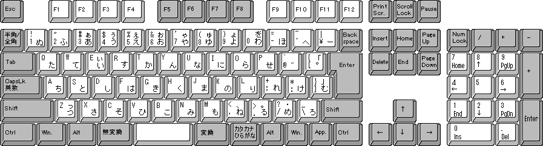

# 五十音图

日语为表音文字

日语的每个假名代表一个音节（拗音除外），所以属于音节字母。日语的假名共有七十一个，包括清音、浊音、半浊音和拨音。其中基本元音有5个，辅音41个，不可拼4个。表示四十五个清音音节的假名，按照发音规律，可排列成表，这个假名表称为五十音图【五十音図】（ごじゅうおんず）。


### 发音

#### 元音

  **あ** a    **い** i    **う** u    **え** e    **お** o

#### 辅音

(清音)：**か行** k    **さ行** s    **た行** t    **な行** n    **は行** h    **ま行** m    **や行** y    **ら行** r    **わ行** w    **ぱ行** p

(浊音)：**が行** g    **ざ行** z    **だ行** d    **ば行** b

#### 促音

​    日语中有一个实际上听不见声音的音节，叫做促音。他发生在か、さ、た、ぱ行之前。发音要领是前面的音发完后，口型做好下一个音的准备，等一会再发下一个音。

​    促音后面是か、た、ぱ行时与さ行时的发音方法不同。促音位于か、た、ぱ行之前时，堵住全部气流然后再放开，使气流急冲而出。位于さ行前时，则几乎不停止发音而发出辅音s。但不论哪种情况都必须保持一点顿挫。否则词语的意思会发生变化。

【例】おと（声音）— おっと（丈夫）			さか（坡）— さっか（作家）


#### 长音 

平假名长音书写方法规则：

1. **あ段，い段，う段，平假名あ、い、う跟在各段音节之后。**

   如：おかあさん（母亲）    ほしい（想要）


2. **え段，后续平假名い读作え。有部分词例外，后续平假名え。**

   如：とけい（表）　　えいが（电影）

   【例外】おねえさん（姐姐）　　　ええ（是）


3. **お段，后续平假名う，读作お。有部分词例外，后续平假名お。**

   如：そうじ（打扫）　　　　おとうと（弟弟）

   【例外】とおい（远）    おおきい（大）


4. 外来语的长音原则上是用长音符号“—”来书写。

   例如：オーヷーバ ート


5. 但也有不写长音符号而添写元音的习惯，

   例如：ミイラ，バレエ，レ イアウト，ボウリング等。


6. 相当于英语词尾的-er、-or、-ar的音，原则上作为ア段长音用长音符 号“—”来书写，但也经常按习惯省去“—”。例如：エレベヷータ（－）， コンピュヷータ（ヷ）等。

7. 而接在イ段和エ段音后面的、相当于ア音节的音原则上写作“ア”，

   例如：ピアノ，フェアプレヷ，イタリ ア等。

   但是，按习惯也有部分词汇写 作“ヤ”的。

   例如：タイヤ，ダイヤル等。


假名为表音文字。

平：通俗易懂

片：部分、不完整

平假名取自汉字的草书，片假名取自汉字的一部分


左侧平假名，右侧片假名。斜线之前是该行该段所对应的罗马字，即[训令式罗马字](https://baike.baidu.com/item/%E8%AE%AD%E4%BB%A4%E5%BC%8F%E7%BD%97%E9%A9%AC%E5%AD%97)。而斜线后是该假名的读音，即[平文式罗马字](https://baike.baidu.com/item/%E5%B9%B3%E6%96%87%E5%BC%8F%E7%BD%97%E9%A9%AC%E5%AD%97)。

罗马字是指用拉丁字母来表示的日语表记法。罗马字一共有三种体系，训令式罗马字、黑本式罗马字和日本式罗马字。其中，训令式罗马字是日本最为权威的表记法。


### 清音

| あ段 a        | い段 i            | う段 u            | え段 e        | お段 o        |
| ----------- | --------------- | --------------- | ----------- | ----------- |
| **あ  ア** a  | **い  イ** i      | **う  ウ** u      | **え  エ** e  | **お  オ** o  |
| **か  カ** ka | **き  キ** ki     | **く  ク** ku     | **け  ケ** ke | **こ  コ** ko |
| **さ  サ** sa | **し  シ** si/shi | **す  ス** su     | **せ  セ** se | **そ  ソ** so |
| **た  タ** ta | **ち  チ** ti/chi | **つ  ツ** tu/tsu | **て  テ** te | **と  ト** to |
| **な  ナ** na | **に  ニ** ni     | **ぬ  ヌ** nu     | **ね  ネ** ne | **の  ノ** no |
| **は  ハ** ha | **ひ  ヒ** hi     | **ふ  フ** hu/fu  | **へ  ヘ** he | **ほ  ホ** ho |
| **ま  マ** ma | **み  ミ** mi     | **む  ム** mu     | **め  メ** me | **も  モ** mo |
| **や  ヤ** ya |                 | **ゆ  ユ** yu     |             | **よ  ヨ** yo |
| **ら  ラ** ra | **り  リ** ri     | **る  ル** ru     | **れ  レ** re | **ろ  ロ** ro |
| **わ  ワ** wa |                 |                 |             | **を  ヲ** wo |
| **ん  ン** n  | 拨音              |                 |             |             |

を与お 同音不同字，不过を只用于助词中。

### 浊音

| **が  ガ** ga | **ぎ  ギ** gi | **ぐ  グ** gu | **げ  ゲ** ge | **ご  ゴ** go |
| ----------- | ----------- | ----------- | ----------- | ----------- |
| **ざ  ザ** za | **じ  ジ** ji | **ず  ズ** zu | **ぜ  ゼ** ze | **ぞ  ゾ** zo |
| **だ  ダ** da | **ぢ  ヂ** ji | **づ  ヅ** zu | **で  デ** de | **ど  ド** do |
| **ば  バ** ba | **び  ビ** bi | **ぶ  ブ** bu | **べ  ベ** be | **ぼ  ボ** bo |
| **ぱ  パ** pa | **ぴ  ピ** pi | **ぷ  プ** pu | **ぺ  ペ** pe | **ぽ  ポ** po |

ぱ 行为半浊音

### 拗音

|              | や  ヤ段 ya          | ゆ  ユ段 　yu         | よ  ヨ段 yo          |
| ------------ | ----------------- | ----------------- | ----------------- |
| **き  キ行** ki | **きゃ  キャ** kya    | **きゅ  キュ** kyu    | **きょ  キョ** kyo    |
| **ぎ  ギ行** gi | **ぎゃ  ギャ** gya    | **ぎゅ  ギュ** gyu    | **ぎょ  ギョ** gyo    |
| **し  シ行** si | **しゃ  シャ** sha    | **しゅ  シュ** shu    | **しょ  ショ** sho    |
| **じ  ジ行** zi | **じゃ  ジャ** jya/ja | **じゅ  ジュ** jyu/ju | **じょ  ジョ** jyo/jo |
| **ち  チ行** ti | **ちゃ  チャ** cha    | **ちゅ  チュ** chu    | **ちょ  チョ** cho    |
| **ぢ  ヂ行** ji | **ぢゃ  ヂャ** dya    | **ぢゅ  ヂュ** dyu    | **ぢょ  ヂョ** dyo    |
| **に  ニ行** ni | **にゃ  ニャ** nya    | **にゅ  ニュ** nyu    | **にょ  ニョ** nyo    |
| **ひ  ヒ行** hi | **ひゃ  ヒャ** hya    | **ひゅ  ヒュ** hyu    | **ひょ  ヒョ** hyo    |
| **び  ビ行** bi | **びゃ  ビャ** bya    | **びゅ  ビュ** byu    | **びょ  ビョ** byo    |
| **ぴ  ピ行** pi | **ぴゃ  ピャ** pya    | **ぴゅ  ピュ** pyu    | **ぴょ  ピョ** pyo    |
| **み  ミ行** mi | **みゃ  ミャ** mya    | **みゅ  ミュ** myu    | **みょ  ミョ** myo    |
| **り  リ行** ri | **りゃ  リャ** rya    | **りゅ  リュ** ryu    | **りょ  リョ** ryo    |


### 外来语　

ヴァ(va)、ヴィ(vi)、ヴ(vu)、ヴェ(ve)、ヴォ(vo)　　

ファ(fa)、フィ(fi)、フュ(fyu)、フェ(fe)、フォ(fo)　　

ツェ(tse)、チェ(che)、シェ(she)、ジェ(je)、イェ(ye)　　

クァ(qwa)、クォ(qwo)、ウィ(wi)、ウェ(we)、ウォ(wo)　　

トゥ(tu)、ドゥ(du)、ホゥ(hu)、ツァ(tsa)、ヂャ(zha)　　

ティ(ti)、テュ(tyu)、ディ(di)、デュ(dyu)、クヮ(kwa)


### 方言与古语

ヰ(wi)、ゐ(wi)、ヱ(we)、ゑ(we)　　

ヷ(va)、ヸ(vi)、ヹ(ve)、ヺ(vo)　　

ゔ(vu)、くゎ(kwa)、ぐゎ(gwa)


### 音读与训读

音读：传到日本的古代汉字发音。

训读：与汉字字义相对应的日语固有词语的发音。

【例】山：さん（音读）；やま（训读）　


### 声调

1. 单词的第一个音节和第二个音节的音高一定不同：

   第一个音节低，则第二个就高。

   第一个音节高，则第二个就低。

2. 一个单词的声调中，或没有下降，或只有一处下降。


　


# 日语输入


### 输入法

日语输入法（日本语入力）一般使用电脑自带的IME，谷歌日本语入力，百度日本语入力。手机输入法有ATOK和simeji等。

Google IME : Google Japanese Input (谷歌日语输入法)


### 平假名和片假名之间的切换

Hiragana——>平假名 ； 
Katakana——>片假名 ； 
Alphanumeric——>英文数字 ； 
Direct Input——>直接输入假名方式 ； 
Full-width——>全角 ； 
Half-width——>半角 ； 


### 日语键盘




# 输入规则


### 清音

```
平假名：あ い う え お 
片假名：ア イ ウ エ オ 
输入法：a　i　u　e　o 

平假名：か き く け こ 
片假名：カ キ ク ケ コ 
输入法：ka ki ku ke ko 

平假名：さ　し　す　せ　そ 
片假名：サ　シ　ス　セ　ソ 
输入法：sa　si　su　se so 

平假名：た　ち　つ　て　と 
片假名：タ　チ　ツ　テ　ト 
输入法：ta　ti　tu　te　to 『ち chi』『つ tsu』 

平假名：な　に　ぬ　ね　の 
片假名：ナ　ニ　ヌ　ネ　ノ 
输入法：na　ni　nu　ne　no 

平假名：は　ひ　ふ　へ　ほ 
片假名：ハ　ヒ　フ　ヘ　ホ 
输入法：ha　hi　hu　he　ho 『ふ fu』 

平假名：ま　 み　 む　 め　 も 
片假名：マ　 ミ　 ム　 メ　 モ 
输入法：ma　mi　mu　me　mo 

平假名：や　 ゆ　 よ 
片假名：ヤ　 ユ　 ヨ 
输入法：ya　 yu　 yo 

平假名：ら　り　る　れ　ろ 
片假名：ラ　リ　ル　レ　ロ 
输入法：ra　ri　ru　re　ro 

平假名：わ　を　ん 
片假名：ワ　ヲ　ン 
输入法：wa　wo　n 
```


### 浊音

```
平假名：が　ぎ　ぐ　げ　ご　 　 　 
片假名：ガ　ギ　グ　ゲ　ゴ　 　 　 
输入法：ga　gi　gu　ge　go　 
　 　 
平假名：ざ　じ　ず　ぜ　ぞ 
片假名：ザ　ジ　ズ　ゼ　ゾ 
输入法：za　zi　zu　ze　zo『じ ji』 

平假名：だ　ぢ　づ　で　ど 
片假名：ダ　ヂ　ヅ　デ　ド 
输入法：da　di　du　de　do 

平假名：ば　び　ぶ　べ　ぼ 
片假名：バ　ビ　ブ　ベ　ボ 
输入法：ba　bi　bu　be　bo 

平假名：ぱ　ぴ　ぷ　ぺ　ぽ 
片假名：パ　ピ　プ　ペ　ポ 
输入法：pa　pi　pu　pe　po 
```


### 拗音

```
きゃ きゅ きょ 
kya　kyu　kyo 

しゃ しゅ しょ 
sya　syu　syo　『しゃsha しゅshu しょsho』 

ちゃ ちゅ ちょ 
tya　tyu　tyo 『ちゃcha ちゅchu ちょcho』 

にゃ にゅ にょ 
nya　nyu　nyo 

ひゃ ひゅ ひょ 
hya　hyu　hyo 

みゃ みゅ みょ 
mya　myu　myo 

りゃ りゅ りょ 
rya　ryu　ryo 

ぎゃ ぎゅ ぎょ 
gya　gyu　gyo 

じゃ じゅ じょ 
ja　　ju　 jo [じゃ じゅ じょ] zya zyu zyo 

[じゃ じゅ じょ 
zya zyu zyo 

びゃ びゅ びょ 
bya　byu　byo 

ぴゃ ぴゅ ぴょ 
pya　pyu　pyo 　 

ぢゃ ぢゅ ぢょ 
dya　dyu　dyo 
```


### 促音

```
双打っ音后的第一个字母 例:ずっと zutto 、はっきり hakkiri、 やっぱり yappari 单独的っ的打法是xtu（注：在あ い う え お及个别假名打法前加打一个“x”会打出相应的小假名） 
```

 

### 拨音ん

```
按两下"n"。例:まんぞく mannzoku 
```


### 其他

```
诸如てゃ、てぃ（ティ）、てゅ，可输入tha、thi、thu。
```


### 罗马字和假名输入完全对应表

##### 1）汉字、词的变换 

不变换汉字、词的时候，请直接按「enter」回车键即可。 
要变换汉字、词语时，请按「space」空格键，即会出现变换出来的汉字或词的清单，找到想输入的汉字或词时再按「enter」回车键

##### 2）长音ー输入 

片假名里的长音符号“ー”，输入方法是按数字键0右方的-（减号键）。 

##### 3）拨音ん的输入 

连续打两个n。

##### 4）促音输入 

单词中输入促音也就是小っ，方式有两种： 
① 双重输入后一发音的第一个字母后，会出现促音，比如：切符，きっぷ kippu、学校 がっこう gakkou 
② 单独输入小っ的时候可以使用直接输入ltu或者xtu 

##### 5）小ぁぃぅぇぉ 

其他小假名的输入方式和上面②里面说明的相同，只要在前面加上x或l就可以变成小假名（没有小假名的除外）。 
比如：输入字母“l”或“x”+a、i、u、e、o，输入la得到ぁ，输入xa也得到ぁ，输入li得到ぃ。 

##### 6）ぢ和づ的输入 

ぢ/ヂ 读音为ji，但在输入时应该输入di。 
づ/ヅ 读音为zu，但在输入时应该输入du。 

##### 7）は和を的输入 

は在作助词用时，读作wa，但输入仍为ha。 
を的读音为o，但输入时为wo。 

##### 8）古语假名ゐ和ゑ的输入 

ゐ输入wi 
ゑ输入we 
然后按空格键寻找就可以了。 

##### 9）平假名、片假名、英数字间的转换 

输入罗马字之后，

按 **F6** 转换为 **平假名**，

按 **F7** 转换为 **全角片假名**，

按 **F8** 转换为 **半角片假名**，

按 **F9** 转换为 **全角英文数字**，

按 **F10** 转换为 **半角英文数字**。 

##### 10）输入方法方面

し可以简拼为si，ち可以是ti，つ可以是tu，じ可以是zi，但是す只能拼为su，ず只能是zu，所遵循的原则是：既可以使用罗马音，也可以使用该行辅音+该段元音（例如し的罗马音是shi，而它属于s行、i段，所以可以拼为si）。

##### 11）快捷键 

> ① 快捷键Alt + ~（Esc键下边的那个键） 
> 可以在直接输入Direct Input（图标A）和平假名Hiragana（图标あ）间切换 
>
> ②快捷键Alt + Shift 
> 在系统默认输入/中文输入法和日文输入法之间切换 
>
> ③快捷键Alt +CapsLock 和Ctrl + CapsLock 
> 输大量片假名时，在平假名Hiragana（图标あ）模式下，可以按Alt +CapsLock切换到片假名Katakana（图标カ）模式，输完按CTRL+CAPSLOCK可切回平假名Hiragana（图标あ）。 


# 标点符号

文章中的标点符号

。句号用于句尾

，、逗号 横写时可以用“，” 或“、” 竖写时只用“、”同一篇文章里不能混用

「」单引号 相当于汉语的引号 日语中横写和竖写都用此引号而不用“”号

『』双引号 相当于汉语的书名号或在“「　」”中引用的部分

（　）括弧 相当于汉语的小括号

小说中使用中黑点 ？问号！ 感叹号

冒号 分号几乎不用

# 书写

日语文字包括：ひらがな（平假名），かたかな（片假名），漢字｛かんじ｝

平假名：可用来书写所有日语发音，主要用于表示语法功能的词。

```
いつも：经常，总是
いつ：什么时候
ここ：这里，这儿
あの：那个
```

片假名用于书写外来词，拟声词，拟态词，一部分动植物名称。

```
テレビ：电视机
パンダ：熊猫
ガーガー：鸭子叫的声音
コロコロ：小石头滚动的样子
```

汉字用于表示事物的名称和动作


|                 |                 |             |             |
| --------------- | --------------- | ----------- | ----------- |
| **ち  チ** ti/chi | **ら  ラ** ra     | **ろ  ロ** ro | **る  ル** ru |
| **す  ス** su     | **む  ム** mu     |             |             |
| **あ  ア** a      | **め  メ** me     | **ぬ  ヌ** nu |             |
| **れ  レ** re     | **ね  ネ** ne     | **わ  ワ** wa |             |
| **な  ナ** na     | **た  タ** ta     |             |             |
| **さ  サ** sa     | **き  キ** ki     |             |             |
| **け  ケ** ke     | **は  ハ** ha     | **ほ  ホ** ho |             |
| **に  ニ** ni     | **こ  コ** ko     |             |             |
| **く  ク** ku     | **へ  ヘ** he     |             |             |
| **ま  マ** ma     | **も  モ** mo     |             |             |
| **せ  セ** se     | **や  ヤ** ya     |             |             |
| **い  イ** i      | **し  シ** si/shi |             | **り  リ** ri |
| **そ  ソ** so     | **て  テ** te     | **と  ト** to | **を  ヲ** wo |
| **う  ウ** u      | **つ  ツ** tu/tsu |             |             |
| **お  オ** o      | **の  ノ** no     |             |             |
| **み  ミ** mi     | **ゆ  ユ** yu     | **よ  ヨ** yo | **ひ  ヒ** hi |
| **え  エ** e      | **ふ  フ** hu/fu  | **か  カ** ka |             |


# 字典

```
MAC 安装字典

其实苹果自带的Dictionary异常强大，前提是需要给它添加一些词典包，你可以随心所欲的添加牛津、朗文、英汉、汉英、法汉、德汉、汉法、汉德、日汉、汉日；甚至康熙大辞典，以及湘雅医学专业词典。只要你能找到合适的词典包即可。 


[下载地址已经更新，2017/07月 可用] 
词典转换工具地址New：https://github.com/jjgod/mac-dictionary-kit/releases/download/v2.1/DictUnifier-2.1.zip 
词典包地址New： http://stardict.rrr.rs/zh_CN/index.html 

1.下载DictUnifier 2.1 
2.下载tarbal词典包 
3.词典包是文件夹的形式出现的，打开文件夹后，里面有好几个文件，把后缀是ifo的拖进打开的第一个软件里(DictUnifier 2.1)。 
4.请你用足够的耐心等待它转换吧，字典较大或者机器较老可能需要很长时间，千万不要以为程序死了。 
5.词典包安装后，Dictionary会自动打开，点一下Dictionary的"All"或者 “全部”， 就能发现你新添加的词典名称，哈哈，enjoy! 
6.特别提醒：有些Mac OS版本，需要在Dictionary的偏好设置里面（command加逗号），把需要的词典勾选一下～ 

对于不想要的词典： 

1. 在Dictionary界面不显示——在Dictionary的“系统设置”里面，把不想用的词典前面的“对勾”去掉 
2. 想完全删去——在下面这两个文件夹内，找到相应的.dictionary文件，delete 
a) Macintosh HD/Library/Dictionaries文件夹 
b) Macintosh HD/Users/你的用户名/Library/Dictionaries文件夹
```


# 词语读法

### 常用中国姓氏

```
B	--------------------B
包 包 ほう 
C	--------------------C
曹 曹 そう 
陈 陳 ちん 
F	--------------------F
方 方 ほう 
冯 ひょう/フォン 
H	--------------------H
韩 韓 かん 
胡 胡 こ 
黄 黄 こう 
J	--------------------J
江 江 こう 
蒋 蒋 しょう 
L	--------------------L
黎 黎 れい 
李 李 り 
梁 梁 りょう 
林 林 りん 
刘 劉 りゅう 
柳 柳 りゅう 
罗 羅 ら 
吕 呂 ろ 
M	--------------------M
毛 毛 もう 
P	--------------------P
潘 ぱん
Q	--------------------Q
齐 斉 さい 
钱 銭 せん 
秦 秦 しん 
S	--------------------S
宋 宋 そう 
孙 孫 そん 
W	--------------------W
王 王 おう 
韦 韋 い 
吴 呉 ご 
X	--------------------X
肖 肖 しょう 
许 許 きょ 
徐 徐 じょ 
Y	--------------------Y
杨 楊 よう 
Z	--------------------Z
曾 曾 そ 
张 張 ちょう 
章 章 しょう 
赵 趙 ちょう 
周 周 しゅう 
朱 朱 しゅ 
```

### 常用日本姓氏

```
山田 山田 やまだ 
丰田 豊田 とよた
田中 田中 たなか 
本田 本田 ほんだ 
齐藤 斎藤 さいとう 
山本 山本 やまもと 
佐藤 佐藤 さとう 
森 森 もり 木村 
木村 きむら 
林 林 はやし 
木下 木下 きのした 
小林 小林 こばやし 
川边 川辺 かあべ 
藤原 藤原 ふじはら 
佐佐木 佐々木 ささき 
佐野 佐野 さの 
铃木 鈴木 すずき 
熊野 熊野 くまの 
村上 村上 むらかみ 
竹下 竹下 たけした
```

### 地名

```
单词 读音 声调 词性 释义
--------------------------------------------
あきはばら（秋葉原） ③型 名词 秋叶原（著名电器街） 
あらかわく（荒川区） ④型 名词 荒川区 
いけぶくろ（池袋） ③型 名词 池袋
いたばしく（板橋区） 0型
うえの（上野） 园） ④型 名词 板桥区 名词 上野（有著名上野动物园）
えどがわく（江戸川区） ④型 名词 江户川区 
おおたく（大田区） ③型 名词 大田区 
かさはら（笠原） ②型 名词 笠原 
かしま（鹿島） 0型 名词 鹿岛 
かすみがせき（霞ヶ関） ④型 名词 霞关 
しながわく（品川区） ④型 名词 品川区 
しぶやく（渋谷区） ③型 名词 涩谷区 
しんじゅくく（新宿区） ④型 名词 新宿区
しんばし（新橋） ①型 名词 新桥 
すぎなみく（杉並区） ④型 名词 杉并区
せたがやく（世田谷区） ④型 名词 世田谷区 
たいとうく（台東区） ③型 名词 台东区 
たてやま（館山） ②型 名词 馆山 
ちゅうおうく（中央区） ③型 名词 中央区 
ちよだく（千代田区） ③型 名词 千代田区
としまく（豊島区） ③型 名词 丰岛区 
なかのく（中野区） ③型 名词 中野区 
ぶんきょうく（文京区） ③型 名词 文京区
めぐろく（目黒区） ③型 名词 目黑区
```

### 英文字母

```
A a エヷ 
B b ビヷ 
C c シヷ 
D d デイヷ
E e イヷ 
F f エフ 
G g ジヷ 
H h エイチ
I i アイ 
J j ジェヷ
K k ケヷ
L l エル
M m エム
N n エヌ，エン 
O o オヷ 
P p ピヷ 
Q q キュヷ 
R r アヷル 
S s エス 
T t テイヷ 
U u ユヷ 
V v ブイ
W w ダブリュ
X x エックス
Y y ワイ
Z z ゼット
```

### 数词

```
零 零 れい ①型 
0    ゼロ ①型 
一 1 一 いち ②型 
二 2 二 に ①型 
三 3 三 さん 0型 
四 4 四 し/よん/よ ①型 
五 5 五 ご ①型 
六 6 六 ろく ②型 
七 7 七 しち/なな ①型 
八 8 八 はち ①型 
九 9 九 く/きゅう ①型 
十 10 十 じゅう ①型
--------------------------------------------------
十一 11 十一 じゅういち 
十二 12 十二 じゅうに 
十三 13 十三 じゅうさん 
十四 14 十四 じゅうし/じゅうよん 
十五 15 十五 じゅうご 
十六 16 十六 じゅうろく 
十七 17 十七 じゅうしち/じゅうなな 
十八 18 十八 じゅうはち 
十九 19 十九 じゅうきゅう/じゅうく 
二十 20 二十 にじゅう 
二十一 21 二十一 にじゅういち
三十 30 三十 さんじゅう 
四十 40 四十 よんじゅう 
五十 50 五十 ごじゅう 
六十 60 六十 ろくじゅう 
七十 70 七十 ななじゅう/しちじゅう 
八十 80 八十 はちじゅう 
九十 90 九十 きゅうじゅう （
一）百 100 百 ひゃく
一百零一 101 百一 ひゃくいち 
一百一十九 119 百十九 ひゃくじゅうきゅう 
二百 200 二百 にひゃく 
三百 300 三百 さんびゃく 
四百 400 四百 よんひゃく 
五百 500 五百 ごひゃく 
六百 600 六百 ろっぴゃく 
七百 700 七百 ななひゃく 
八百 800 八百 はっぴゃく 
九百 900 九百 きゅうひゃく
（一）千 1000 千 せん 
一千零一 1001 千一 せんいち 
二千 2000 二千 二千 
二千零四十 2040 二千四十 にせんよんじゅう 
三千 3000 三千 さんぜん 
三千六百九十七3697 三千六百九十七 さんぜんろっぴゃくきゅう じゅうなな
四千 4000 四千 よんせん 
五千 5000 五千 ごせん 
六千 6000 六千 ろくせん 
七千 7000 七千 ななせん 
八千 8000 八千 はっせん 
九千 9000 九千 きゅうせん
一万 1万 一万 いちまん 
十万 10万 十万 じゅうまん 
六十三万 63万 六十三万 ろくじゅうさんまん 
百万 100万 百万 ひゃくまん 
一千万 1000万 一千万 いっせんまん
一亿 1亿 一億 い ちおく 
一兆 1兆 一兆 いちちょう
```

百位数与千位数有音变，读法如下：

```
一百 百 ひゃく 
二百 ニ百 にひゃく 
三百 三百 さんびゃく 
四百 四百 よんひゃく 
五百 五百 ごひゃく 
六百 六百 ろっぴゃく 
七百 七百 ななひゃく 
八百 八百 はっぴゃく 
九百 九百 きゅうひゃう 
一千 千 せん
二千 ニ千 にせん 
三千 三千 さんせん 
四千 四千 よんぜん 
五千 五千 ごせん 
六千 六千 ろくせん 
七千 七千 ななせん 
八千 八千 はっせん 
九千 九千 きゅうせん 
一万 一万 いちまん
```

### 量词

```
一个 一つ ひとつ ②型 
二个/两个 二つ ふたつ ③型 
三个 三つ みっつ ③型 
四个 四つ よっつ ③型 
五个 五つ いつつ ②型 
六个 六つ むっつ ③型 
七个 七つ ななつ ②型 
八个 八つ やっつ ③型 
九个 九つ ここのつ ②型 
十个 十 とお ①型
```

### 数量、顺序词汇的读法

```
单词 读音 声调 词性 释义
--------------------------------------------------
ひとり（一人） ②型 名词 一（个）人。
ふたり（二人） 0型 名词 二人；两个人；
さんにん（三人） ③型 名词 三（个）人。
よにん（四人） ②型 名词 四（个）人。
ごにん（五人） ②型 名词 五（个）人。
ろくにん（六人） ②型 名词 六（个）人。
しちにん（七人） ②型 名词 七（个）人。
はちにん（八人） ②型 名词 八（个）人。
きゅうにん（九人） ②型 名词 九（个）人。
じゅうにん（十人） ②型 名词 十（个）人。
なんにん（何人） ②型 名词 几个人；多少个人。
```

注意：一个人/两个人是特殊读法（ひとり/ふたり），其它的在基数词 后加“人（にん）” 即可

### 星期

```
何曜日（なんようび）： 星期几 
月曜日（げつようび）： 星期一 
火曜日（かようび）： 星期二 
水曜日（すいようび）： 星期三 
木曜日（もくようび）： 星期四 
金曜日（きんようび）： 星期五 
土曜日（どようび）： 星期六 
日曜日（にちようび）： 星期日
```

### 日期

```
一天 （いちにち）
一日（一号） (ついたち） 
二日 （ふつか） 
三日 （みっか） 
四日 （よっか） 
五日 （いつか） 
六日 （むいか） 
七日 （なのか） 
八日 （ようか）
九日 （ここのか） 
十日 （とおか）
十一日 （じゅういちにち）
十二日 （じゅうににち）
十三日 （じゅうさんにち）
十四日 （じゅうよっか）
十五日 （じゅうごにち）
十六日 （じゅうろくにち）
十七日 （じゅうしちにち）
十八日 （じゅうはちにち）
十九日 （じゅうきゅうにち）
二十日 （はつか）
二十一日 （にじゅういちにち） 
二十二日 （にじゅうににち） 
二十三日 （にじゅうさんにち）
二十四日 
二十五日 
二十六日 
二十七日 
二十八日 
二十九日 
三十日 
三十一日 
何日


 
（にじゅうよんにち）/(にじゅうよっか) 
（にじゅうごにち） 
（にじゅうろくにち） 
（にじゅうななにち） 
（にじゅうはちにち） 
（にじゅうきゅうにち）

（さんじゅうにち/みそか） 
（さんじゅういちにち） 
 (なんにち)/几日，几号


```


### 月份

```
一月 （いちがつ）
```


### 四季

```
春（春/はる）、 春季（しゅんき）
夏（夏/なつ）、 夏季（かき）
秋（秋/あき）、 秋季（しゅうき）
冬（冬/ふゆ）、 冬季（とうき）
```


### 时分秒表达法

```
×时/点钟： ×時（じ） 
×小时： ×時間（じかん） 
×分： ×分（ふん） 
×分钟： ×分間（ふんかん） 
×秒： ×秒（びょう） 
×秒钟： ×秒間（びょうかん）
```


### 其它时间相关

```
世纪——世紀（せいき） 
年——年（ねん） 
光年——光年（こうねん）

前年——前年（ぜんねん）/一昨年（おととし）
去年——去年（きょねん）/昨年（さくねん） 
今年——今年（ことし） 
明年——明年（みょうねん）/来年（らいねん） 
后年——後年（こうねん）/再来年（さらいねん）

上上个月——先々月（せんせんげつ）
上个月——先月（せんげつ） 
这个月（本月）——今月（こんげつ） 
下个月——来月（らいげつ） 
下下个月——再来月（さらいげつ）

上上周（上上个星期）——先々週（せんせんしゅう）
上周（上星期）——先週（せん しゅう） 
本周（本星期）——今週（こんしゅう） 
下周（下星期）——来週（らいしゅう） 
下下周（下下个星期）——再来週（さらいしゅう）

前天——昨日（おととい）
昨天——昨日（きのう） 
今天——今日（きょう） 
明天——明日（あした/みょうにち） 
后天——明後日（あさって）

早上——朝（あさ）
上午——午前（ごぜん） 
中午——昼（ひる） 
下午——午後（ごご） 
傍晚——夕方（ゆうがた） 
晚上——夜（よる） 
白天——昼（ひる）

周末——週末（しゅうまつ）
月末——月末（げつまつ） 
年末——年末（ねんまつ）
```


# 语法术语名称

```
主語 しゅご 主语 
述語 じゅつご 谓语 
客語 きゃくご 宾语 
補語 ほご 补语 
連体修飾語 れんたいしゅうしょくご 连体修饰语（体修） 
連用修飾語 れんようしゅうしょくご 连用修饰语（用修） 
提示語 ていじご 外位语（提示语） 
同格語 どうかくご 同位语（同格语） 
自動詞 じどうし 自动词（不及物动词） 
他動詞 たどうし 他动词（及物动词） 
単語 たんご 单词 
文 ぶん 句子 
文節 ぶんせつ （文节） 
連文節 れんぶんせつ 词组（连文节） 
単文 たんぶん 单句 
複文 ふくぶん 复句 
重文 じゅうぶん 并列句 
平叙文 へいじょぶん 叙述句 
疑問文 ぎもんぶん 疑问句 
命令文 めいれいぶん 祈使句（命令句） 
感動文 かんどうぶん 感叹句
```

# 日语词汇分类

按照日语词汇的意义、形态或者功能来进行分类，可以分成如下12个类 别（12品词）：

1. 单词 独立词 有词尾变化 可以作谓语 用言 动词.

   形容词 形容动词

2. 没有词尾变化 可以作主语 体言 名词

   数词 代名词

3. 不可以作主语 作修饰语 修饰体言——连体词

   修饰用言——副词

4. 不可以作修饰语 起接续作用——接续词

   没有接续作用——感叹词

5. 附属词 有词尾变化——助动词 

   没有词尾变化——助词

说明：独立词在句子里具有独立的概念，在句子里具有独立的能力。而 附属词没有独立的概念，在句子里不能单独存在，只能附在独立词的后面 起一定的语法作用。