# About Face 4：The Essentials of Interaction Design


# 前言(概念)


### IxD与用户体验

在数字技术的世界中，形式、功能、内容和行为密不可分,设计一件交互产品的诸多挑战直接牵涉到数字产品的定位和功能。

设计上的交互性，即随着时间变化而针对输入所形成的变化和响应。

用来讨论如何设计丰富、动态的行为和变化的用户界面所需要的语言。

交互设计核心问题：如何明确地设计复杂交互系统的行为。

用户体验(ux)设计有三个关注点：形态、行为和内容。

交互设计的重点是行为设计，但也关注行为与形态和内容之间的关联。

信息架构的重点是内容结构，但也关注采用什么行为，以及内容如何呈现给用户。

工业设计和图形设计关注的是产品和服务的形态，但也必须保证形态支撑使用，这又要求关注行为和内容。


### 本书涵盖范围

本书尝试为交互设计提供有效实用的工具。这些工具由原则、模式和过程构成。

设计原则：包括设计实践的广泛思考，以及关于如何充分利用具体的用户界面和交互设计术语的规则和提示。

设计模式：讲述了一套交互设计术语，这些术语常常用来处理具体的用户要求和设计关注点。

设计过程：讲述了如何理解和定义用户需求，如何把需求翻译成设计框架，最后在具体环境中充分应用设计原则和模式。

> 本书在帮助读者设计更加高效实用的对话框和菜单的同时，也帮助读者理解：用户如何理解设计师的数字产品，如何与产品交互。此外，本书还帮助读者理解如何使用这些知识来推动设计。

设计原则、过程和模式融合起来，是设计高效的产品交互与界面的关键。

世上没有所谓客观的优秀用户界面。质量取决于环境：用户是什么人、在做什么、动机是什么。

样式指南倾向于回答是什么，但通常难以回答为什么。


本书提供了一组方法来解决这种以行为为导向的新型设计，并提供完整的设计过程，从而更好地理解用户目标、需求和动机，我们称为“**目标导向设计**”。要理解目标导向设计的过程， 首先需要更好地了解用户目标的本质、产生用户目标的心理模型，以及用户目标如何成为设计交互行为的关键。


设计互动系统的5个步骤：研究目标领域，理解用户及其需求，定义解决方案 框架，丰满设计细节，验证—测试解决方案对用户的效率。


### 本书结构

第1部分：详细介绍并讲解了目标导向设计构成，以及如何建设设计团队，如何把设计团队融入到项目团队。

第2部分：介绍了高级交互设计原则，该原则几乎可以应用到所有平台的任何交互设计问题。

第3部分：涵盖了底层和针对移动、桌面、网页，以及其他具体平台的交互设计原则和术语。


# 第一部分 目标导向设计 Goal-Directed Design


# 第一章 目标导向设计

本书有一个简单的前提：如果我们设计的数字产品能够让人们方便地达成目标，他们会感到满意，提高效率，心情愉快。如此一来，人们会高兴地购买这款产品并推荐他人购买。假设我们能够以低成本实现上述目标，就能取得商业上的成功。

交互数字产品的独特之处在于，复杂的行为渗透其中。运用恰当的方法，设计能够弥合人类与科技产品之间的缺口。


### 有问题的数字产品

产品没有进行恰当设计，忽视用户的需求和期望所带来的某些后果。

1. **数字产品粗鲁无礼**

   数字产品常常责怪用户犯了错，事实上错误不在用户，或者本不该发生。

   > 错误消息如野草般不停地弹出来，宣称用户又一次操作失败。这些消息还命令用户点击确认，承认自己失误。

   软件驱动的产品缺少基本的礼貌。记不住我们告诉它们的信息，也无法很好地预测我们的需要。

2. **数字产品要求人们像计算机一样思考**

   数字产品经常假设人们非常了解技术。

   > Word中，如果用户想重命名正在编辑的文件名，就必须知道，要么关闭文件后再改，要么就在菜单中选择“另存为…”。这些行为与正常人所认为的重命名方式不一致，而是要求人们改变自 己的思维方式来迎合计算机。

   数字产品常常晦涩费解，把真实含义、意图和动作隐藏起来，让用户无从知晓。

   > 应用程序经常使用一些正常用户无法理解的“行话”（您的SSID是什么）

3. **数字产品马虎大意**

   软件经常要求人们脱离主任务流，执行一些本不需要另外打开一个界面或额外导航才能完
   成的功能。

   应用程序的外观复杂混乱，使导航和理解变得困难

4. **数字产品要求人来干重活**

   为了恰当地操作软件，人们被迫做大量的工作

   > 从简单的窗口间复制数值


### 产生有问题的数字产品原因？

创造出技术先进却难于使用和控制的产品，是因为没有在作品中注入人性。

**重点错置：产品管理和开发团队工作重点错置。**

> 市场营销人员长于理解和估计商机，精于向市场推出和定位产品，但他们对产品设计过程的贡献通常仅限于一点需求列表。这些需求通常与用户的真正需求和期望关系不大，
>
> 开发人员负责产品的构造过程，决定构造什么样的产品。而开发人员的任务诉求与产品最终用户的完全不同。
>
> 开发人员关注的是解决技术难题带来的挑战、遵循优秀的工程实践准则、如期完成任务。他们收
> 到的指示往往不完整、缺乏远见、有时甚至相互矛盾，还要在极为紧迫的时间内或不了解人们将如何使用产品的情况下，被迫做出事关用户体验的重要决定。

**无视产品的真实用户：不了解哪些用户的基本需求能推动产品成功。**

**利益冲突：开发团队既要设计又要打造用户体验时存在利益冲突。**

> 程序员的业绩评估主要取决于其编程效率以及能否在极其紧张的时间内完成任务
>
> 即使程序员有足够的设计能力和设计意愿, 也无法有效地兼顾用户、商业及技术各方利益。

**设计流程缺失：对客户需求进行收集、分析和利用，从而以此来驱动产品的终端体验。**

> 其中遗漏了一个重要环节，即确保产品能吸引用户的一个可重复的、可预见的分析过程，它能把对用户的了解转化为满足用户专业化、个性化和情感化需求的数字产品。
>
> 对设计师和产品来说，听一听用户反映的问题，远比直接从用户那得到拟议解决方案更有价值。


### 规划并设计产品行为

现代产品开发三原则开始形成：功用性（capability)、可行性 (viability)和称许性（desirability)

> Doblin Group 公司的拉里•基利（Larry Keeley)提出的

行为设计是一个不同的问题，需要更了解情景，而不仅仅是视觉组合和品牌规则。行为设计需要了解用户从购买到使用完整过程中同产品的关系。最重要的是，要了解用户希望如何使用该产品、以什么样方式使用产品，以及使用产品的目的是什么。交互设计不仅仅是审美选择，更要建立在对用户和认知原则的了解上。


### 识别用户目标

> 什么是用户目标呢？
>
> 我们该如何识别这些目标？
>
> 如何区分哪些是真正的目标，而不是因设计工具或业务流程低劣而强迫用户执行的任务？
>
> 所有用户的目标都一样吗？
>
> 会随时间变化吗？

无论我们从事何种工作，必须完成何种任务，多数人都有这种简单的个人目标。即使人们有更高的志向，也更多的是从个人而非工作出发，如晋升、了解更多行业知识、为别人树立良好的榜样等。

只为实现商业目标而设计和幵发的产品终会失败，因为并未解决用户的个人需求。当产品设计能够满足用户个人目标需要的时候，商业目标也会更有效地实现。

> 研究大多数商业性软件、网站和数字产品，就会发现它们的用户界面经常无法满足用户目标。这些问题经常是：
>
> - 让用户感觉自己很愚蠢。
> - 导致用户犯大错。
> - 费很大力气才能有效操作。
> - 无法带来愉快的体验。

当公司确实关注用户时，往往把过多注意力放在用户要完成的任务上，而没有给予用户执行任务的目标以足够的关注。


#### 目标VS任务和活动

目标不等于任务或活动（activity)。目标是对最终情况的预期，而任务和活动只是达成一个或者一组目标的中间步骤（在组织中的不同层次上）。


目标驱动人们开展活动，理解目标可以帮助你理解用户的预期和渴望，反过来又会帮你决定哪些行动的确和设计相关。只有对用户目标进行分析后，任务和行动分析才会在细节处理上起作用。问问“用户的目标是什么？”能够让你理解活动对于用户的意义，从而创造出更加恰当、更加令人满意的设计。


#### 设计要满足情境中的目标

设计目标依赖于具体的情境—用户是谁、在做什么、 目标是什么。一味地遵循与用户目标和需求不相关的规则，是无法设计出好产品的。


### 目标导向的设计过程

用户如何实际使用产品的关键信息。

必须从不同角度来思考如何做出产品决策。

#### 1. 产品定义的设计

基于用户目标、业务需要和科技约束的设计提供了真正的产品定义。

#### 2. 作为研究者的设计者

同理心。

1. 提出方案前，要先为用户考虑
2. 设计人员引入到用户研究的过程中能清楚哪些用户信息是真正重要的。

#### 3. 在研究和设计之间：模型、需求和框架

明确而系统的过程，讲用户研究和设计结合起来。从而定义用户模型，确定设计需求，并把这些内容转换为一个高层次的交互框架。


#### 设计过程概览

目标导向的设计方法综合了以下方面的技术：

人种学研究（ethnography）、利益相关者访谈（stakeholders）、市场调研、详细用户模型、基于场景的设计、交互设计原则和模式。

这种方法能够既满足用户的需求和目标，同时又能满足业务和技术需求的解决方案。


#### 目标导向设计过程

```
研究(用户及应用领域) > 建模(用户及使用情境) > 定义需求(定义用户、业务、技术方面的需求) > 
定义框架(定义设计结构及流程) > 细化(行为、形式及内容) > 支持(开发阶段的要求)
```

> 同Gillian Crampton Smith和Philip Tabor提出的交互设计中5个构成活动一致，即**（理解、抽象、组织、表示、细化）**。不过更加强调了对用户行为的建模和对系统行为的定义。

**Goal-Directed Design process**

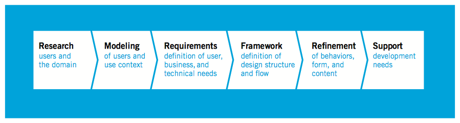

detailed look at the Goal-Directed Design process：

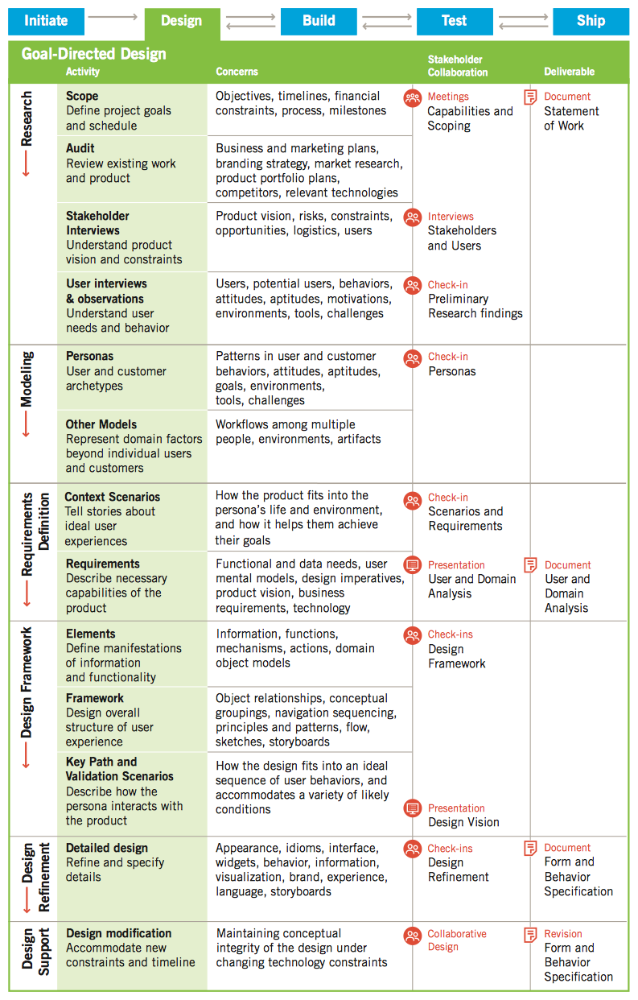


##### 1. 研究 (research)

在研究阶段，采用基于人种学的现场研究技术（观察和情境访谈）来获取一些有关产品的真正用户或潜在用户的定性数据。这个阶段的工作还包括对竞争性产品的考察，对于市场研究、技术白皮书和品牌战略的分析，以及对产品的利益相关者、开发人员、产品所属领域的专家（Subject matter expert）和特定应用领域的技术专家进行一对一的访谈。

现场观察和用户访谈的一个主要成果是，我们能从中提取出一组行为模式，这是一些可以被确认的行为，它有助于对一个现有或即将出现的产品的使用方式进行分类。这些模式揭示出了用户使用产品时的目标和动机（即用户在使用产品时想要得到的哪些具体或一般性的结果）。在商业和科技领域中，这些行为模式一般对应着某种职业角色：而对于面向消费者的产品来说，这些模式往往对应着生活方式的选择。在建模阶段，由行为模式及其相关的用户目标即可以产生出人物角色（persona）。市场研究有助于对人物角色进行选择，并从中筛选出一组正确的同业务模型相适应的人物角色。利益相关者访谈、文献研究，以及产品研究能够加深设计人员对于产品所属领域的理解，并清楚地说明产品的业务目标、品牌特点和技术上的约束，而这些因素都是产品设计所必须支持的。

> The Research phase employs ethnographic field study techniques (observation and contextual interviews) to provide qualitative data about potential and/or actual users of the product. It also includes competitive product audits as well as reviews of market research, technology white papers, and brand strategy. It also includes one-on-one interviews with stakeholders, developers, subject matter experts (SMEs), and technology experts as suits the particular domain.
>
> One of the principal outcomes of field observation and user interviews is an emergent set of behavior patterns—identifiable behaviors that help categorize modes of use of a potential or existing product. These patterns suggest goals and motivations (specific and general desired outcomes of using the product). In business and technical domains, these behavior patterns tend to map into professional roles; for consumer products, they tend to correspond to lifestyle choices. Behavior patterns and the goals associated with them drive the creation of personas in the Modeling phase. Market research helps select and filter valid personas that fit business models. Stakeholder interviews, literature reviews, and product audits deepen the designers’ understanding of the domain and elucidate business goals, brand attributes, and technical constraints that the design must support.


##### 2. 建模 (modeling)

通过对现场研究和访谈的分析，我们从中得到用户行为和工作流程模式。在建模阶段，我们将其综合到领域模型和用户模型中。领域模型包括了信息流和工作流程的图表：用户模型，或者说人物角色则是一种详细的经过人为加工的用户原型（user archetype）,它代表在使用行为、态度、目标，以及动机方面有明显不同的一些用户群，这是通过在调研就观察并确认而得到的。

人物角色在基于叙述式场景的设计方法中起着主要的作用，它能够反复地在框架定义阶段用于产生设计概念。同时也能在优化阶段用来提供反馈，以保证设计上的正确性和一致性。它所起到的作用是一个强有力的交流工具，有助于经理和开发人员理解一些设计背后的考虑，并且能基于用户的需要来确定不同的功能优先级。在建模阶段，设计人员采用多种方法学工具来对人物角色进行合成、区分并确定这些角色的优先级。他们对各种不同种类的用户目标进行研究，并将人物角色对应到各种使用行为上，以保证不会发生缺少某个角色或在某些角色间产生重叠的情况。

基于每个人物角色和其他人物角色目标的相关成度，通过比较其目标并赋予它们不同的优先级从人物角色清单中选择特定的设计目标，指定人物角色类型的过程确定了每个人物角色对最终设计形式和行为的影像。

> During the Modeling phase, behavior and work flow patterns discovered by analyzing the field research and interviews are synthesized into domain and user models. Domain models can include information flow and work flow diagrams. User models, or personas, are detailed, composite user archetypes that represent distinct groupings of behaviors, attitudes, aptitudes, goals, and motivations observed and identified during the Research phase.
>
> Personas are the main characters in a narrative, scenario-based approach to design. This approach iteratively generates design concepts in the Framework Definition phase. It provides feedback that enforces design coherence and appropriateness in the Refinement phase. It also is a powerful communication tool that helps developers and managers understand design rationale and prioritize features based on user needs. In the Modeling phase, designers employ a variety of methodological tools to synthesize, differ-entiate, and prioritize personas, exploring different types of goals and mapping personas across ranges of behavior to ensure that no gaps or duplications exist.
>
> Specific design targets are chosen from the cast of personas through a process of comparing goals and assigning priorities based on how broadly each persona’s goals encompass the goals of other personas. A process of designating persona types determines how much influence each persona has on the design’s eventual form and behavior.


##### 3. 需求定义 (requirements Definition)

需求定义阶段（Requirements Definition）,团队所采用的设计方法提供了用户与其他模型间所必须的紧密练习和设计的框架。这个阶段次阿勇基于场景剧本（scenario）的设计方法，其重要突破在于关注脚本提纲，不是关注抽象的用户任务，它首要关注的是满足具体用户人物角色的目标和需求。从人物角色中可以得到哪些任务是真正重要的及其原因，这样产生的界面同时具有最小化的必须任务（工作量）和最大化收益。人物角色成为这些脚本提纲中的主要角色，设计者通过角色扮演的形式探索设计空间。

对每一个界面/首要人物角色来说，在需求定义阶段中的设计过程中要分析人物角色数据和功能性需求（用术语“对象”、“动作”和“情境”来表达）。在不同情景中，基于人物角色目标、行为及与其他人物角色的交互来对这些数据和需求进行优先级排序。

这种分析通常通过一种反复(iteractively)优化情境场景剧本(context scenario)的过程来完成，从人物角色使用产品的“生活中的某一天”开始描述高层次的产品接触点，到持续定义不断深化的细节。除了场景剧本中产生的需求外，还要考虑人物角色使用产品的熟练程度、身体能力、使用环境等有关问题。业务目标、品牌属性、科技约束也要考虑。并且要与人物角色的目标和需求平衡。

> Design methods employed by teams during the Requirements Definition phase provide the much-needed connection between user and other models and design’s framework. This phase employs scenario-based design methods with the important innovation of focusing the scenarios not on user tasks in the abstract, but first and foremost on meeting the goals and needs of specific user personas. Personas help us understand which tasks are truly important and why, leading to an interface that minimizes necessary tasks (effort) while maximizing return. Personas become the main characters of these scenarios, and the designers explore the design space via a form of role playing.
>
> For each interface/primary persona, the process of design in the Requirements Definition phase involves analyzing persona data and functional needs (expressed in terms of objects, actions, and contexts), prioritized and informed by persona goals, behaviors, and interactions with other personas in various contexts.
>
> This analysis is accomplished through an iteratively refined context scenario. It starts with a “day in the life” of the persona using the product, describing high-level producttouch points, and thereafter successively defining detail at ever-deepening levels. In addition to these scenario-driven requirements, designers consider the personas’ skills and physical capabilities as well as issues related to the usage environment. Business goals, desired brand attributes, and technical constraints are also considered and balanced with persona goals and needs. The output of this process is a requirements definition that balances user, business, and technical requirements of the design to follow.


##### 4. 框架定义 (Framework Definition)

框架定义阶段（Framework Definition）,创建整个产品的概念，定义产品行为、视觉设计、屋里形式的基本框架。除了情境脚本提纲外，交互设计团队还是用两个与其有关的重要系统方法来合成一个交互框架（interaction framework）。

1是一套通用的交互设计原则（interaction design principle）,它提供了在多重情境中定义恰当系统行为的指导原则。

2是一套交互设计模式（interaction design pattern）,对先前已经分析过的不同类别的问题，它给出了通用的解决方案（基于情境不同会有所不同）。

在这个高度上描述了数据和功能性需求之后，按照交互原则，将其转变为设计元素。然后按照模式和原理，将其组织为设计草图和行为描述。这个过程的产物是交互框架的定义（interantion framework definition）,即稳定下来的设计概念，它们为后续设计细节提供了逻辑上的和总体的形式结构。接下来反复进行的关注范围更在的场景剧本，为细化阶段（Refinement Phase）提供细节，这种方式是自上而下（基于模式）和自下而上（基于原则）的设计之间的平衡。

当产品进入到屋里形式的设计阶段后，交互设计者和工业设计者开始紧密协作。针对产品可能采用不同的输入（input vectors）和外形因素（form factors）,采用场景剧本来考虑每一种可能的优缺点。工业设计者在早起一定不能脱离产品的行为来创造概念。

一旦交互框架浮现出来，视觉设计者可以开始创建视觉框架，也称为“视觉语言策略”（visual language strategy）。视觉设计者越用品牌属性和对整体界面结构的理解开发出版面（typography）、色彩模式（color palrttrs）视觉风格（visual style）。

> In the Framework Definition phase, designers create the overall product concept, defining the basic frameworks for the product’s behavior, visual design, and, if applicable, physical form. Interaction design teams synthesize an interaction framework by employing two other critical methodological tools in conjunction with context scenarios. The first is a set of general interaction design principles that provide guidance in determining appropriate system behavior in a variety of contexts. Part II of this book is devoted to high-level interaction design principles appropriate to the Framework Definition phase.
>
> The second critical methodological tool is a set of interaction design patterns that encode general solutions (with variations dependent on context) to classes of previously analyzed problems. These patterns bear close resemblance to the concept of architectural design patterns first developed by Christopher Alexander 3 and more recently brought to the programming field by Erich Gamma and others. 4 Interaction design patterns are hierarchically organized and continuously evolve as new contexts arise. Rather than stifling designer creativity, they often provide needed leverage to approach difficult problems with proven design knowledge.
>
> After data and functional needs are described at this high level, they are translated into design elements according to interaction principles and then organized, using patterns and principles, into design sketches and behavior descriptions. The output of this process is an interaction framework definition, a stable design concept that provides the logical and hi-level formal structure for the detail to come. Successive iterations of more narrowly focused scenarios provide this detail in the Refinement phase. The approach is often a balance of top-down (pattern-oriented) design and bottom-up (principle-oriented) design.
>
> When the product takes physical form, interaction designers and industrial designers begin by collaborating closely on various input methods and approximate form factors the product might take, using scenarios to consider the pros and cons of each. As this is narrowed to a couple of options that seem promising, industrial designers begin producing early physical prototypes to ensure that the overall interaction concept will work. It’scritical at this early stage that industrial designers not create concepts independent of the product’s behavior.
>
> When working to design a service, we will collaborate with service designers to draft a service map and a blueprint that coordinates touchpoints and experiences across chan-nels, both “backstage” with the service providers and “frontstage” experiences from the users’ point of view.
>
> As soon as an interaction framework begins to emerge, visual interface designers produce several options for a visual framework, which is sometimes also called a visual language strategy. They use brand attributes as well as an understanding of the overall interface structure to develop options for typography, color palettes, and visual style.


##### 5. 细化 (refinement)

细化阶段类似于框架定义阶段，但更多地关注细节和实现。这一阶段使用关键线路走查（walkthrough）和验证性场景剧本（validation scenarios）,重点在于使用更详细的故事版线路来走查界面。视觉设计者定义系统的类型风格、各个部分的尺寸、图标，以及其他视觉元素，从而提供一个具有清晰affordance和视觉层次的次隐忍的体验。细化阶段的最终成果是详细的设计文档、形式和行为规范（form and behavior specification）,这一文档是按照情境要求，以书面文字或交互媒体方式来记录。

> The Refinement phase proceeds similarly to the Framework Definition phase, but with increasing focus on detail and implementation. Interaction designers focus on task coherence, using key path scenarios (walkthroughs) and validation scenarios focused on storyboarding paths through the interface in great detail. Visual designers define a system of type styles and sizes, icons, and other visual elements that provide a compelling experience with clear affordances and visual hierarchy. Industrial designers, when appropriate, finalize materials and work closely with engineers on assembly schemes and other technical issues. The culmination of the Refinement phase is the detailed documentation of the design—a form and behavior specification or blueprint, delivered in either paper or interactive media form as the context dictates.


##### 6. 开发支持 (Development support)

设计在开发过程中可能遇到困难和技术难题。开发者构建产品的过程中要能够及时回答他们提出的问题。开发为赶工期需要缩减设计方案，按优先级排序。

> Even a very well-conceived and validated design solution can’t possibly anticipate every development challenge and technical question. In our practice, we’ve learned that it’s important to be available to answer developers’ questions as they arise during the construction process. It is often the case that as the development team prioritizes their work and makes trade-offs to meet deadlines, the design must be adjusted, requiring scaled-down design solutions. If the interaction design team is not available to create these solutions, developers are forced to do this under time pressure, which has the potential to gravely compromise the integrity of the product’s design.


##### 产品成功的关键是目标，不是特性

goals, not features, are the key to product success

功能都是抽象的概念，很难告诉人们使用产品时如何能提高生产力或感到愉快。

> 目标导向的过程及其设计决策提供的理论基础，保证设计不是凭空猜猜，不是个人偏好或奇想。
>
> 目标导向设计也是回答在定义和设计产品中出现重要问题的有力工具

**设计原则**

- 我的用户是哪些人？
- 我的用户在试图实现什么？
- 我的用户如何看待它们要实现的产品？
- 我的用户会发现哪些体验是吸引人并有收获的？
- 我的产品应当如何工作？
- 我的产品应当次采用何种形式？
- 用户如何同产品交互？
- 我的产品永能如何能最有效的组织在一起？
- 我的产品以何种方式面向首次实用的用户？
- 我的产品如何体现在技术上易于理解、让人喜欢、易于控制？
- 我的产品如何处理用户遇到的问题？
- 我的产品如何帮会组偶尔使用的用户或生手用户变得更熟练？
- 我的产品如何为专家既用户提供足够的深度和力度？

> • Who are my users?
>
> • What are my users trying to accomplish?
>
> • How do my users think about what they’re trying to accomplish?
>
> • What kind of experiences do my users find appealing and rewarding?
>
> • How should my product behave?
>
> • What form should my product take?
>
> • How will users interact with my product?
>
> • How can my product’s functions be most effectively organized?
>
> • How will my product introduce itself to first-time users?
>
> • How can my product put an understandable, appealing, and controllable face on technology?
>
> • How can my product deal with problems that users encounter?
>
> • How will my product help infrequent and inexperienced users understand how to accomplish their goals?
>
> • How can my product provide sufficient depth and power for expert users?


# 第二章 实现模型和心理模型

**实现模型**

程序用代码来实现的细节

**用户心理模型**

和软件交互过程中用户的心理模型。这种模型基于用户自己对如何进行操作，以及计算机将会怎样运行的想法。

> 人们使用产品时，创造出一种认知上的简捷的解释方式

**设计者的表现模型**

设计者将软件的运行机制展示给用户的方式称为“表现模型”


表现模型越接近用户心理模型，用户会感觉程序越容易使用和理解。

表现模型过于接近实现模型，会严重削弱用户学习和使用该软件的能力。


**用户界面应该基于用户的心里模型，而不能基于实现模型**

软件的表现模型非常符合用户的心理模型，提供使用户很容易理解其目标和如何得到满足的认知框架，可以消除用户界面中一些不必要的复杂性。

用户的心里模型并不一定要真实或准确，但应该能让用户更有效的工作。

> 对用户而言，几乎是一样的两个操作计算机的反应却不一样，很容易给用户造成认知失调，即由于对同一个现实情况的两种矛盾的表现产生的疑惑，结果导致原本简单的交互变得难以掌握。

新技术需要新的表现方式

> we have a hard time seeing how digital products will be used, we tend to rely too much on representations from the past


# 第三章 新手、专家和中间用户

### 永久的中间用户

在交互和界面设计中，如何用同一个界面满足新手用户和专家用户的需求，是长久以来存在的难题。

> 解决方法在于理解各种用户掌握的新概念和任务的方式
>
> 大多数用户既非新手，也不是专家，而属于中间用户
>
> 没有人愿意停留在新手机别，新手意味着不称职。新手会成为晋升为普通用户或放弃
>
> 维持高水平的技术程度很困难
>
> 正态分布曲线只是瞬间快照，新手和专家随着时间的推移都会倾向于成为中间用户
>
> 大部分工作满足永久的中间用户同时，也提供各种机制，让新手和专家两类较少的用户也能有效使用。
>
> 长时间不用该软件，忘掉大量内容，重新使用时，需要一些提示回到以前的状态。
>
> 网站设计中尽可能采用透明和容易发现的交互很重要。
>
> 同时，现在网站能后追踪用户的行为，以提供一个适用性的体验越来越流行，依靠cookie可以辨别一个新的访问者，并为其提供一种不唐突的帮助，很有用。


### 为不同的体验水平设计

为中间用户优化（大多数实际用户），让程序对中间用户来说功能强大，易于使用。同样也必须满足新手和专家的需求，但不能让所占比例最大的一部分用户感到不舒服。

目标有3个方面：

1. 让新手快速和无痛苦的成为中间用户
2. 避免为那些想成为专家的用户设置障碍
3. 让永久的中间用户感到愉快。（功能强大易于使用）


#### 新手需要什么

新手是敏感的，很容易在开始有挫败感。不可将新手状态视为目标。好的软件缩短这一过程。他们需要一些提示但不是很多，学习过程应该快速且富有针对性。

聪明人在理解原因和效果后会学的更好，让他们理解为什么软件会那样工作，我们用心里模型来弥合这种矛盾。

新手必须迅速掌握程序的概念和范围（不然会彻底放弃），确保程序充分反映了用户关于任务的心智模型。

> 他可能想不起哪个命令执行特定对象，但会想起对象和动作间的关系，一些重要概念，如果界面的概念结构与其心智模型一致的话。

1. 让新手转变为中间用户需要程序提供特别的帮助，而一旦成为中间用户，这种帮助反过来会妨碍用户。
2. 标准的在线帮助的主要功能是为用户提供参考。新手不需要参考信息，他们需要概括性的信息，如：一次全局页面的导游。
3. 单个的指南工具-显示在对话框中，是一个交流大体情况、范围和目标的好工具。用户使用时，显示程序的基本目标、工具，告诉用户基本功能。只要这种引导持续集中在新手所关注的问题如范围和目标即可。
4. 新手也依赖菜单来学习和执行命令，可能菜单执行起来慢且沉闷。但它彻底而详细，让人放心。菜单项发起的对话框（如果这么做）应该是解释性的（简介和精炼），并有方便的“取消”按钮。


#### 专家需要什么

专家是非常重要的人群，他们对缺少经验的用户有极大影响。新用户考虑产品时会更信赖专家，而不是中间用户。如果专家说“这个产品不好”，可能指“这个产品对专家来说不好”。担新手不知道这些，他会考虑专家的意见，即使建议并不适用。

专家会寻找深奥的功能，并经常使用。经常使用的工具集要求能快速访问，工具集可能很大。专家需要所有的快捷方式。

专家欣赏更新的且更强大功能，不会受复杂性增加的影响。

> 专家持续积极地学习更多内容，以了解其自身行动和程序的行为，以及表达之间的关系。


#### 永久的中间用户需要什么

中间用户需要工具，因为他们已经掌握了这些程序的意图和范围，不再需要解释。工具提示（Tooltip）是适合中间用户最好的习惯用法。它没有限定范围、意图和内容。只用简单用户语言告诉你程序功能，且使用的视觉空间少。

中间用户知道如何使用参考资料，只要不是必须一次解决所有问题，就有深入学习和研究的动机。这意味在线帮助是极佳工具，通过索引使用帮助，因此索引部分必须非常全面。

中间用户会确定其经常使用和极少使用的功能，可能会遇到一些模糊的特性，但会很快识别出自己经常使用的功能。会要求常用功能中的工具放在界面前端和中心位置，容易寻找和记忆。

中间用户知道高级功能存在，即使不需要或不用。但有高级功能的事实让中间用户放心，让他们确信购买这个程序是正确的。


# 第四章 设计研究 Understanding the Problem :Design Research

定量分析只能回答那些少数简化轴上的“多与少”问题。而定性研究能够以丰富多元的形 式回答“是什么”、“怎么样”和“为什么”等问题，真实反映人类现实情况的复杂性。


### 设计研究中的定性研究与定量研究

#### 定性研究的价值

与定量研究相比，定性研究对于帮助我们理解产品的领域、情境和受约束条件更加有用。 它能更快速、简便地帮我们发现产品用户和潜在用户的行为模式。

定性研究能帮助我们理解以下问题：

- 产品现有和潜在用户的行为、态度与能力。 


- 待设计产品的技术、业务和环境情境，即产品的领域（问题域）。 


- 目标领域的词汇和其他社会问题。 


- 已有产品的使用方式。

定性研究也有助于设计项目的进展：

- 为设计团队提供可信性和权威性方面的依据，因为有研究结果作为设计决定支撑。


- 让团队对目标领域和用户关切达成统一认识。


- 帮助管理人员在产品设计问题上做出更全面科学的决策，而不是基于猜测和个人偏好 做决定。

与定量相比之下，定性研究方法实现更快、成本更低，并且更有可能为重要问题提供有用的答案，从而产生更优的设计：

- 产品如何融入用户生活的大背景之中？ 


- 用户使用该产品的基本目标是什么？哪些基本任务能够帮助人们达成这些目标？


- 哪些体验能够吸引用户？如何将这些体验融入正在设计的产品之中？ 


- 用户⾤用当前方法进行设计时会遇到哪些问题？

定性研究的价值不限于对设计流程的支持。根据我们的经验，花时间深入了解用户人群， 能够提供传统市场研究无法揭示的宝贵商业见解。


#### 定量研究的利弊

**【优点】：**

在确定用户的购买动机时少不了市场营销专业人士的帮助。其中一个最有力的工具是**市场划分 （market segmentation)**。

> 焦点小组和市场调研的数据可以按照人口统计的标准对潜在客户分组，如 ：年龄、性别、教育程度、邮编等。**这有助于生产商确定某种特定产品或市场信息对何种类型的消费者最具吸引力**。更复杂的消费者数据可能包括消费心态学和行为变量，如态度、 生活方式、价值观、意识形态、风险厌恶和决策模式等。
>
> 【方法论】：
>
> 斯坦福研究院(SRI)的“价值、态 度和生活方式”（VALS)、乔纳森• 罗宾(Jonathan Robbin)的地理人口统计法PRIZM群等市场划分法，能够通过预测消费者购买力、购 买动机、自我倾向和资源，从而使数据更加明晰。

**【缺点】：**

1. 然而，了解某人是否会购买某商品，并不等于了解用户购买后如何使用产品。
2. 市场划分是确定和量化市场机会并确认市场划分的实用工具，但在定义什么产品能够抓住市场机遇时，效果不好。
3. 量化研究，如⽹络分析和其他用数字描述人类行为的举措，能够解释“是什么” 或“ 有多少 ” 。 但缺少基本的定性分析， 不能解释这些行为的原因，这样的统计数据带来的问题的数量只会超过所能提供的答案。

**定量分析能指导设计研究：**

定性分析是收集行为知识的有效工具。行为知识能够帮助设计者为用户定义和设计产品。量化数据市场研究能够确定并量化商机，能够准确地预测产品和服务在市场上的接受程度。（市场建模技术是评估产品可行性的宝贵工具，也是说服管理人员开发某 个产品的有力手段。）

如果设计师计划采访和观察目标用户，可以参考市场研究（如果有的话）来帮助选择访谈目标。

⽹络和其他有价值的数据分析是发现设计问题的绝佳途径，这些问题可能需要解决方案。

**用户研究有益于市场研究：**

在描述用户行为和潜在需求方面，定性研究⼏乎始终是不二之选。但是，也有一种信息（商业利益相关者至关重要）单靠定性研究是无法获取的行为模型的市场规模。这里是采用量化技术的理想场 合（比如调查）来填补缺失信息。

一旦行为模型（人物模型）能够成功地代表用户，就可以构建调查。调查要区分用户类型，收集传统市场人口统计数据，这些数据与行为数据相关。调查结束后，就可以确定（尤其是对于消费产品而言）在设计产品特性和整体体验时哪一类用户是重点。

**[The relationship between quantitative research and qualitative, Goal-Directed design research]**

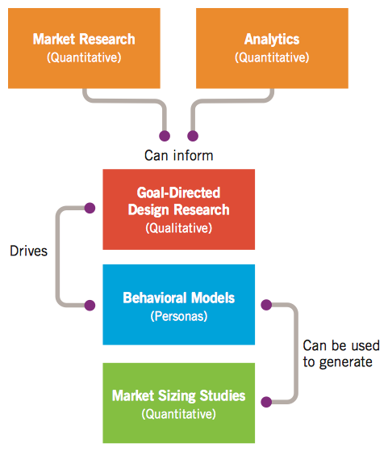


### 目标导向设计研究

在社会科学和可用性教程中有很多定性研究的方法和技术。如下定性研究活动在目标导向涉及实践中最有用（大致按照执行顺序排列）：

- 启动会 (Kickoff meeting)


- 文献综述  (Literature review)


- 产品/原型和竞争者审核  (Product/prototype and competitive audits)


- 利益相关者访谈 (Stakeholder interviews)


- 主题专家(SME)访谈 (Subject matter expert (SME) interviews)


- 用户和客户访谈 (User and customer interviews)


- 用户观察/人种学实地研究 (User observation/ethnographic field studies)

**[An overview of the Goal-Directed design research process]**

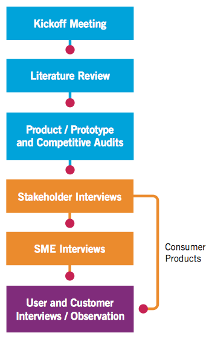


#### 启动会

这是设计师聚集利益相关者提出初始关键问题的好机会：

- 产品是什么？


- 用户是谁？


- 用户最需要什么？


- 从业务上来说，哪些客户和用户最重要？


- 设计团队和商业上面临何种挑战？


- 谁是最大的竞争对手？为什么？


- 为了熟悉产品、业务和技术领域知识，需要了解何种内外部文献资料？

这么做不仅能让设计团队深入了解产品本身，还能了解产品利益相关者、用户，以及会面临的设计问题。这些问题还能为设计师后期访谈利益相关者和用户提供线索，为理解产品领域提供参考。（如果领域很狭窄或者技术性很强，这些问题就尤为重要。）


#### 文献综述

在访谈利益相关者之前或同时，设计团队就应该査阅产品或产品所在领域相关的文献。其中应该包括以下类型的资料：

- 内部资料，包括产品市场规划、品牌策略、市场研究、用户调查、技术规范和白皮书、 竞争性研究、可用性研究和指标、呼叫中心统计数据或记录等客户支持数据，以及用户论坛存档。


- 行业报告，如商业和技术期刊杂志。 


- ⽹络搜索，从⽹上搜索来的相关产品和竞争产品、新项目、独立用户论坛、博客文章，以及社会媒体讨论话题等内容。

设计团队应该收集以上文献，以此为基础，设计针对利益相关者和主题专家提出的问题。之后可以使用文献来提供领域补充知识和词汇表，检查汇编的用户数据。


#### 产品/原型和竞争者审核

在访谈利益相关者和主题专家之前或同时，产品设计团队检查产品的现有版本或者原型,以及主要的竞争对手。

设计团队能够产生相关的设计认识，为访谈期间的问题增添内容。理想情况是，设计团队能够参与当前产品（如果有的话）和竞争产品界面的非正式或专家评审(有时称作启发式评审）。他们应该按照交互和视觉设计原则进行比较。这一过程让设计团队能够熟悉当前产品对用户而言有哪些优势与局限，总体上了解产品当前的功能范围。


#### 利益相关者访谈

任何新产品设计的研究工作都应当从了解产品的业务环境和技术背景开始。多数情况下，产品设计（或再设计）是为了实现一个或者多个商业目标（赚钱是其中最常见的）。设计师有责任在开发出解决方案的同时，又不会忘记这些目标。因此，设计团队务必理解设计摘要背后的机会与限制。

【访谈对象】

一般而言，利益相关者是指对所设计产品有权利或有责任的任何人。

> 具体说来，利益相关者是委托设计的组织方的所有关键成员，通常包括高管、经理，以及开发、销售、产品管理、 市场营销、顾客支持、设计和可用性各方面的代表成员，可能也包括与委托方组织有业务合作的其他组织的类似人员。

【访谈时机】

访谈利益相关者应该在其他用户研究开始之前进行。访谈利益相关者有助于启发展开用户研究。

【访谈方式】

**访谈利益相关者最有效的方式是单独进行**，而不是大规模跨部门间交流。一对一的设定能促使一些利益相关者畅所欲言，确保个人观点不会淹没在人群中（这种访谈中最有意思的发现, 莫过于了解到一个产品团队中的所有人对共同愿景的接近或不接近程度）。**访谈不要超过一小 时**。如果确认某个利益相关者是极有价值的信息来源，还可以召开后续会议。

【收集内容】

从利益相关者那里收集某些类型的信息尤为重要：

- 产品初期设想。你可能会发现，每个业务部门对将要设计的产品，看法都略有不同，都不太完整。因此，必须把这些看法与用户和顾客的看法协调统一起来。如果利益相关者之间存在严重的分歧，需要在早期阶段就进行监管、跟进。 


- 预算和日程计划。讨论这一问题通常能够对设计工作的范围进行现状核实。如果用 户研究表明需要更大（或更小）的范围，这就给管理者提供了决策点。 


- 技术限制和机遇。设计范畴的另一个重要决定因素是，在给定财政预算、时间和技 术的限制条件下，对技术可行性的坚实理解。另外，研发产品有时是为了利用一项新 技术。理解该技术蕴藏的商机有助于规划产品的方向。 


- 商业驱动。设计团队要了解商业目标，这一点非常重要。如果用户研究指出了业务需求和用户需求之间存在冲突，这就又产生了一个新的决策点。设计必须尽可能地在产品、用户、顾客和供应商之间打造共贏的局面。 


- 利益相关者对用户的看法。同用户有关的利益相关者（如顾客支持代表）可能有些重要的真知灼见，有助于制订用户研究计划。你也可能会发现，一些利益相关者对用户的理解与你在研究中的发现有很大差别。这些信息会成为过程后期与管理层的讨论重点。

讨论上述话题，有助于在设计团队、管理人员和工程团队之间发展出共同语言和共识。设计师的任务就是开发出整个团队都信仰的愿景。

> 如果不花时间了解每个人的想法，大家就会认 为，拟议解决方案可能没有体现他们各自的重点。因为这些人有责任、有权力把产品投入现实世界，他们就必须获得重要知识，表达各自意见。如果你没有坦诚提问，后面就可能陷入被动，往往拟议解决方案会遭到批评。

尽管从利益相关者那里收集意见很重要，也不能照单全收。在随后的用户访谈中很可能 发现，一些用户会通过提出解决方案的方式来表达问题。设计师就要仔细斟酌字里行间 的意思，找出真正的问题所在，并提出适应商业和用户需求的解决方案。


#### 主题专家(SME)访谈

在一个设计项目初期，找到并会见⼏位主题专家（产品所在领域的权威人士），十分宝贵。 对于 一些高度复杂，或者技术性极强，又或是需要考量法律因素的领域来说，这么做至关重要 (医疗保健领域就同时涵盖以上三点）。

主题专家与利益相关者一样，都会对产品和用户提供有价值的看法。设计师应该小心地认识到，主题专家的看法可能有所歪曲，因为通常他们不可避免地会加入自己对产品/所在领域的理解。这种对产品怪癖和所在领域限制条件的深入看法，既可能是福祉，也可能会阻碍创新设计。

> 许多主题专家本身就是产品或者上一代产品的用户，现在则可能是培训、管理或者咨询人员。他们通常是利益相关者聘请的专家，但本身不是利益相关者。

访谈主题专家时应该考虑以下⼏点：

- 主题专家通常是专业用户。他们对产品或领域的长期经验，意味着他们可能已经习惯 了当前的交互。他们可能倾向于专家级用户，而不是为永久的中级用户设计交互产品 。主题专家通常不是产品的当前用户，他们更倾向于从管理的角度思考问题。


- 主题专家知识渊博，但不是设计师。他们可能对改进产品有很多想法，其中也不乏行 之有效、有价值的意见，但**从这些建议中收集的最重要的信息是找出哪些问题诱发了 他们的拟解决方案**。和用户访谈一样，对方提出解决方案时，要询问这对用户或者设 计师有什么帮助。


- 主题专家在复杂或者专业领域必不可少。如果为技术领域做设计，如医疗、科技或金 融服务等，可能需要主题专家的指导—除非你自己就是主题专家。借助主题专家收 集行业最佳实践和复杂规则相关的信息。主题专家对用户角色特点的了解，对复杂领 域中用户研究的规划非常关键。 


- 确保设计过程中能够得到主题专家的帮助。如果产品所在领域需要主题专家协助，就 能在不同设计阶段依赖于他们，完成设计细节的现状检查。务必在早期访谈中获得这 种人脉。


#### 客户访谈

用户和客户这两个概念容易被混淆。对于消费品来说，客户通常就是用户。但在公司或技术领域，用户和客户通常指不同的人。尽管两组人员都是访谈对象，但他们对产品的观察角度不同，在产品最终设计的反映也有所不同。

客户指购买产品的人。两者有着截然不同的目标和需求。为了确保产品的可行性，理解客户及其目标就非常重要。同样要意识到这些顾客实际上很少使用产品，当他们使用时，也和用户的使用方式不同。

访谈客户时，要了解以下内容：

- 购买产品的目的。


- 当前解决方案中遇到的难题。


- 购买正在设计的这类产品时的决策过程。


- 在安装、维护、管理产品时的角色。


- 产品所在领域相关问题和词汇。

同主题专家一样，客户对于改进产品可能会有许多意见。分析这些意见背后存在的问题也非常重要，就像针对主题专家的情况一样，这样才能确定所提想法背后的问题，因为在设计过程后期，可能会产生更好、更完整的解决方案。


#### 用户访谈

设计的主要关注点是用户，他们是亲自使用产品来达成目标的人。如果要重新设计或改良现有产品，与现有用户和潜在用户交流就很重要。而潜在用户虽然目前并未使用产品， 但因为产品能够满足他们的需求， 所以他们将来很有可能会使用， 属于产品的目标市场。对现有用户和潜在用户进行访谈，可以发现产品当前版本的体验对用户行为和思维有何影响。

我们需要从客户访谈中了解的信息：

- 产品（如果目前产品还未面世，则指类似系统）如何适应用户生活和工作流程：用户 何时、 因何原因以及如何使用产品。 


- 用户角度的领域知识：用户完成工作需要知道的信息。


- 当前任务和活动：包括现有产品需要完成和不能完成的。 使用产品的动机与期望。 


- 心理模型：用户对于工作、活动的看法，以及对产品的期望。 


- 现有产品（如果目前产品还未面世，则指类似系统）的问题和不尽完美之处。


#### 用户观察

大多数用户不能准确评估自己的行为,尤其是行为脱离了人类活动范畴时。

> 的确，由于害怕显得愚蠢、无能或者缺乏礼貌，许多人不会谈论他们觉得有问题或者难以理解的软件行为。

如果在设计师希望了解的场景之外进行访谈，收集到的信息将会不完整和不精确。访谈时，可以与用户讨论他们对自身行为的看法，或者可以直接观察用户。后者效果更佳。

或许，收集定性用户数据最有效的技巧是将访谈和观察结合起来，允许设计师实时提出问题澄清，直接询问观察到的情形。

许多可用性专家利用技术辅助手段，如录音或摄像来记录用户的言行。⾤访者应切记，使用这些技术不要太过明显，否则用户会分神，或者表现得与没有被记录时有所不同。根据经验, 一个笔记本和 一台数码相机足以捕捉我们需要的全部信息，同时不会有损信息交流的真实性。 通常只有在我们觉得同被访者建立信任关系后，才拿出数码相机，用来捕捉环境一些难以速记的元素和对象。如果使用恰当，视频可以成为强有力的表现工具，用以说服利益相关者接受有争议或者超出预料的研究结果。在 一些不适合做笔记的场所，如在行驶的车中，视频也有用武之地。

对消费品而言，很难获得用户行为的真实画面，尤其是户外或者公众场合使用产品的话。 这种情况下，采取路人的方式观察用户十分有效。这样，设计团队能够在公开场合轻松地观察产品相关的人类行为。这一技巧有助于理解传统企业商业相关行为，这些行为可以解释成⽹络行为、移动相关的各类行为，或者主题公园，或博物馆等与特定环境的有关行为。


### 访谈并观察用户

把观察和一对一访谈结合起来，对于收集用户及其目标方面的定性数据来说，是设计师最有效的工具。人种学访谈方法结合了沉浸式观察和有导向的访谈法。

> 休•拜耳(Hugh Beyer)和卡伦•霍尔茨布拉特(Karen Holtzblatt)开创了被他们称之为 “情境调查”(contextual inquiry)的人种学调查法。


#### 情境调查

人种学调查的4个基本原理：

- 情境—同用户交流和观察的地点尽量选择用户正常的工作环境，或是适合产品的物 理环境，不要选择干净洁白的实验室，这点很重要。观察用户的活动，提出问题，要在用户自己熟悉的环境中展开，他们自己的环境中布满了日常使用的物品，这有利于 挖掘出他们行为相关的所有重要细节。


- 伙伴关系—访谈和观察时，要⾤取合作的方式探索用户，对工作的观察和对工作架 构、细节的讨论可以交替进行。 


- 解读—设计师的大部分工作就是研究收集到的用户行为、环境和谈话内容，进行综 合分析，解读信息，发现设计意义。不过，访谈者必须谨慎，还要避免不经过用户证 实而做出主观臆测。 


- 焦点—设计师应该巧妙地引导访谈，利于捕捉与设计问题相关的数据，而不是用调 查问卷提问回答，或者让访谈自由发挥。

#### 改进情境调查

情境调查为定性研究奠定了坚实的理论基础，但作为一种具体的方法，它也有局限性和效率不高的问题。

下面的过程改进措施可以产生更加有利的研究阶段:

- **缩短访谈过程**：情境调査假定用户访谈需要一天的时间。作者发现，只要保证足够的访 谈数量（每个假定的人物模型或类型大约需要6个精心挑选出来的用户），一个小时足以收集必要的用户数据。找到一组愿意与设计师相处一个小时的多类型用户，比找到愿意花一整天的单一用户，更加容易，更加高效。 


- **适用小规模设计团队**：情境调查假定有一个庞大设计团队同时进行多项访谈，随后所 有团队成员开会讨论调查内容。我们发现，由同一组设计师依此进行每一场访谈的效 果更好。这样设计团队可以保持较小规模（两三名设计师）。更重要的是，这意味着整个团队可以与所有访谈的用户直接交互，从而可以更有效地分析和综合用户数据。 


- **首先找出用户目标**：情境调查的设计过程从根本上讲是以任务为重点。我们建议，在 确定与目标相关的任务前，采用人种学调查首先找出用户目标，确定目标的轻重缓急。 


- **超越商业情境**：情境调查呈现的是产品和企业环境，但在消费者领域进行人种学调查 也是可行的。不过提问的重点会略微不同。


#### 为人种学访谈做准备

> 人种学是借用人类学中的一个术语，意味着系统深入地研究人类文化。这里的目的不是试图理解整个文化的行为和社会利益，而是理解与个体产品相关的人的交互行为和习惯。

##### 确定候选人

确定合适的、多样化的用户样本和用户类型，确定采访哪种用户和潜在用户。

##### 人物模型假设

人物模型假设(persona hypothesis)应当基于可能的行为模式以及区分这些模式的因素

> 产品所在领域的性质决定了人物模型假设的方式。商业用户与消费品用户的行为模式和动机大不相同，因此构造人物模型假设使用的技巧也各不相同。

人物模型假设是为产品定义不同用户（有时是客户）类型的第一步。

人物模型假设试图在较高层面上解决以下问题：

- 哪些不同类别的人可能会使用这些产品？


- 他们的需求和行为可能会有何变化？


- 需要探索哪些行为范畴和环境类型？

**商业和消费领域的角色**

对于商业产品来说，角色（role)(不同类别用户相关的共同任务和信息需求）提供了重要 初始组织原则。在商业和技术情境中， 角色通常大致等于工作描述。 所以通过理解系统中用户（或潜在用户）担任的职位类别，获得一些合理的初始访谈用户类型相对来说要容易。

**行为和人口统计学变量**

除了角色，人物模型假设应该建立在不同的变量基础上，这些变量能够根据用户的需求和 行 为来区别不同的用户群体。这往往是区分用户类别最有效的方式

消费品用户类型通常大致可以通过组合用户类型所对应的行为变量来区分，但行为变量对于确定业务和技术用户类型也很重要。同一业务角色定义中的人可能存在不同的需求和动机。这些都可以在收集用户数据后，通过行为变量捕捉到。

鉴于收集用户数据之前，很难精准地预测行为变量，建立人物模型假设的另一个有效途径 就 是使用人口统计学变量。制订访谈计划时，可以利用市场研究确定产品目标人群的年龄、区 域、性别和收入。被访者应该分布在这些人口统计学变量的范围之内，以期访问的人群足够多 样化，从而确定显著的行为模式。

**技术专业知识与行业专业知识**

行为区分的一个重要类型是技术专业知识和行业专业知识之间的不同。

**环境因素**

最后要考虑一点，就是用户就职的组织之间的文化差异，对商业产品来说尤其如此。

**创建人物模型假设之后，加上潜在角色和行为、人口统计学以及环境变量，就需要制订访谈计划，与负责协调和安排访谈的人员进行沟通。**

> 在实践中发现，对于企业或者专业产品，每个假设的行为模式都要经过大约6次访谈 才能得到证实或者证伪(如果领域较为复杂，有时需要更多访谈)。通常消费品的行为变量更多，因此要确切描绘出区别需要更多次访谈。


#### 进行人种学访谈

在制订访谈计划时，设计师应该与可以接触到用户的利益相关者密切合作。利益相关者的参与通常是实现访谈的最佳方式，尤其对业务和技术产品而言。

> 对于企业或者技术产品来说，直接同利益相关者一起合作，通常能够帮助访谈者接触到大量的被访者。然而这一点对消费型产品来说更具挑战性

##### 访谈团队和时间

一个负责引导访谈并适当做些笔记，另外一位负 责 详细记录访谈内容，查找提问的漏洞。

##### 人种学访谈的阶段

一个项目的完整人种学调查按时间顺序排列可以分为3个阶段。不同阶段的调查所采用的 方法都会和上一阶段有所不同，这反映出每次访谈的用户行为知识都在增加。开始时，访谈的关注点比较⼴泛，针对的是总体结构和目标相关问题。后期关注的范围则逐渐缩小，逐步锁定某些特定功能及与任务相关的问题。

- 早期访谈具有探索性质，重点是从用户角度收集领域知识。问题通常较为⼴泛、开放, 较少探究细节。 


- 中期访谈中用户模式初步显现，设计师开始提出开放式和明确的问题，形成初步轮廓。 既然设计师已经掌握了领域的基本规则、结构和领域词汇表，这时问题通常更关注于行业细节设计。 


- 后期访谈确认先前观察到的模式，进一步阐明用户角色和行为，并对任务和信息需要 的假设进行细微调整。提问更多侧重封闭型问题，对数据进行收尾工作。

了解访谈对象后，同利益相关者一起安排访谈各个阶段的最佳人选对访谈大有裨益。

##### 基本方法

访谈者遵循以下建议，就能获得大量有用的定性数据。

- 在交互发生的地方进行访谈。


- 避免按照固定的问题提问。


- 假装成门外汉，而非专家。


- 采取开放式和封闭式问题相结合引导提问。


- 首先关注目标，任务其次。


- 避免把用户当设计师。


- 避免讨论技术问题。


- 鼓励讲故事。


- 请求演示和讲解。


- 避免诱导性问题。

###### 【在交互发生的地方进行访谈】

遵照情境调查的首要原则，在用户使用产品的场所访谈受访者。这不仅让访谈者有机会观察正在使用的产品，也让访谈团队有机会了解交互发生的环境，从而深入地洞察产品的局限性，以及用户需求与目标。

> 仔细观察环境有可能发现访谈对象没有提到的任务线索。例如，注意一下他们需要的信息类型（桌面上的纸张或者屏幕边缘贴的便条）、不适当的系统（备忘单和用户手册）、任务频率和优先级（收件箱和发件箱），以及他们遵循的工作流类型（备忘录、图表及日历）。未经许可 不 要偷窥，但若看到有趣的事情，可以请受访者聊一聊。

###### 【避免按照固定的问题提问】

如若用固定的调查问卷进行访谈，不但有可能疏远访谈对象，还有可能错失丰富而有价值的用户数据。人种学访谈（和情境调查）的整个前提条件是，我们作为调查者，事先并不了解产品所在领域，无法预设提问的问题。必须从访谈对象那里了解哪些是重要的。尽管如此，心里有问题类型对访谈很有帮助。根据领域不同，有一组标准化的话题准备在访谈期间使用，或许有用。 话题清单可能随着访谈进程而演变，但可以保证从每次访谈中收集足够多的细节，发现明显的行为模式。

> 以下是需要考虑的一些目标导向型问题：
>
> - 目标—哪些事会让你愉快？或是糟糕？
>
>
>
> - 机会—目前哪些事情在浪费你的时间？
>
>
>
> - 优先级—哪些是最重要的事？
>
>
>
> - 信息—什么帮助你做决定？
>
>
> 另一类有用的问题是系统导向型问题：
>
> - 功能—使用产品时做得最多的事情是什么？
> - 频率一产品哪个部分使用频率最高？
>
>
> - 偏好一你最喜欢产品的哪些方面？最讨厌的是什么？
>
>
>
> - 失败—你如何解决遇到的问题？
>
>
>
> - 经验—你使用什么样的快捷键？
>
>
> 对于商业产品，工作流程导向型问题很有帮助。
>
> - 过程—早起做的第一件事是什么？之后呢？
>
>
>
> - 频率—这件事多久做一次？什么事情每周或每月都要做，而不是每天都做的？
>
>
>
> - 特殊情况—通常一天是怎么过的？什么事情是不寻常的？
>
>
> 为了更好地了解用户动机，可以提问态度导向型问题。
>
> - 期望—未来五年的规划是什么？
>
>
>
> - 避免—你不愿意做什么？哪些事在拖延？
>
>
>
> - 动机—工作（或者生活方式）中最满意的是什么？哪些问题是你常常会最先解决的？
>

###### 【假装成门外汉，而非专家】

访谈中，要摘掉专业设计师或者顾问的帽子，以学徒的角色提问。你的目标是⼴泛而客观 地 听取受访者的谈话内容，并鼓励受访者积极地给予详细深入的讨论。不要害怕问一些肤浅的问题，这样有助于帮助人放松，你会发现有时貌似愚蠢的问题反而能够进一步深化之前的想法，引导出真知灼见。做一个富有同理心、善于倾听的访谈者，你会发现人们愿意分享他所知道的任何类型的信息。

###### 【采取开放式和封闭式问题相结合引导提问】

开放式问题鼓励受访者详尽地回答问题。用这些类型的问题来为某一主题引导出更多细节,从而获得更多的信息。典型的幵放式问题一般以“为什么”、“如何”和“是什么”开始。

封闭式问题则鼓励简短的回答。用封闭式问题来关闭询问，或者在受访者朝着无意义的防线偏离时将其拉回访谈正轨。封闭式问题一般期望回答是或否，通常以“你是”“你会”开头。

受访者回答了封闭式问题后，对话之间通常会有暂停。接着你就可以用开放式问题重新引导讨论新的专项问题。

###### 【首先关注目标，任务其次】

与情境调查和其他大多数定性研究方法不同，人种学调查的首要问题并非要执行的任务是什么，而是理解用户行为的原因，即什么激发了不同角色个体的行为，以及他们希望最终如何达成目标。当然，理解任务是重要的，并且必须详细地记录任务。但最终还要对这些任务进行调整，以便在最后的设计中更好地配合用户目标。

###### 【避免把用户当设计师】

引导访谈对象审视问题所在，但要避免受访者提出解决方案。大多数时候，这些方案都带有个人色彩，反映的是用户个人的侧重点。尽管如此，受访者提出的解决方案可以作为有效的跳板，把讨论从用户目标引向他们在当前系统使用中遇到的问题。 如果用户不假思索地冒出一个有趣的想法，则询问他：“这样可以解决哪些问题？”或者“这个方案好在哪里？ ”。

###### 【避免讨论技术问题】

不了解技术决策背后的目的就讨论技术问题没有任何意义。对于技术型或科学型产品来说，技术始终是个问题，这时要分清领域相关技术和产品相关技术，并在讨论中避免讨论后者。如果受访者执著于探讨产品的实现方式，可以询问“这对你有什么帮助？ ”把话题拉回来。

###### 【鼓励讲故事】

鼓励受访者讲述关于使用产品的体验的具体事例，远比请他们给出设计建议更有效。询问他们如何使用产品，对产品的看法如何，使用产品时同什么人交互，在哪些场合使用产品等，这类细节性问题通常是了解用户如何与产品交互的最好方式。访谈中要鼓励讲述使用产品的典型和特殊案例。

###### 【请求演示和讲解】

在了解用户活动和交互的流程和结构，并完成其他问题后，可以请求受访者演示和讲解，或者展示与设计问题的相关内容。这些内容可以是领域相关技术、软件界面、文件系统、工作环境浏览等技术，当然最好能包括以上所有内容。确保不光要记录内容本身（使用数字或摄影机较为方便），还要留意受访者的描述方式，并且要问足够多的问题弄清楚其表述。

在用户环境中捕捉设计技术的同时， 要格外留意现有设计中未碰到的需求或不足之处。

###### 【避免诱导性问题】

访谈中要避免的一个重要事项就是避免使用诱导性问题。

> 以下是某些诱导性问题的示例：
>
> - X功能对你是否有帮助？
>
>
>
> - 你喜欢X,对吗？
>
>
>
> - 如果可能，你认为自己会使用X功能吗？
>
>
>
> - X对你来说是个不错的选择吗？

###### 【访谈之后】

每次访谈后，设计团队都要比对笔记，讨论在最近访谈中观察到的任何有趣趋势或者出现的一些具体细节。如果有时间，还要回顾旧的笔记，查看其他访谈中未回答的问题和研究是否得到恰当的回答。这些信息应该用来为后续访谈中将采用的方法制订策略。

访谈阶段结束后，设计团队要通览所有笔记，标注或重点画出数据中的趋势和模式。这对下一步从累积的研究中创造人物模型来说用处很大。


### 定性研究的其他类型

> 伊丽莎白•古德曼(Elizabeth Goodman)、 迈克•库涅夫斯基(MikeKuniavsky)和安德里亚•莫爱德(AndreaMoed)合著的《观察用户体验》—书，该书主要描述了用于设计和开发过程的一系列用户研究方法。

#### 焦点小组

市场部门钟情于使用焦点小组收集到的用户数据。首先，一般参照之前确定的目标市场人群划分来确定代表性用户，之后设计师将这些用户聚集在一间屋子，询问一组结构化问题，并提供一组结构化的选项供用户选择。通常，这种会议会以视频或音频的形式记录下来，以供日后查阅。焦点小组是传统产品营销的标准技术，有助于测定产品外观以及工业设计等产品形式的初始形状。焦点小组也有助于收集用户长时间使用某产品的反应。

尽管焦点小组看起来提供了必要的用户接触，但这种方法在很多方面不适合用做交互设计工具。焦点小组擅长收集人们拥有或愿意购买的产品方面的信息，但在收集用户使用产品做什么、如何使用产品以及为何这么使用产品等方面的信息方面表现不佳。此外，焦点小组属于团 队活动，倾向于达成一致意见。因此，讨论中大多数人的意见或呼声最高的观点最终成为小组的整体观点。这对交互设计过程来说很可怕，因为设计师必须了解产品要表达的所有行为模式。 焦点小组倾向于抑制行为和观念的多样性，而这些正是设计师所需要接纳的。

#### 市场统计和市场划分

市场划分，将具有不同需求的人进行分组，以确定什么类型的消费者易接受某种特定产品或市场消息。市场人员根据一组人口统计学变量来划分消费者，这些原始数据的手机通畅通过结合市场挑檐和焦点小组的方式进行。更复杂的消费者数据包括心理描绘、行为变量等以及决策确定模式。分类系统，地利人口统计等。

量化数据市场研究能够确定并量化商机，能够准确地预测产品和服务在市场上的接受程度。（市场建模技术是评估产品可行性的宝贵工具，也是说服管理人员开发某 个产品的有力手段。）


#### 可用性测试

可用性测试是测量用户与产品交互特点的一系列技术的总称。测试的目标通常是评估产品的可用性。可用性测试的重点是衡量用户完成具体的、标准化的任务的好坏程度，以及在此过程中所遇到的问题。测试结果通常能够揭示用户在理解和使用产品时遇到的问题，同样也能展现用户哪些方面更易成功。

可用性测试需要在较为完善和连贯的设计成品上进行。不论测试的对象是生产软件，还是可点击的产品原型甚或纸质模型，测试的关键在于验证某个产品的设计。这就意味着，可用性测试会放在设计周期的后期，在有了连贯的设计概念和充分的细节来构造原型后再展开。

在重新设计开始时可以将可用性测试作为一个案例。可用性测试技术肯定能在此类项目中发现改进机会。然而，我们发现，通过定性研究，能够更好地评估产品的不足之处。或许预算有限，在一款产品的初始设计中，只允许进行一次可用性测试。如果情况如此，那么在形成候选方案后展开测试更有价值，以此来测试新设计的某个方面。

#### 卡片分类

卡片分类是信息架构师推⼴开来的技术，有助于理解用户组织信息和概念的方式。尽管该方法存在多种变体，但通常的做法是要求用户对一叠卡片进行分类，每张卡片都包含关于⽹站或产品的一些功能或信息。卡片分类最棘手的是结果分析，可以通过探索趋势或者统计分析来 揭示各种模式及其关联。

卡片分类的确有助于理解用户心理模型的某个方面， 但前提是用户必须具备精湛的组织能力，并且默认抽象主题的分类与期望的产品使用方式之间存在一定的关联。然而，根据我们的经验，事实并非总是如此。

克服上述潜在问题的一种方法是让用户根据完成任务的情况，对卡片进行排序，而产品就是设计用来支持这些任务的。另一种增强卡片分类研究效果的方式是事后交流，理解用户⾤用的分类方法依据哪些组织原则（同样是为了理解其心理模型）

最后，我们相信，展开恰当的开放式访谈能够更有效地探索用户心理模型的上述方面。通过提出正确的问题，以及密切关注受访者对其活动和领域的解释，能够解读用户心里如何把不同功能与信息间联系起来。

#### 任务分析

任务分析是指使用问卷调查或者开放式访谈来深入理解人们目前如何执行具体的任务。该研究包括以下内容 ：

- 用户执行任务的原因（即任务背后的目标)。


- 任务的执行频率和重要程度。


- 提示——推动或促使任务执行的因素。


- 依赖关系——执行任务的要素和完成任务的必备条件。


- 相关人员有哪些，他们的职责和角色。


- 执行的具体动作。


- 做出的决定。


- 支持决策的信息。


- 有哪些问题——失误和意外情况。


- 如何纠正这些失误和意外。

问卷调查完成或访谈结束后，任务通常会被分解或分析。通常，结果会融入流程图中，或者类似的图表中，这些图表能够传达动作之间的关系，往往还能传达人与流程之间的关系。

任务分析是了解用户当前行为、识别难点所在，以及改进机会的重要途径。然而，任务分析对明确用户目标帮助不大。人们目前的行为方式通常是不得不与落后的系统和组织 交互而遗留的产物。人们做某件事，往往与他们愿意怎么做或者如何有效地完成之间，没有多少相似之处。


# 第五章 为用户建模:人物模型和目标 Modeling Users: Personas and Goals 

### 为何要建模

在自然科学和社会科学中，模型通过有效的抽象来代表复杂的现象。用户之间的关系、用户的期望、用户与社会及物理环境之间的关系，以及用户与我们所设计的产品之间的关系。用我们的研究结果创建关于用户的描述性模型，我们把这些用户模型叫作“人物模型”（persona)。它们来源于研究中众多真实用户的行为和动机。必须十分严格和细致地辨别用户行为中那些显著而有意义的模式，并且把它们转变成能够切实代表各色用户的原型。

交互设计者还可以使用其他一些有用的工具，比如工作流程模型和物理模型等，但我们 发现人物模型这个工具最为有效，而且可以将其他建模手段的优秀方法运用在人物模型上。


### 人物模型的力量

要创建一个能够满足多样化用户受众的产品时，逻辑上讲，功能应该尽可能⼴泛，以满足 最多的用户。然而这种逻辑有缺陷。满足⼴大用户需求的最佳方式是，为具有特定需要的特定个体类型设计。

任意扩展产品功能，涵盖很多受众时，只会增加所有用户的认知负担及导航成本。能够取 悦某些用户的功能设置可能会对其他用户造成困扰。

这种方法的关键在于首先要选择正确的设计对象，即能代表最⼴大关键人群需要的用户之后，将这些个体进行优先级排序，确保满足最重要人群需求的同时，不会损害次重要个体需求。人物模型为不同类型用户及其不同需求提供了强有力的交流手段，有助于帮助设计 师决定哪些用户最为重要，从而在形式和行为上做出满足符合他们的设计。

[Persona]

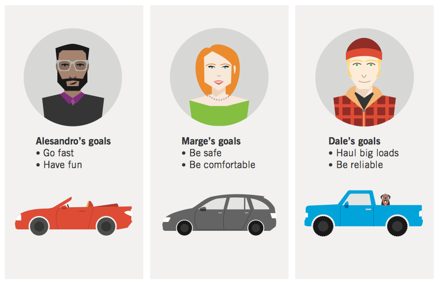


#### 人物模型作为设计工具的优势

- 确定产品的功能及行为。

  > 人物模型的目标和任务奠定了整个设计的基础。


- 同利益相关者、开发人员和其他设计师交流。

  > 人物模型为讨论设计决策提供了共同语 言，并有助于确保设计流程的每一步都能以用户为中心。


- 就设计意见达成共识和承诺。

  > 共同语言铸就共同理解。有了人物模型，就减少了对图形模型阐释的需要，就更容易⾤用叙述式结构来理解用户行为的细微差别。简言之，人物模型和真人具有相似性，比起功能列表和流程图，它同真实用户的联系更容易。


- 衡量设计的效率。

  > 我们可以像在成形过程中面对真实用户一样，用人物模型对设计方 案进行测试。尽管这并不能替代真实用户的需求，但它为设计者尝试解决设计难题提 供了有力的现实依据。这使得设计能够在白板上反复、快速且低成本地进行，并为曰后进行实际用户测试奠定了更强大的设计基础


- 助力市场营销和销售规划等与产品相关的其他工作。

  > 作者已经见过人物模型在作者客户的组织内发挥多种作用：人物模型为营销活动、组织架构、客户支持中心和其他战略规划活动提供信息。产品开发之外的其他业务部门也期望对用户有完善详细的了解，因此他们通常对人物模型也非常感兴趣。


#### 人物模型有助于避免各种设计陷阱

人物模型能够解决产品开发过程中出现的以下三个设计问题：

- 弹性用户。


- 自我参考设计。


- 边缘功能设计。

**弹性用户**

虽然满足用户是我们的目标，但“用户”这一术语用于特定设计问题和场景时，很容易引发问题。因为产品团队每个人对于用户及其需求都有自己的理解。到了做决定的时候，“用户”成了弹性概念，为了适应团队中强势者的观点和假设，很容易被扭曲变形。

而实际用户以及代表实际用户的人物模型并非弹性，相反他们有基于目标、 能力和情境的特定需求。

不同角色有着不同的经验、态度、专长、需求和动机。缺乏对用户的准确了解会导致产品功能定位不清晰。

**自我参考设计**

自我参考设计指设计者或开发人员将自己的目标、动机、技巧和心理模型带入产品设计。用户不会超越设计者这样的专业人员，这种设计方式仅适合很少数的产品，完全不适合大多数产品。

**边缘功能设计**

人物模型能够避免的另外一种问题就是设计边缘功能。设计和编程时，必须考虑到边缘功能，但绝不应当成设计的重点。人物模型为设计提供了一次实际操作检查机会。我们会问：“朱莉经常进行这种操作吗？” “她会进行这种操作吗？ ”了解了这些，我们就能很清晰地对功能进行优先级排序。


### 人物模型为什⼳有效

人物模型作为用户模型取得成功的原因之一是，人物模型就是用户的化身人物模型把设计和开发团队的同理心聚集在用户目标周围。

同理心对于设计师来说很关键。他们会基于人物模型的认知和情感元素（也是人物模型的目标）来做出设计框架和细节上的决定。


#### 人物模型以研究为基础

人物模型应该建立在对现实世界的观察上。用于综合人物模型的主要数据来自人种学研究、情境调查或者其他类似的与实际用户和潜在用户的对话和观察。按照设计顺序搜集的数据质量直接影响用于明晰和引导综合设计方案的人物模型的功效。其他数据能够支持和补充人物模型的创建（大致按照效率高低排序)：

- 脱离用户的情境进行访谈。


- 利益相关者和主题专家提供的用户相关信息。


- 焦点小组、调查等市场研究数据。


- 市场划分模型。


- 文献综述和前期研究收集的数据。

以上补充数据都无法取代直接对用户进行的访谈和观察。一个开发良好的人物模型， ⼏乎每个方面都能够在用户言行中找到依据。


#### 人物模型代表特定产品的用户类型

人物模型代表的仍是特定交互产品的某一类用户群体。人物模型把使用某种产品（则指类似活动）的一组明确的行为模式概括起来。通过分析访谈数据，就能找出这些行为。恰当的定性或定量数据也能起一定的支持作用。行为模式及具体动机或目标等因素定义了人物模型。人物模型有时也称为“合成用户原型”（composite user archetype),因为在某种意义上，人物模型是组合出来 的：在研究阶段，观察相似角色的个体，把观察到的使用模型按相关程度分组，汇集在一起。

###### 跨产品人物模型

拥有不止一种产品的企业通常希望重复利用同一个人物模型。然而，为了有效，人物模型 必须是针对具体情境的，应该专注于具体产品相关特定领域的行为和目标上。由于人物模型建立在特定情境中对用户交互的具体观察上，即便产品之间有密切联系，也很难在不同产品之间重复使用同一人物模型。

如果希望一组人物模型成为用于多种产品的有效设计工具，就必须先研究所有产品的使用 情境，然后基于这些研究创造出相应的人物模型。除了要拓宽研究范围，更具挑战的任务是要归纳出适用于所有情境的、可操控且一致的行为模式。不能想当然地认为，因为两位用户使用同一产品的行为相似，两人在使用不同产品时，也会有相似的行为表现。

随着焦点涵盖的产品越来越多，创建一套简洁、一致而且能代表真实用户多样化的人物模型也越来越困难。我们发现，多数情况下，不同的产品应该单独研究和开发不同的人物模型。

###### 原型与模式化形象

人物模型提供了精确的设计目标， 是设计团队的交流工具，因此，设计师在选择特定人群统计特征时要格外小心。理想的情况是， 人物模型人群统计应该综合反映研究者在访谈人群中的观察，并且根据⼴泛的市场研究进行调节。人物模型应该具有代表性，值得信赖，但不能一成不变。如果数据不具备决定性作用，或者特征对于设计或者可接受性来说无关紧要，我们宁愿在性别、人种、年龄和地域差异性上犯错。


#### 人物模型拓展了用户行为的范围

产品的目标市场描述了人种学信息和生活方式，有时也涉及职业角色，但没有描述目标市 场成员展示的有关产品和相关情境下的行为范围。范围不同于平均值。人物模型不是要创建一般性用户，而是确定范围内具有典型性和确定性的行为模式。

产品必须适应用户行为、态度和能力等， 因此设计者必须明确指定产品相关的一组人物模型。多个人物模型将行为范围分割为不同的集合。不同人物模型代表不同的关联行为模式。这些关联是通过分析研究数据得到的。


#### 人物模型有动机

每个人的行为背后都有动机， 有些较为明显， 更多的则较为微妙。 人物模型要捕捉这些动机，把这些动机当成目标，这一点很重要。

> 我们罗列的人物模型目标正是动机的简称，它不仅指出了特定的使用模式，也表明了这些行为产生的原因。理解用户执行任务的原因给了设计师强大的动力，去改进甚至消灭某些不必要的任务，同时仍能完成同样的目标。 多强调目标对人物模型的重要性也不为过。如果模型没有目标，你所拥有的就根本不是人物模型。


#### 人物模型可以代表用户之外的相关人士

产品的既有用户和潜在用户都应该是交互设计师关注的重点。除了创建人物模型外，创建一个或者多个不同于用户人物模型的顾客角色或许有用。当然，这些顾客角色的创建应该和用户角色一样建立在通过人种学研究过程观察到的行为模式的基础之上。

⼏乎所有联⽹软件产品都要考虑到恶作剧者和恶意黑客。有时因为政治原因，必须设置一个产品要避免为其服务的人物模型。人物模型用户之外的所有这些类型都可以设为“反人物模型” （anti-persona),以备战略、安全和设计讨论等之需。


#### 人物模型是比其他用户模型更合适的设计工具

交互产品设计过程中，会使用其他用户模型，如用户角色、用户信息和市场划分等。这些模型与人物模型都试图描述用户，以及用户同产品的关系。但在创建人物模型、把人物模型当做设计工具的方法等⼏个关键的方面与其他用户模型有显著不同。

###### 用户角色 （user roles）

用户角色（user role)或角色模型（role model)是个抽象的概念，是对一类用户及其问题之间关系的定义，包括需求、兴趣、期望和行为模式。敏捷开发过程同样会将用户简化为角色作为抽象概念（一般采用一张属性列表)， 用户角色不会被当成真实用户，通常也不试图表达更⼴泛的人类动机和情境。

霍尔茨布拉特和拜耳是在统一流程中使用人物模型的，而且文化、物理和序列模型也相近, 都 企图从人群中将各种特点和关系提取并抽象化。我们发现这些方法具有一定局限性：

- 脱离了拥有行为和关系的人，很难明确传达人类的抽象行为和关系。人类同理心在抽 象 人群上没用。


- 两种方法⼏乎只专注于任务，忽视了使用目标是作为思考和综合设计的组织原则的。 


- 霍尔茨布拉特和拜耳的强化模型虽然在特定范围内有用，且较为全面，但很难作为一 个 连贯的工具用于开发、交流和衡量设计决策。

人物模型能够解决以上问题。良好开发的人物模型不仅能像用户角色一样描述相同的行为类型和关系，而且能够以叙述目标和示例的方式表现出来。这样，设计者和利益相关者能够以自然语言来理解设计决策。描述一个人物模型的目标，就为人物提供了背景和结构，文化和工作流对行为的影响也就融入了进去。

只关注用户角色而忽视更复杂的行为模式，会过分简化不同用户间重要的相似点和差异。创建一个代表不同角色需求的人物模型是可能的。

人物模型提供了更为全面的用户及其情境模型，而许多其他模型则过于简化。 在任何情况下，人物模型能够和其他建模技术综合使用。

###### 人物模型与用户信息 （Personas versus user profiles）

许多可用性研究人员将人物模型和用户信息混为一谈。如果用户信息来源于人种学第一手数据，同时包括了作者已经描述的足够深度的信息，则这两个概念没什么差别。然而遗憾的是，我们发现，很多时候用户轮廓是按照韦伯辞典对轮廓的定义，即“简略的传记性的简述”而设计的。

> 换句话说，用户轮廓通常只有一个名字和照片，加上一个⼏乎算得上人口统计数据的简短描述，还有一小段与手头的设计毫无关联的信息，例如描述这个人开什么类型的车、家中⼏个孩子、住在哪里、以何为生等。这种类型的用户信息更像基于模式化形象。虽然我们也赋予人物模型名字，甚至给车子和家庭成员起名，但很少用。这些虚构的细节只是人物模型创建的很小部分。只要能让设计师和产品团队头脑中的人物模型丰盈起来就够了。

###### 人物模型与市场划分 （Personas versus market segments）

市场划分和人物模型设计之间的最大区别在于，前者基于人口统计数据、分销渠道和购买行为，而后者基于使用行为和目标。二者不是一回事，用途也不同。市场营销的人物模型有助于了解销售过程，而设计的人物模型有助于产品定义和开发过程的清晰化。

市场划分在人物模型开发中发挥一些作用。市场划分有助于确定人群统计的范围，进而确定人物模型的框架。

人物模型按照用户行为划分，而不是按照人口统计或购买行为来划分的，因此市场划分和人物模型很少存在一一对应的关系人物模型。

而市场划分能够作为初始过滤器，把访谈限制在限制目标市场内的人群。我们通常会使用 人物模型的优先级来做出战略性的产品定义决策，这些决定应该包含市场情报。

[Personas vs Market Segments]

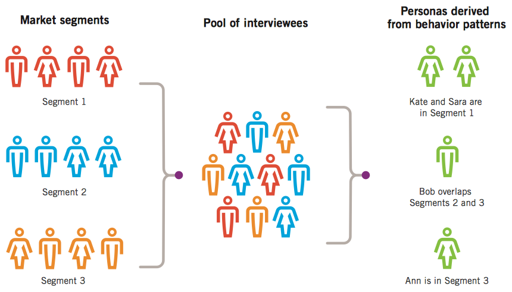


### 理解目标 

假如人物模型为观察到的行为提供了情境，用户目标就是这些行为背后的驱动力。设计师必须通过目标来考虑产品的功能。产品的功能和行为必须通过任务来处理目标，通常任务越少越好。必须牢记，任务只是达到结果的手段，目标才是最终的目的。


#### 目标驱动使用模式

人或者人物模型的目标驱动着大家的行为。因此，目标不仅解释了人物模型为什么想要产品、怎么使用产品，而且还是设计者头脑中某些人物模型复杂行为和任务的简写。


#### 目标必须来自定性数据

通常我们无法直接询问一个人的目标是什么，他要么无法清楚地表述出来，要么表述得不准确，或者没有实话实说。人们完全没有回答这种自省式问题的准备。因此，设计者和研究人员需要认真地从观察到的行为、对他问题的回答、非言语暗示，以及诸如书架上的书名等环境的暗示中重新构造目标。人物模型建模中的最关键任务之一是要找出目标，简明地表述出来： **每个目标表述成一个简单的句子。**


#### 用户目标和认知处理

唐纳德• A •诺 曼在《情感化设计》中介绍，产品设计应该解决三个不同层次的认知和情感处理过程：**本能、行为和反思**。诺曼的理论建立在多年的认知研究基础上，提供了表述清晰的结构来给用户对产品和品牌的反应建模，也为专业设计师长期的直觉提供了合理的情 景：

- 本能是最直接的处理层面。在与一件产品深入交互之前，人们会对能够观察到的视觉和感觉方面做出反应。本能处理帮助我们迅速判断出好还是坏、安全还是危险。

  > 这是人类行为中令人激动的一类，也是数字产品能否获得有效支持的最大挑战之一。马尔 科姆• 格拉德韦尔(MalcolmGladwell)在其著作《决断毫秒间》中研究了这个层次的认知处理。关于更详细深入的直觉决定的研究，可以参考加里•克莱因(Gary Klein)《力量的源泉》或盖伊•克拉克斯顿(GuyClaxton)《兔脑⻳心： 慢活让你更聪明》

- 行为是处理的中间阶段。这一阶段可以帮助我们管理简单的日常行为。

  > 按照诺曼的观点，行为构成了人类活动的大部分。诺曼指出，以往的交互设计和可用性实践⼏乎全部都在解决这一层面的认知处理。行为处理可以增强和约束较低层次的本能反应以及 较高层次的反思反应。反过来，本能处理和反思处理也可以增强和约束行为处理。

- 反思是最不直接的处理过程。这一步包含有意识的思考和对以往经历的反思。反思处 理能够增强或抑制行为处理过程，但不能直接访问本能反应。这个层次的认知处理只 发生在记忆中，而不是通过直接交互或感知来产生的。反思处理与设计的关联中，最 有趣的方面是通过反思，可以将过去设计产品的经历与更⼴泛的生活经历相融合，并 随着时间的推移，将实际意义和价值同产品本身联系起来。

##### 为本能反应而设计 （Designing for visceral response）

为本能反应而设计，是指设计初见产品时的感受，此时还没有与产品进一步交互。对于大多数人来说，这意味着设计视觉外观、动作、声音或触觉设计。

讨论本能层次设计时经常会有一种误解，即为本能反应而设计就是要设计漂亮的产品。美丽的外表可能不是产品的重点，本能设计实际上是为情感设计—在特定情境下引起人们心理和情感上的反应，而不只是美学设计。美观及由此产生的卓越和愉悦仅仅是情感设计调色板的一小部分。

然而，对于消费品和服务来说，有吸引力的用户界面通常是恰当的。有趣的是，可用性研究人员证实，用户一开始通常会认为吸引人的界面会更有用，用户的这种观点会持续很久，直到对产品界面累积了足够的经验后才会推翻他们最初的观点。产生这种现象的原因有可能是用户被表面看起来易于使用而受到鼓舞，因此花费很多精力学习本来可能很难用的界面，而不愿意承认他 们的投入根本不值得。这对于细心的设计者意味着，如果用户界面在本能层次上承诺了易于使用，或者在交互设计上有任何其他本能的承诺，就要在行为上实现这些承诺。

##### 为行为而设计 （Designing for behavior）

为行为而设计是指设计出的行为可以补充用户自己行为、隐含假设和心理模型的产品行为。

诺曼与设计有关的三层理论中，最有意思的是，他断定行为层次处理最为独特，直接影响其他两个层次的处理，也受其他两个层次的影响。这似乎暗示着交互设计的日常行为应该成为设计的主要关注点，而本能和反思层次设计起辅助作用。在足够关注其他两个层次的前提下，只有把行为部分设计好，才最有机会积极影响用户构建产品体验的方式。

不遵循这样的原则，有可能导致用户的最初印象和现实脱节。此外，很难想象没有坚实的目标和行为，如何为反思层面设计。因此，理想情况下，用户对产品和物品的体验，应该以行为设计为基础，实现本能设计和反思设计的和谐统一。

##### 为反思而设计 （Designing for reflection）

为反思而设计，尤其是它对设计的意义，可能是诺曼三层处理模型中最具挑战性的一个。有一点很清楚，反思层次设计意味着打造长期的产品关系。不清楚的是，确保反思层次设计成功的最佳方式（如果有的话）是什么？这里是否是机遇推动了成功——在正确的时间出现在正确的地点？预先设计在其中发挥作用了吗？

> 在描述反思设计时，诺曼列举了一些用于商品的高度概念化的设计做例子，比如形状奇怪的茶壶，以及设计师菲利普•斯塔克设计的(PhillipeStarck)榨汁机。从本质上讲，这些设计的价值和目的就是它们的美学表述，很容易看到这些产品如何强烈地迎合了人们对独特性和文化复杂性的反思欲望，这种反思可能源于艺术性或极具风格的自我形象。

产品有真正的使用目的，在优雅漂亮和功能之间保持平衡，就更难了。但是，如果某个产品或服务的设计满足了用户的目标和动机，甚至超越产品的主要目 标， 而用户以某种方式通过个人或文化关系与产品联系起来，则引发具有反思意义的可能性就大大提升了。


#### 用户目标的三种类型

三种用户目标分别对应诺曼提出的本能、行为和反思三个层次:

- 体验目标。


- 最终目标。


- 人生目标。

[The three types of user goals]

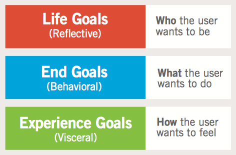


##### 体验目标

体验目标是简单、通用且个人化的。矛盾的是，这使得很多人很难讨论这一目标，尤其是在客观的商业情境下。体验目标表达了人们在使用产品所期望的感受或者与产品交互时期的感觉。这一目标让人们关注于产品的视听特性以及交互感（如动画过渡、延迟、触摸反应和按钮的可点击性)、物理设计，以及微交互。这些目标还能让人洞察人物模型在本能层次上表达出来的以下动机：

- 感觉灵敏、掌控事物


- 有趣


- 再次确保安全性和敏感性


- 感觉很酷或很时髦或者放松


- 保持专注警醒

如果产品使用户感到自己笨拙不舒服，则会不愉快，效率和乐趣会骤降，即便有其他目标也无济于事。用户对产品的怨恨情绪会增加。如果用户受够了遭到如此对待的感觉，用户就会准备逃离这一系统。

交互、视觉和工业设计师必须将人物模型的体验目标转化为可以传递恰当感觉、感情、情感和情调的形态、行为、动作和听觉元素。视觉语言及情绪和激励研究试图按照人物模型的态度和行为来打造视觉主题，这些都是定义人物模型情感期望的有力工具。

##### 最终目标

最终目标代表用户使用某个具体产品时执行任务的动机。产品和服务可以帮助用户直接或间接地完成这些期望目标，这些目标是产品的交互设计、信息架构和工业设计的功能方面需要关注的焦点。必须满足用户的最终目标，让用户感觉他们值得为此付出时间和金钱。

交互设计者必须将最终目标作为产品行为、任务、外观和感受的基础。情境或日常场景和认知演练可以有效地帮助我们发掘用户的目标和心理模型，有助于进行恰当的行为设计。

##### 人生目标

人生目标代表用户的个人期待，这通常超越了所要涉及的产品的情境。这些目标代表着深层次的驱动力和动机，有助于解释用户为什么试图完成他们寻求完成最终的目标。人生目标描述了人物模型长期的欲望、动机和自我形象的特征，正是这些元素将人物模型和产品联系起来。 以下目标就是产品整体设计、战略和品牌的关注点：

- 过美好的生活。


- 成就自己的抱负。


- 成为某个方面的行家。


- 在同辈中有魅力、受欢迎、被尊重。

交互设计师需要将人生目标转换为高层次的系统功能、正式的设计概念和品牌战略。在探索产品概念的不同方面时，情绪板和情境场景会很有帮助。⼴泛的人种学研究和文化建模，对于发现用户行为模式和深层次动机至关重要。人生目标很少会直接关系到具体元素的设计或者界面行为。

> 不过，还是有必要谨记在心：如果用户发现，某个产品不仅帮助他实现最终目标， 还有助于 他向人生目标迈进，那么这一点必将比任何营销活动更能决然地赢得该用户。假设其他目标达成的前提下，能否达成用户的人生目标，决定用户成为普通的满意用户还是狂热的忠实用户。


#### 用户目标是用户的动机

了解人物模型不仅要理解具体任务和人口统计数据，更要了解用户动机和 目 标。高层次的用户动机把人物模型目标与诺曼的模型连接起来，包括如下内容：

- 体验目标同本能处理过程相关，即用户想要感受什么。


- 最终目标同行为处理过程相关，即用户想要做什么。


- 人生目标同反思处理过程相关，即用户想要成为什么。


#### 非用户目标

用户目标并非设计者们需要考虑的唯一目标类型。客户目标、商业目标和技术目标属于非用户目标（nonuser goal)。尽管必须解决这些目标，但目标的实现不能以用户为代价。

##### 客户目标

客户与用户的目标不同。消费型产品和企业产品的客户目标本质上有很大不同。客户目标需要纳入整体设计中的范畴，但是客户目标不能凌驾于最终目标之上。

##### 商业和组织目标

商业和其他组织对产品、服务和系统也有自己的需求，需要在计划设计方案时予以考虑和建模。 商业目标通常通过人物模型、客户人物模型（customer persona) , 以 及 机 构 人 物模型 (organizational personas)来捕捉。重要的是，在设计阶段早期，要找出委托设计、开发和销售产品的组织的商业目标。

商业或运营目标包括：

- 增加利润。


- 提高市场占有率。


- 留住现有客户。


- 打败竞争对手。


- 更高效地使用资源。


- 提供更多产品和服务。


- 保证知识产权安全。


- 教育大众。


- 筹集足够的资金维持运转。

##### 技术目标

软件产品设计中都考虑了技术目标。这些目标旨在降低软件创建、维护、伸缩性、扩展性等任务的难度，这也是设计者的目标。技术目标包括如下内容：

- 能够在不同浏览器中运行。


- 保护数据完整性。


- 提尚应用程序的执行效率。


- 使用特定幵发语言或库。


- 保持跨平台一致性。

技术目标最终要为用户和商业目标服务，这一点在教育阶段的早期就要强调。如果技术目标不是为了满足他人的需求，不是为了满足其他更人性化目标，那么产品的成功就不是很重要。用户只关心能否快速、高 效、轻 松而又自信地完成。


#### 成功的产品首先要满足用户目标

设计产品需要考虑的最重要一点就是产品实际用户的目标，而不是购买者或幵发者的目标。产品用户竭尽所能在 完成 雇主的商业目标时，还会尝试实现自身目标。用户最重要的目标永远是维护自己的尊严，不让自己感到蠢笨。

优良交互设计的精髓在于设计出的交互，既能够满足制造商、服务提供商或其合作伙伴的 目标，又能支撑用户的目标。


### 构造人物模型 (Constructing Personas)

人物模型源于定性研究，尤其从访谈和观察产品用户、潜在用户（有时是顾客） 中观察到的行为模式。其他的补充数据可以通过主题专家、利益相关者、定量研究，以及其他可用文献提供的补充研究和数据获得。我们构造一组人物模型的目的，是用其代表各种各样观察到的动机、行为、态度、能力、约束、心理模型、工作或者活动流程、环境，以及对现有产品和系统的不满之处。

> 由罗伯特•莱曼（Robert Reimann)、金•古德温（ICim Goodwin)和莱恩•哈利（Lane Halley) 三位业内资深专家在Cooper任职期间开发。

**任务创建过程：**

1. 根据角色对访谈对象分组
2. 找出行为变量
3. 将访谈主体和行为变量对应起来
4. 找出重要的行为模型
5. 综合各种特征，阐明目标
6. 检查完整性和冗余
7. 指定人物模型的类型

> 1. Group interview subjects by role.
> 2. Identify behavioral variables.
> 3. Map interview subjects to behavioral variables.
> 4. Identify significant behavior patterns.
> 5. Synthesize characteristics and define goals.
> 6. Check for completeness and redundancy.
> 7. Designate persona types.
> 8. Expand the description of attributes and behaviors.

[Overview of the persona creation process]

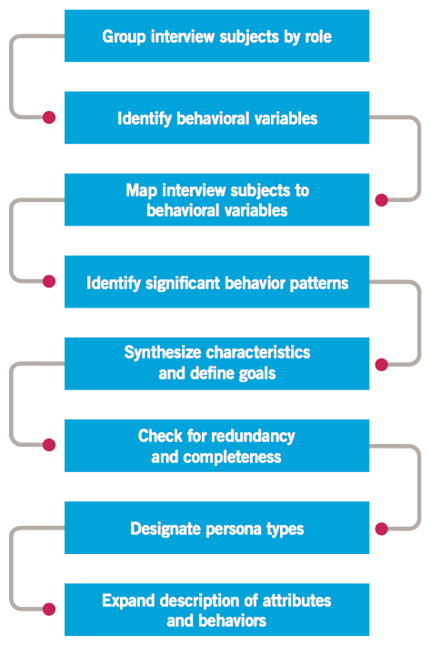


#### 第1步：根据角色对访谈对象分组

完成研究工作并将数据大致分类组织后，根据角色不同对受访者迸行分组。 

> 对于企业应用程序来说，角色通常同工作角色或职责相对应，因此容易描述。
>
> 消费产品的角色区分更细微， 包括家庭角色、态度、相关活动的方法、兴趣和选择 生活方式的能力等。


#### 第2步：找出行为变量

根据角色不同对受访者进行分组后，把从每种角色身上观察到的一些显著的行为，组成不同的⼏组行为变量。年龄或者地理位置等人口统计学变量有时似乎也会影响行为。但要注意，不能将重点放在人口统计学变量方面，因为在开发有效的用户原型时，行为变量更有用。

一般来说，关注如下类型的变量，就会看到不同行为模式之间最重要的差别浮现出来：

- 活动—用户做什么，频率和工作量。


- 态度一用户看待产品所在领域和采用的技术。 


- 能力—用户所受教育和培训、学习能力。 


- 动机—用户涉足产品领域的原因。 


- 技能—用户与产品领域和技术相关的技能。

尽管每个项目的变量各不相同，但通常从每个角色上可以发现15〜30个变量。

这些变量可能会和你在人物模型假设时发现并确定下来的变量差不多。比较实际数据中找出来的行为与人物模型假设中的设想。找出来的各种角色是否完全不同？找出来的这些行为变量是否有效？是否还有其他未预料到的？或者尽管预料到了，却缺乏数据支持的？

列出所观察到的行为变量的完整集合。如果结果和假设有出入，就需要添加、删减或者更改预期的行为和角色；如果出入很大，就要考虑增加一些新的用户访谈，弥补新发现的行为区间中的空白。


#### 第3步：将访谈主体和行为变量对应起来

从访谈对象身上挖掘出重要的行为变量后，就可以进行下一步，将每个访谈对象和行为变量对应起来。有些变量可能会代表一个连续的行为区间，例如使用技术的信心。有些变量可能会代表多个不连续的选择，例如使用数字相机相对于使用胶卷相机。

将访谈者精确映射到区间的某个点上不如**确定受访者之间相对的位置关系**那么重要。换句话说，受访者是精确地落在45%还是50%的比例刻度上并不重要。通常没有精确的方式来度量, 你必须依靠自己的直觉，而直觉则建立在对主体的观察上。**执行这一步骤的结果是精确地呈现出，多个主体如何聚集在各种重大变量周围。**

[Mapping interview subjects to behavioral variables]

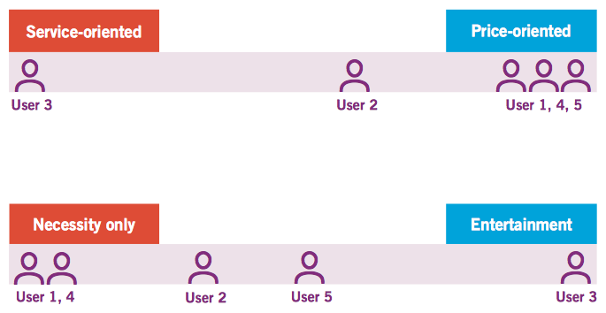


#### 第4步：找出重要的行为模型

把访谈对象映射完以后，寻找落在多个区间或者变量上的主体群。如果一组主体聚集在6〜 8个不 同的变量上，很可能代表一种显著的行为模式，而这个模式构成了人物模型的基础。一些特殊角色可能仅仅会展现一种重要的模式，但通常会发现2〜3个此类模式。

若模式有效，那么在聚集的行为间就必然会有逻辑或者因果联系，而不仅仅是假想的关联。


#### 第5步：综合各种特征，阐明目标

我们从人物模型的行为中发现其目标和其他特性。这些行为是从研究过程中观察/挖掘出来的结果综合出来的，这些行为代表了在一段时间内，对产品有意义的典型使用情况，恰当地捕捉了相关的用户动作集合。但时间长短实际上取决于所用的产品或服务，以及人物模型用产品干什么。

对于每个找出来的重要行为模型，要综合数据中的细节。细节应该包含如下内容：

- 行为本身（活动及其动机)。 


- 使用环境。 


- 使用当前解决方案遇到的挫折和痛苦。 


- 行为相关联的人口统计学。 


- 行为相关的技巧、经验或能力。 


- 行为相关的态度和情感。 


- 同其他人、产品或服务相关的交互。 


- 做同样事情的替代或者竞争方案，尤其是类似技术。

在这一步中，列出描述行为特征的简短要点就足够了，尽量坚持贴近所观察到的行为。有 一两个凸显出人物模型个性的描述能够将人物模型变得栩栩如生。不过，虚构描述过多，尤其是歪曲性细节描写，不仅会分散精力，还会降低人物模型自身的吸引力。要记住，你创造的是设计工具，而不是小说里的人物梗概。只有真实的数据才能支持团队最终做出设计和商业决策。

有一个虚构细节很重要：人物模型的姓名。姓名要能够代表人物模型所代表的人群，但又不会弱化其独特性，或者不会偏向漫画式、刻板化。这时，也可以添加一些人口统计信息，如年龄、地理位置、相对收入（如果合适的话），以及职位、头衔。这些信息主要帮你在汇编行为细节时，更好地视觉化呈现人物模型。

##### 定义目标

目标是从访谈和行为观察中综合信息的最关键细节。最好通过分析每个人物模型行为得出。通过确定每个受访者集合行为之间的逻辑关系，可以推断出这些行为背后的目标，推断方式包括对受访者动作的观察（每个人物模型集合中访谈主体试图完成的任务及其原因），以及对访谈主体对目标导向型访谈问题回答的分析。

要想成为有效的设计工具，目标在某种程度上必须与正在设计产品始终直接相关。对于人 物模型来说，通常大部分有用的目标是最终目标。大多数人物模型会有3〜5个最终目标。而对消费型产品的人物模型来说，人生目标是最有用的目标，这点同样适用于担任临时职务角色的企业人物模型。没有人生目标或者只有一个人生目标对大多数人物模型是恰当的。诸如“别觉得自己笨”和“不要浪费时间” 等一般性经验目标可以当成每个人物模型的隐含目标。偶尔某些具体领域可能需要具体的体验目标， 对大多数人物模型而言，0〜2个体验目标比较恰当。

##### 人物模型和社会关系

有时某个产品的一组人物模型是同一个家庭或者同一公司的一部分，他们之间存在人际关 系和社 会关系。

考虑人物模型之间的社会或业务关系是否有意义时，可以思考以下两点：

1. 观察到访谈主体是否有行为随着公司大小、产业或者家庭/社会关系发生变化而变化的 (如果有这样的情况，就要确保你的人物模型集合代表了这些差异性，方法是放在⼏个 不同的商业或社会环境中）。
2. 在同事、家庭或社会组织成员之间的工作流程或社交交互非常关键。

如果创建的人物模型在同一个公司工作，或者相互间有着社会关系，如果你需要表达的重 要目标不属于你预先建立的关系时，就会遇到麻烦。定义人物模型之间单一的社会关系，比定义人物模型集合之外的单个角色和次要角色之间的多个不同且不相关的社会关系要更容易。最初创建人物模型时， 最好还是创建多样化的人物模型，这比冒险尝试将更多不同的场景塞进单个社会动态关系中要好得多。


#### 第6步：检查完整性和冗余

检查建立起来的映射、人物模型的特征和目标，以确定是否存在重要的漏洞需要弥补。

> 如果行为坐标轴上有缺漏，则可能需要进行额外的 研究工作，找到特定的行为。有时可能也要检查笔记，看看是否需要针对同一目标加入政治人物模型，以满足利益相关者的设想或者要求。偶尔还要加入目标一致但不同区域的人物画像，只有满足客户组织在这些区域的分支机构的需求，才能保证听到机构的组成部分的声音体现在设计中。
>
> 如果发现两个人物模型仅在一些人口统计数据方面有区别，这就需要去掉其中一个重复的人物模型，或者调整人物模型特征让差异更明显。每个人物模型都至少要有一个显著的行为与其他人物模型不同。映射工作做得好的话，这些就都不是问题。
>
> 能够保证人物模型集的完整性，以及各个人物模型具有差异性，就能确保人物模型可以充分代表现实世界中行为和需求的多样性。同时也保证了设计目标尽可能紧凑，开始交互设计时也会减少工作量。


#### 第7步：指定人物模型的类型

到目前为止，人物模型应该很像你认识的真实人物了。构建人物模型的关键一步是将定性 研究转换为一组强大的设计工具。

所有的设计都需要一个目标，即设计所关注的受众。目标越具体越好。试图创建出能够满 足3个甚至4个人物模型的设计方案是项异常艰巨的任务。

接下来，我们必须对人物模型进行优先级排序，确定主要的设计目标。我们的目的是从集 合中找到一个人物模型，其需求和目的能够用一个界面就完全得到愉快满足，同时不会剥夺其他人物模型的权利。我们指定人物模型的类型来完成这一步骤。有6种人物模型，通常大致按照以下顺序选定：

- 主要人物模型。 
- 次要人物模型。 
- 补充人物模型。 
- 客户人物模型。 
- 接受服务的人物模型。 
- 负面人物模型。

##### 主要人物模型

主要人物模型(primary persona)是界面设计的主要标的。一个产品的一个界面只能有一个主要人物模型，但对于某些产品来说，可能存在多个不同界面，其中每个界面都针对不同的主要人物模型。

> 例如，医疗信息系统中的诊所界面和财务界面可能是分开的，并且每个界面针对不同的人物模型。请注意，我们在这里说的“界面”（interface)是抽象意义上的。有些情况 下，两个独立的界面可能是使用同一数据的两个独立的应用程序；在有些情况下，两个界面可能就两组不同的功能集合，按照角色或者定制化的不同而服务于两组不同的用户。

针对集合中任何其他人物模型的设计都不能满足主要人物模型的需求。不过，如果目标是主要人物模型，则至少能部分满足其他人物模型的需求。（我们要找出一种方式，在不妨碍主要人物模型的前提下，满足其他人物模型。）

选择主要人物模型是一个排除过程，必须通过比较人物模型的目的来测试每个人物模型。 如果没有发现明显的主要人物模型，则意味着两种可能：产品需要多个界面，每个界面针对一个合适的主要人物模型（企业或技术型产品大多如此)；产品想实现的结果太多。如果一个消费型产品有多个主要人物模型，产品的范围可能过宽。

避免这样的陷阱：哪个人物模型面向最大的市场板块最大，就选哪个。

> 美国0X0公司Good Grips 产品线最初是为了便于关节炎患者使用而设计的。结果证明，满足了这些动作最不灵便的用户（整个市场上的很小一块)，也就满足了大部分客户的需求。因此，最大的市场有时未必是最主要或最具影响力的人物模型。

##### 次要人物模型

主要人物模型的通常满足了大部分次要人物模型的需求。然而，次要人物模型还存在一些额外的特定需求，可以在不削弱产品能力，以服务主要人物模型的前提下得以满足。并非总是都有次要人物模型。 如果一个产品的次要人物模型超过3或4个，则说明产品涉及的范围可能太大或者过于分散。我们应该采取的办法是先为主要人物模型设计，再调整设计来适应次要人物模型。

##### 补充人物模型

既不是主要的也不是次要的人物模型就是补充人物模型。主要人物模型和次要人物模型结 合在一起完全可以代表补充人物模型的需求，完全可以通过某个主要人物模型创建的方案满足。一个界面可以同任意多的补充人物模型相联系。政治人物模型（一般被归为利益相关者一类）通常会成为补充人 物模型。

##### 客户人物模型

客户人物模型解决的是客户而不是终端用户的需求。通常，客户人物模型会被处理为次要人物模型。然而在某些企业环境下，一些客户人物模型可能会成为自己独有的管理界面的主要人物模型。

##### 接受服务的人物模型

这一角色在某种程度上与我们之前讨论的人物模型有所不同。他们并非产品的用户，却会 直接受产品使用的影响。

> 接收放射性治疗机器治疗的病人就不是机器界面的使用者，但会因为一个好的界面设计接受到更好的服务。 接受服务的人物模型提供了一个跟踪产品产生的二次社会和物理影响的途径。这一类属于次要人物模型。

##### 负面人物模型

负面人物模型(negative persona)又称作反人物(anti-persona)角色，用来与利益相关者和产品团队成员沟通交流，告知产品不会为某类具体的用户服务。同接受服务的人物模型一样, 负面人物模型并非产品的实际用户。它们只存在讨论中，用来帮助和团队中其他成员进行交流, 让大家知道某种人物画像绝不是产品的设计目标。

> 对于消费型产品来说，好的负面人物模型候选人通常是精通技术且很早就使用过该产品的人物模型。
>
> 对于商业用户企业产品来说，负面人物模型通常是罪犯、危害较小的恶作剧者和“钓鱼”之徒，以及IT专家。


#### 第8步：进一步描述特性和行为

第5步中列出的关键特征和目标指出了复杂行为的本质，但留下了许多需要澄清的问题。 第三人称叙述的方式能够更有力地向其他团队成员传达人物模型的态度、需求和问题所在，也加深了设计者/作者与人物模型及其动机的联系和同理心。

##### 人物模型叙述

典型的人物模型描述应该综合了研究阶段所观察到的人物模型相关的最重要的细节。这个 人物模型就成了沟通和交流的有效工具。理想情况下，用户研究的多数发现人物模型应该能够包含在人物模型描述中。这样一来，发现就能够直接激活设计工作

人物模型叙述长度不应长过1或2页（或PPT张数)。（第5步中的特征的每一或两个小点用一段描述比较合适。）人物模型描述不必包含每个观察到的细节。理想情况下，设计师参与了研究，而大多数团队外的人不会超出研究的细节。

本质上，叙述必须包含某些虚构情况。但正如前面所讨论的一样，这不是一篇小故事。最好的叙述方式就是快速介绍人物模型的职业或生活方式，简略地描绘他一天的生活，包括抱怨、 关切 和兴趣等与产品直接相关的信息。细节应该是特征列表的扩充，额外数据来自观察和访谈。 叙述应该 用总结的方式，表达人物模型对产品的需求。

叙述中要认真考虑细节的篇幅。 细节不应超过研究的深度。 在自然科学中， 如果记录了一个35.421m的度量，这意味着度量精确到了 0.001m。同样，详细的人物模型描述意味着你在研究中也有相似程度的观察。

要确保在人物模型描述不引入暗含设计解决方案的线索。叙述是描绘人物模型的行为和痛 点，而不是介绍计划如何解决。具体解决方法是设计过程的下一步，

- 叙述中务必包括所有重要行为类型的总结。


- 不要包含过多虚构描述。细节描述要恰到好处，只要能涵盖基本的人口统计数据，能 将行为类型编成一个故事就足够了。 


- 不能将未观察到的细节加入行为描述中。 


- 不要在人物画像描述中引入解决方案，而是突出痛点。

最后，不要为人物画像列出区间或均值。人物模型是个体，永远不可能出现1.5个孩子， 一年挣 35000〜45000美元这种描述。这些是市场划分所需要的数值。如果这些细节对于人物模型来说很重要，那就挑选具体细节。

##### 人物模型照片

开始展幵描述的时候，可以为人物模型选择一些照片。在展开叙述时，或者完成叙述时让 团队的其他人参与进来，照片有助于使叙述更加真实。照片的选择要倍加小心。最好的照片不仅能捕捉人口统计信息及环境线索（护士人物模型应该身着护士服，置身于医院环境，或许还要有个病人)，还要捕捉人物模型的一般态度（承受大量文书工作的秘书照片可能看起来很有压力）。我们保存了⼏个可检索的照片库，以及带Creative-Commons许可的仓库源，用以査找合适的人物模型图片。以下是挑选人物模型照片时需注意的其他事项：

- 不要选择拍摄角度奇怪或者扭曲的照片。


- 这会分散注意力，让人物模型看起来像漫画。 


- 不要选择表情夸张的照片，这看起来同样像漫画。 


- 不要选择有明显造型或冲着镜头笑的照片。 


- 选择像普通人而不是模特的相片。 


- 照片中的人是在现实背景中从事一项合适的活动。 


- 各个人物模型照片的选择风格和修剪要保持一致。

我们也发现，有时为每个人物模型创建照片拼贴画更有用，可以传递更富情感和经验力量 来塑造 人物画像。把大量的小图片放在一起，可以更好地表达一些文字难以描述的内容。有时我们发现创建人物模型所在环境的模型也很有用（比如楼层平面图等)。这同样会使环境因素更加真实可见。

创建此类沟通助手的时候，要记住人物模型是设计和决策工具，完美自身描述并不是目的，这点很重要。虽然有时力量来自于创造人物模型的整体形象，但太多的装饰和剧情有可能让人感觉是在无聊地浪费时间。这样最终可能会降低人物模型作为用户模型的有效性。


### 实践中的人物模型

#### 关于人物模型的误解

##### 设计者“虚构”人物模型

> 1998年，“The Inmates Are Running the Asylum” 一书第一次引入了人物模型，用这种方法生成目标导向的设计概念。

通过人物模型捕捉到的用户行为模型是真实的，因其来源于从用户访谈和第一手观察中所获得的真实人种学数据。人物模型是设计师从解读数据所做出的分析和推断中构造出的。

> 误解很有可能是因为，人物模型虚构的名字、表面上的（但实际收集的数据是真实的） 人口统计数据信息，以及叙述式的讲故事技巧覆盖了行为数据。这些手段都是为了增强设计者的同理心，同产品团队成员沟通用户需求而采用的。这些叙述式的概念只是交流的辅助手段， 并不会影响用于刻画人物模型的真实行为数据，不影响在此基础上最终形成的设计决策。

如果碰到声称使用人物模型的产品团队、设计团队或者客户，一定要问清楚他们的人物模型是如何创建的，收集了哪些用户信息，又是如何分析创造出来的。如果“人物画像”没有任何关联的目标，那就立刻亮出黄牌。

> 尽管单是人口统计信息就能帮助团队了解用户基础的构成，但这些信息不足以构造出能够生成详细的设计概念的人物模型。


##### 人物模型不如引入真人有用

这种方法被称为“参与式设计”，似乎能够从哲学和政治的角度解决一些问题，因为当实际 用户在场，你就无法质疑他们的做法。不过，这么做实际上给设计的概念化带来了一些严重的问题。将许多人的行为集中并进行分析本质上是为了一个目的：设计师能够将大部分用户普遍存在的关键行为和需求同特定用户的特殊行为分离开来。关注个体用户而不是总的用户行为，同样有可能让你错失个别用户（有特殊行为）的关键行为，这些个别用户或许碰巧没做这样的行为，或者做法与大多数用户不 同。

如果委托人或者产品团队坚持引入真实用户，可以首先解释人物模型是从观察真实用户中创建出来的。然后展示用户访谈环节的音频或视频记录(确保至少部分受访者可以接受这么做)。 或者可以邀请一位利益相关者参加访谈。如果团队能够拿出证据，证明人物模型以实际用户行为类型为基础，就会发现问题迎刃而解。


##### 人们并非为了任务而完成任务

人们很少从任务的角度来考虑产品，尤其是对于消费产品和社交系统而言。很少有人登 录Facebook、打幵电视或者访问新闻⽹站是为了完成脑海中的某个具体任务。人们这么 做，更多的是 “就想看看有什么新鲜事”，然后做出回应。结果，一些设计师就倡导，基于任务的方法不适用于这些领域，因此应该摒弃人物模型，用灵感做设计。并非所有用户会以执行任 务的形式思考问题，这么说没错，但不能一刀切。任务不是人物模型的核心，目标才是。“跟上潮流”就是完全合理的目标。


##### 人物模型是可溯源的

尽管所有主要的人物模型特征都应该源于用户研究，但一些设计师只将那些在用户访谈中 看到的特征融入人物模型特征中。如果一些组织想要确保设计遵循严格的用户中心方法，保证设计师不是简单地虚构人物模型，则上述办法很有效。但是受访者很少能够清晰地陈述自己的目标。很多时候，人 物模型最好的引述能够体现许多受访者都表达过的含义，但又没有任何一 个受访者都把这种含义明确表述出来。如果有压力要求必须保证可以溯源，可以这样反驳说， 人物模型可以追溯到研究中发现的模式，而不是某个具体的特殊访谈。


#### 人物模型的量化

信奉定量数据的利益相关者或团队通常会这样回应:“你怎么确定这些人物模型能够真实地 代表绝大多数用户？ ”

这个问题源自混淆了人物模型与市场划分人物模型。市场划分根据人种学和心理学的差 别对潜在客户进行分组。另一方面，人物模型代表使用产品的动作，就界面而言，并非始终代表某个独有的群体。主要人物画像决定界面的结构，特定的界面设计除了支撑主要人物模型的需求外，还能满足一个或多个次要人物模型（或补充人物模型）的需求。因此, 即便主要人物模型自身不能代表绝大多数的市场，一个界面所服务的主要、次要和补充人物模型三者加起来也足以代表大部分的市场。

即便如此，了解人物模型的市场份额也是有用的。开发团队在细节层面对各个特性进行优 先级排序的时候，更是如此（非独有人物模型群体相关信息也纳入考虑范畴）。如前所述，可以开展“人物模型个性调查”，找出来每个参与者与哪个人物模型最相似。具体过程如下：

1. 回顾各个行为变量以及受访者和行为变量的对应关系。
2. 针对每个变量，制订一个多项选择题，答案能够区分不同的人物模型。（请注意，有时多个人物模型针对特定变量会有相似行为表现。）
3. 针对每个变量制订2〜4个问题，以不同的问法询问相同的问题。这样能够保证参与者 回答问题的准确性。
4. 随机安排调查问题顺序。
5. 向参与者发放调查问卷。样品的大小很重要，可以使用http://www.surveysystem.com/sscalc.htm⽹站的在线计算器，计算产品合适的样品大小。
6. 用表格记录每位参与者的反应，跟踪每个人物模型对应的答案个数。如果人物模型得 到的某特定参与者的回应最多，那么该人物模型就与这个任务参与者最相似。
7. 用表格记录每个人物模型与多少名参与者相似，然后除以参与者总个数。这就是人物 模型的市场份额（百分比）。

记住，主要人物模型不一定占最大的市场份额，还要权衡次要和补充人物模型的作用，每 都要单独进行设计。


#### 机构的“人物模型”

人物模型是描述人们行为模式的工具。不过，我们发现另外一个相似却更加简单的概念， 也可以用于描述人物模型所属组织的行为。

> 例如，如果你在设计一个薪酬系统，小公司的需求和人物模型与之交互的方式和跨国公司有很多不同。因此，二者的人物模型很可能不一样（或许跨国公司的角色比小企业更加专门化），因此交互方式也就不一样，此外企业自身的规则和行为都不同。可以想象，这个道理同样适用于其他类型的组织（你需要为它们做设计），甚至适用 于处于不同生活阶段的家庭等之类的社会单位。

为人物模型收集信息时，无疑会捕捉到其所属或相关联的单位组织的相关信息。通常，可 以使用类似的叙述方法，构造聚合的虚构机构“人物模型”，你的人物模型就属于这一机构。人物模型通常起一个能引起共鸣的名字，用一两段话介绍一下，针对所要设计的产品和服务，该组织有哪些行为和痛点就足以提供必要的情境了。设计师可以不使用照片，而是创造企业的标志，用在展示材料中。


#### 资源有限时使用临时人物模型

尽管我们非常希望人物模型建立在详细的定性数据基础上，但有时限于时间、资源、预算 不足， 或公司不愿意执行必要的现场工作，在这种情况下，可以使用临时人物模型（唐•诺曼称为“特殊人物模型”（adhoc persona))来清楚地传达设想：重要的用户是谁，他们需求是什 么。这种任务画像还能迫使严格地思考如何满足具体的客户需求（即便这些需求未经验证）。

临时人物模型的架构类似真实的人物模型，但依赖可获取数据以及设计师对用户行为、动 机和目标的仔细揣测。他们通常建立在利益相关者和主题专家对用户的了解以及现有市场数据中对用户了解的基础之上。

根据我们的经验，在研究匮乏的情况下，使用临时人物模型比没有任何用户模型结果要好。 就像真实的人物模型一样，临时人物模型有助于帮助产品团队聚焦产品特性和行为，并就此达成共识。然而，有⼏点需要注意。临时人物模型之所以有这个名称，是因为他们是建立在限定的定性数据基础上人物模型的替代品。尽管临时人物模型有助于设计和产品团队更好地聚焦， 但是如果没有数据来支撑假设，则可能会导致以下结果：

- 聚焦到错误的设计目标。 


- 尽管聚焦于正确的目标，但漏掉了使产品与众不同的关键行为。 


- 要获得未参与产品创造的个体和组织的青睐，存在一定困难。 


- 损害人物模型价值，导致所属组织长期拒绝使用人物模型。

使用临时人物模型，重点注意以下⼏点：

- 明确标示该人物模型，解释清楚。我们通常只给它们起个名字。 在视觉呈现上，选择素描而非照片作为代表，有助于加强角色临时性的提醒。 


- 尽量使用现有的数据（市场调查、领域研究、主题专家、领域研究或者类似产品的人 物模型）。 


- 记录下使用了哪些数据，如何做出互动假设。 


- 避免使用典型（没有领域数据更难避免)。专注于行为和目标，而不是人口统计。


### 其他设计模型

霍尔茨布拉特和拜尔的《情境设计》[Holtzblatt and Beyer’s Contextual Design (Morgan Kaufmann, 1993)]一书中介绍了关于模型的大量信息,在此简要讨论。


#### 工作流模型

工作流(work flow)或者序列模型(sequence model)有助于捕捉企业组织内的信息流和决策过程。通常表述为流程图或者有向图的形式，用以捕捉⼏种现象:

- 过程的目标或期望结果。 


- 过程和每个动作的频率及重要性。 


- 过程和每个动作的诱发和促进因素。 


- 依赖关系过程和每个动作执行必需的条件，以及什么依赖于过程和每个动作的完成。 


- 参与者及其角色和责任。 


- 具体执行的动作。 


- 做出的决定。 


- 用以支持决策的信息。 


- 哪些地方会犯错——错误和例外情况。 


- 如何纠正错误和意外情况。

一个完整的人物模型应该能够捕捉人物模型单独的工作流程，但是在捕捉详尽的人际间的 或者组织间的工作流程时，工作流模型依然必要。主要建立在工作流上的交互设计往往会像“实现模型”的软件一样失败。“实现模型”软件的交互主要根据其内部技术结构建构。因为工作流 之于业务如同框架之于编程，以工作流为基础的设计通常会创建出“业务实现模型”，功能齐备却没有人性。


#### 人工制品模型

顾名思义，人工制品模型(artifact model)代表的是用户执行任务和工作流中使用的各种 不同人造品。通常，这些人造品指的是在线或纸质的表格。人造模型通常捕捉类似人工制品之间的共同点和显著差异，目的是为了在最终设计中提取和复制最佳实践。人工制品在设计过程的后期可能比较有用。要注意，直接将纸质系统转换为数字系统时，如果不认真分析目标、运用设计原则，通常会导致发生可用性问题。


#### 物理模型

物理模型(physical model)同人工制品模型一样，意在捕捉用户环境的元素。物理模型的关注点是捕捉构成用户工作空间的物理对象的布局，有助于发现用户使用频率问题和妨碍生产效率的物理障碍。好的人物模型描述囊括了这一信息的部分内容。但在复杂的物理环境中 (如医院平面图或者生产线），针对用户环境创造离散、详尽的物理模型（地图或者平面图）或许有用。

人物模型和其他模型使得大量令人困惑的用户数据变得合理、有意义。既然已经拥有了作 为设计工具的成熟模型。


# 第六章 设立愿景：场景和设计需求

> 研究能够深入理解用户，头脑风暴能激发团队灵感，但一旦开始制订详细的设计和开发决策，团队很快会意识到，遗漏了从理论研究到实际产品设计过程的一个关键环节。 没有指明研究的道路，没有组织原则强调哪些特性和功能与实际用户相关， 并描述如何才能把各种要素融合成一款连贯产品，从而同时满足用户需求和商业目标，也得不到任何清晰的解决方案。
>
> 叙事是这一过程的黏合剂，是研究数据和潜在产品特性的指南针：用人物模型创造故事， 让故事指明用户满意的地方。

这里采用的一系列技巧均以人物模型为主角。这些技巧以迭代、可重复和可测试的方式迅速推出设计方案。这一过程包含四个主要活动：

- **利用故事情节或场景剧本来设想理想的用户交互过程。** 


- **运用场景剧本提取设计需求。** 


- **依次使用这些需求来定义产品的基本交互需要。**


- **在这个框架中不断增加设计细节。**


### 场景：以叙述为设计工具

> 用故事来考虑各种可能，这也是为用户设想一个美好新未来的高效途径。
>
> 叙述固有的社交属性使它成为高效而吸引人的工具，用来在团队成员和利益相关者之间分享优秀创意。
>
> 围绕故事设计出的体验更易于用户理解并参与，因为所有设计是围绕故事构建的。
>
> 叙述在交互产品的视觉描述方面也很有效。交互设计首先是对不断发生的行为进行设计。 因此， 叙事结构结合快速、灵活的视觉工具（比如不起眼的白板），能够完美地激发、想象、呈 现、验证各种交互概念。
>
> 在过程的最初阶段，我们只关注情节中的各个点，这使得我们能在探索设计概念时保持灵活。


#### 场景对比使用案例、用户故事

> 场景：
>
> 场景和使用案例都是用来描述用户与系统交互的方法。不过，它们服务于不同的功能。目标导向的场景是从具体用户（人物模型）角度定义产品行为的迭代手段。其中不仅包括系统的功能，也包括功能的优先级排序，以及这些功能如何从用户所见、用户如何与系统交互的角度来表达。


> 使用案例：
>
> 使用案例通常是一种技术，基于对系统功能需求的全面描述上，具有事务性 (transactionalnature)，关注低层用户行为和相应的系统反应。系统的精确行为，系统究竟如何回应—通常不是常规或具体使用案例的一部分。关于系统形式和行为的很多猜想仍然是不清晰的。使用案例允许针对不同类型的用户，完整地归类用户任务，但很少或完全没有提到这些任务是如何呈现给用户的，或者在界面中孰重孰轻。
>
> 传统使用案例作为交互设计基础的最大不足是，它们倾向于认为所有可能的用户交互都同样可能出现，都同样重 要。这表明用例源于软件工程而不是交互设计。
>
> 用例在确定极端例子及确定产品功能是否完整方面用处很大，但只适用于设计验证的后期。


> 用户故事：
>
> 敏捷编程方法中会采用用户故事的方式，但通常这些故事并非真实的故事或叙事。用户故事由简短的词句组成，如“作为用户，我想登录我的⽹上银行账户。”一般，紧跟着会出现另一组句子，简单描述完这一交互所需要的界面。用户故事更像是非正式的措辞要求， 而不是场景。 用户故事不会描述宏观层面的整个用户流程或用户最终目标。这些很重要，可以删除不必要的交互， 锁定用户真实需求。


> 场景与叙事诗：
>
> 场景更类似于敏捷方法所描述的叙事诗（epic)。同场景一样，叙事诗不描述任务层面的交互，而是主要描述更⼴泛深远的交互集合，这里的交互旨在满足用户需求。叙事诗更关注功能和用户界面与交互的呈现，而不是用户行为。但在范围和粒度水平方面，比起用户故事，叙事诗与场景剧本的共同点更多。


#### 基于场景的设计

场景(scenario)这一概念，一般用来描述具体解决设计问题的方法：运用一个具体的故事构建并阐明设计方案。

> “场景既具体又概括，既真实又灵活。场景含蓄地鼓励所有人以”如果……则会怎么样”的方式思考。允许人们在不削弱创新的前提下，清晰阐述各种设计可能。场景迫使人们关注使用，而使用则构成了设计的产品。场景能够针对多种不同的目的，描述各级细节的情况，有助于协调所设计项目的各个方面。”

卡罗尔所采用的基于场景的设计(scenario-based design)描述了用户完成任务的方式。基于场景的设计由环境设定组成，包括抽象出来代替用户的代理人(agent或actor),还有基于角色的名字，如 “会计”或“程序员”等。

尽管卡罗尔的确了解场景在设计过程中的力量和重要性，我们发现他的方法存在两个缺陷：

- 卡罗尔认为代理人是抽象出来、基于角色的模型，但这一概念还不够具体，不足以理解用户或者产生针对用户的同理心。不了解用户的具体细节，就不可能设计出拥有恰当行为的系统。 


- 卡罗尔的场景概念迅速地跳转到任务阐述，却没有考虑是什么样的用户目标和动机在驱动和过滤这些任务。尽管卡罗尔的确简短地讨论了目标，但他所指的仅仅是场景的目标。这些目标被迂回地定义为具体任务的完成。根据我们的经验，在确定用户任务并排列出优先级之前，应该先考虑用户目标。不解决人类行为的动机，很难进行高层次的产品定义，也很容易被误导。

卡罗尔基于场景的设计方法中缺少了一环，即使用人物模型。人物模型是用户的有形代表， 是场景设定中的可靠代理人。人物模型除了反映当前的行为模式和动机外，人物模型还能让人去探索未来用户动机如何影响任务，以及如何对任务进行优先级排序。因为人物模型仿效的是目标，而不仅仅是任务，因此场景解决的问题范围能够扩展到产品定义。人物模型帮助回答了 以下问题：“产品应该是什么样的？”，以及“产品看起来应该像什么，有什么样的行为？”


#### 基于人物模型的场景

基于人物模型的场景是用叙事的方式简明地描述运用产品或服务来实现具体目标的一个或多个人物模型。这种方法让我们能够从一个故事作为设计的开端，这个故事从人物模型的角度描述一种理想的体验，聚焦于人及其思考和行为方式，而不是关注科技或商业目标的实现。

场景能够捕捉随时间而出现的用户与产品、环境或系统之间的非语言对话，以及交互功能的结构和行为。目标能够对任务进行过滤，并能在构造场景剧本的迭代过程中对信息显示和控制的组织进行指导。

场景的内容和背景是从研究阶段收集并在建模阶段分析得到的信息中推导出来的。在创建场景剧本时，设计师执行一种角色扮演人物模型，带着人物画像排练日后如何与产品或服务交互，就像演员即兴表演一样。这一过程促使结构和行为的实时综合，通常绘制在白板或写字板上，然后再填补外观和感觉细节。最后，使用人物模型和场景来验证整个过程中的设计创意和猜想是否有效。


#### 三类场景

在设计过程的不同阶段，目标导向设计的方法会采用三类基于人物模型的场景，每一类都相继有针对界面的焦点。

第一种是情境场景，用于在更高层次探索产品如何更好地服务于人物模型的需求。情境场景在执行任何设计草图之前创建。情景场景从人物模型的角度撰写，关注人类活动、感知和期望。正是在开发情境场景时，设计师具有最大的自由来设想理想的用户体验。

一旦设计团队定义了对产品功能和数据，开发出设计框架，情境场景就被修改了。通过更详细地描述用户与产品的交互、引入设计词汇，情境场景就成为关键路径场景 (Key Path Scenario)。这些场景关注最重要的用户交互，始终注意人物模型如何使用产品以达到自身目标。随着越来越多的细节被开发出来，关键路径场景也会反复得到优化。

在此过程中，设计团队使用验证场景在各种情况下测试设计方案。这些场景往往不会那么详细， 通常会使用“如果……会……”等问题质询拟议方案。


### 设计需求：交互的“什⼳”问题

需求定义阶段决定设计中的“什么”问题：人物模型需要哪些信息和能力来完成其目标。 在进入下一个问题之前，阐明交互中需要“什么”并达成一致意见很关键：产品外观是什么样子、有什么样的行为、如何操作、感觉如何。


#### 设计需求不是特性

在许多产品开发组织中，“需求”已经成了产品特性或功能的同义词。需求和功能之间显然有关系。

但是我们建议把设计需求当成需要(needs)的同义词。

在这一步，必须满足人类和商业的需要，这是产品必须满足的目标。


#### 设计需求不是规格说明

“需求”一词在业界的另一种用法是一张功能列表，这份列表通常是产品经理做出来的。这些市场营销需求文档(MRD)和项目需求文档(PRD),在得到良好执行时，是在试图描述“产品是什么”问题，但也存在陷阱。首先，上述列表通常只和任意一种用户研究有着松散的联系， 在制订时往往没有认真研究用户需求。尽管文档中描述的内容可能（幸运的话）反映的是一款连贯的产品，但也没法保证会是用户喜欢的产品。

其次，许多市场需求文档和产品需求文档容易将产品需求与实现方式混为一谈。诸如“应该有一个菜单包含……”之类详细的界面描述预先假定了一个解决方案，但可能不适用于用户及其工作流程。 在设计过程之前命令制订解决方案只会引来麻烦，因为这样很容易导致笨拙杂乱的交互和产品。

> 例如，设想设计一款数据分析工具，帮助决策者更好地理解其业务状态。如果不了解需求， 直接 设计解决方案，你可能会很容易得出这样的结论：这个工具输出的应该是报告。如果执行 过用户研 究，可能会注意到，报告是普遍被接受的解决方案。不过，如果能够想象一些情节， 分析用户的实际 需求，可能会发现，决策者实际需要的是在错失机遇或者出现问题之前，认识 到异常情况的办法。从 这里不难看出，静态的平面报告不是满足这些需求的最好方法。用这个 解决方案，决策者必须仔细査 看数份报告，才能找到异常和趋势背后隐藏的重要数据。而更好 的解决方案可能包括数据驱动的异常 报告或实时趋势监控系统。

此类需求文件的最后一个问题是，文档自身对商业利益相关者和开发人员来说用处不大。 这种文档无法将清单上的内容视觉化，无法看到能够反映清单所列需求的设计，利益相关者和开发人员都很难根据描述做出决定。


#### 设计需求是战略性的

为了找出最佳方式来满足特定的人群需求，就要从需求着手，而不是从解决方案开始，分离问题和解决方案是一种方法，这么做能在面对变化的技术显示和崛起的机遇面前，尽可能保持灵活性。通过明确定义用户需求，设计师能够同技术人员一道，找到切实可行的最佳方案，同时保证产品帮助人们达成目标的能力不会妥协。这样的话，执行出现问题时不会殃及产品定义。同样，这样也就可能规划长期技术发展，从而能够提供日益先进的途径来满足用户需求。


#### 设计需求来源⼴泛

人物模型和场景是设计需求的主要来源。尽管人物模型可能是需求等式中最重要的部分，但设计还包括其他需求。人物模型商业需求和限制，以及技术和法律的约束通常是在采访产品的商业和技术利益相关者时收集到的。


### 需求定义过程

把模型转化为设计方案需要经过两个主要阶段。需求定义回答了关于产品是什么以及要做什么的问题。框架定义则主要回答了产品行为方式和如何构建产品来满足用户目标等问题。

我们要讨论的是**需求定义的细节**。这里讨论的方法以人物模型场景的方法论为基础。

> 由罗伯特•莱曼、金•古德温、莱恩•哈利、大卫•克罗宁(David Cronin) 和韦恩•格林伍德(Wayne Greenwood)创立，过去10年来经过了 Cooper公司设计师 们的不断优 化。

[An overview of the Requirements Definition process]

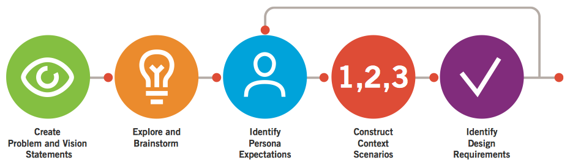

需求定义过程由以下五个步骤组成:

1. 创建问题和愿景陈述


2. 探索和头脑风暴


3. 确定人物模型期望


4. 构建情境场景


5. 明确设计需求

虽然上述步骤大致按执行的时间先后排列，但它们呈现的是一个循环往复的过程。设计师可能需要在步骤3和步骤5之间重复多次，直至需求稳定下来。


#### 步骤1: 创建问题和愿景陈述

在构思过程开始前，设计师要对前进方向有明确的指令。目标导向的方法旨在通过人物模型、场景和设计要求定义产品和服务，不过此刻定义场景和需求的方向通常是很有用处的。我们已经意识到针对哪些用户、目标是什么， 但还缺乏清晰的产品要求， 这样仍有 很大的可能产生困惑。问题和愿景陈述提供了这种指令，非常有益于在设计过程向前推进之前，在利益相关者之间达成共识。

在较高层次上，问题陈述定义了设计启动的目标。设计的问题陈述应该同时为人物模型， 以及提供产品给人物模型的企业，简明地反映变化。通常企业和人物模型之间的关注点之间存在因果关系，

> 例如：
>
> X公司的顾客满意率低。市场占有率去年下降了10%，因为用户执行任务X、Y和Z时工具不趁手，而用户执行这些任务其实是为了满足目标G。

把商业问题和可用性问题联系起来是推动利益相关者支持设计的关键，也是同时满足用户 和商业目标而拟定设计框架的关键。

愿景陈述是问题陈述的倒转，是高层设计目标或委托。在愿景陈述中，将以用户需求为引 领，将需求转化为如何让设计愿景满足商业目标。

> 以下是前一个例子中产品重新设计的模板。
>
> 产品X的新设计能够提高用户执行任务X、Y和Z的准确性、效率等，避免他们当前面临的 A、B、C问题，从而帮助用户完成目标G。这能显著提高X公司的客户满意度，提高市场份额。

**问题和愿景陈述中的内容应该直接从研究和用户模型中获得。**

**用户目标和需求应该从主要和次要人物模型中得出。**

**商业目标则应该从利益相关者的访谈中提取。**

当你重新设计己有产品时，问题和前景陈述很有用。对于新技术产品，或者尚未开发的针 对市场设计的产品也有用。有了这些任务，把用户目标和挫折整理成问题和愿景陈述有助于团队建立共识，把精力专注于接下来设计活动的重点事项。


#### 步骤2:  探索和头脑风暴

我们希望不带臆断地创建情境场景，而是真正地关注人物模型更可能如何使用产品。在此阶段，我们展开头脑风暴，将脑海中的想法提炼出来，这样才能把这些创意记录下来， 暂时先把想法放在那里。

这里的主要目的是尽可能地剔除先入之见。这么做允许设计师保持开放灵活，使用他们的 想象力来构建场景，使用分析技能思维从场景中得到需求。此刻头脑风暴的另一个好处是将你的头脑切换到置于“解决方案模式”。在用户研究和建模阶段的大部分工作是分析性的，需要不同的思维模式才能想出创造性的设计。

也可挑选一些探索性概念与利益相关者或客户分享，帮助你发现他们关于创新解决方案和 时间跨度的真正取向。如果利益相关者说，想要天马行空的想象，你可以仔细地挑选探索性概念来测试天马行空的想法，观察他们的反应。如果讨论看起来比较消极，你就知道随着场景推进，需要将想法调整得稍微保守一点。

> 不要在头脑风暴中花费太多时间。简单的项目用⼏小时，有一定范围或复杂度的项目用⼏天时间，就足够让你和你的队员从系统中找出所有的疯狂想法了。如果发现想法已经开始重复，没什么新想法了，就是时候结束了。


#### 步骤3: 确定人物模型期望

> 人物模型的心理模型是其对现实的内部呈现—她自己如何思考事物、 如何解释事物。人们对产品及其工作方式的期望，心理模型透露着大量信息。

界面的呈现模型—应该尽可能与我们对用户心理模型的理解相契合。呈现模型不应反映实现模型，即产品实际的内部构造方式。

为了达到这一目标，我们正式记录这些期望。这是需求的一个重要来源，对于每个主要和 次要人物模型，我们要确定以下⼏点：

- 影响人物模型期望的态度、经历、渴望和其他社会、文化、环境，以及人物模型认知 因素。


- 人物模型对使用产品的体验可能持有的一般期待和愿望。


- 人物模型对产品行为的期待和愿望。


- 人物模型如何看待数据的基本元素或单位（例如，在一款电子邮件应用程序中，数据 的基本元素也许是信息和人）。

人物模型描述中可能包含了充分的信息，能够直接回答这些问题。不过，研究数据仍是极 其丰富的资源。运用这些数据来分析访谈对象，如何定义和描述构成对象使用模式一部分的物体和动作，以 及对象使用的语言和语法。这里有需要寻找的问题：

- 访谈对象首先提到什么？


- 使用了哪些动作单词（动词）？哪些名词？


- 在此过程中没有提及哪些中间步骤、任务或者物体？（提示：这些事情对他们如何看 待事物也许没有那么重要。）


#### 步骤4: 构建情境场景

情境场景讲述的是某个人物模型的故事，有着多样的动机、需求和目标，这个人物模型以 自己最典型的方式，使用产品的未来版本。情境场景展现了人物模型使用场景，包括了环境和组织（对于企业系统而言）考量。

设计由此而始。开发情境场景时，重点是如何才能使设计的产品最有效地帮助人物模型实现目标。情境场景建立在一天或者其他有意义的一段时间中，主要和次要人物模型与系统之间（或者与其他人物模型之间）的主要接触点。

情境场景应该范围⼴而浅，不应该描述产品或交互的细节，而应该从用户的角度专注于高 层次的动作。重要的是首先制订出宏观轮廓，系统地找出用户需求。只有这样才能设计合适的交互动作和界面。

情境场景解决了以下问题：

- 产品在什么背景下使用？


- 是否会被超时使用？


- 人物模型是否经常被打断？


- 是否有多个用户使用单个工作站或者设备？


- 与其他产品一起使用吗？


- 人物模型要达到目标需要执行的首要活动是什么？


- 使用产品预期的最终结果是什么？


- 根据人物模型的技能和使用频率，允许的复杂程度有多大？

情境场景不应该像当前一样代表产品行为。这些场景代表的是目标导向产品这个美丽新世 界，因此，特别是在初始阶段，重点是解决人物模型的目标。不要担心如何完成目标。

多数情况下，可能不只需要一个情境场景。如果有多个主要人物画像，更是如此，但有时 一个主要人物模型也可能有两个或者多个不同的使用场景。

场景也完全由文字构成。我们还没有讨论形式，仅仅讨论了用户和系统的行为。这种讨论 最好用文本叙述来完成，“怎么做”的问题留到后面的改进阶段。

> 情景场景示例
>
> 以下是一个情景场景针对主要人物模型的第一次重复，产品是一款个人数字助理（PDA) 式电话， 这里所指的电话，既包括设备也包括设备的服务。薇薇安•斯特朗（Vivien Strong) 是印第安纳波利斯市的一个房地产中介，她的目标是平衡工作和家庭生活、完成交易，让每个客户都感觉自己是她的唯一客户。
>
> 薇薇安的情境场景如下：
>
> 1. 早上梳洗完毕后，薇薇安用电话查收邮件。因为手机的屏幕足够大，⽹络连接速度也够快， 所以在她急匆匆地为要上学的女⼉爱丽丝做三明治之际便收电子邮件，手机可比启动电脑方便多了。
> 2. 薇薇安收到一封邮件，来自新客户弗兰克，他想下午去看房子。手机里有他的联系信息，所以现在在邮件中一个简单动作就可以呼叫对方。
> 3. 在与弗兰克通电话时，薇薇安安切换到免提状态，这样她能够在谈话的同时看到屏幕。 她查看自己的行程表，确定哪段时间还有空闲。当她做出新的安排时，电话会自动记录她与弗兰克的约会，因为电话知道她在同谁交流。谈话结束后，她快速输入那处房 产的地址。
> 4. 把爱丽丝送到学校后，薇薇安前往房地产办公室收集另一个会面所需要的材料。她的电话已经在Outlook里更新了她的预约信息，所以办公室里的人都知道她下午会在哪里。
> 5. —天过得很快，结果薇薇安有点晚了。她朝着即将带弗兰克参观的房子出发时，电话提醒她，距离预约还有15分钟。打开电话后，不仅能看到预约，还能看到与弗兰克相关的所有文件，包括电子邮件、备忘录、电话留言以及通话记录。薇薇安拨出电话，电话自动连接到弗兰克，因为电话知道薇薇安安即将同弗兰克见面。她告诉弗兰克将在20分钟内到达。 
> 6. 薇薇安知道那处房地产的地址，但不是很确定具体位置。她停靠在路边，点击预约中的地址。电话直接下载方向，还有缩略图显示她与目的地的相对位置。 
> 7. 薇薇安准时到达目的地，开始向弗兰克介绍这处房地产。她听到钱包里电话响起。通常在见客户时，电话会自动转接到语音信箱，但爱丽丝有代码可以拨进来。电话知道是爱丽丝的电话，并使用了一个特殊铃声。 
> 8. 薇薇安接起电话，爱丽丝错过了公交，需要有人过去接她。薇薇安给自己的丈夫打电话看他能否接女⼉。可是拨通后被转入语音信箱，他肯定不在服务区内。她给丈夫留言，告诉他自己正在跟客户一起，能否抽空接一下爱丽丝。五分钟后，电话发出了一个简短的铃音。薇薇安认出是丈夫发的。她看到丈夫发过来一条即时消息：“我会去接爱丽丝的，好运。”

需要注意的是，这里的场景剧本处于较高的层次，没有涉及太具体的界面和技术。在技术 允许的范围内创建场景很重要，但在这一阶段，现实中的细节内容不是太重要。我们希望为真正的创新方案留有余地，总能缩减。我们最终是为了描述一个最佳且可行的体验。同样要注意, 场景中的活动是如何与薇薇安的目标联系起来，尽量去除不必要任务的。


#### 步骤5: 明确设计需求

在对情境场景初稿满意后，可以分析草稿，提炼出人物模型的需要或设计需求。这些设计需求包括对象、动作和情境。我们不倾向于将需求等同于功能和任务。因此从上一个场景来看，需求可以解读为：

直接从预约（情境）中拨打电话（动作）给某个人（对象）。

如果你习惯于以这种方式提取需求，那很有效。不然，分解成数据、功能和情境需求。

如下所示：

##### 数据需求

人物模型的数据需求是指必须在系统中呈现的对象和信息。利用上面的语义分析法，数据 需求可以被看成对象以及与对象相关的宾语或形容词。常见例子有账号、人、地址、文件、消息、歌曲、图像机器属性，如状态、日期、大小、创建者和主题等属性。

##### 功能需求 

功能需求对系统对象执行的操作或动作，通常会转换为界面控件，可以把功能当做产品的动作。 功能需求也定义了界面中的对象或者信息必须显示在什么位置或容器中（位置和容器本身不是动作，但动作需要它们）。

##### 情境需求 

情境需求描述了系统中对象之间的关系或依赖。这包括系统中哪些对象必须显示在一起才能让工作流程有意义，或满足具体人物模型的目标（例如，购买商品时，选择购买的商品的列表总和应该是可见的）。其他情境需求包括考虑使用产品的物理环境（办公室、路上、恶劣环境）, 以及使用产品的人物模型使用产品的技能和能力。

##### 其他需求 

要对所设计的企业和技术的现实需求形成坚实的观点(如果选择影响用户目标，设计师能影响技术的选择）。

- 业务需求包括利益相关者的优先事项、开发时间表、预算和资源限制、规则和法律考虑、价格结构和商业模型。 
- 品牌和体验需求反映体验的特性，你希望用户和客户把这些特性联系到你的产品、公司或者组织。 
- 技术需求包括重量、大小、形式要素、显示、功率限制和软件平台的选择。 
- 顾客和合作伙伴需求包括易于安装、维护和配置、支持成本和许可权协议。


现在应该有了粗略的创造性的概览：产品如何以情景场景的形式解决用户目标，以及从研究、人物模型及场景中提取的要求和需求构成简表。这些设计需求不仅指明了设计和开发方向，还提供了与利益相关者交流的工作范围。从这一点起，后面出现的任何新的设计需求，必然会改变工作范围。


# 第七章 设计产品：框架和提炼


### 创建设计框架

> 在目标导向设计中，不要一上来就直接跳入细节设计，而应先站在一个高层次上关注用户界面和相关行为的整体结构，我们把这个阶段叫做设计框架。

设计框架(Design Framework)定义了用户体验的整个结构，包括底层组织原则、屏幕上 功能元素的排列、工作流程、产品交互、传递信息的视觉和形式语言、功能性和品牌识别等。 从以往的经验看，形式设计和行为设计必须保持一致；设计框架包括交互框架及视觉设计框架， 有时也包括工业设计框架。在此阶段中，交互设计者利用场景和需求来创建屏幕和行为草图，完成交互框架设计 （interaction framework)。与此同时，视觉设计者使用视觉语言研究开发视觉设计框架（visual design framework),它通常表现为详细的单个屏幕原型。

> 自上而下的方式，首先关注总体，提出低保真而不包含具体细节的方案。这样才能保证设计师和涉众在开始阶段重点关注基本原则，满足人物模型的目标和需求。

修改是设计者生活的常态。通常，反复演示设计方案的过程有助于设计者和涉众丰富想 象力，更好地理解产品满足人类需要的最佳方式。

> 这里的技巧在于，方案中的细节精细程度足以引起重视就够了，不必花费过多时间和精力阐释日后肯定还要修改或者放弃的细节。我们发现，夹杂叙事场景的故事板草图，是探索及讨论设计方案的有效方式，不会产生额外开支和惰性。

> 铅笔素描图能够鼓励大家参与讨论设计方案，并能在演示当前工作时加强受众对渲染的理解。


#### 定义产品交互框架

交互框架不仅要对高层次的屏幕布局进行定义，还要定义产品的工作流、行为和组织。

以下步骤描述了交互框架的整个定义过程：

1. 定义形式要素、姿态和输入方法
2. 定义功能性和数据元素
3. 确定功能组和层级
4. 勾画交互框架
5. 构建关键线路情景剧本
6. 运用验证性场景来检查设计

> 尽管我们把这个过程按照顺序分解为6个步骤，但实际上并不一定是线性过程，而经常是 循环回路

[The Framework Definition process]

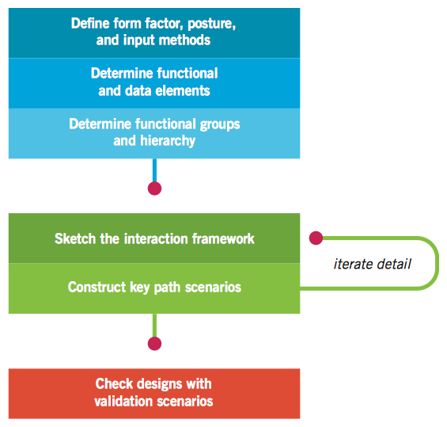


##### 步骤1: 定义形式要素、姿态和输入方法

创建框架的第1步是对设计产品的形式要素(form factor)进行定义。

> 产品是高分辨率电脑屏幕上的Web应用？是小巧、轻便、低分辨率，无论强光还是黑暗处都能看清屏幕的手机？是嘈杂的公共场所中供众多容易分心的新手使用的信息亭？每种形式要素对设计暗含何种限制条件？每种产品的外观因素对于产品的设计都有明显的影响，对这些问题的回答为接下来的所有设计工作奠定了基础。如果回答不够清晰，可以回顾人物模型和场景，更好地了解理想的使用情境和环境。

定义外形时，也要考虑产品基本姿态(posture),确定该系统的输入方法。产品姿态是指用 户将会投入多大的注意力和产品互动，以及产品的行为将会对用户投入的注意力做出何种反应。这一决定取决于情境场景中描述的使用情境和环境。

输入方法是用户和产品互动的方式，同时也受到产品外形和姿态、人物模型的态度、能力和喜好的驱使。这一选择包括键盘、鼠标、小键盘、拇指板、触摸屏、声音、游戏杆、遥控器、专门按键等多种可能。确定何种组合更适合产品的主要人物模型和次要人物模型。在需要两种或以上不同输入方式的组合（如大多数电脑应用和⽹站访问都需要键盘和鼠标两种输入方法）要确定该产品的主要(primary)输入方法。


##### 步骤2: 定义功能性和数据元素

功能性和数据元素代表着界面中要展现给用户的功能和数据。它们是需求定义阶段中所确定下来的功能和数据需求的具体表现形式。如果需求的描述有意从人物模型的角度出发，采用日常词汇和语言，则功能和数据元素会以用户界面的表现语言来描述。每个元素的定义要针对先前定义的具体需求，才能保证产品的各方面都有清晰的意图，能够追溯到某个使用场景或者业务目标。

数据元素通常是交互产品中的基本主体，比如照片、电子邮件、客户记录及订单等，是用 户可以访问、反应以及操作的基本个体。理想情况下，数据元素要符合人物模型的心理模型。在这点上，将数据对象分类十分关键，因为产品的功能定义通常与此相关。我们也关注对象的一些显著属性（比如电子邮件的发件人和照片的拍摄日期等），不过，在此阶段，对于属性的了解不必过于全面，只要对人物模型是否关心少数或者多数属性有大致了解即可。这时，可以着手构建团队软件原型，利用目标导向数据模型创建更多的正式数据模型，以供日后开发人员使用。

考虑数据元素间的关系也大有裨益。有时一个数据可能包含其他数据的信息，而更多的时 候，不同数据间可能存在更紧密的联系。

> 比如相册中的照片、播放列表中的歌曲或者客户数据中的某个账单等，都是不同数据相互联系的范例。对于简单联系可以通过创建子窗口记录，而针对复杂关系，使用 方盒-箭头表示法来阐释更为合适。

功能元素是针对界面中的数据元素及其显示所做的操作。一般来说，功能元素包括数据元 素操作工具，以及数据元素的视觉和结构化管理方式。功能需求向功能元素的转换，使得设计逐渐清晰具体。如果说情境场景是我们设想用户整体体验的载体，那么功能元素就让设想变得真实。

> 一个需求通常由多个界面元素来满足。
>
> 例如，智能电话人物模型薇薇安， 需要能够拨通联系人电话的功能，则满足这一需求的功能元素如下：
>
> - 声音激活控制（将声音数据同联系人相连)。
>
>
> - 快速拨号键。 
>
>
> - 从目录中选择联系人。 
>
>
> - 从电子邮件、约会事项或备忘录中选择联系人。 
>
>
> - 在合适情境下的自动拨号键（比如下一个约会事项）。

再次强调，必须回到情境场景、人物模型目标和心理模型中，才能检验解决方案是否适合 此刻的情形。此时，设计原则和模式开始成为创建有效解决方案的正确途径，避免了重复建设。这个阶段需要发挥创造力和设计决策能力。每个确定的用户需求，通常都需要创建多种解决方案，这时候就要审视哪个方案能够满足以下条件：

- 最有效满足用户目标。 
- 最符合设计原则。 
- 最适合当前的技术水平和成本考量。 
- 最能满足其他条件。

一般性的设计原则和具体的交互模式很重要。除非有充足的理由，否则不要轻易背离标准。

场景提供了一种一致且自上而下的交互设计方法，从主界面到细微的小窗口和对话框，场 景反复运用在越来越细致的设计结构上。原则和模式则加入了一种自下而上的方法，用以平衡整个设计过程，可以用于每个设计层次上各元素的组织。


##### 步骤3: 确定功能组和层级

有了完善的高层次功能和数据元素后，就可以开始按照不同功能分组工作，确定各自的层 级。由于这些元素各自承担着具体任务，因此元素分组的目的在于更好地在任务中和任务间疏通人物模型的流程。

这时，要考虑的主要问题如下：

- 哪些元素需要大片的视频区域，哪些不需要？
- 哪些元素能够容纳其他元素？ 
- 容器如何组织才能优化工作流？ 
- 哪些元素需要捆绑使用？哪些不是？ 
- 相关联的元素使用时顺序如何？ 
- 哪些数据元素有助于人物模型做出决定？ 
- 采用何种交互模式和原则？ 
- 人物模型的心理模型如何影响元素组织？

在这个阶段，重要的一点是，要把数据和功能纳入屏幕、框架或⽹格等高层次容器元素。 这些分组随着设计的推进可能会有变化（尤其当你草拟出界面后），不过这种临时的元素分组仍然有用，这将加快创建初步方案的进程。

对于产品所需的主要屏幕或状态（以后我们称之为“视图”)，最初的情境场景会给你一个 大概的感觉。如果用户仍有⼏个最终目标未能体现在现有数据和功能中，则需要考虑定义不同的视图来处理。相反，如果你发现有一些需求是相互关联在一起的，就要考虑定义同一个视图来集成所有的需求。

在对功能和数据元素进行分组时，还要根据产品平台、姿态、屏幕大小、外形要素和输入 方法等条件，考虑如何进行组织和安排。

> 如果要对容纳对象进行比较或者一起使用，则其应该是相邻的。一般来说，代表一个过程中的⼏个步骤的对象也应该相邻，并按照顺序排好。这种情况下，采用交互设计原则和模式是极其有用的，


##### 步骤4: 勾画交互框架

我们将视 图细分为粗略 的方块图，对应窗格、控制部件（如工具栏），以及其他高层次的容器。然后为每 个方块图添加标签 和注解，并描述每个分组或者元素如何影响其他分组和元素。方块间的箭头 代表流程或状态的改变。

开始时，界面的视 觉化应 当简单明了，即每个功能组和容器用方块图表示，标注上名字和不同区域间关系的简单 描述

开始阶段一定要看到整体且高层次的框架，不要被界面上某个特殊区域的细节分散注意力(尽量设想一下每个容器的内容有助于你决定如何组织安排各个区域）。在这个高层次的“方块图阶段”，必要的话，很容易探索表达信息和功能的不同方式，也非常容易进行彻底重组。在最终选择最佳方案前，尝试⾤用⼏种不同排列并用于验证性的场景通常是有效的做法。在设计的初期花费过多精力研究复杂的细节，会阻碍设计者改变思路，选择更好的解决方案。


##### 步骤5: 构建关键线路情境剧本

人物模型如何使用交互框架词汇同产品进行交互，关键线路情境剧本对此进行了描述。人 物模型最频繁使用界面的主要路径，通常是每天都使用的路径。

这些场景通常从情境场景演变而来，但在此处的场景特别描述了人物模型和组成交互框架 的不同功能和数据元素之间的交互。交互框架中细节越多时，我们越会反复运用关键线路情境，对用户动作和产品反应中更为具体的细节进行仔细考量。

与目标导向情境场景不同，关键线路场景以任务为导向，关注情境场景中⼴泛描述和暗含 的任务细节。（这方面同敏捷用例类似）这不意味着我们可以忽视目标，目标和人物模型需求始终都是整个设计过程的度量尺，用来删除不必要的任务，优化必要任务。不过，关键线路情境剧本必须在细节上严谨地描述每个主要交互的精确行为，并提供每个主要线路的走查。

###### 故事板

⾤用低保真草图序列和关键线路情境剧本的叙述，你可以充分地描述设计方案如何帮助人 物模型完成其目标。产品和用户间的每个交互都可以用一个或多个框架或者幻灯片来描绘，通过故事板，我们可以使交互的连贯性和整个过程接受现实的检验。

###### 过程变更和反复

创造性的人类活动往往都不是顺序且线性的过程，因此框架图阶段的步骤也不应被想象成 简单的顺序过程。普遍做法是，在每个步骤之间前后移动，甚至把整个过程反复⼏次，直到产生出稳固的设计方案。根据思维方式的不同，上述的步骤3〜5可以有多种不同的实现方式，你会发现其中比较适合你的一种。

语言思维者通常愿意使用场景来引导整个设计过程，按照如下顺序实现上述步骤3〜5:

1. 关键线路情境剧本。


2. 进行口头上分组。


3. 勾画草图。

视觉思维者会认为从图解开始，有助于理解过程中的其他部分，倾向于按照如下顺序：

1. 勾画草图。


2. 关键线路情境剧本。


3. 査看分类在场景中是否行得通。


##### 步骤6: 通过验证性的场景来检查设计

> 用故事板完成关键线路情境剧本，并对交互框架进行调整，场景会逐渐变得流畅，你也更 加确信自己正沿着正确的道路前进。这时，可以将重点转移到一些不太频繁使用和不太重要的交互设计上。 

这些验证性场景通常不像关键线路情境剧本一样详细，而是包含一系列假设性问题。本步骤的目标在于，指出设计方案的漏洞，并根据需要进行调整（或者完全抛弃或者重新开始设计）。这就需要按照如下顺序，解决三类主要的验证性场景：

1. 替代场景：指的是人物模型决策过程中，关键路径某个点的替代或者分叉点，其中包 括常见的例外情形、不常使用的工具和试图、基于次要人物模型需求和目标的其他场景或变体。 

2. > 回到智能手机的场景中，如果薇薇安决定通过电子邮件而不是电话的方式回复弗兰克，就变成关键线路替代场景的一个例子。

3. 必须使用的场景：指那些必须要执行，但又不经常发生的动作。比如清空数据库、升 级设备，以及其他特别请求等都属于这个类别。用户需要学习掌握必须使用的交互，因为这些情形很少会遇到，用户可能会忘记如何操作，或者如何执行相关任务。不过，由于很少用到这些功能，用户并不一定要有并行的交互方式，比如可以同时用键盘和鼠标来操作。而且这些功能也不一定要根据用户来定制化。譬如说，智能手机设计的一个必备场景就是，如果用户买的是二手手机，就需要清除功能，来删除原用户所有的个人信息。

4. 边缘情形场景：指的是非典型的情形下一些产品必须要有却不太常用的功能。开发人员之所以关注边缘情形，是因为这反映出系统的不稳定性或者存在的漏洞，通常需要特别关注和投入。无论何时，边缘情形都不应该成为设计工作的重点。诚然，设计者不能忽视边缘情形和边缘功能，但这些情形和功能所需的交互，应该在设计工作优先级排序中靠后排列，处于界面的底层。尽管代码在处理边缘情形时有成有败，产品在处理日常使用和必备情形时也是如此。

   > 再回到薇薇安的例子中，如果薇薇安想添加两个重名的联系人，这就成为一个边缘情形场景。虽然这种情况薇薇安也不愿意碰到，但是如果存在这种情况，手机应该有能力处理。


#### 定义视觉设计框架


## 第二十一章 控件 Controls

根据用户目标，控件可分为4种基本类型：

1. 命令控件（imperative control）,用于启动功能。
2. 选择控件（selection control）,用于选择选项或数据。
3. 输入控件（entry control）,用于输入数据。
4. 显示控件（display control）,用于可视化地直接操作程序。

有些控件包含上述一种或几种类型。

**避免布满控件的对话框**。


### 命令控件 / Imperative Controls

在人机交互中，有一种由名词（“对象”）、动词、形容词、副词组成的语言。当我们发起命令时，便制定了动词-动作的声明。

与动词相对应的控件类型叫做“命令控件”，因为它产生立即的操作，命令控件接收操作并且立即执行。（菜单项也属于命令的习惯用法，按钮是典型例子）

#### 按钮 / Buttons

按钮一般具有三维模拟的凸起、加亮的特征表现，他就具有命令的视觉启示（“可点击的”）

按钮的部分启示是其视觉的受范性，显示他的“可按压特性”。当用户指向并单击，屏幕上的按钮视觉上发生改变，显示已被激活。

#### 图标按钮 / Butcons

图标按钮容易使用，易于记忆。

困扰图标按钮的问题来自图标部分（大部分人都可以迅速理解其视觉启示）。不过工具提示（Tooltips）有效提供了帮助。优秀的图标在经过使用者几次使用后就可以被学会并记住，我们在中间用户和高级用户身上可以看到这种典型的情况。

> 很难设计一套让新手用户可以立即理解的没有文本标签的图标。工具提示可以有做帮助但太笨拙。这种情况下，文字说明菜单才是更好的手段。

#### 超链接 / Hyperlinks

you should use links for navigation through content, and buttons or butcons for other actions and functions. 

由于大多数使用者已经知道链接是一种浏览导航的习惯用法，如果点击一个链接就执行一个操作，会非常令人费解并混乱。


### 选择控件 / Selection Controls

命令控件是动词，需要一个名词来进行操作。选择控件和输入控件是两类用于选择名词的控件。**选择控件允许用户从一组有效的选项中选择一个操作数，他还可以被用来设定操作**。（选择控件不直接导致操作，操作通常需要命令控件来触发。现在情况不一定是这样）

这两种做法各有优缺点。如果使用者在发起操作前要做出一系列的选择，这时应该提供明显的命令控件（按钮）；如果使用者想要立即看到选择结果，并且这个操作也很容易被撤销，则完全有理由让选择控件变成命令控件。

#### 复选框 / Check boxes

复选框有强烈的可供单击的视觉启示，存在受范区域。鼠标经过时会突出显示。单击后可以看到一个检查标记（check marker）。单击做标记，再次单击去掉标记。

复选框主要是基于文本的控件，是熟悉而有效的习惯用法。确切的文本实用复选框清楚明确，但使用户不得不放慢速度阅读，而且占据了屏幕空间。

传统上，复选框是方形的。用户通过形状来识别视觉对象，因而方形复选框是一个重要的标准。

#### 开关按钮 / Toggle buttons

开关按钮作为单次选择习惯用法广泛取代了复选框，特别适用在非模态的交互中，不会打断用户做决定时的流状态。锁定图标按钮比复选框更节省空间，因为他们依靠视觉识别，而不是文本标签来表明意图，体积更小。（当然图标的费解性也是问题）。工具提示解决了图标按钮的困惑，不需要长期占用太多像素。

控件特征也变成不同的类型，命令控件成了选择控件。


#### 滚翻按钮：一种应该避免的选择习惯用法

Flip-flop buttons: A selection idiom to avoid

State-switching buttons: an idiom to avoid

滚翻按钮是用于节约界面空间的常用控件变体，但却让用户极度困惑。该按钮上的动词总是控件所能处在的多个状态之一。（音乐播放器中的播放和暂停按钮，在一个按钮上）。

这种方法的问题在于人们可能认为控件是显示当前状态（播放或暂停两种状态）的指示器，意味着这个按钮会提供两种机非常合理又非常矛盾的解释。

控件或者作为状态指示器，或作为状态装换的命令控件，但不能同时表示二者。

> 翻滚按钮效率很高，在一个控件内控制两个互斥的选项来节省空间。问题是无法完成控件的第二个职责，告诉用户他们当前的状态。
>
> 如果当前处于off状态，按钮显示on，就无法知道状态是什么；如果当前处于off状态，显示off，那么on又在哪里？

#### 单选按钮 / Radio buttons

> 汽车第一次装上收音机时，旋转按钮调频会危及生命，6个镀铬合金按钮调到喜欢的频道。

单选按钮的行为是互斥的，每次只有一个按钮可以选择。所以总以两个或多个成组出现。

单选按钮更浪费屏幕空间。在某些情况下，这种浪费是值得的，特别是在向用户显示全部可获得选项集合时。

单选按钮很适合担当教学的角色，这也意味着他们可以合理地用于不常使用的对话框。

drop-down list boxes are often a better choice on the surface of a sovereign application which must cater to daily users.

##### 单选图标按钮

如果两个或以上的锁定图标按钮按组放在一起，并且相互排斥，每次只能锁定其中之一，他们的行为方式与单选按钮相同。单选图标按钮像单选按钮一样工作，总有一个被选中即锁定。另一个选中时，先前的按钮就返回正常状态。

> 与所有图标按钮习惯用法一样，他们有效利用空间，让经验丰富的用户依靠模式识别来分辨他们，同时用工具提示提醒临时用户他们的用途。


#### Switches

The switch control is a more compact version of two radio buttons used together. It has two states, typically on and off


#### 组合图标按钮

他是一个右侧有向下箭头的单一锁定图标按钮。单击箭头并停住，会下拉出一个菜单，包含数个图标按钮。使用者从中选择，选定的图标按钮就出现在工具栏的箭头旁边。单击图标按钮，就会切换图标按钮状态。单击箭头并保持在箭头上下拉，然后移动到所需图标按钮上释放，就触发可这个图标按钮。

> 这种用法是支队频繁使用的用户，尤其经常使用鼠标的用户设计的，而不是新手用户。对于用户需要长时间交互的独占姿态应用程序，这是一个记号的常用控件。


#### 列表控件 / List controls

列表空间允许用户从有限的文本字符串中选择，每个代表一个命令、对象或属性。他排除了做出错误选择的可能性。

1. 列表控件是一个文本区，框中以离散的问本行形式显示对象，右侧有滚动条上下移动，用户单击一次选择一行文本。
2. 一种列表控件变体允许多重选择。
3. 下拉是列表控件的一个变体，开始仅显示在单列中被选中的条目，箭头按钮被按下，其他选项才出现。
4. 每行文本前有一个图标；
5. 列出条目的同时列出了预览视图（通常用在列表控件有选择控件和命令控件双重功能时）

##### 做记号

选择多个项时，每个文本条目旁放一个复选框，通过他进行选择，并标记出使用者的选择。复选框是一种明显的非互斥习惯用法，也是用户非常熟悉的GUI习惯用法。

##### 从列表中拖放