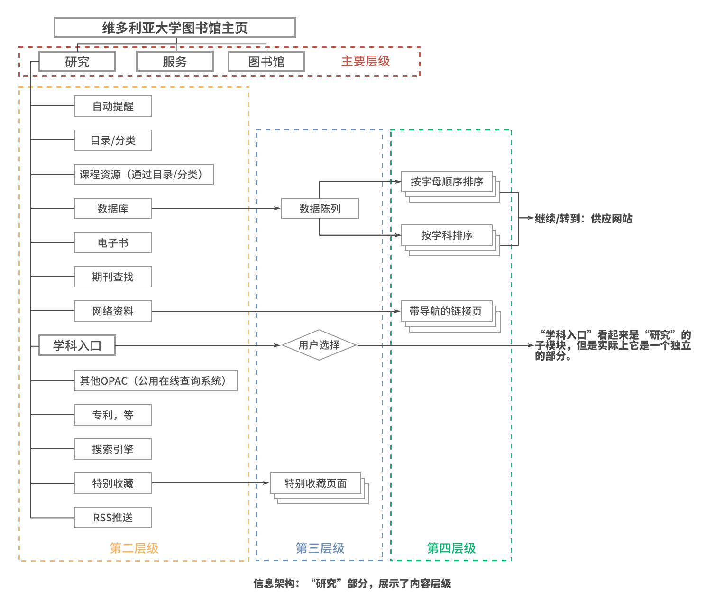

# UX

##### 设计原则

大设计：包括了市场、用户、需求、产品、交互、视觉、内容、数据、运营、传播、变现等各个环节的设计。

易于学习

更有效率

同理心

用户界面应该基于用户的心里模型，而不能基于实现模型

> 对用户而言，几乎是一样的两个操作计算机的反应却不一样，很容易给用户造成认知失调，即由于对同一个现实情况的两种矛盾的表现产生的疑惑，结果导致原本简单的交互变得难以掌握。

重大改变必须是非常好的改变

在交互和界面设计中，如何用同一个界面满足新手用户和专家用户的需求，是长久以来存在的难题。

> 解决方法在于理解各种用户掌握的新概念和任务的方式
>
> 大多数用户既非新手，也不是专家，而属于中间用户
>
> 没有人愿意停留在新手机别，新手意味着不称职。新手会成为晋升为普通用户或放弃
>
> 维持高水平的技术程度很困难
>
> 正态分布曲线只是瞬间快照，新手和专家随着时间的推移都会倾向于成为中间用户
>
> 大部分工作满足永久的中间用户同时，也提供各种机制，让新手和专家两类较少的用户也能有效使用。
>
> 长时间不用该软件，忘掉大量内容，重新使用时，需要一些提示回到以前的状态。
>
> 网站设计中尽可能采用透明和容易发现的交互很重要。
>
> 同时，现在网站能后追踪用户的行为，以提供一个适用性的体验越来越流行，依靠cookie可以辨别一个新的访问者，并为其提供一种不唐突的帮助，很有用。

为中间用户优化（大多数实际用户），让程序对中间用户来说功能强大，易于使用。同样也必须满足新手和专家的需求，但不能让所占比例最大的一部分用户感到不舒服。

目标有3个方面：

1. 让新手快速和无痛苦的成为中间用户
2. 避免为那些想成为专家的用户设置障碍
3. 让永久的中间用户感到愉快。（功能强大易于使用）

不要让用户感觉自己愚笨

##### Recommended Books for your User Experience and Usability Library

###### [Information Architecture for the World Wide Web: Designing Large-Scale Web Sites](http://www.amazon.com/gp/product/0596527349?ie=UTF8&tag=ux-booth-20&linkCode=as2&camp=1789&creative=390957&creativeASIN=0596527349)

This is a great book to introduce business people to information architecture, for architects to reinforce their skills, and for web designers to principles to apply to site design. The second edition has more information and is more in depth than the first, and is well worth purchasing.

###### [The Psychology Of Everyday Things](http://www.amazon.com/gp/product/0465067093?ie=UTF8&tag=ux-booth-20&linkCode=as2&camp=1789&creative=390957&creativeASIN=0465067093)

Although this book is a product of the 1980’s, its essential premise is not dated nor obsolete. Dr. Norman vividly illustrates the good and bad of design, and provides an excellent guidebook for the understanding of basic user-centric design in products, fixtures, software, and the everyday things that make up our world.

###### [The Design of Sites: Patterns for Creating Winning Web Sites (2nd Edition)](http://www.amazon.com/gp/product/0131345559?ie=UTF8&tag=ux-booth-20&linkCode=as2&camp=1789&creative=390957&creativeASIN=0131345559)

This book may simply be the best collection of proved successful web interface design patterns. It has no technical details but does has a rich collection of the state of the art patterns that can inspire web designer. Studying this book before actually writing any web interface code is highly recommended.

###### [A Project Guide to UX Design: For user experience designers in the field or in the making (Voices That Matter)](http://www.amazon.com/gp/product/0321607376?ie=UTF8&tag=ux-booth-20&linkCode=as2&camp=1789&creative=390957&creativeASIN=0321607376)

This is an excellent real-world primer on UX design that captures all the necessary elements for someone to become a competent UX designer. It strikes the right balance between revealing better design practices with the most effective project management approach which is often omitted in books in the same category.

###### [The Elements of User Experience: User-Centered Design for the Web (Voices That Matter)](http://www.amazon.com/gp/product/0735712026?ie=UTF8&tag=ux-booth-20&linkCode=as2&camp=1789&creative=390957&creativeASIN=0735712026)

The Elements of User Experience cuts through the complexity of user-centered design for the Web with clear explanations and vivid illustrations that focus on ideas rather than tools or techniques.

###### [The User Is Always Right: A Practical Guide to Creating and Using Personas for the Web (Voices That Matter)](http://www.amazon.com/gp/product/0321434536?ie=UTF8&tag=ux-booth-20&linkCode=as2&camp=1789&creative=390957&creativeASIN=0321434536)

This comprehensive guide approaches user experience research like never before, and is well-written, easy-to-read, and quite user friendly. It provides real-world examples of how user research is done in just enough detail that it can both inform an executive of the role of usability research as well as introduce methodology for persona creation to someone starting out in user experience design.

###### [Information Architecture for Designers: Structuring Websites for Business Success](http://www.amazon.com/gp/product/2880467314?ie=UTF8&tag=ux-booth-20&linkCode=as2&camp=1789&creative=390957&creativeASIN=2880467314)

This must-read text for all web designers delivers vital information on how to employ information architecture to create intelligent sites that produce hard sales. In today’s drastically reduced web market, measurable business returns are essential to clients and this book equips the designer with the tools to deliver the goods.

###### [Designing Interfaces: Patterns for Effective Interaction Design](http://www.amazon.com/gp/product/0596008031?ie=UTF8&tag=ux-booth-20&linkCode=as2&camp=1789&creative=390957&creativeASIN=0596008031)

Designing Interfaces catalogs UI design patterns in use and provides guidance in using them, with plenty of examples. It takes a consistent approach to describing each pattern: What it is, when to use it, why to use it and how to use it. The book is both a good overview and a reference.

###### [Prioritizing Web Usability (Voices That Matter)](http://www.amazon.com/gp/product/0321350316?ie=UTF8&tag=ux-booth-20&linkCode=as2&camp=1789&creative=390957&creativeASIN=0321350316)

This book is for anyone involved in creating something that goes on the internet: designers, programmers, information architects, and, yes, usability people. It doesn’t say anything about programming languages or using software like Photoshop, but it says everything about the product created by programming languages and software. A website is the cumulation of a thousand decisions: the location of links, typography, the size of the search box, the substance of the content, etc. This book gives you the best design decisions and the reasons behind those decisions discovered through in depth usability testing of the common user.

###### [The Back of the Napkin: Solving Problems and Selling Ideas with Pictures](http://www.amazon.com/gp/product/1591841992?ie=UTF8&tag=ux-booth-20&linkCode=as2&camp=1789&creative=390957&creativeASIN=1591841992)

The Back of the Napkin is one of the very few really practical books about visual thinking. It describes the process and explains the tools effectively in the lay man’s terms. This book is a must for everybody who would like to learn not only visual thinking but creative thinking in general. It’s essential part of the visual literacy.

###### [Designing the Obvious: A Common Sense Approach to Web Application Design](http://www.amazon.com/gp/product/032145345X?ie=UTF8&tag=ux-booth-20&linkCode=as2&camp=1789&creative=390957&creativeASIN=032145345X)

This book is great for people who are new to the information architecture/usability/interface design field. This was the first book I read in this area, and it was a great starter book which has kick started my desire to learn more. Even if you aren’t in those fields, its a great book for software designers and developers to read and should have you improving your apps usability in no time.

###### [Designing the Moment: Web Interface Design Concepts in Action (Voices That Matter)](http://www.amazon.com/gp/product/0321535081?ie=UTF8&tag=ux-booth-20&linkCode=as2&camp=1789&creative=390957&creativeASIN=0321535081)

Hoekman’s style makes this a quick and very understandable read. Each chapter is overflowing with tips you can apply immediately to things you’re working on right now. In many cases, he starts with some design that may not have any obvious problems, then iterate through improvements, thoroughly explaining WHAT he’s improving on and WHY the improvement actually IS an improvement. The plentiful, full color screenshots are a huge help, to see exactly what the iterations produce.

###### [Mental Models: Aligning Design Strategy with Human Behavior](http://www.amazon.com/gp/product/1933820063?ie=UTF8&tag=ux-booth-20&linkCode=as2&camp=1789&creative=390957&creativeASIN=1933820063)

The book is detailed and clear about mental modeling methods and practices, and strikes a nice balance between the thinking and doing aspects of creating a mental model.

###### [About Face 3: The Essentials of Interaction Design](http://www.amazon.com/gp/product/0470084111?ie=UTF8&tag=ux-booth-20&linkCode=as2&camp=1789&creative=390957&creativeASIN=0470084111)

Not only does this book cover the general principles and theory behind interaction design, but also provides lots of real-world practical information. The writers call on designers not simply to follow rigid interaction design rules, but to create elegant, informative and respectful interfaces. That’s a loftier goal, and this book give you the tools to attain it.

# Designing the User Experience

# 信息架构

> 信息架构：入门完全指南
>
> http://www.jianshu.com/p/5763090456b7
>
> Complete Beginner’s Guide to Information Architecture
>
> http://www.uxbooth.com/articles/complete-beginners-guide-to-information-architecture/

> 信息架构是帮助人们在现实世界以及网络上了解自己的环境，找到他们要找的东西的学科。— Information Architecture Institute

##### 通用方法

创建信息架构的时候我们经常会问：

- 用户浏览我们网站的过程是怎样的？
- 这个应用怎么样帮助用户分类他们的信息？
- 这些信息是怎么样呈现给用户的？
- 这些信息有没有帮到客户，并驱使他们做出决定？

为了回答这些问题，信息架构师必须聚焦于这些要点：目标受众，与网站相关的技术，将要展现给用户的数据。

Timothy Greig structures the information flow of a library website.

###### 图书馆学

> 图书馆学定义为“知识型组织体系”的构建 — 华盛顿大学

图书馆学是研究如何进行分类，编目，并找到资源的学科。

我们的目标是创建一个具有适当的、可用的元数据的信息架构，这些元数据包含可用的内容，而这些内容又来自于维护良好的档案。

###### 认知心理学

认知心理学研究心智是如何运作的，以及心理过程是如何发生的。它同时影响交互设计，也影响着我们架构信息的方式。信息架构借鉴了认知心理学中一些不同的内容，这些对我们如何组织信息很有帮助。

下面是一些认知心理学中对于信息架构师极具价值的内容：

- **认知负荷**是指一个人在给定的时间内可以处理的信息量。请你记住，了解认知负荷可以防止信息架构师一次性带给用户过多的信息，这样就不会造成用户信息过载。
- **心智模型**是指用户在与一个网站或应用程序进行交互之前，他们的心智中已经形成的假设。当信息出现的位置和用户的心智模型中的假设位置一致时，信息就更容易被发现。
- **决策**或许听起来不像心理学的内容，但实际上它是的！决策是一个认知过程，它使我们作出选择，如选择一个选项。信息架构师通过在关键时刻提供某些信息，从而帮助我们做出决策。

###### 建筑学

现代信息架构的创始人是Richard Saul Wurman，他并不是一个网页设计师，而是一名平面设计师和建筑师，有趣的是，信息架构的概念正是从建筑学中衍生出来的。Wurman认为信息应以和建筑物同样的方式来构造：要有一个坚实的基础。连线杂志上有一篇[关于Wurman的文章](http://www.wired.com/2000/02/wurman/)，作者Gary Wolf认为Wurman的工作给了我们很好的启发：“信息的呈现方式可以比信息本身更为重要。”
信息架构非常重要，就像建筑学有很多形式一样，信息架构也可以采取很多有吸引力的形式，并且是基于精确的、有策划的结构和坚实的想法基础之上的。

##### 日常工作和交付物

###### 用户研究与分析

对于一个项目来说，信息架构师要承担极大的责任。为了了解该项目的受众，信息架构师需要参考可用性测试的结果，卡片分类的结果，利益相关者访谈的结果，以及用户访谈的结果，这些还只是其中一些例子。通常情况下，信息架构师会在访谈或[卡片分类](http://www.usability.gov/how-to-and-tools/methods/card-sorting.html)中扮演积极的角色，在这个过程中他们可以了解一位潜在用户是如何给各种条目进行分类的。通过这样的研究，信息架构师能够了解到人们会怎样操作应用程序，人们会怎样使用应用程序提供的信息，以及当他们使用该应用程序时，他们的心智模型是怎样的。
在进行了这些研究之后，信息架构师开始分析数据。他们可能会用这些方式把信息呈现给团队中的其他人，比如电子表格，建议清单，甚至一组[用户角色](http://www.usability.gov/how-to-and-tools/methods/personas.html)，用户角色将展示典型用户是谁，他们的目标是什么，以及他们可能如何接触到应用程序。

###### 导航和架构层级创建

在一个网站或者应用程序中，信息架构师负责确定信息如何被展现及获取。正如我们之前讨论过的，这就是信息架构的关键部分。为了创建架构层级，信息架构师需要考虑用户期望看到什么，以及我们想要在内容之间产生怎样的联系。
例如，如果我们希望把“常见问题”与“帮助”页面联系起来，那么这两个界面也许都应该放到“帮助”这个模块底下。但是，通过调查研究，我们也许发现用户希望“常见问题”属于“产品”这个模块。在这种情况下，信息架构师需要作出选择与决定。信息架构师需要平衡各方利益，还需要考虑其他可行方案，以尽量同时实现不同目标，比如把“常见问题”和“帮助”都放在“产品”部分。最终，正是这些选择与决定，创造了整个网站或应用程序的结构。与这项工作有关的交付物是网站地图，网站地图阐明了网站内容的层次结构。

###### 线框图

对于一些信息架构师来说，线框图是表现不同界面之间联系的最好方式，也是确定网站实际情况下会如何运作的最佳途径。基于调查研究收集的数据，以及架构创建所作出的决定，信息架构师可以画出关键界面的草图，以此来演示用户如何与信息进行交互。
当然，设计师承担信息架构的工作并为此负责也是很常见的。设计师往往会从视觉的角度去思考问题，但设计师可以利用线框图思考信息的结构。线框图也可以作为交付物分享给客户，开发者和视觉设计师，以此来给他们提供制作模型，原型，和最终产品的参考。

###### 制作标签

前面我们提到了信息架构师作出选择和决定的重要性。一旦他们作出选择或决定，紧接着就需要给每个模块制作标签，即每个部分叫什么。虽然这个工作可能属于内容策划师的范畴，但是每个信息架构师都应该参与，不论他是否同时也是内容策划师或设计师。在一个网站上制作标签，或者所谓的页面与链接，我们需要确保导航和层级结构都有合适的名称，这些对于用户是否能够找到正确信息有很大的作用。

###### 分类学和元数据

一个分类是指一系列组合在一起的事物。对于一个信息架构师来说，分类也是对相似类型内容或信息的记录。大多数信息架构师会基于目标受众的心智模型，给网站或应用程序选择一个或多个合适的分类方案。然后他们可能使用元数据给内容“标签”，这样用户可以搜索基于假设分类的内容。比如，一个服装店可以考虑多种分类方式，一种根据织物类型，一种根据服装商品，还有一种根据色彩。信息架构师可以这样标记一件体恤，棉或尼龙，也可以标记为衬衫或红上衣。这样一来，一位拥有“我需要一件新衬衫”的心智模型的购物者可以很容易地找到这个红色的棉质衬衫。

###### 数据建模

数据建模也被称为内容建模，这项工作可以与内容策划师共同承担。数据建模把开发者和信息架构关联在一起，它决定了结构化的内容类型，这些内容类型代表着用户需求，业务逻辑和要求，以及内部的编辑规范。在网站重新设计的案例中，新的数据模型通常需要与现有的结构匹配，以确保内容可以被顺利的移植。这种工作通常使用电子表格完成，映射出字段类型和关系要求，有时直接落实形成一个CMS（内容管理系统）。数据建模还可以促进内容类型记录文件或内容模板的创建，内容策划师或文案可以直接参考这些东西创建内容。

##### 相关书籍

###### 《Ambient Findability: What We Find Changes Who We Become》

*Peter Morville*
发表于2005年，这本书关于信息过载和如何在谷歌的世界中寻找内容，即便到今日，这本书仍然很有价值。作者深究这样的问题：“假如谷歌可以神奇地回答你的问题时，你就会思考，信息的构成方式为什么如此重要？”除此之外，作者也把内容可用性和信息架构联系起来。

###### 《A Practical Guide for Information Architecture》

*Donna Spencer*
Donna Spencer的这本书如其书中所说：实用。这本书实际上相当于信息架构师的清单，并且附带着一些概述，探讨了信息架构和用户体验如何协同运作。对于高级信息架构师来说，这本书可能有点太基本了，但是对于新手来说，这有你所需要的所有信息。

###### 《How to Make Sense of Any Mess》

*Abby Covert*
Abby Covert这样定义语言文字的混乱：“那是一种人与信息之间的交互充满了困惑和困难的情况。”这句话很好的定义了混乱，也准确定义了大多数网站，除非这些网站拥有设计过的架构。在这本书中，读者可以学习并使用七个步骤，以此来处理甚至是最混乱的架构，使得一切变得清晰且可管理。

###### 《Information Architecture: An Emerging 21st Century Profession 1st Edition》

*Earl Morrogh*
这本书出版于2003年，探讨了信息架构的多学科性质。作者提出完成信息架构的工作需要视觉设计，信息设计，图书馆学，信息科学和人机交互技术的融合。这本书更多的是探讨信息架构的历史而不是具体的方法，Morrogh讨论了创建美丽的，有价值的，易于使用的信息环境的目的。

###### 《Information Architecture: For the Web and Beyond》

*Louis Rosenfeld, Peter Morville & Jorge Arango*
这本书目前已经出到了第四版，是信息架构领域最重要的书籍之一。这本书在UX部门或相关机构中随处可见，很多人都知道它的昵称“北极熊的书”，因为它的封面上印着北极熊。这本书的重点内容关于如何创建大型网站的信息架构，这其中包含复杂的层次结构。

# 交互设计

> 交互设计：入门完全指南
>
> http://www.jianshu.com/p/f1ad273ef586
>
> Complete Beginner’s Guide to Interaction Design
>
> http://www.uxbooth.com/articles/complete-beginners-guide-to-interaction-design/

常用方法：**目标驱动的设计，可用性，交互设计五维度，认知心理学，人机界面准则**。

#### 常见方法

##### 目标驱动的设计

Alan Cooper这样定义“目标驱动的设计”：把解决问题置于最高优先级。换句话说，目标驱动的设计首先考虑或优先满足终端用户具体需求和期望。

在思考“目标驱动的设计”的过程时，以下5点尤需注意：

###### 1. 设计第一，开发第二

目标驱动的设计首先考虑的是用户如何交互（和东西看起来怎么样！），而不是首先考虑技术问题。

###### 2. 划分设计和开发的职责

这指的是我们需要交互设计师站在终端用户的这一边，不需要担心技术限制。一个设计者应该信任他的开发者可以处理技术层面的问题；事实上，Alan Cooper表示，如果不这么做就会将设计师置于利害冲突之中。

###### 3. 设计师要为产品质量和用户满意度负责

虽然利益相关者或者客户有他们自己的目标，但是交互设计师要为屏幕另一边的人（用户）负责。

###### 4. 定义一个明确的用户

这个概念已经被发展为用户研究中的：用户角色（Personas）。Alan的这个观点还在不断地提醒我们要把用户角色和产品联系起来，并且不断追问：用户角色会在什么情境下使用这个产品？他或者她是谁？他或者她想完成什么？

###### 5. 在多个团队中工作

最后一点，交互设计师永远不能单打独斗。Alan Cooper 称交互设计师为“设计交流者“，与他人合作是非常关键的。

##### 可用性

在 《人机交互》（《Human Computer Interaction》）（作者 Alan Dix, Janet E. Finlay, Gregory D. Abowd, Russell Beale）一书中，可用性可以被分解为三个要素：

- 可学习性（Learnability）：对于一个新用户来说，学习如何在界面中操作有多简单？
- 灵活性（Flexibility）：有多少种方式可以供用户与系统交互？
- 健壮性（Robustness）：当用户遇到错误时，我们怎么样更好地支持用户？

Nielsen 和 Schneiderman 提出可用性由五个要素组成：

- 可学习性（Learnability）：同上，对于一个新用户来说，学习如何在界面中操作有多简单？
- 效率（Efficiency）：用户完成一个任务有多快？
- 可记忆性（Memorability）：如果一个用户离开这个系统一段时间，他们是否能很好的回忆起界面？
- 错误（Errors）：用户会造成多少错误？他们从错误中走出来有多快？
- 满意度（Satisfaction）：用户享受使用这个界面的过程吗，以及他们对结果满意吗？

最后，国际标准（ISO 9241）也将可用性分解为五个要素，如下：

- 可学习性（Learnability）：同上，对于一个新用户来说，学习如何在界面中操作有多简单？
- 可理解性（Understandability）：用户能在多大程度上理解他所看到的？
- 可操作性（Operability）：用户在这个界面中有多少控制力？
- 吸引力（Attractiveness）：这个界面有多吸引人？
- 规范性（Usability compliance）：界面依从规范、标准了吗？

##### 交互设计五维度

在Bill Moggridge的书籍讨论会上（书名：Designing Interactions）, 一位交互设计的学术研究者Gillian Crampton Smith提出了“交互设计语言”的四个维度。这些维度组成了交互设计本身，也因此构建起了用户与界面之间的交互。最初的四个维度是：语言、视觉展现、物理实体或空间和时间。就在最近, IDEXX实验室的高级交互设计师Kevin Silver，提出了第五个维度，行为。
**第一维度：语言**，应该易于理解，而且应该以易于和用户交流的方式陈述。
**第二维度：视觉表达**，指的是所有的图形或图像，几乎就是除了文字的一切。这些都应该有节制地使用，避免溢出而让用户难以承受。
**第三维度：物理实体或空间**，指的是物理硬件，不论是鼠标、键盘，或是用户手中的移动设备。
**第四维度：时间**，指的是用户在与前三个维度交互时的时间长度。这包括用户了解其所处进程的时间，也包括声音和动画时间。
**第五维度：行为**，这个维度是Kevin Silver在他的文章（What Puts the Design in Interaction Design）中提出的，指的是用户和系统交互时的情感和反应。

从这五个维度去思考，交互设计师就可以观察到用户和交互系统产生交流和连接时的确切体验。

##### 认知心理学

认知心理学是一门研究思维如何运作、心智过程如何发生的学科。根据美国心理学协会（American Psychological Association）的定义，这些过程包括“注意力，语言使用，记忆，感觉，问题处理，创造以及思考。”
心理学是一个极其广泛的领域，但是在认知心理学中有一些理论，对交互设计理论的建立颇为重要。Don Norman曾在他的书《设计心理学》（《The Design of Everyday Things》）中多次提到一些概念，下面是其中一些：

- **心智模型**，指的是用户头脑中的图景，这些赋予他们对特定交互或交互系统的预期。通过学习用户的心智模型，交互设计师可以设计出自然的、符合直觉的系统。
- **界面隐喻**，指的是采用用户已知的行为去引导他们产生新的行为。举个例子，计算机上的垃圾桶图标，它就象征着我们平时使用的垃圾桶，这样可以提醒用户进行一些可以预期的行为（如：清空垃圾桶）。
- **功能可见性**，指的是我们不仅要设计一个东西并让它能完成一些事情，而且要设计一个东西，使它看起来就像它能完成这个事情。举个例子，一个按钮，如果你把它设计得像一个可以按下去的物理实体，那么这样的设计就体现了功能可见性：当一个不熟悉界面按钮的人也会理解如何去和它交互（知道它可以按下去！）。

##### 人机界面准则

“人机界面准则”，这么说可能不是很恰当。实际上，没有一套固定的准则，创造人机界面准则这个想法本身就是一个方法论。世界上主要的技术、设计公司都创造了自己的准则，包括 Apple 和 Android ，Java 和 Windows。他们这么做的目标都是相同的：给潜在的设计师和开发者提供建议和推荐，从而帮助他们创造自然的、符合直觉的界面和程序。

#### 书籍

###### 《Designing for Interaction: Creating Innovative Applications and Devices (2nd Edition)》

*Dan Saffer*
Dan Saffer带领你审视周围的世界，以及我们每天接触到的交互情境。他的书为你打开设计的世界，并且深入浅出。这本书充满了实际案例，讲解了如何创造可用的产品以及设计的策略、方法。

###### 《Designing for the Digital Age: How to Create Human-Centered Products and Services》

*Kim Goodwin*
在这本书中，Kim Goodwin大胆提出：我们必须承认，由于技术带来的限制和机遇，我们的产品和服务已经被设计的过于复杂了。无论我们可以实现多么让人激动的功能，我们都不能忽视“数字王国”带个每个用户的困惑。Goodwin探讨了设计师面临的机遇和挑战，并且提出了不会制造困惑的、具有更好体验的过程和活动。

###### 《Designing Interfaces》

*Jenifer Tidwell*
这些年来，这本书已经相当普及，大家都知道它的昵称：“封面上有一只鸟的书”。这本书的畅销也有着其深层次的原因：Jenifer Tidwell讲解了最佳做法，提供了大量的实例，给予读者充分的方法和指导，这些都对激发未来的设计大有裨益。

###### 《Interaction Design: Beyond Human-Computer Interaction》

*Yvonne Rogers*
这本书已经出到第三版，Rogers的书从技术以及伦理角度告诉我们该如何设计。书中每一章都提供了很好的基础：“如何设计交互产品，使它能够促进、扩展人们的沟通、交互和工作方式。”这本书中包括了个案研究，实例，问题，以及对未来趋势的探索。

###### 《The Design of Everyday Things》

*Don Norman*
这是一本经典书籍，它改变了人们对于设计的看法：设计是必要的而不是可有可无。在这本书中，Don Norman为我们展现了可用性的价值，以及我们日常生活中自然的、符合直觉的设计。他列出了一系列可以遵循的设计原则，这些可以帮助你设计简单的、可用的产品并创造愉快的体验。

###### 《Don’t Make Me Think》

*Steve Krug*
这是一本短小精悍的书，有趣、内容丰富。在这本书中，Steve Krug从用户真实的例子出发，讨论了交互设计的基本问题。Krug作为可用性顾问的经历，提供给他很多现实世界的例子和有效的解决方案，这些想必会对设计师大有启发。

# 用户体验设计研究

> 用户体验设计研究：入门完全指南
>
> http://www.jianshu.com/p/1c0db6b2d546
>
> Complete Beginner’s Guide to UX Research
>
> http://www.uxbooth.com/articles/complete-beginners-guide-to-design-research/

#### 什么是设计研究？

设计研究的主要目标是从最终用户的角度给整个设计提供信息、灵感。它使我们避免这样的错误：为我们设计而非用户。UX或以用户为中心的设计的目的都是要将最终用户考虑进来，在这个过程中，正是调查研究告诉我们：用户是谁，在什么样的情境中使用我们的产品或者服务，以及他们需要从我们这里得到什么。

调查研究可分为两部分：数据收集，数据综合，这些都会为提升可用性提供帮助。在项目开始时，设计研究的重点是了解利益相关者的项目需求，以及最终用户的需求和目标。研究人员将进行访谈，收集调查问卷，观察预想的情况或当前用户的行为，并回顾已有的文献、数据或分析结果。紧接着，设计研究在整个设计过程中反复进行，研究重点逐渐转移到易用性以及用户的感受上。研究人员可能会进行可用性测试或A/B测试，通过访谈了解用户的使用过程，除此之外，也会测试可能会改善设计的假设。

> Young, Indi. 2008. Mental Models: Aligning Design Strategy with Human Behavior. （心智模型：联结设计策略与人的行为）New York: Rosenfeld Media.

- **定量研究** 是指任何可以用数字来衡量的研究。它回答这样的问题，如“有多少人点击了这里”或“有多少比例的用户能找到并发起操作？”。理解统计上的可能性，以及网站和APP上所发生的事情是很有价值的。

- **定性研究** 有时也被称为“软研究”。它帮助我们理解为什么用户会这样做，这些信息往往以访谈或对话的形式获得。通常包含这样的问题“为什么用户没有注意到发起操作的提示”和“用户在这个界面中还注意到了什么？”

#### 常用方法

用户体验研究方法众多，从面对面的访谈，到相对自由的A/B测试，以及其他方法，虽然这些方法都前后连贯，互不矛盾，但它们都基于这最关键的三点：观察，理解和分析。

##### 观察

实施调查研究的第一步就是学会观察我们周围的世界。就像初学摄影的人一样，初学调查研究的人需要学习如何去“看”。他们需要注意那些细节，比如受试者的面部抽搐、痉挛，这些可能表他们处于压力或不确定的状态之中，然后从这些细节中发现他们长期持有的信念或想法，我们可以在后面进一步探查这些信念或想法是否真实。

观察可能看起来很简单，但事实真相很可能被我们潜意识中的偏见所遮盖—每个人都是。设计研究人员需要进行自我培养，比如观察，做笔记，这使他们有能力发现不同组别用户之间模式的区别。

##### 理解

与观察类似，理解也是我们在日常生活中经常做的事。我们努力了解我们的同事，我们的家庭和我们的朋友，也往往试图抓住那些新鲜的观点和不熟悉的概念。但是，对于UX研究人员来说，理解更多的是产生认同而非分歧，这一点需要与[心智模型](https://mentalmodelsblog.wordpress.com/)联系起来。

心智模型是指当人们想到一个特定的词汇或场景时，他们脑海中所拥有的图景。例如，如果一个人拥有一辆SUV，他们对于“车”的心智模型可能就会与拥有一辆智能车的人的不同。心智模型帮助我们作出决定；在刚才那个例子中，当他们被问及“开车到温尼伯需要多少时间”时，他们的回答就会基于车辆油耗等等而给出。

设计研究人员需要去了解受访人或受试人的心智模型，原因有二。第一，我们有时会使用最简略的表达方式进行沟通。研究者必须基于说话者的心智模型识别出他们表达的要点。第二，如果研究人员能够准确地识别出用户的心智模型，他或她就可以与设计团队分享这些信息，这样，设计就会更好的适应这个模型。

##### 分析

研究本身自有其价值，但为了使用这些信息来给设计提供启发和灵感，我们需要分析这些信息，并最终呈现给更多的团队人员。分析是研究人员通过调查研究识别模式、提出可能原由或解决方案，并提出建议的过程。

有这样一些分析方法，包括创建角色或场景，描述心智模型，或使用图表图形来表达统计数据和用户行为。这里所描述的研究方法是指研究实施过程中所用到的方法，但有非常重要的一点，请记住：[研究结果只有分享出来才有价值](http://www.uxbooth.com/articles/research-right-audience/)。把研究结果锁在柜子里，或者让这些结果被遗忘在设计之后，这叫暴殄天物！

#### 日常工作和交付物

每个UX项目都是不同的，研究者执行的任务也会因情况而不同。一些比较流行的研究方式有访谈、问卷调查、卡片分类、可用性测试、树状测试和A/B测试 。

##### 访谈

实际情况证明，研究人员在用户或者利益相关者之间进行一对一的访谈是最有效的。下面是三种主要的访谈形式，我们需要根据不同的目标以及情况选择合适的访谈形式。

**定向访谈** 是最常见的访谈形式。研究者提问一些明确的问题，与受访人进行典型的问与答。当需要研究的用户量很大时，这是一种有效的方法，或者当我们需要去比较、对比不同用户之间的区别时，这种方法也是相当有效的。

**非定向访谈** 是处理棘手问题的最佳方法，在这种情况下，直接提问会打断用户或者利益相关者。在非定向访谈中，访谈人建立一些最基本的准则，并且和受访人开启对话。在访谈过程中，访谈人大多数情况下是在聆听，仅仅表达一些语句去促进、引导用户或者利益相关者提供更多的细节或解释他们的概念。

**人种志访谈** 是指在真实的生活、工作环境中观察人们是如何行为的。在这类访谈中，面试人要融入、沉浸在受访人的工作或家庭氛围中，同时让用户展示他们是如何完成某些任务的。这可以帮助研究人员了解人们真实所做与他们所说之间区别（说的和做的往往不一样）。这种方法也可以让我们了解到一些有趣的信息，如只有在最舒服的情况下用户才会产生的行为。

##### 调查与问卷

调查与问卷都是收集大量信息的方法，简便又高效。对于拥有大量用户或者不同组别的项目，以及有匿名要求的项目来说，这种方法都是很好的选择。研究人员可以使用类似[Wufoo](http://www.wufoo.com/)或Google Docs的工具创建调查问卷，然后通过电子邮件发送出去，只需短短几分钟，就可以收到数以百计的回应。

很显然，调查与问卷有优就有劣。使用这种方法，研究人员无法与回应的人直接交流互动，因此无法向他们解释问题，或者在问卷问题表述不当时帮助他们，也就是说，研究人员无法跟进反馈。另外，当我们不要求用户注册登录或者填写联系人信息时，这种方法可以得到较高的回应率，但也因此无法进一步获取他们的解释或细节信息。

##### 卡片分类

卡片分类时常作为访谈或可用性测试的一部分。在卡片分类中，我们向用户提供一组词汇/术语，并要求他们对其进行分类。在封闭式卡片分类中，我们给用户确定的类型名；而在开放式卡片分类中，用户需要根据自己的感觉创建合适的类型名。

卡片分类的目标是探索内容之间的联系，并更好地理解用户所感知的层次结构。许多内容策略师和信息架构师依靠卡片分类来测试层级是否合理，或者以此开始制作网站地图的工作。

##### 可用性测试

可用性测试包括询问潜在的或正在使用当前产品或服务的用户，让他们完成一组任务并观察其行为，然后以此确定产品或服务的可用性。这项工作可以通过使用正在运营的网站或应用程序进行，也可以使用原型、可交互的线框图，甚至是纸和铅笔来进行。

虽然有许多不同类型和风格的可用性测试，但下面这三个是经常用到的：有主持的可用性测试，无主持的可用性测试，游击式测试。

**有主持的可用性测试** 是最传统的测试类型。它可以通过人，或者通过屏幕共享和视频进行。为了完成有主持的可用性测试，我们通常需要建立完整的可用性实验室，并且为利益相关者配备单向观察室。在测试过程中，主持人需要保持中立，与用户坐在一起，宣读测试任务并且提醒用户运用出声思维法完成这些任务。主持人的作用是在利益相关者和用户之间建立联系管道，通过问题来评估设计以及假设的有效性，于此同时，主持人还要让用户在整个过程中感到舒适。

**无主持的可用性测试** ，有时也被称为异步研究，它在网上进行，充分考虑了用户的便利性。测试任务和指令通过视频或录制的音频传送，用户点击按钮开始测试，于此同时，我们会录屏、录音，并把这些资料保存下来以便分析。就像在有主持的可用性测试中一样，我们需要鼓励用户大声说出他们的想法，尽管在这种方法中并没有主持人提出问题。无主持的测试可通过许多在线网站进行，这种方法也比有主持的测试便宜很多。

**游击式测试** 是一个相比传统测试更现代、轻盈的测试方法。不同于建立或租用一间实验室，游击式研究通常在社区进行，我们在咖啡馆或地铁站寻找用户完成基本的测试任务（关于网站或服务等），作为回报，我们可以支付他们几美元或者赠送一杯咖啡。虽然游击式测试是一个很棒选择（尤其当我们考虑预算时），但使用这种方法的前提是产品或者服务拥有庞大的用户群。小众产品将很难从这种方法中获得很多有用、可靠的信息。

##### 树状测试

如果说卡片分类是在建立架构前收集信息的最佳办法，那么树状测试则是验证该架构的最佳办法。在这种测试中，我们给用户一个任务，并且给他们示出一个网站地图的最高层级。然后，与可用性测试类似，他们需要在测试过程中不断地说出他们的想法。但是，不同于可用性测试的是，当用户选择一个模块时，他们不会看到这个模块的界面，而是看到系统架构的相应层级。这样做的目标就是确定信息是否被正确地分类，并且验证该模块的命名是否恰当地反映了这个模块。

##### A/B测试

A/B测试是研究用户行为的另一种方式。当设计师纠结于两个相互竞争的因素之间时，通常会选择A/B测试。设计师可能会纠结于两种不同的内容形式，纠结放一个按钮还是一个链接，或者纠结两种不同的到达主界面的方式，无论他们到底在纠结什么，我们都需要在相同数量的用户面前随机地展示方案（即A方案或B方案），然后进行分析：对于一个特定的目标来说，哪个方案更优。当我们需要比较旧版本与新版本，或者需要收集数据来验证假设时，A/B测试法都会很有价值。

#### 常用工具

##### Ethnio

Ethnio是第一款有主持的远程研究软件，它因此而生并逐渐强大起来。Ethnio可以找到正在使用此网站或应用程序的用户，并允许研究员询问用户一些有关体验的问题（当然要征得许可）。它可以自动实现人为测试中的许多元素，包括实时通知，并可以给参与者发放亚马逊礼品卡以作为奖励。Ethnio有十四天的免费试用期，有四种付费选项，以适应各种规模的企业。
[了解更多关于Ethnio](https://ethn.io/)

##### Optimal Workshop

Optimal Workshop拥有一切！整套Optimal Workshop包含四个研究工具，每项工具也可单独出售（而且非常经济实惠）。Treejack不仅可以很好地在远程测试信息架构，也可以在远程测试命名或层级结构；Optimal Sort提供在线卡片分类功能，可以看到用户是如何组织内容的；Chalkmark提供网路站点的点击模式热图；另外，Reframer是一款笔记工具，也提供了简便地识别主题的功能。这些工具我们都极力推荐。
[了解更多关于Optimal Workshop](https://www.optimalworkshop.com/)

##### SurveyMonkey

调查与问卷是收集信息的好方法，特别是立即就可以看到数以百计的反馈时，这种方法就更为有效。SurveyMonkey是一款在线问卷生成和分析报告工具，它允许你定制和管理自己的调查问卷，然后通过社交媒体发送出去，它也允许你将问卷嵌入到网站，或群发邮件。SurveyMonkey也可以帮助你简单地分析数据并形成报告。这个工具的基础版本是免费的，或者你也可以添加更多的功能并每月支付费用。
[了解更多关于SurveyMonkey](https://www.surveymonkey.com/)

###### UserTesting

如果你没有条件安排用户进行实时测试，那么UserTesting可以帮助你解决这个问题，它可以让你观察到人们是如何使用网站的。研究人员可以创建一系列的任务，然后接受参与者的视频，这些参与者可能是预先选定的，也有可能是随机选择的。研究人员可以观看录像，看到参与者使用该网站，听到他们解释自己在做什么。UserTesting有基础和专业版本，价格因版本而异。
[了解更多关于UserTesting](https://www.usertesting.com/)

##### UserZoom

好消息是，无论你需要什么，UserZoom都有。可用性测试（有主持的或没有主持的），移动或桌面端的远程测试，标杆分析，卡片分类，树状测试，调查问卷和排序，这款工具应有尽有！坏消息是，与其他大型软件一样，学习起来费时费力，而且这款工具比较昂贵。当然，对于预算充足的企业或者公司，UserZoom坚实、稳定、有效，是非常不错的选择。
[了解更多关于UserZoom](http://www.userzoom.com/)

#### 相关书籍

###### 《Observing the User Experience》

*Elizabeth Goodman, Mike Kuniavsky, and Andrea Moed*
我们心目中想象的用户往往并不是真实的用户。在这本书中，作者不仅解释了它们之间的区别，也说明了它为什么重要，以及如何找到真实的用户。一旦我们真正了解了谁是我们的用户，我们就可以为用户需求而设计。

###### 《Design Research Through Practice: From the Lab, Field, and Showroom》

*Ilpo Koskinen, John Zimmerman, Thomas Binder, Johan Redstrom, and Stephan Wensveen*
结构化的设计研究是当代研究的主要风格，它起源于工业和交互设计领域。这本书汇集了来自不同领域研究专家的研究经验和成果：传统实验室科学，社会科学，艺术，工业设计，UX和HCI，并且给设计研究者提供了可用于教学的知识技能。

###### 《Rocket Surgery Made Easy》

*Steve Krug*
这本书的优点并不是你可以在一趟飞机旅程中就读完它（尽管你可以）。这本书并不是漫画，也不是内容简单到极点（虽然它通俗易懂）。它是真正的实例！这本书中包含着一个6页长的可用性测试脚本范例，在这个范例中，测试人执行了一个假想的用户测试，并且通过一张可用性测试清单向我们说明：接下来的几周、几天、几小时内，我们该做些什么，以及如何进行游击式可用性测试。

###### 《Understanding Your Users: A Practical Guide to User Requirements Methods, Tools, and Techniques》

*Kathy Baxter, Catherine Courage, Kelly Caine*
早在2010年我们就推荐过这本书，现在新的、修订后的第二版出版了，我们很高兴再次推荐它！这本书向我们展示了现实世界的例子和一些经受过实战检验的方法，它们帮助我们从用户那里获取信息。对于UX从业者以及想获得新鲜观点的专家来说，这本书都是很棒的。

###### 《Validating Product Ideas: Through Lean User Research》

*Tomer Sharon*
我们都希望快速、高效地了解用户在思考什么，但看起来这是一个不可能完成的任务。Tomer Sharon证明了它并不是不可完成，这本书结合了理论、解释说明，以及实用的建议，为产品经理，开发人员以及其他想要通过真实用户测试产品的人提供帮助。

# 数据测量与分析

> 数据测量与分析：入门完全指南
>
> http://www.jianshu.com/p/2c116280f28b
>
> Complete Beginner’s Guide to Analytics
>
> http://www.uxbooth.com/articles/complete-beginners-guide-to-web-analytics-and-measurement/

#### 什么是分析学？

- **描述性分析**类似于老式的计数器。描述性分析可以给出这样的基本数据，比如有多少人访问了一个网页，多少人点击了这个按钮，或有多少人观看了视频。
- **诊断分析**可能会使用一些和描述性分析类似的度量指标，但却基于不同的目的。诊断性分析有助于我们了解发生了什么，以及为什么。例如，如果一个在线零售商正在赔钱，他们可能会测量用户在各个使用环节中的点击率和页面退出率，从而得知用户在哪些地方流失掉了。
- **规则性分析**指的是那些帮助用户得知下一步该做什么的数据。例如，假如谷歌地图收集了上下班高峰期的交通数据，它就可以基于这些数据给司机规划一个更好的线路。或者当我们要考虑设计的有效性时，规则性数据也可以帮助我们识别模式，从而给我们未来的设计决策提供启发或帮助。
- **预测性分析**是最后一种类型。它告诉我们在某一情境中可能会发生什么。例如，如果我们使用[A / B测试法](https://blog.kissmetrics.com/ab-testing-introduction/)测试一个网站新版的顶部设计，该测试可以告诉我们哪个设计更容易将客户留在网站上。如果新版的顶部设计比较受欢迎，我们就可以得到这样的预测：如果我们使用了新版的顶部设计，网站流量很可能会增长。

以上四种类型的分析过程中都会使用一些度量指标，这些度量指标通常基于关键绩效指标（KPI），亦或者或者和KPI相关。关键绩效指标是一个可测量的行为或者信号，它关乎商业的成败。

#### 通用方法

大体上，分析学领域基于这三点：研究、测量和分析。

##### 研究

尽管基于网络的分析是一个相当新的领域，但研究领域已经有几百年的历史了。研究人员横跨各个领域，从科学到营销，再到人类学，他们使用的分析技术直接影响分析师的工作方式，以及分析师决定去继续追踪研究的方向。研究人员的工作，特别是当与分析学结合在一起的时候，与科学方法极其类似：

研究人员首先优化自己的目标或问题，以便集中他们的注意力。一旦他们明确了项目目标，他们就会首先提出一个假设，然后去检验这一假设。接下来，数据分析师可以去测量研究和测试的结果。基于这些测量结果，研究人员和分析师可以识别、去除出一些离群值，或不能反映整体以及模式的结果。最终，他们得出结论，甚至基于他们的分析给出一些预测。

##### 测量

仔细说来，很多指标都可以帮助我们了解一个公司或品牌是否愈来愈强。营销人员、企业家、商业顾问都建立了自己的衡量成功的方法。他们可以测量这些数据：用户数量、网站的速度、用户在网站上的停留时间，以及一些离线细节，比如资金款额、新产品关注量、邮件的订阅量，或购买数量。

有许多公司只知道测量而不重视先前的研究和后续的分析，这种处境相当危险。举个例子，你可以去测量访问该网站的人数，但如果你没有研究之前几天，几周，几月的用户访问数量，如果你没有两种数据的分析、比较方法，那么你测量到的数据其实是毫无意义的。这就是为什么我们经常提及数据追踪，而不仅仅是测量。数据追踪意味着基于研究的持续测量，这整个过程都包含有分析的意图。

##### 分析

分析是将整块信息打碎成片段，并检查每块片段代表含义的过程。分析的概念应用广泛，它在数学、哲学、化学、精神病学，以及计算机科学中都有使用。如果没有分析，所有在研究阶段收集到的信息都可以被测量出来，但是毫无意义。分析使我们在信息之间建立关联。例如，你可能会研究人们如何访问一个网站，测量由搜索引擎进入网站的人数，然后我们可以通过分析得出相关背景，以及回答一些基本问题，如：有多少人访问过类似的网站？今天有多少人访问了您的网站，相比于昨天或上周或去年如何？有多少人从谷歌进入你的网站，与从Twitter进入的数量相比如何？

这里有一个有趣的细节：“分析”一词来自古希腊的ἀναλύω，意思是“我将它解开、拆散”。“分析”这个词最早发现使用于亚里士多德的文章标题中，[Prior Analytics](https://www.amazon.com/Prior-Analytics-Hackett-Classics-Aristotle/dp/0872200647/ref=as_li_ss_tl?ie=UTF8&linkCode=sl1&tag=uxbo09-20&linkId=0797abc06ddb6644cf5ba3d238bb6aaf)，这是一篇关于演绎推理和科学方法的文章。作为人类，我们都自然地对分解信息并在逻辑上理解他倍感兴趣，这也许就是我们发现分析极其有价值的原因之一。

#### 日常工作和交付物

数据分析是许多行业的必要工作之一，从营销人员到用户体验从业者，再到数据分析师无不如此。在本节中，我们将回顾一些UX从业者可能会实施的分析任务、工作，以及相关的交付物。

##### 设定关键绩效指标

当一个新的举措即将启动并实施时，分析师需要确定和设置相关的关键绩效指标。这些KPI都和该项目要达到的用户体验目标密切相关，这也就是为什么UX从业者和数据分析师一起共同协作进行分析工作是非常有价值的。关键绩效指标，如我们上面所解释的，是关联到公司或项目目标的可测量的行为或信号。比如说，如果一个公司的目标是成为一个全球性的公司，他们的一个KPI就可能是来自世界各地的用户访问量，或者是国外的产品销售数量。理想情况下，每个项目目标都应该有一个与之相关的关键绩效指标，这使得我们可以衡量项目成功与否。

##### 优化内容

我们之前一直在集中讨论分析学有关测量的部分，还没有触及到这些是如何影响用户体验的。分析学告诉我们哪些内容或网站的哪些部分需要改进，这意味着，分析师往往可以给UX人员提出可最优化的建议和方向。这可能包括理解[谷歌的搜索算法是如何工作的]()，如何处理和改进元数据，哪些关键字最有可能触及到我们的目标受众，以及许多和贸易相关的方便技巧。在页面上线或者活动启动之前，分析团队（或个人）需要审查一切事物，并优化所有的内容，这使得事情更容易成功。

##### 设置分析工具

一旦确定了关键绩效指标，我们就需要添加代码到相关网页，以跟踪网站参与度、转换数据，以及其他一些指标。Google Analytics 是最流行的分析工具之一，它的流行在很大程度上是因为谷歌让它极易在网站上添加跟踪代码。有些时候，追踪、分析数据的任务由开发团队承担，但在更多的情况下，这些工作由分析师来承担，他们还需要为开发团队提供所需的相关代码片段。

##### 监视和测量

维护是分析工作的重要组成部分。根据项目的不同，分析师可以创建每日，每周，每月，或双年度的分析报告。比如说，如果是和社交媒体相关的活动，那么就可能需要每天更新报告。然而，对于一个新产品来说，产品本身的推出就可能需要6个月的时间长度，相应的分析报告也就需要更长的更新周期。不管时间段的长短，分析师通过不断地监测、计量和报告，逐渐深入并进行分析。最后要说的是，仅仅报告KPI是不够的，分析工作意味着解释关键绩效指标的含义，并根据对这些指标的理解给UX团队提出建议。

#### 常用工具

##### Google Analytics

Google Analytics 如其所说，是一套企业级的网站分析解决方案。这意味着什么呢？Google Analytics 为您提供的服务使你能对自己网站的流量和营销效果有更深入的洞察，比如它会测量用户会话指标，包括跳出率、关键字的频率等。这些服务都是免费的，且易于设置和自定义，它同时适用于小型和大型企业。

[了解更多关于 Google Analytics](https://www.google.com/analytics/#?modal_active=none)

##### Moz Pro, from Moz

Moz 一开始是一家 SEO 咨询公司，目前它已成长为一家拥有四种工具软件的公司，这些工具可以帮助你优化内容，收集并分析数据。Moz Pro 是他们主要的搜索营销工具，它使用了“一套集所有功能于一身的搜索引擎优化（SEO）研究和分析工具”来帮助你拆解数据。这个工具有多种价格可供你选择：79$ /月 至 599$ /月 不等。

[了解更多关于 Moz Pro](https://moz.com/products/pro)

##### Clicktale

ClickTale 帮助你捕获并记录访问者在网页里面的每一次鼠标移动、点击、滚动和按键，然后将此信息发送回 ClickTale 的服务器。这使得分析师可以重新回顾用户浏览网页的整个流程，了解他们如何在网页上互动。

该工具软件相当复杂，它为你的系统提供了很多可优化机会，并且还提供了定性或定量的数据追踪功能。个人版最低 9$ 起，企业版最低 99$ 起，并根据购买数目最终定价。

[了解更多关于 ClickTale](https://www.clicktale.com/)

##### KISSmetrics

KISSmetrics 是一款帮助用户体验从业者识别、理解，并提高他们业务指标的工具。KISSmetrics 的软件代码可以被添加到任何网站，使得数据分析师可以追踪用户的行为，例如有多少人访问了这个页面，他们来自哪里，有多少人离开网页，以及从人口统计学的角度来看，网站用户有哪些共同点。这款软件相对昂贵：起始版 200$ /月，基础版 700$ /月，专业版 2000$ /月，虽然价格昂贵，但物有所值。

[了解更多关于 KISSmetrics](https://www.kissmetrics.com/)

##### Crazy Egg

Crazy Egg 的优势在于它的绘制热图功能。“让我看看我的热图”，是他们的主要业务功能。通过热图，Crazy Egg 可以展示出点击人数，用户何时进行了滚动操作，以及用户在某一处的停留时间。Crazy Egg 价格相对便宜，起价为 9$ /月，最高 99 $ /月。

[了解更多关于 Crazy Egg](https://www.crazyegg.com/)

#### 相关书籍

###### 《Web Analytics 2.0》

*Avinash Kaushik*
本书作者为Web分析界的思想领袖 Avinash Kaushik。《Web分析2.0：用户中心科学与在线统计艺术》一书提供了很多建议，例如，如何创建一个可操作、可实施的策略，如何正确运用分析技术，如何应对诸如社会媒体和多渠道营销活动带来的分析挑战，如何利用实验得出最佳结果，以及如何使用方法、策略真正地聆听客户。

###### 《Advanced Web Metrics with Google Analytics》

*Brian Clifton*
这本书教会读者如何使用 Google Analytics 的诸多功能以达到最佳效果。该书的许多细节和建议，旨在帮助读者实施新的方法和理念，包括追踪处在社交生活和移动生活中的用户，使用多种途径或方法报告分析结论，了解过滤器的使用，等等。

###### 《Lean Analytics （精益数据分析）》

*Alistair Croll & Benjamin Yoskovitz*
这本书专为创业者和企业家，以及所谓的“内部创业者”（试图从内部挑起变化、作出改变）而创作，并向读者们展示了如何验证思路、找到合适客户的方法，以及讨论了如何构建事物，并让它广泛传播的策略。这本书囊括了三十多个案例研究以及数百名专家的经验见解。

###### 《Ask, Measure, Learn》

*Lutz Finger & Soumitra Dutta*
这本非技术性指南向读者展示了如何从大数据中提取、发掘显著商业价值的方法，它帮助你构建一个系统，使你可以提出正确的问题，测量正确的数据，然后从结果中学习。本书的作者 Lutz Finger 和 Soumitra Dutta 最初设计了此套系统，以帮助各国政府和非政府组织在大量的数据中进行筛选工作。不仅如此，该系统也可以应用到社交媒体分析上，这些大多涉及市场、销售、公共关系和客户管理。

###### 《The Human Face of Big Data》

*Rick Smolan & Jennifer Erwitt*
这本书的作者捕获到了许多照片和文章，以此展示出大数据和分析学对商界、学术界、政府、医疗以及人们日常生活的影响。不同于我们列举出的其他书籍，这本书更加富有启发性，而不是平白直接的教育。这本书由Rick Smolan 和 Jennifer Erwitt，Against All Odds Productions （对抗一切老旧产品）的联合创始人所编辑，他们在数据收集的过程中融入了许多人性化的考量。

