（产品经理竞品分析）

# 1 什么是竞品分析？

按字面意思就是“对竞争对手产品的分析”。但**不同职位做竞品分析的目的，角度和方法都不相同。**

# 2 明确竞品分析的目的？

### 2.1 大原则上：

1. 了解市场，看清市场的发展趋势，找准市场切入点；

2. 了解对手，他山之石可以攻玉，同时发现潜在的竞争对手；

3. 了解需求，把握需求对应的功能点和界面结构，并侧面了解用户习惯。

4. 分析竞品的目的无非是，竞品是否能给到我们借鉴的作用？而竞品的迭代，也无外乎两个，用户想要的（需求），产品想要的（价值）。

5. 最重要的是分析自己要走的一条路和别家走的路有什么相同、相差、相交。搞清楚自己的资源优势、方向和产品定位之后，再去看哪家在和你吃同一块蛋糕，别人是怎么做的，有什么优点可以学习，有什么错误可以避免，有什么办法可以超越。

6. 为什么要长期观察竞品的演化过程？

   其实从竞品的长期迭代过程里，我们可以得到的经验是很多的。因为直接的竞品里面，大家会面对很多相同的问题，别人去尝试过的方法，往往可能是比自己的想法先行且吻合，能对自己的产品计划产生指导的作用。

   一个有用的分析报告，除了能描述清楚竞品的形态之外，更重要的是要去思考，竞品为什么要这样做，同样的问题我们是否存在，他们的解决方案，于我们而言有什么帮助。相对于我们的解决方法的优劣。

7. 产品中满足的某个行为进行分析

   ​

### 2.2 常用场景

我们为什么时候会需要竞品分析？常用的场景有这么几个：

##### **a. 项目立项。**

> 通常是对全行业和前三的竞品进行分析，了解行业状态和目前用户习惯，结合自己的优势看看有没有合适的机会和角度可以进入。行业是正处在萌芽期还是成长期或者成熟期？比如2011年的时候做移动支付？肯定会早早死掉，因为那时候支付宝还没有在移动端普及，智能手机覆盖面也还不足。行业里有没有具有垄断地位的竞品在？

##### b. 市场份额/竞争程度分析。

> 以市场竞争状态为主要目标，参考波特五力分析模型进行分析，了解自己所处在行业中的位置以及上升空间。

##### c. 产品体验分析。

> ##### 这个是大部分人都习惯的点，主要包含产品功能、交互设计、产品性能等方面，也就是PM、UE最关心的事情。

##### d. 运营分析。

> 除了需要分析产品功能之外，其实运营层面的分析也是很有必要的，尤其是面对强运营的产品。比如O2O领域，产品层面大同小异，决定项目能不能做起来的决定性因素是运营能力，所以就要分析竞品在运营层面做过哪些关键性的事情。

# 3 明确分析给谁看的？

除去艾瑞和易观这种分析全行业的之外，大部分产品人员/运营人员做竞品分析并不需要把每个点都分析得透，多了反而不能聚焦和深入。明确分析给谁看的，然后针对性地进行分析更佳。通常会给谁看呢？

### a. 你的Boss

> 老板们比较关注市场份额和行业动态这种层面的分析，所以给Boss看的竞品分析报告你讲太多视觉细节上的差异点显然是不合适的，每个角色所关注的点一定不一样，这就解释了上面说的为什么要针对性分析。

### b. 产品经理

> 产品经理一般比较关注产品功能和产品策略两个维度，如果你还停留在竞品视觉好不好看这种层面上，那就要考虑下自己做的到底是不是产品经理的事情。

### c. 产品运营

> 对于社区、O2O、电商、游戏这种强运营的产品，一定要把运营分析作为重点中的重点，分析竞品到底是怎么做起来的，社区氛围建立的关键点，以及口碑传播中的KOL。

### d. 交互设计师

> 交互层面的分析，不做赘述，大家都已经很关注交互了。

### e. 视觉设计师

> 视觉层面的分析，不做赘述，大家也很关系视觉好不好看，对于非专业的人在没啥可说的情况下只能拿审美来说事了。

### f. 研发人员

> 研发人员最关心什么？产品性能，具体包含稳定性、兼容性、崩溃率、流量耗费程度、访问速度等，这些分析通常需要通过专业的测试工具来完成。白崎曾做过一个浏览器的评测，就用到了页面加载速度测试、谷歌V8 JS基准测试、鱼缸测试、Sunspider Javascript Benchmark测试、HTML5兼容性测试、RoboHornet Pro测试等。当时做的时候这些测试我也都不明白，磨着PM大叔一个个解释，然后挨个挨个去跑分记录数据，然后拿来做对比。

# 3 详细的竞品分析思路（汇报的时候反着来）

1.竞品分级

2.竞品基础结构分析

2.1 信息架构（IA)

2.2 功能（feature）

2.3 交互（interaction）

3.竞品核心策略分析

3.1 产品定位

3.2 运营策略

3.3 盈利模式

4.产品的行业发展&分布

5.结合用户&市场总结整体趋势

注：

对视觉效果、交互、运营策略的分析，产品经理注意要把握好重点。

用户&市场分析虽然同竞品分析有交集，但属于不同方面的分析，可以互相借鉴但尽量不要混到一起。

竞品分析是可以更深入和拓展出去的，但过于消耗资源。这里一定要根据产品经理本身的需求合理投入。

# 4 分析竞品

### 竞品分析关键点

竞品分析最重要原则之一就是“灵活多变”，即根据目的不同，灵活选择分析重点。根据时效性，灵活选择分析深度。根据资源不同，优化或调整分析手段等。

竞品分析宁可无结论，也不能蒙一个错误结论，危害巨大。

实际项目中需要根据具体需求进行重点分析，并不是每次竞品分析都是面面俱到的。

但是他可能会产生以下几个问题：为什么要调研A？是因为A的份额最大，还是因为A的营收最多？还是A的业务形态和我们的产品最像？还是因为A的某几个功能让老板感到了动心/恐惧？为什么？等等。

然后以上一系列问题又可以被发散到更高的层面：

如果A的份额不是最大，那么谁是？如果A是，那么整个行业的排位格局是怎样的？第二第三和A的差距在哪里？更进一步说，为什么？我们自己的产品在什么位置？

如果说A的业务形态和我们最像，那么我们最有可能和他在哪里短兵相接？我们的质量和他们相比是什么情况？在哪里胜算最大？哪里胜算最小？我该怎么把这些消息传递给运营/市场/销售？

如果说A的某几个功能让老板感到了恐惧，那么这几个功能是不是再商业模式上对我们造成了威胁（例如我们收费的功能对方免费了？）对方这么打他的赢面如何？我们又如何应对？

等等。

然后调研对方的产品细节，产品历史（这点非常重要，足足可以再开一个话题来说），判断下对方走到今天的心路历程（毕竟都是人，不会没有破绽或者不可捉摸），猜猜他为什么会这么走，发生了什么？

对方采用了哪些运营策略，效果如何？

对方现在是什么盈利模式？如果还没有，那么什么时候可能盈利？是不是要打一个cold call去对方客服那里去了解下情报？

然后输出自己的看法和报告，而不是只是陈述事实。

## 4.1 确定竞品, 识别竞争对手

Identifying Competitors 

你是谁，谁是你的竞争对手

我们首先要做的是正确的评估自己与竞品中的区别。一个产品成功一定是多方面因素影响。所以我们可以挑选一些差异大的或者有很深影响的纬度进行对比：资源、用户量、产品定位、使用场景、目标...等等。

> Identify Direct Competitors
>
> - same solutions
> - same keywords
> - same business model
> - same industry
> - alternative solutions
>
> 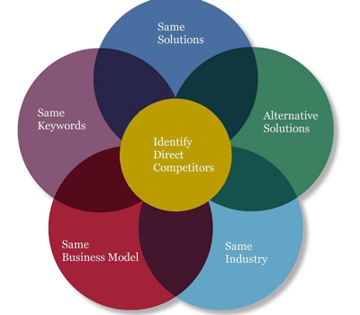
>
> - 目标用户群是否重合？
> - 即使都不一致，对方以后的业务拓展是否可能构成威胁？
> - 是否存在异业跨界打击？等等，竞品并不是局限于看似一致的产品，也不局限于PRD之前的构思，而应贯穿产品的整个生命周期，可能不断会有新的竞品出现，这是一场无止境的战争。

## 4.2 竞品分级

竞品分析第一步就是确定竞品，然后给竞品分级。可分为核心竞品，重要竞品，一般竞品。

##### 核心竞品

> 一般选择标准是产品直接相关的细分市场内，第一梯队的竞争对手。对于核心竞品要一直关注和跟进。
>

##### 重要竞品

> 一般选择标准是产品相关细分市场内排名第1的竞争对手。需要定期关注。重大改版要及时跟进。

##### 一般竞品

> 一般就是产品直接和相关细分市场的其余产品。普通竞品面要全。仅需定期梳理即可，不需深入研究。以充分了解市场动向和潜在危机。

##### 竞品分级举例

> 下图是一个想要做银行卡【优惠】的产品，产品决策者把市面上最火的微信、支付宝、大众点评、美团、掌上生活、卡惠作为竞争对手。这几个产品有非常类似的地方，所以我们把相似的竞品先进行了合并分析，然后再按照场景、用户行为、内容体量、卖点进行了对比，用浅红色代表相似度高，深红色代表相似度较高，蓝色代表相似度低。通过对比可以清楚地发现像微信、支付宝这样的产品几乎没有太多参考性；而像掌上生活、卡惠这样的产品虽然不是市场最热的，但却是最直接的竞争对手，参考价值最大。
>
> 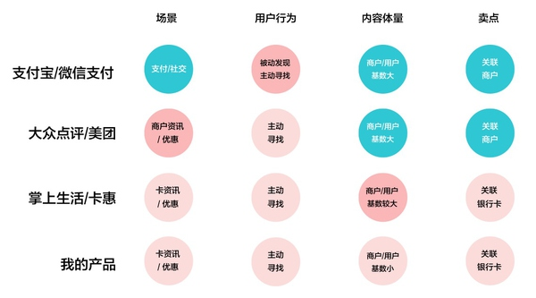

**!!! 这样的分析能帮助我们认清自己是谁，谁是你的直接/间接竞争对手。**

## 4.3 竞品的解构，如何进行分析？

### 4.3.1 所有的分析都分为两个层面：定性分析和定量分析

> 产品功能、产品策略、用户体验，这些都是定性分析的点。而用户数据、活跃情况、性能对比这些就需要实打实的数据了，光看产品没用。
>
> 对竞品进行定性分析的核心点在于思考对方的产品经理/产品运营/交互设计师/视觉设计师为什么要这样做。也就是需要具有同理心！

### 4.3.2 选定竞品后，要看哪些地方？

其实这个在不同情况下依然需要具体问题具体分析。

> - 一般，我会先看一下竞品1.0版本是如何切入市场，如何引爆的，然后会看它的迭代方向，可以往哪些地方拓展；
> - 平时其他类型的产品我也会关注，不只是竞品，尤其是爆款可以想一下背后的原因，创新并不一定是完全的新的东西，也可以是一个东西在新领域的应用。中国的大部分互联网产品都是一大抄，要是像腾讯懂得如何抄的有水平也无所谓，但是大部分产品同质化太严重，大家的想法太过于直线，比如增加粘性，大部分就都想做社区，但是是否适合做社区，社区做出来质量如何，能否真正提高活跃带来转化？这些都是需要细想的。

### 4.3.3 数据从哪儿来？

说到定量分析的层面，定量是需要数据的。但是数据从哪儿来？公开数据和非公开数据。

#### 公开数据

> 用得比较多的是行业分析报告和百度指数，不要忽略了上市公司的财报，由于上市公司公开资料的准确性要求，财报上的数据指标基本都是客观的，不过要注意具体的表达方式和措辞。还有一种公开数据的来源是小道消息和PR稿，这类消息在准确性上需要多个维度相互验证，尤其是PR稿多半是掺水分的。

#### 非公开数据

> - 一种方式就是之前举例的时候提过，没有现成的数据，但需要你去整理，比如用户数。iOS平台是很难看到的，但Android的数据是公开的，把行业里前几的百度小米应用宝360四家数据汇总，这四家能占到总量的60%左右，所以可以大概估出来。顺便把应用市场里的用户评论摘出来看下，一般新功能如果不好用很多人会去应用市场骂，把这些资料收集起来就能避免自己也走进坑里。还有微博上的舆论，竞品的用户论坛QQ群，都是做竞品口碑分析重要渠道。
>
>
> - 还有一种方式是通过自建监测系统，或者通过各种渠道测算，这就是具有大数据平台公司的优势，可以轻松拿到别人拿不到的数据，想想PC时代的安全软件，像数字公司的安全卫士整天在电脑里扫描文件，再加上软件管理模块的分发能力，它就能大概知道你的用户数和活跃情况。

### 4.3.4 分析的框架与工具

#### SWOT模型

（Strengths、Weaknesses、Opportunities、Threats）

> 是一种分析产品/公司内外部竞争环境的工具。
>
> S、W指产品内部有哪些优劣势。
>
> O、T指的是产品外部市场存在哪些机会和威胁。
>
> 此工具的优点在于它可以对所有类型的产品进行粗略的分析，既可以是实体的商店，又可以是线上的互联网产品。
>
> 缺点在于力度比较粗，对于产品特质的抓取不是特别有力。
>
> 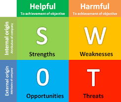

> **一个位于市中心的新品牌披萨店的例子**：
>
> Strengths（内部优势）：
>
> - 产品：拥有优质的食材&配方
> - 价钱：比其他流行品牌便宜
> - 设计：精美的、有设计感的托盘
> - 氛围：店内环境舒适，适合交谈
>
> Weaknesses（内部劣势）：
>
> - 品牌：不被大众熟知
> - 员工：未经过专业的培训
> - 经验：缺乏经营的经验
>
> Opportunities（外部机会）：
>
> - 受众：价格和设计吸引了许多年轻的女性
> - 周边品牌：有杂志、服饰、图书等资源，可发展成为综合性的门店
>
> Threats（外部威胁）：
>
> - 对手：竞争对手能提供更多品种的披萨
> - 环境：周围500米有同类型的披萨店

####  PEST模型

（Political、Economic、Social、Technological）

> 是一种产品的宏观环境分析工具，即政治、经济、社会、科技，这些因素不受产品的的改变而改变，是对产品的孕育环境的了解，和公司的运作管理更相关。
>
> 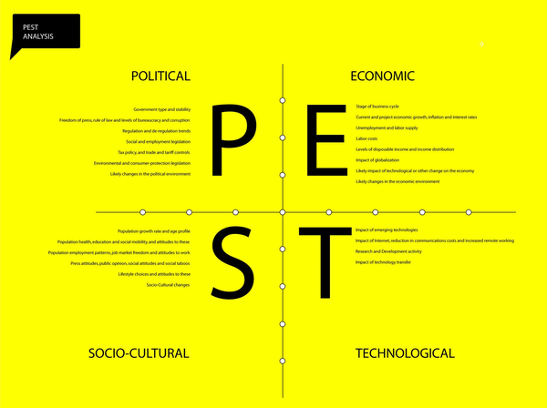
>
> Political（政治因素）：
>
> - 贸易政策
> - 股东需求
> - 国家政策
>
> Economic（经济因素）：
>
> - 国外经济趋势
> - 本地经济趋势
> - 外汇比率
> - 关税
>
> Social（社会因素）：
>
> - 宗教因素
> - 地域消费行为模型
> - 地域人口统计
> - 地域教育程度
>
> Technological（技术因素）：
>
> - 技术发展趋势
> - 技术授权/牌照
> - 技术的成熟度

####  AARRR模型

[（Acquisition、Activation、Retention、Revenue、Refer）](http://baike.baidu.com/link?url=weXPulNQu1I0m6sTbeOTA_1LvDxe1iZeEe3TCIrxH8RUwEXtiZtsN4v5P__ugiO-FfAUSuwRetBtCMQpQKFOs_)

> 是一种分析产品运营情况的模型，分别是：获取用户、提高用户活跃度、提高留存率、获取收入、自传播五个方面。比较适用于分析偏运营的产品。
>
> 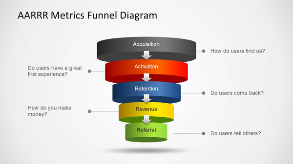
>
> 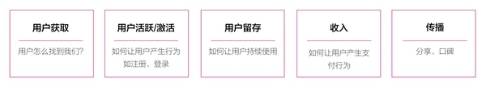
>
> AARRR模型有它关注的指标，可做参考：
>
> - 获取用户：新增用户数、CPA
>
> - 提高用户活跃度：AU（活跃用户）、活跃率、使用时长、启动次数
>
> - 提高留存率：次日留存率、周、月留存率
>
> - 获取收入：ARPU（平均每位用户收入）、消费用户比例、LTV（生命周期价值）
>
> - 自传播(病毒式营销)：K因子
>
>   > - **CPA（Cost Per Action）**
>   >
>   > 是一种广告计费模式，顾名思义按照行为（Action）作为指标来计费，这个行为可以是注册、咨询、放入购物车等等。广告公司和媒体公司常用CPA、[CPC](http://baike.baidu.com/item/CPC/9981134)(Cost Per Click)、[CPM](http://baike.baidu.com/item/CPM/1139783)(Cost Per Mille，或者Cost Per Thousand;Cost Per Impressions)一起来衡量广告价格。
>   >
>   > CPA（每次行动成本，Cost Per Action）计价方式是指按广告投放实际效果，即按回应的有效问卷或定单来计费，而不限广告投放量。CPA广告是网络中最常见的一种广告形式，当用户点击某个网站上的cpa广告后，这个站的站长就会获得相应的收入。
>   >
>   > CPA模式，在充分考虑广告主利益的同时却忽略了网站主的利益，遭到了越来越多的网站主的抵制。网站主们普遍不愿意拿优质广告位投冷门产品的CPA广告，因为广告被点击后是否会触发网友的消费行为或者其他后续行为(如注册帐号等行为)，最大的决定性因素不在于网站媒体，而在于该产品本身的众多因素(如该产品的受关注程度和性价比优势、企业的信誉程度等等)以及现今网友对网上消费的接受状况等因素，越来越多网站媒体在经过实践后拒绝CPA模式，CPA收费广告很难找到合适的网络载体。
>   >
>   > ​
>
>   > - **ARPU(ARPU-AverageRevenuePerUser)**
>   >
>   > 即[每用户平均收入](http://baike.baidu.com/item/%E6%AF%8F%E7%94%A8%E6%88%B7%E5%B9%B3%E5%9D%87%E6%94%B6%E5%85%A5)。用于衡量电信运营商和互联网公司业务收入的指标。ARPU注重的是一个时间段内运营商从每个用户所得到的收入。很明显，高端的用户越多，ARPU越高。在这个时间段，从运营商的运营情况来看，ARPU值高未必说明利润高，因为利润还需要考虑成本，如果每用户的成本也很高，那么即使ARPU值很高，利润也未必高。
>   >
>   > ​
>
>   > - **LTV(life time value)**
>   >
>   > 生命周期总价值，意为客户终生价值，是公司从用户所有的互动中所得到的全部经济收益的总和。通常被应用于市场营销领域，用于衡量企业客户对企业所产生的价值，被定为企业是否能够取得高利润的重要参考指标。
>   >
>   > 终身价值（LTV）:是计算客户满意度“货币数据”的办法.
>   >
>   > LTV的计算涉及到顾客保持率、顾客消费率、变动成本、获得成本、贴现率等信息的正确取得。
>   >
>   > 其中：
>   >
>   > 顾客保留率（retention rate，RR）= 本年度的顾客总数 / 上年度的顾客总数；
>   >
>   > 顾客消费率（spending rate，SR）= 顾客总消费额 / 顾客总数；
>   >
>   > 变动成本（variable cost，VC）= 产品成本 + 服务管理费用 + 信用卡成本等；
>   >
>   > 获得成本（acquisition cost，AC）= 本年度广告、促销费用 / 本年度顾客总数；
>   >
>   > 净利润（gross profit，GP）= 总收入 – 总成本；
>   >
>   > 贴现率（discount rate，DR）= [1 +（风险系数×银行利率）]n ；
>   >
>   > 利润净现值（net present value profit，NPV）= GP / DR ；
>   >
>   > 累积NPV = 特定时间内每年NPV 的总和；
>   >
>   > 顾客终身价值（LTV）= 累积NPV / 顾客总数。
>   >
>   > 而对于游戏行业来说：
>   >
>   > 生命周期（Life Time，LT）：一个用户从第1次到最后1次参与游戏之间的时间段，一般按月计算平均值；
>   >
>   > 用户平均收入（ARPU）：活跃用户对游戏产生的平均收入。即ARPU = 总收入/总活跃用户；
>   >
>   > 用户终生价值（Life Time Value，LTV）：用户在生命周期内为该游戏创造的收入总计，可以看成是一个ARPU 值的长期累计。即LTV = ARPUxLT。
>   >
>   > **对于绝大多数商业行为而言，要正确理解你与顾客关系的LTV，需要考虑以下因素。**
>   >
>   > **关系的长短：**你的客户关系平均能保持多久？这代表未来将发生多少笔交易
>   >
>   > **回头率：**你是更注重寻找新的潜在顾客还是倾向于关注现有顾客？你回访新顾客的比率是多少？新客户成为回头客的百分比有多少？
>   >
>   > **重复销售价值：**回头客的平均价值如何？您使用什么附加产品来进行交叉销售或进一步销售给现有顾客
>   >
>   > **规模经济：**你是否能够通过将销售提升到某个水平而形成规模经济？达到一定进货量时，能否与供应商谈判争取更优惠的条件？
>   >
>   > **更改产品/服务组合：**后续服务是否涉及更多可获利润的较低服务层次？潜在产品的销售是否比原有的购买行为产生更高的边际利润。
>   >
>   > **推介业务：**顾客考虑额外业务的可能性如何？推介的价值如何？
>   >
>   > ​
>
>   > - **K因子**
>   >
>   > K因子量化了感染的概率，即一个已经感染了病毒的宿主所能接触到的所有宿主中，会有多少宿主被其传染上病毒。
>   >
>   > K因子的计算公式不算复杂，K = (每个用户向他的朋友们发出的邀请的数量) * (接收到邀请的人转化为新用户的[转化率](http://baike.baidu.com/subview/834105/834105.htm))。假设平均每个用户会向20个朋友发出邀请，而平均的转化率为10%的话，K =20*10%=2。这个结果还算是不错的效果——当K>1时，用户群就会象滚雪球一样增大。如果K<1的话，那么用户群到某个规模时就会停止通过[自传播](http://baike.baidu.com/subview/7188878/7342320.htm)增长。

####  Lean Canvas 精益商业画布

> 是一种全面分析产品的方式，它包括了产品应该关注的方方面面。
>
> [Business Model Canvas](http://36kr.com/p/214438.html)
>
> 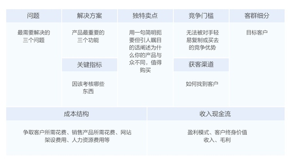

####  图表分析

> 雷达图
>
> 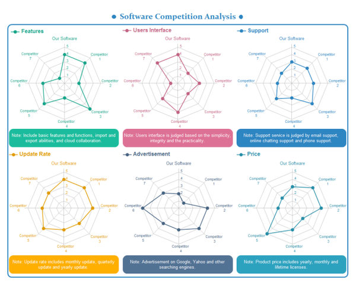

> 气泡图
>
> 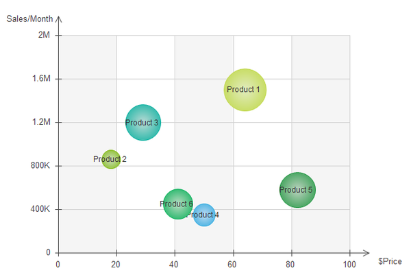

> 表格打分
>
> 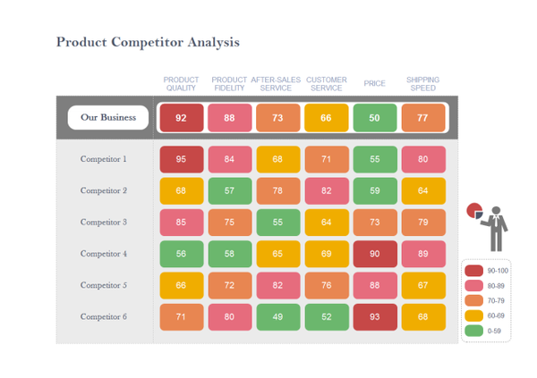

####  

#### 用户体验要素

> 关于产品体验的分析我比较推崇『用户体验要素』的分析框架，也就是从战略层→范围层→结构层→框架层→表现层，如果分析全局就按照这条线层层深入，也可以针对局部一个层面进行分析。

## 2. 竞品基础结构分析

竞品基础机构主要包括信息架构（IA），功能（feature），交互（interaction）三个部分。

> 再次说明：从个人的设计到产品的职业发展经历，建议PM在基础结构分析中，可将视觉表现融入到信息架构分析中，指导分析界面信息元素重要性和指示作用即可，不需要单独进行分析。因为视觉分析的专业性要求较高，不是每个PM都具备的，分析结论容易出现偏差，另外相距PM的核心职责较远。有种PM帮RD分析代码编写思路的感觉，不切实际。

### 2.1 信息架构（IA）分析

又可以细分为信息流程，界面层级，界面布局三大部分。

#### 2.1.1信息流程

就是分析竞品的信息是如何逐步呈现给用户，如何引导用户获得需要的信息。好的产品架构，信息的流转应该是清晰而高效的。

在实际操作中为提高效率，主要针对竞品核心内容的信息流转情况进行分析即可。其他次要信息流可以根据需求度进行拆解分析。

步骤1，确定要分析的信息流程主体。

步骤2，按信息元素和信息跳转流程进行梳理，形成流程图。

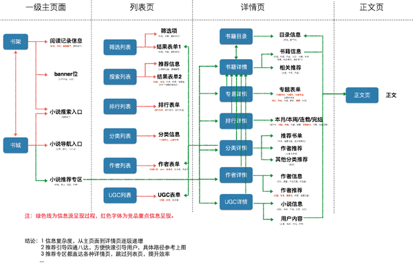

> 注：分析中尽量单一流程进行分析，避免线路混杂。另外除去线路示意还要有分析结论。

#### 2.1.2界面层级

界面层级是和信息流程紧密结合的，界面层级能够更直观的反映出软件设计的架构。

步骤1， 对竞品进行全方位的截图。

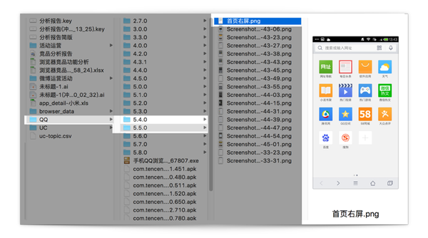

> 注：截图要全面，如果有精力最好是找到竞品多个版本进行截图。如无精力可仅对最新版进行截图。经过不断积累就能够了解竞品在时间轴上的全貌。经实操该方法效率很高。

步骤2， 根据界面进行分级，然后根据跳转关系整理到文档中。

#### 2.1.3界面布局

完成对整体信息结构梳理后就可以对具体页面信息和布局进行细致拆解。由于具体页面布局拆解工作量较大，所以可根据需求，拆解部分页面即可。建议首页的分析不能缺少。

下面推荐三种分析方式：

> 第一种页面解构方式：即并对页面元素进行标注，然后对页面元素，交互范式，展示方式等进行详细的分析
>
> 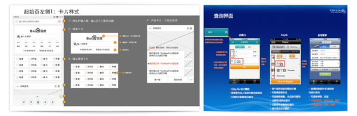
>
> 第二种时间轴分析方式：即按照竞品版本变化来分析其布局的调整，从而有效的发现竞品布局的思路和优缺点。个人习惯是把同一页面按时间顺序添加到ppt中，然后连续播放就能发现很多信息。
>
> 比如一直保留下来的布局属于经典布局，可参考学习。被干掉后有增加回来的，说明经验证是有效的布局方式等，或者临时出现某设计又很快被拿掉说明有问题等（个人很喜欢这个方式，简单高效）
>
> 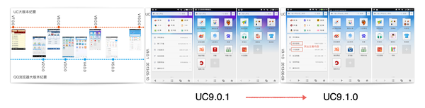

### 2.2功能（feature）分析

个人感觉其最重要的作用就是全方位了解竞品有哪些功能，从而指导自己产品的功能补充。至于更细致的功能交互逻辑分析，建议不要混到功能分析中，放到后面的交互分析中即可。

这里只推荐一个全功能列表统计方法。

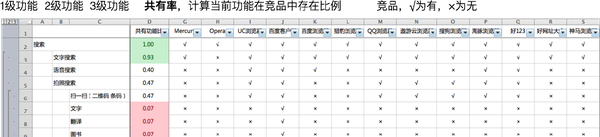

> 注：一般功能分级不要超过三级；功能梳理一定要细致全面不能丢落；功能共有率（个人发明），能侧面反映功能重要性；若某功能，或某一类功能是某一竞品独有，则可能是该竞品差异化的点；功能总数能反映产品复杂度。

这个方法能够迅速发掘同类产品核心功能是什么，以及发掘竞品的差异化功能。并凭借对功能的分析，了解用户的需求和产品打法。

### 2.3 交互（interaction）分析

在技术和载体不变的情况下，通过市场快速的发展，合理的交互范式经过市场的检测和用户习惯的培养，最终会被规范下来，成为通用模式。所以在相同界面架构和相同功能定位下最优的使用路径几乎是相同的。

> 由于交互分析工作量较大，因此产品经理在做竞品交互分析的时候，只需要根据需求进行重点分析即可。
>
> 同时利用截图可以直接进行高保真的交互分析，而不必进行低保真图还原。同时高保真图能有效结合界面布局进行分析。

##### 交互分析的注意点：

1 一定要从功能入口开始分析，而不要从功能主体开始。容易错过其他入口，导致分析缺陷。比如不加入口可能是路径1，但实际可能是路径2。

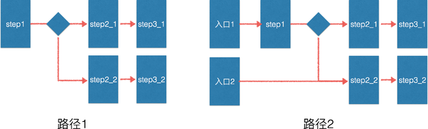

2 以目标操作任务为主干，避免被分支功能分散，从而导致分析结果混乱。

3 产品经理不是交互设计师，因此对竞品交互逻辑的分析一定要把握好度。

### 2.4 设计和交互

很多情况下不是重点，不过看脸的时代，UI很大程度上决定产品调性，多接触不同类别的app，看它的细节。当然，调性这个东西并不是越高越好，只要贴合受众，就是好的。如果你和竞品的目标用户群有所差异，往往也可以在设计上把人群区分开来。

至于页面层级，展示结构等，一个脑图罗列一下就好，方便比对不同的归类和实际体验的流畅性之间，是如何一一对应的？这个就不得不提网易，我发现网易的产品流畅性往往完爆其竞品啊，减少用户的操作成本，如何减少，如何合并步骤，等等的细节，也是可以下功夫的地方 。

## 3. 竞品核心策略分析

该部分也可归纳为产品定位，运营策略，盈利模式，三个主要部分。

对核心策略的分析有两个难点：

1）策略一般是较长一段时间内的规划，并且是延续和变化的。因此对策略的分析要能了解过去，现在并且推演出将来。不能局限于一个版本或一个时间点进行分析。

2）策略的分析是没有像基础结构分析一手资料呈现的，只能根据相关资料去分析和推测。具有不确定性。所以结论的准确性很重要。

### 3.1产品定位分析

个人喜欢借助历史版本介绍、启动引导、版本对应的用户商店评价进行分析

#### 步骤1

确定版本发布情况。

> 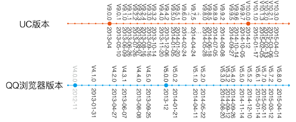

#### 步骤2

收集版本介绍，以及对应的启动引导页。在ppt内进行整理。并且标注不同版本下的重点功能。

> 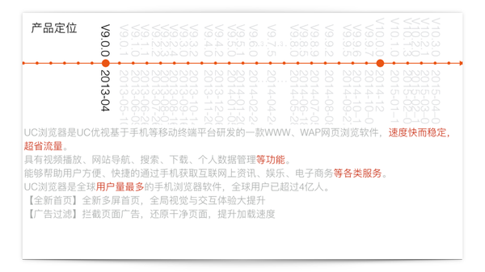
>
> 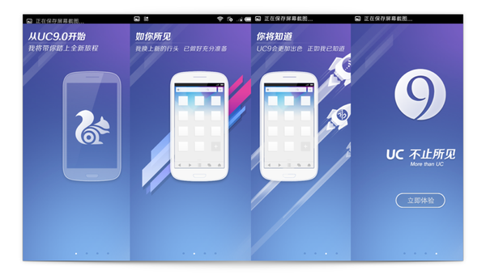

#### 步骤3

归纳总结产品定位走向，并分析不同产品定位下的重点功能，以及是否存在比较关键的功能点，并分析产品定位对应的利弊。

> 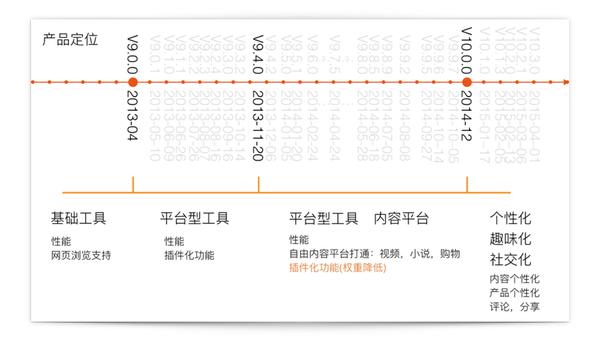
>
> 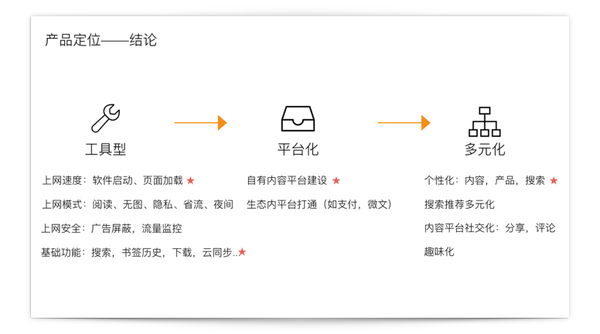
>
> 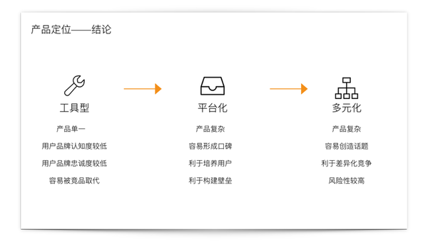

#### 步骤4

定位有效性评价

分析总结过竞品的产品定位后，需要了解产品定位对产品产生的作用，从而对自身产品提供有效参考信息。

由于公司内能统计到竞品对应的用户活跃，时长等数据，所以是个人很喜欢的评判方式。如下图所示（数据保密，坐标隐藏）

> 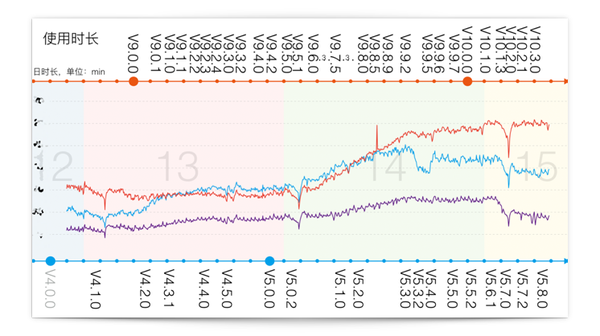
>
> 注意：需要参考市场规律性波动，版本收敛速度（即新版本发布到用户升级再到对数据影响的时间过程），综合评判数据影响来自于哪个版本的影响，以及对应的产品变化。

当然很多公司可能没有这种便利条件，因此可以从其他方面进行评估，个人推荐应用商店版本评级变化，和对应的用户评论分析。如截图：

> 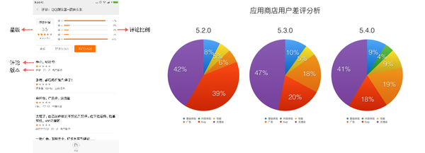
>
> 注意：评论里有可能存在水军等，要仔细评估。除了商店评论，网上相关文章分析也可以参考。但根据以往经验水文会比较多，所以建议仅供参考。

### 3.2运营策略分析

对竞品的运营策略分析主要侧重于对应产品定位下的运营手段，品牌策略的相互结合。

当然对运营策略的分析首先要了解运营体系和运营方法。这里暂不展开，产品运营也是产品的重要知识体系之一，后续会详细拆解。

罗列竞品的运营事件，以及其新闻、融资事件，有哪些资源等等，看其效果，看其踩过的坑，看其实力的增减，都可以对自己起到防范、借鉴、战略防御等作用。

##### 对于品牌运营相对好分析，收集竞品品牌语即可。

> 比如UC：
>
> 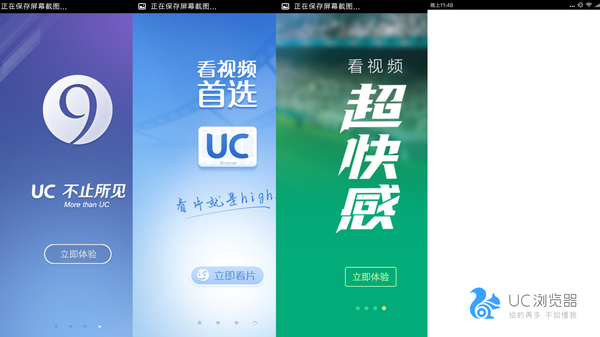
>
> 明显看出品牌和产品定位紧密结合的，一开始功能性定位，品牌语“不止所见”；后面主推内容和性能，品牌语变成“看片就是high”，“超快感”；最近在推个性化，品牌语对应为“给的再多，不如懂你”。所以品牌运营也能很好的反应产品定位。
>
> 结合品牌代言形象，品牌广告投放形式，可以明确在不同产品定位和市场环境下，竞品想要营造的品牌形象。

##### 对于运营手段分析

最大的困难是回溯之前的运营方案。

建议可以让RD帮忙下载竞品所有官方微博，可以获得非常多的信息。如下图：

能够很清楚的知道运营内容，运营顺序，时间跨度，运营经过，多个运营项目是如何穿插和配合的，以及相应的活动关注人数。

然后对其进行归纳&总结。将其对应到对应到运营模型下，包括用户运营，内容运营，新媒体运营，活动运营，品牌运营，数据运营等。最后分析运营同产品的结合点。

> 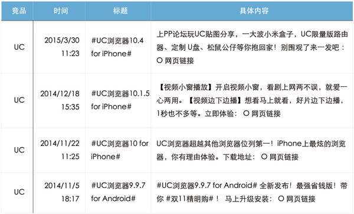
>
> 会发现uc每次新版发布都会在线上进行宣传，大版本还会配合抽奖等活动，并且活动会尽可能同功能挂钩。

##### 对竞品运营分析的关键

是要充分了解如何将产品策略和运营策略紧密结合，从而在产品功能开发之初就为后续运营做好铺垫。

> 举个例子，元旦很火的微信朋友圈红包照片活动，都必须是产品在几个版本前就要考虑到运营策略，进行功能优化和扩展性设计。
>
> 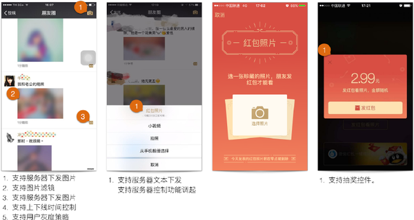
>
> 经实践这个方法很有效果，在有限条件下能够获得很多有效信息，并能充分了解产品定位同运营策略之间的联系和打法，为运营框架搭建打好基础。但是工作量较大，需要运营同学一起配合。

### 3.3盈利模式分析

产品获得钱的方式大体就是三种方式：

1. 向投资人要钱。
2. 向广告主要钱。
3. 向用户要钱。

##### 向投资人要钱

> 就是目前产品处于第几轮融资，然后要为下轮融资做准备。这个没什么好说的。推荐个网站，能查到很多融资信息

##### 向广告主要钱

> 首先收集软件内的广告位，其次统计广告位上出现的品牌广告&效果广告的比例。最后看广告投放是来自于广告代理还是自己平台投放。
>
> 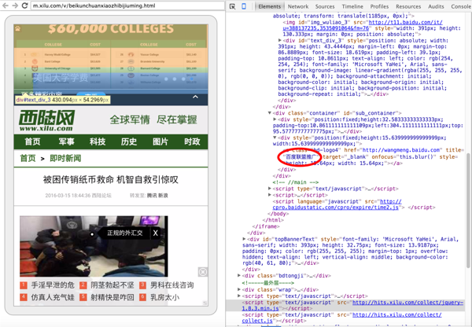

##### 向用户要钱

> 对某些产品是有两个终端的如淘宝，滴滴，有卖家和买家。对卖家可以抽成或者入住费。对买家可以是会员服务或者产品直销，比如游戏会员，金融产品（金融产品的盈利要复杂得多）。这些一般可以通过服务声明快速了解相关情况。

同时若竞品的公司已经上市，财报是非常有利的分析资料。通过财报可以很清楚了解竞品公司的各方面营收&支出能力。可以对竞品进行辅助分析。

## 5. 该类产品的行业发展&分布及市场情况

### 对产品行业发展和分布的分析

主要有两个目的：

- 一个是充分了解行业发展的竞争情况。

- 一个是寻找新的发展机会或者市场切入点。

> 在竞品分析中对行业发展和分布的分析，个人习惯是先遍历AppStore排行榜。
>
> 比如当初在做便签竞品分析，粗略统计了便签产品共计5000多项。
>
> 然后提取前200个便签，依次统计产品说明的关键点，并下载后统计主要功能。
>
> 之后提取行业的细分点，然后将竞品归纳到相应的细分定位上。
>
> 从而直观的了解行业的分布，和目前各个分布的竞争情况。
>
> 这里借用我们同事做的一个母婴行业的分析，采用的也是类似的方法，给大家感受下：
>
> 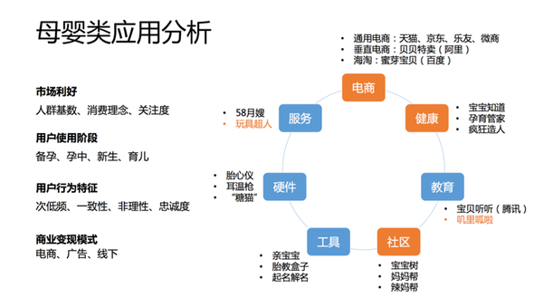

### 市场了解

- 去艾瑞、易观智库等等去找报告，如果找到了，一般来说对这个行业的认知是基本大差不差不会出问题了。也会得到行业的大趋势 。
- 如果没找到，应该会对这个行业的竞品去开始挖掘。然后也能得出一份次之的认知。

## 6. 结合用户&市场总结整体趋势

1. 竞品分析一般还会和相应的用户分析报告，市场分析报告，进行综合分析，相互佐证。
2. 产品根据市场情况所要注意的问题

> -  对于市场相对空白的产品. 可能会目的性不那么强的寻找一些好的模式，思考自己产品可以以什么形态引爆市场；
> -  对于发展期的产品. 可能会看一下此市场的标杆产品是怎么做的，看数据，预测这个市场可以做多大，然后对比和竞品的优劣势，想想哪些可以构成有效的竞争点，去超越竞争对手？
> -  对于红海市场的产品. 会看现有的几大竞品的用户构成，主要功能，相关数据等，寻找好的切入点，把竞品的用户挖过来

。。。

## 7. 持续的关注和积累了解其发展的脉络和动向

分享下个人下打磨基本功的方法：

1 每天特定关注几个互联网资讯站，及时把握互联网内的大事件和发展动向。

2 定期看相关的互联网数据，尤其如果有条件看竞品的数据，一定要每天关注下。

3 定期做下用户分析，了解用户属性和用户数据。

4 培养每天看新app和做相关简单分析记录的习惯。

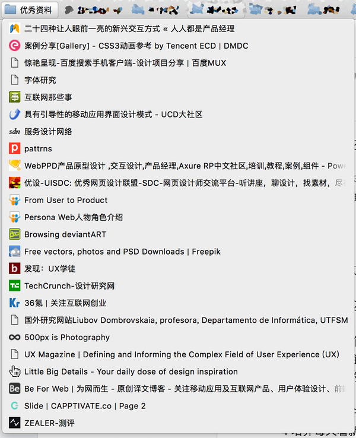

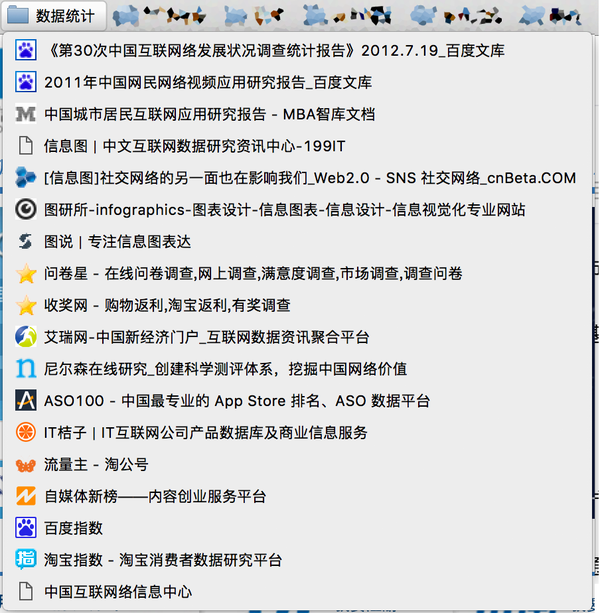

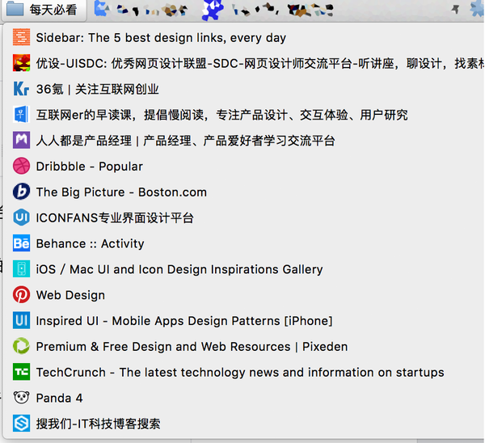

## 最后总结

关于竞品分析：

方法思路要灵活（根据需求，合理选择资源投入，分析深度以及分析方法）

分析结论要准确（宁可结论含糊或者无结论，也不要错误结论）

分析是从基础到架构再到多维度综合分析，但汇报要反过来。

拆解竞品分级和竞品基础结构分析。这部分偏基础性，分析方法和素材都有迹可循，此部分偏重方式和效率。

拆解产品策略，产品行业等进行分析。这部分偏策略，素材获取结论总结都相对模糊，此部分偏重分析和判断。

总之，竞品分析，是不断的打磨观察、调整、打击和抗打击的过程，但是请记得不要被竞品牵着走，竞品分析应服务于你的产品设计，而不能决定它，你还需要对用户的洞察，对宏观的敏感，对热点的借力，等等，这些都同样重要。

具体运用什么方法分析，都是要看目的，看背景，看问题边界，没有放之四海皆准的东西。

思路比方法论重要。大学时期看了很多MBA的理论和案例，不过我比较在意的是它怎样形成这样的理论，这些理论的前提和适用范围在哪，现实案例可以归纳为怎样的模型，什么时候也可以利用这个模型，等；扔掉那些fancy的名词，标准的结构，关注问题解决，就是实战和大学商赛的区别。加之成年累月的观察，总结出自己的理论，那就是很牛逼的事情。

洞察和创新大概是一个pm的天花板。真正的眼光和创造，又是另一回事了。