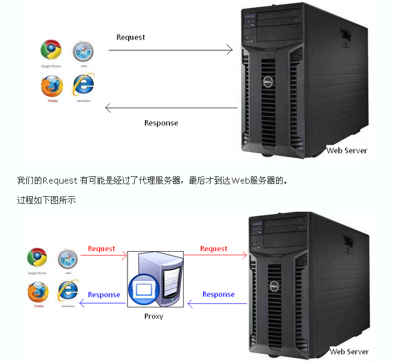
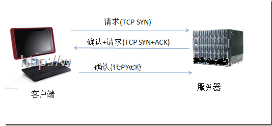

# HTTP

## 概念

协议是指计算机通信网络中两台计算机之间进行通信所必须共同遵守的规定或规则，超文本传输协议(HTTP)是一种通信协议，它允许将超文本标记语言(HTML)文档从Web服务器传送到客户端的浏览器。

HTTP协议，即超文本传输协议(Hypertext transfer protocol)。是一种详细规定了浏览器和万维网(WWW = World Wide Web)服务器之间互相通信的规则，通过因特网传送万维网文档的数据传送协议。

HTTP协议是用于从WWW服务器传输超文本到本地浏览器的传送协议。它可以使浏览器更加高效，使网络传输减少。它不仅保证计算机正确快速地传输超文本文档，还确定传输文档中的哪一部分，以及哪部分内容首先显示(如文本先于图形)等。

HTTP是一个应用层协议，由请求和响应构成，是一个标准的客户端服务器模型。HTTP是一个无状态的协议。

在Internet中所有的传输都是通过TCP/IP进行的。HTTP协议作为TCP/IP模型中应用层的协议也不例外。HTTP协议通常承载于TCP协议之上，有时也承载于TLS或SSL协议层之上，这个时候，就成了我们常说的HTTPS。

HTTP默认的端口号为80，HTTPS的端口号为443。

浏览网页是HTTP的主要应用，但是这并不代表HTTP就只能应用于网页的浏览。HTTP是一种协议，只要通信的双方都遵守这个协议，HTTP就能有用武之地。比如咱们常用的QQ，迅雷这些软件，都会使用HTTP协议(还包括其他的协议)。

## HTTP 简史

它的发展是万维网协会（World Wide Web Consortium）和Internet工作小组IETF（Internet Engineering Task Force）合作的结果，（他们）最终发布了一系列的RFC，RFC 1945定义了HTTP/1.0版本。其中最著名的就是RFC 2616。RFC 2616定义了今天普遍使用的一个版本——HTTP 1.1。

### HTTP/1.0

“HTTP 正式作为标准被公布是在 1996 年的 5 月，版本被命名为 HTTP/1.0，并记载于 RFC1945。虽说是初期标准，但该协议标准至今仍被广泛使用在服务器端。”

RFC1945 - Hypertext Transfer Protocol -- HTTP/1.0

http://www.ietf.org/rfc/rfc1945.txt”

### HTTP/1.1

1997 年 1 月公布的 HTTP/1.1 是目前主流的 HTTP 协议版本。当初的标准是 RFC2068，之后发布的修订版 RFC2616 就是当前的最新版本。

RFC2616 - Hypertext Transfer Protocol -- HTTP/1.1

http://www.ietf.org/rfc/rfc2616.txt

# TCP/IP

通常使用的网络（包括互联网）是在 TCP/IP 协议族的基础上运作的。而 HTTP 属于它内部的一个子集。

计算机与网络设备要相互通信，双方就必须基于相同的方法。比如，如何探测到通信目标、由哪一边先发起通信、使用哪种语言进行通信、怎样结束通信等规则都需要事先确定。不同的硬件、操作系统之间的通信，所有的这一切都需要一种规则。而我们就把这种规则称为协议（protocol）。

协议中存在各式各样的内容。从电缆的规格到 IP 地址的选定方法、寻找异地用户的方法、双方建立通信的顺序，以及 Web 页面显示需要处理的步骤，等等。

像这样把与互联网相关联的协议集合起来总称为 TCP/IP。也有说法认为，TCP/IP 是指 TCP 和 IP 这两种协议。还有一种说法认为，TCP/ IP 是在 IP 协议的通信过程中，使用到的协议族的统称。

## TCP/IP 的分层管理

TCP/IP 协议族里重要的一点就是分层。TCP/IP 协议族按层次分别分为以下 4 层：应用层、传输层、网络层和数据链路层。

> 把 TCP/IP 层次化是有好处的。比如，如果互联网只由一个协议统筹，某个地方需要改变设计时，就必须把所有部分整体替换掉。而分层之后只需把变动的层替换掉即可。把各层之间的接口部分规划好之后，每个层次内部的设计就能够自由改动了。

### 应用层

应用层决定了向用户提供应用服务时通信的活动。

TCP/IP 协议族内预存了各类通用的应用服务。比如，FTP（File Transfer Protocol，文件传输协议）和 DNS（Domain Name System，域名系统）服务就是其中两类。HTTP 协议也处于该层。

### 传输层

传输层对上层应用层，提供处于网络连接中的两台计算机之间的数据传输。

在传输层有两个性质不同的协议：TCP（Transmission Control Protocol，传输控制协议）和 UDP（User Data Protocol，用户数据报协议）。

### 网络层（又名网络互连层）

网络层用来处理在网络上流动的数据包。数据包是网络传输的最小数据单位。该层规定了通过怎样的路径（所谓的传输路线）到达对方计算机，并把数据包传送给对方。

与对方计算机之间通过多台计算机或网络设备进行传输时，网络层所起的作用就是在众多的选项内选择一条传输路线。

## 特点

HTTP协议永远都是客户端发起请求，服务器回送响应。这样就限制了使用HTTP协议，无法实现在客户端没有发起请求的时候，服务器将消息推送给客户端。

#### 1. HTTP协议的主要特点

1、支持客户/服务器模式。支持基本认证和安全认证。
2、简单快速：客户向服务器请求服务时，只需传送请求方法和路径。请求方法常用的有GET、HEAD、POST。每种方法规定了客户与服务器联系的类型不同。由于HTTP协议简单，使得HTTP服务器的程序规模小，因而通信速度很快。
3、灵活：HTTP允许传输任意类型的数据对象。正在传输的类型由Content-Type加以标记。
4、HTTP 0.9和1.0使用非持续连接：限制每次连接只处理一个请求，服务器处理完客户的请求，并收到客户的应答后，即断开连接。HTTP 1.1使用持续连接：不必为每个web对象创建一个新的连接，一个连接可以传送多个对象，采用这种方式可以节省传输时间。
5、无状态：HTTP协议是无状态协议。无状态是指协议对于事务处理没有记忆能力。缺少状态意味着如果后续处理需要前面的信息，则它必须重传，这样可能导致每次连接传送的数据量增大。

#### 2. 无状态协议

协议的状态是指下一次传输可以“记住”这次传输信息的能力。
http是不会为了下一次连接而维护这次连接所传输的信息,为了保证服务器内存。
比如客户获得一张网页之后关闭浏览器，然后再一次启动浏览器，再登陆该网站，但是服务器并不知道客户关闭了一次浏览器。
由于Web服务器要面对很多浏览器的并发访问，为了提高Web服务器对并发访问的处理能力，在设计HTTP协议时规定Web服务器发送HTTP应答报文和文档时，不保存发出请求的Web浏览器进程的任何状态信息。这有可能出现一个浏览器在短短几秒之内两次访问同一对象时，服务器进程不会因为已经给它发过应答报文而不接受第二期服务请求。由于Web服务器不保存发送请求的Web浏览器进程的任何信息，因此HTTP协议属于无状态协议（Stateless Protocol）。

#### 3. HTTP协议是无状态的和Connection: keep-alive的区别

无状态是指协议对于事务处理没有记忆能力，服务器不知道客户端是什么状态。从另一方面讲，打开一个服务器上的网页和你之前打开这个服务器上的网页之间没有任何联系。
HTTP是一个无状态的面向连接的协议，无状态不代表HTTP不能保持TCP连接，更不能代表HTTP使用的是UDP协议（无连接）。
从HTTP/1.1起，默认都开启了Keep-Alive，保持连接特性，简单地说，当一个网页打开完成后，客户端和服务器之间用于传输HTTP数据的TCP连接不会关闭，如果客户端再次访问这个服务器上的网页，会继续使用这一条已经建立的连接。
Keep-Alive不会永久保持连接，它有一个保持时间，可以在不同的服务器软件（如Apache）中设定这个时间。

## 工作流程

一次HTTP操作称为一个事务，其工作过程可分为四步：
1）首先客户机与服务器需要建立连接。只要单击某个超级链接，HTTP的工作开始。
2）建立连接后，客户机发送一个请求给服务器，请求方式的格式为：统一资源标识符（URL）、协议版本号，后边是MIME信息包括请求修饰符、客户机信息和可能的内容。
3）服务器接到请求后，给予相应的响应信息，其格式为一个状态行，包括信息的协议版本号、一个成功或错误的代码，后边是MIME信息包括服务器信息、实体信息和可能的内容。
4）客户端接收服务器所返回的信息通过浏览器显示在用户的显示屏上，然后客户机与服务器断开连接。
如果在以上过程中的某一步出现错误，那么产生错误的信息将返回到客户端，有显示屏输出。对于用户来说，这些过程是由HTTP自己完成的，用户只要用鼠标点击，等待信息显示就可以了。

HTTP是基于传输层的TCP协议，而TCP是一个端到端的面向连接的协议。所谓的端到端可以理解为进程到进程之间的通信。所以HTTP在开始传输之前，首先需要建立TCP连接，而TCP连接的过程需要所谓的“三次握手”。下图所示TCP连接的三次握手。
在TCP三次握手之后，建立了TCP连接，此时HTTP就可以进行传输了。一个重要的概念是面向连接，既HTTP在传输完成之间并不断开TCP连接。在HTTP1.1中(通过Connection头设置)这是默认行为。

## Get VS Post

|             GET             |          POST           |
| :-------------------------: | :---------------------: |
|      parameters in URL      |   parameters in body    |
| used for fetching documents | used for updating data  |
|     maximum URL length      |      no max length      |
|         ok to cache         |     not ok to cache     |
| shouldn't change the server | ok to change the server |

**Post request should use form**

### Solutions to users entering bad data into our form?

> use dropdown to limit what the user can actually enter
>
> verify what the user enter and complain if the data is bad

## Reference

http://www.cnblogs.com/EricaMIN1987_IT/p/3837436.html

https://segmentfault.com/a/1190000006743835

https://developer.mozilla.org/zh-CN/docs/Web/HTTP/Overview

http://www.qixing318.com/article/the-http-protocol-handling-process.html

http://www.cnblogs.com/ranyonsue/p/5984001.html

http://www.cnblogs.com/li0803/archive/2008/11/03/1324746.html