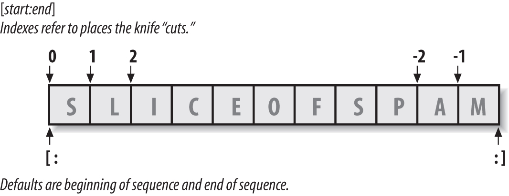

# Python Study Notes


# Indexing and Slicing：

string, list, tuple


## `S[i]`

**Indexing (S[i]) fetches components at offsets:**

- The first item is at offset 0.


- Negative indexes mean to count backward from the end or right.


- S[0] fetches the first item.


- S[−2] fetches the second item from the end (like S[len(S)−2]).


## `S[i:j]`

**Slicing (S[i:j]) extracts contiguous sections of sequences:**

- The upper bound is noninclusive.


- Slice boundaries default to 0 and the sequence length, if omitted.


- S[1:3] fetches items at offsets 1 up to but not including 3.


- S[1:] fetches items at offset 1 through the end (the sequence length).


- S[:3] fetches items at offset 0 up to but not including 3.


- S[:−1] fetches items at offset 0 up to but not including the last item.


- S[:] fetches items at offsets 0 through the end—making a top-level copy of S.


## `S[i:j:k]`

**Extended slicing (S[i:j:k]) accepts a step (or stride) k, which defaults to +1:**

- Allows for skipping items and reversing order—see the next section.

  X[I:J:K], which means “extract all the items in X, from offset I through J−1, by K.”The third limit, K, defaults to +1, which is why normally all items in a slice are extracted from left to right. 

```
>>> 'spam'[1:3] 			# Slicing syntax
'pa'
>>> 'spam'[slice(1, 3)] 	# Slice objects with index syntax + object
'pa'
>>> 'spam'[::-1] 
'maps'
>>> 'spam'[slice(None, None, −1)] 
'maps'
```


## The basics of slicing



> The basics of slicing are straightforward. When you index a sequence object such as a string on a pair of offsets separated by a colon, Python returns a new object containing the contiguous section identified by the offset pair. The left offset is taken to be the lower bound (inclusive), and the right is the upper bound (noninclusive). That is, Python fetches all items from the lower bound up to but not including the upper bound, and returns a new object containing the fetched items. If omitted, the left and right bounds default to 0 and the length of the object you are slicing, respectively.


## Example

```
>>> S = 'Spam'	# Make a 4-character string, assign it to a name 
>>> len(S) 		# Length
4		
>>> S[0] 		# The first item in S, indexing by zero-based position
'S'
>>> S[1] 		# The second item from the left
'p'
>>> S[-1] 		# The last item from the end in S
'm'
>>> S[len(S)-1] # Negative indexing, the hard way
'm'				# we can use an arbitrary expression in the square brackets.
				# anywhere that Python expects a value, we can use a literal, a variable, or any expression we wish. Python’s syntax is completely general this way.

>>> S[-2] 		# The second-to-last item from the end
'a'
>>> S 			# A 4-character string 
'Spam'
>>> S[1:3] 		# Slice of S from offsets 1 through 2 (not 3)
'pa'

# In a slice, the left bound defaults to zero, and the right bound defaults to the length of the sequence being sliced. This leads to some common usage variations:

>>> S[1:] 		# Everything past the first (1:len(S)) 
'pam'
>>> S[0:3] 		# Everything but the last
'Spa'
>>> S[:3] 		# Same as S[0:3]
'Spa'
>>> S[:-1] 		# Everything but the last again, but simpler (0:-1)
'Spa'
>>> S[:] 		# All of S as a top-level copy (0:len(S))
'Spam'
>>> S + 'xyz' 	# Concatenation 
'Spamxyz'
>>> S 			# S is unchanged 
'Spam'
>>> S * 8 		# Repetition 
'SpamSpamSpamSpamSpamSpamSpamSpam'
```

```
>>> L = list(range(100))		# 创建一个0-99的数列
>>> L
[0, 1, 2, 3, ..., 99]
>>> L[:10]						# 取出前10个数
[0, 1, 2, 3, 4, 5, 6, 7, 8, 9]
>>> L[-5:]						# 后5个数
[95, 96, 97, 98, 99]	
>>> L[10:15]					# 前11-15个数
[10, 11, 12, 13, 14]	
>>> L[:10:2]					# 前10个数，每两个取一个
[0, 2, 4, 6, 8]
>>> L[::15]						# 所有数，每15个取一个
[0, 15, 30, 45, 60, 75, 90]
>>> L[:]						# 复制一个list
[0, 1, 2, 3, ..., 99]
```

tuple也是一种list，唯一区别是tuple不可变。因此，tuple也可以用切片操作，只是操作的结果仍是tuple：

```
>>> (0, 1, 2, 3, 4, 5)[:3]
(0, 1, 2)
```

