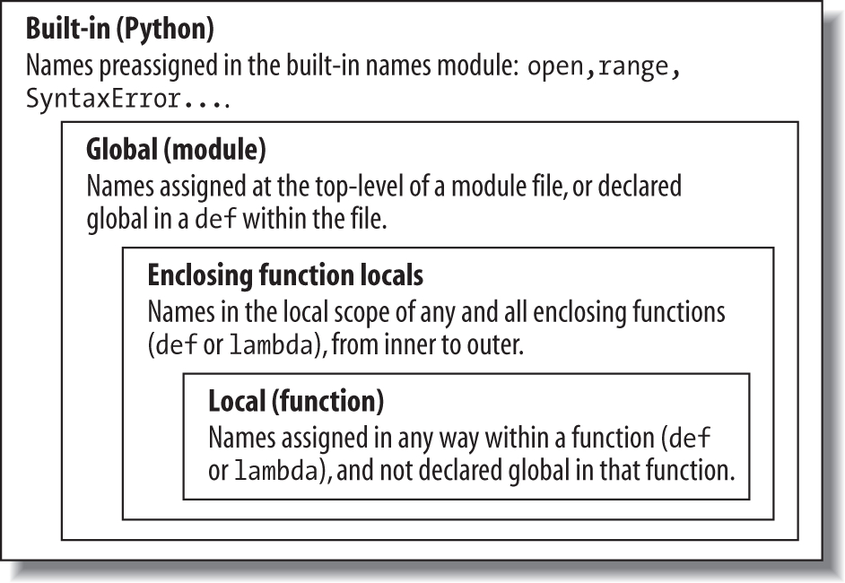
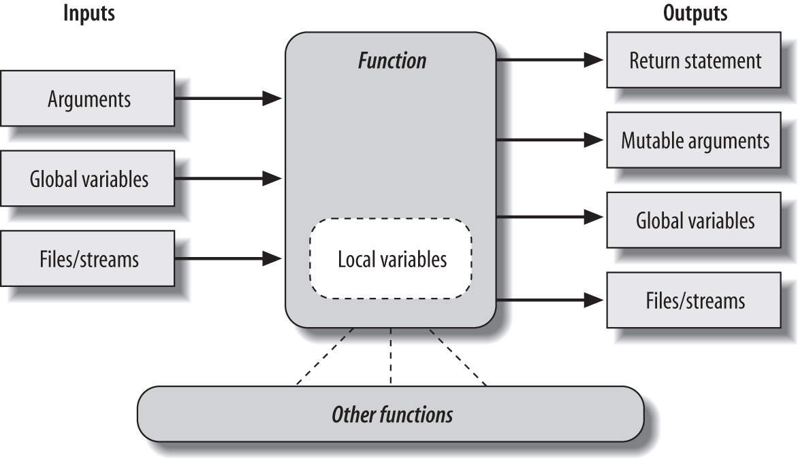

# Functions 函数 


## 1. Function Basics

- Maximizing code reuse and minimizing redundancy

- Procedural decomposition

  > In general, functions are about procedure—how to do something, rather than what you’re doing it to.

a set that includes call expressions, two ways to make functions (`def` and `lambda`), two ways to manage scope visibility (`global` and `nonlocal`), and two ways to send results back to callers (`return` and `yield`).

```
Function-related statements and expressions

Statement or expression		Examples
--------------------------------------------------------------------------------
Call expressions			myfunc('spam', 'eggs', meat=ham, *rest)
--------------------------------------------------------------------------------
def							def printer(messge):
								print('Hello ' + message)
--------------------------------------------------------------------------------
return						def adder(a, b=1, *c):
								return a + b + c[0]
--------------------------------------------------------------------------------				global						x = 'old' 
							def changer():
								global x; x = 'new'
--------------------------------------------------------------------------------
nonlocal (3.X)				def outer():
								x = 'old' 
								def changer():
									nonlocal x; x = 'new'		
--------------------------------------------------------------------------------				
yield						def squares(x):
								for i in range(x): yield i ** 2
--------------------------------------------------------------------------------				
lambda						funcs = [lambda x: x**2, lambda x: x**3]
```


### Coding Functions 编写函数

Here is a brief introduction to the main concepts behind Python functions:

- **def is executable code.** 

  > Python functions are written with a new statement, the `def`. Unlike functions in compiled languages such as C, `def` is an executable state-ment—your function does not exist until Python reaches and runs the `def`. In fact, it’s legal (and even occasionally useful) to nest `def` statements inside if statements, while loops, and even other `def`s. In typical operation, `def` statements are coded in module files and are naturally run to generate functions when the module file they reside in is first imported.

- **def creates an object and assigns it to a name.** 

  > When Python reaches and runs a `def` statement, it generates a new function object and assigns it to the function’s name. As with all assignments, the function name becomes a reference to the function object. the function object can be assigned to other names, stored in a list, and so on. Function objects may also have arbitrary user-defined attributes attached to them to record data.


- **lambda creates an object but returns it as a result.** 

  > Functions may also be created with the `lambda` expression, a feature that allows us to in-line function definitions in places where a `def` statement won’t work syntactically.


- **return sends a result object back to the caller.** 

  > When a function is called, the caller stops until the function finishes its work and returns control to the caller. Functions that compute a value send it back to the caller with a `return` statement; the returned value becomes the result of the function call. A `return` without a value simply returns to the caller (and sends back `None`, the default result).


- **yield sends a result object back to the caller, but remembers where it left off.**

  > Functions known as generators may also use the yield statement to send back a value and suspend their state such that they may be resumed later, to produce a series of results over time. 

- **global declares module-level variables that are to be assigned.** 

  > By default, all names assigned in a function are local to that function and exist only while the function runs. To assign a name in the enclosing module, functions need to list it in a `global` statement. More generally, names are always looked up in scopes—places where variables are stored—and assignments bind names to scopes.


- **nonlocal declares enclosing function variables that are to be assigned.** 

  > Similarly, the `nonlocal` statement added in Python 3.X allows a function to assign a name that exists in the scope of a syntactically enclosing `def` statement. This allows enclosing functions to serve as a place to retain state—information remembered between function calls—without using shared global names.


- **Arguments are passed by assignment (object reference).** 

  > In Python, arguments are passed to functions by assignment (which, as we’ve learned, means by object reference). As you’ll see, in Python’s model the caller and function share objects by references, but there is no name aliasing. Changing an argument name within a function does not also change the corresponding name in the caller, but changing passed-in mutable objects in place can change objects shared by the caller, and serve as a function result.


- **Arguments are passed by position, unless you say otherwise.** 

  > Values you pass in a function call match argument names in a function’s definition from left to right by default. For flexibility, function calls can also pass arguments by name with `name=value` keyword syntax, and unpack arbitrarily many arguments to send with `*pargs` and `**kargs` starred-argument notation. Function definitions use the same two forms to specify argument defaults, and collect arbitrarily many arguments received.


- **Arguments, return values, and variables are not declared.** 

  > As with everything in Python, there are no type constraints on functions. In fact, nothing about a function needs to be declared ahead of time: you can pass in arguments of any type, return any kind of object, and so on. As one consequence, a single function can often be applied to a variety of object types—any objects that sport a compatible interface (methods and expressions) will do, regardless of their specific types.


#### def Statements

The `def` statement creates a function object and assigns it to a name. Its general format is as follows:

```
def name(arg1, arg2,... argN):
	statements
```

> As with all compound Python statements, `def` consists of a header line followed by a block of statements, usually indented (or a simple statement after the colon). The statement block becomes the function’s body—that is, the code Python executes each time the function is later called.

> The `def` header line specifies a function name that is assigned the function object, along with a list of zero or more arguments (sometimes called parameters) in parentheses. The argument names in the header are assigned to the objects passed in parentheses at the point of call.

Function bodies often contain a `return` statement:

```
def name(arg1, arg2,... argN):
	...
	return value
```

> The Python `return` statement can show up anywhere in a function body; when reached, it ends the function call and sends a result back to the caller. The `return` statement consists of an optional object value expression that gives the function’s result. If the value is omitted, `return` sends back a `None`.
>
> The `return` statement itself is optional too; if it’s not present, the function exits when the control flow falls off the end of the function body. Technically, a function without a `return` statement also returns the `None` object automatically, but this return value is usually ignored at the call.
>
> Functions may also contain `yield` statements, which are designed to produce a series of values over time

#### def Executes at Runtime

The Python `def` is a true executable statement: when it runs, it creates a new function object and assigns it to a name. (Remember, all we have in Python is runtime; there is no such thing as a separate compile time.)

```
if test:
	def func():			# Define func this way
		... 
else:
	def func():			# Or else this way
		... 
...
func()					# Call the version selected and built
```

Python functions do not need to be fully defined before the program runs. More generally, `def`s are not evaluated until they are reached and run, and the code inside `def`s is not evaluated until the functions are later called.

```
othername = func 		# Assign function object
othername()				# Call func again

def func(): ... 		# Create function object
func() 					# Call object
func.attr = value		# Attach attributes
```

Like everything else in Python, functions are just objects; they are recorded explicitly in memory at program execution time. In fact, besides calls, functions allow arbitrary attributes to be attached to record information for later use


### Example: Definitions and Calls

#### Definition

```
>>> def times(x, y): 		# Create and assign function
... 	return x * y 		# Body executed when called
...
```

> When Python reaches and runs this `def`, it creates a new function object that packages the function’s code and assigns the object to the name times. Typically, such a statement is coded in a module file and runs when the enclosing file is imported

#### Calls

The `def` statement makes a function but does not call it. After the `def` has run, you can call (run) the function in your program by adding parentheses after the function’s name. The parentheses may optionally contain one or more object arguments, to be passed (assigned) to the names in the function’s header:

```
>>> times(2, 4) 		# Arguments in parentheses
8

>>> x = times(3.14, 4)		# Save the result object
>>> x
12.56

>>> times('Ni', 4) 		# Functions are "typeless"
'NiNiNiNi'
```

#### Polymorphism in Python 多态

Python 将对某一对象在某种语法的合理性交由对象自身来判断，This sort of type-dependent behavior is known as polymorphism, means that the meaning of an operation depends on the objects being operated upon.

> for instance, can generally be applied to a whole category of object types automatically. As long as those objects support the expected interface (a.k.a. protocol), the function can process them. That is, if the objects passed into a function have the expected methods and expression operators, they are plug-and-play compatible with the function’s logic.
>
> Moreover, if the objects passed in do not support this expected interface, Python will detect the error when the * expression is run and raise an exception automatically. It’s therefore usually pointless to code error checking ourselves. In fact, doing so would limit our function’s utility, as it would be restricted to work only on objects whose types we test for.

in Python, your code is not supposed to care about specific data types. （philosophical difference between Python and statically typed languages like C++ and Java）

> If it does, it will be limited to working on just the types you anticipated when you wrote it, and it will not support other compatible object types that may be coded in the future. Although it is possible to test for types with tools like the type built-in function, doing so breaks your code’s flexibility. 

By and large, we code to object interfaces in Python, not data types. 

Of course, some programs have unique requirements, and this polymorphic model of programming means we have to test our code to detect errors, rather than providing type declarations a compiler can use to detect some types of errors for us ahead of time.

>  In exchange for an initial bit of testing, though, we radically reduce the amount of code we have to write and radically increase our code’s flexibility. As you’ll learn, it’s a net win in practice.


### Example: Intersecting Sequences

#### Definition

- Putting the code in a function makes it a tool that you can run as many times as you like.


- Because callers can pass in arbitrary arguments, functions are general enough to work on any two sequences (or other iterables) you wish to intersect.


- When the logic is packaged in a function, you have to change code in only one place if you ever need to change the way the intersection works.


- Coding the function in a module file means it can be imported and reused by any program run on your machine.

wrapping the code in a function makes it a general intersection utility:

```
def intersect(seq1, seq2):
	res = [] 				# Start empty
	for x in seq1:			# Scan seq1
		if x in seq2: 		# Common item?
			res.append(x) 	# Add to end
	return res
```

#### Calls

```
>>> s1 = "SPAM"
>>> s2 = "SCAM"
>>> intersect(s1, s2) 		# Strings
['S', 'A', 'M']
```

the function could be replaced with a single list comprehension expression, as it exhibits the classic loop collector code pattern:

```
>>> [x for x in s1 if x in s2] 
['S', 'A', 'M']
```

#### Local Variables

the variable `res` inside `intersect` is what in Python is called a local variable—a name that is visible only to code inside the function `def` and that exists only while the function runs. In fact, because all names assigned in any way inside a function are classified as local variables by default, nearly all the names in `intersect` are local vari-ables:

- `res` is obviously assigned, so it is a local variable.


- Arguments are passed by assignment, so `seq1` and `seq2` are, too.


- The `for` loop assigns items to a variable, so the name `x` is also local.

All these local variables appear when the function is called and disappear when the function exits


## 2. Scopes 作用域

### Scope Basics

When you use a name in a program, Python creates, changes, or looks up the name in what is known as a namespace—a place where names live. When we talk about the search for a name’s value in relation to code, the term scope refers to a namespace: that is, the location of a name’s assignment in your source code determines the scope of the name’s visibility to your code.

Just about everything related to names, including scope classification, happens at assignment time in Python. As we’ve seen, names in Python spring into existence when they are first assigned values, and they must be assigned before they are used. Because names are not declared ahead of time, Python uses the location of the assignment of a name to associate it with (i.e., bind it to) a particular namespace. In other words, the place where you assign a name in your source code determines the namespace it will live in, and hence its scope of visibility.

- Names assigned inside a `def` can only be seen by the code within that `def`. You cannot even refer to such names from outside the function.


- Names assigned inside a `def` do not clash with variables outside the `def`, even if the same names are used elsewhere. A name `X` assigned outside a given `def` (i.e., in a different `def` or at the top level of a module file) is a completely different variable from a name `X` assigned inside that `def`.

In all cases, the scope of a variable (where it can be used) is always determined by where it is assigned in your source code and has nothing to do with which functions call which. variables may be assigned in three different places, corresponding to three different scopes:

- If a variable is assigned inside a def, it is local to that function.


- If a variable is assigned in an enclosing def, it is nonlocal to nested functions.


- If a variable is assigned outside all defs, it is global to the entire file.

We call this **lexical scoping** because variable scopes are determined entirely by the locations of the variables in the source code of your program files, not by function calls.

For example：

```
X = 99				# Global (module) scope X

def func():
	X = 88			# Local (function) scope X: a different variable
```

> Even though both variables are named `X`, their scopes make them different. The net effect is that function scopes help to avoid name clashes in your programs and help to make functions more self-contained program units


Before we started writing functions, all the code we wrote was at the top level of a module (i.e., not nested in a def), so the names we used either lived in the module itself or were built-ins predefined by Python (e.g., `open`). Technically, the interactive prompt is a module named `__main__` that prints results and doesn’t save its code; in all other ways, though, it’s like the top level of a module file.

Functions, though, provide nested namespaces (scopes) that localize the names they use, such that names inside a function won’t clash with those outside it (in a module or another function). Functions define a local scope and modules define a global scope with the following properties:

- The enclosing module is a global scope. 

  > Each module is a global scope—that is, a namespace in which variables created (assigned) at the top level of the module file live. Global variables become attributes of a module object to the outside world after imports but can also be used as simple variables within the module file itself.


- The global scope spans a single file only. 

  > Don’t be fooled by the word “global” here—names at the top level of a file are global to code within that single file only. There is really no notion of a single, all-encompassing global file-based scope in Python. Instead, names are partitioned into modules, and you must always import a module explicitly if you want to be able to use the names its file defines. When you hear “global” in Python, think “module.”


- Assigned names are local unless declared global or nonlocal. 

  > By default, all the names assigned inside a function definition are put in the local scope (the namespace associated with the function call). If you need to assign a name that lives at the top level of the module enclosing the function, you can do so by declaring it in a `global` statement inside the function. If you need to assign a name that lives in an enclosing `def`, as of Python 3.X you can do so by declaring it in a `nonlocal` statement.


- All other names are enclosing function locals, globals, or built-ins. 

  > Names not assigned a value in the function definition are assumed to be enclosing scope locals, defined in a physically surrounding `def` statement; globals that live in the enclosing module’s namespace; or built-ins in the predefined built-ins module Python provides.


- Each call to a function creates a new local scope. 

  > Every time you call a function, you create a new local scope—that is, a namespace in which the names created inside that function will usually live. You can think of each `def` statement (and `lambda` expression) as defining a new local scope, but the local scope actually corresponds to a function call.

any type of assignment within a function classifies a name as local. This includes `=` statements, module names in `import`, function names in `def`, function argument names, and so on. If you assign a name in any way within a `def`, it will become a local to that function by default.

in-place changes to objects do not classify names as locals; only actual name assignments do.


#### Name Resolution: The LEGB Rule 变量名解析

it really boils down to three simple rules. With a `def` statement:

- Name assignments create or change local names by default.


- Name references search at most four scopes: local, then enclosing functions (if any), then global, then built-in.


- Names declared in `global` and `nonlocal` statements map assigned names to enclosing module and function scopes, respectively.

> all names assigned inside a function def statement (or a lambda, an expression we’ll meet later) are locals by default. Functions can freely use names assigned in syntactically enclosing functions and the global scope, but they must declare such nonlocals and globals in order to change them.

Python’s name-resolution scheme is sometimes called the LEGB rule, after the scope names:

- When you use an unqualified name inside a function, Python searches up to four scopes—the local (L) scope, then the local scopes of any enclosing (E) `def`s and `lambda`s, then the global (G) scope, and then the built-in (B) scope—and stops at the first place the name is found. If the name is not found during this search, Python reports an error.


- When you assign a name in a function (instead of just referring to it in an expression), Python always creates or changes the name in the local scope, unless it’s declared to be global or nonlocal in that function.


- When you assign a name outside any function (i.e., at the top level of a module file, or at the interactive prompt), the local scope is the same as the global scope—the module’s namespace.



> The LEGB scope lookup rule. When a variable is referenced, Python searches for it in this order: in the local scope, in any enclosing functions’ local scopes, in the global scope, and finally in the built-in scope. The first occurrence wins. The place in your code where a variable is assigned usually determines its scope. In Python 3.X, nonlocal declarations can also force names to be mapped to enclosing function scopes, whether assigned or not.

Most statement blocks and other constructs do not localize the names used within them, with the following version-specific exceptions (whose variables are not available to, but also will not clash with, surrounding code):

- Comprehension variables—the variable `X` used to refer to the current iteration item in a comprehension expression such as `[X for X in I]`. Because they might clash with other names and reflect internal state in generators, in 3.X, such variables are local to the expression itself in all comprehension forms: generator, list, set, and dictionary. In 2.X, they are local to generator expressions and set and dictionary compressions, but not to list comprehensions that map their names to the scope outside the expression. By contrast, for loop statements never localize their variables to the statement block in any Python.


- Exception variables—the variable `X` used to reference the raised exception in a `try` statement handler clause such as `except E as X`. Because they might defer garbage collection’s memory recovery, in 3.X, such variables are local to that except block, and in fact are removed when the block is exited (even if you’ve used it earlier in your code!). In 2.X, these variables live on after the `try` statement.

It’s also worth noting that the `class` statement  creates a new local scope too for the names assigned inside the top level of its block. As for `def`, names assigned inside a `class` don’t clash with names elsewhere

Python searches enclosing functions for referenced names, but not enclosing classes, the LEGB rule still applies to OOP code.


#### Scope Example

```
# Global scope 
X = 99 				# X and func assigned in module: global 

def func(Y):		# Y and Z assigned in function: locals 
	# Local scope 
	Z = X + Y		# X is a global
	return Z

func(1)				# func in module: result=100
```

> Global names: `X`, `func` 
>
> `X` is global because it’s assigned at the top level of the module file; it can be referenced inside the function as a simple unqualified variable without being declared global. `func` is global for the same reason; the `def` statement assigns a function object to the name `func` at the top level of the module.
>
> Local names: `Y`, `Z` 
>
> `Y` and `Z` are local to the function (and exist only while the function runs) because they are both assigned values in the function definition: `Z` by virtue of the = state-ment, and `Y` because arguments are always passed by assignment.


#### The Built-in Scope

the built-in scope is just a built-in module called `builtins`, but you have to import `builtins` to query built-ins because the name `builtins` is not itself built in...

```
>>> import builtins
>>> dir(builtins)
['ArithmeticError', 'AssertionError', 'AttributeError', 'BaseException', 'BlockingIOError', 'BrokenPipeError', 'BufferError', 'BytesWarning', 'ChildProcessError', 'ConnectionAbortedError', 'ConnectionError', 'ConnectionRefusedError', 'ConnectionResetError', 'DeprecationWarning', 'EOFError', 'Ellipsis', 'EnvironmentError', 'Exception', 'False', 'FileExistsError', 'FileNotFoundError', 'FloatingPointError', 'FutureWarning', 'GeneratorExit', 'IOError', 'ImportError', 'ImportWarning', 'IndentationError', 'IndexError', 'InterruptedError', 'IsADirectoryError', 'KeyError', 'KeyboardInterrupt', 'LookupError', 'MemoryError', 'NameError', 'None', 'NotADirectoryError', 'NotImplemented', 'NotImplementedError', 'OSError', 'OverflowError', 'PendingDeprecationWarning', 'PermissionError', 'ProcessLookupError', 'ReferenceError', 'ResourceWarning', 'RuntimeError', 'RuntimeWarning', 'StopIteration', 'SyntaxError', 'SyntaxWarning', 'SystemError', 'SystemExit', 'TabError', 'TimeoutError', 'True', 'TypeError', 'UnboundLocalError', 'UnicodeDecodeError', 'UnicodeEncodeError', 'UnicodeError', 'UnicodeTranslateError', 'UnicodeWarning', 'UserWarning', 'ValueError', 'Warning', 'ZeroDivisionError', '__build_class__', '__debug__', '__doc__', '__import__', '__loader__', '__name__', '__package__', '__spec__', 'abs', 'all', 'any', 'ascii', 'bin', 'bool', 'bytearray', 'bytes', 'callable', 'chr', 'classmethod', 'compile', 'complex', 'copyright', 'credits', 'delattr', 'dict', 'dir', 'divmod', 'enumerate', 'eval', 'exec', 'exit', 'filter', 'float', 'format', 'frozenset', 'getattr', 'globals', 'hasattr', 'hash', 'help', 'hex', 'id', 'input', 'int', 'isinstance', 'issubclass', 'iter', 'len', 'license', 'list', 'locals', 'map', 'max', 'memoryview', 'min', 'next', 'object', 'oct', 'open', 'ord', 'pow', 'print', 'property', 'quit', 'range', 'repr', 'reversed', 'round', 'set', 'setattr', 'slice', 'sorted', 'staticmethod', 'str', 'sum', 'super', 'tuple', 'type', 'vars', 'zip']
```

there are really two ways to `refer` to a built-in function—by taking advantage of the LEGB rule, or by manually importing the `builtins` module:

```
>>> zip						# The normal way
<class 'zip'>

>>> import builtins			# The hard way: for customizations
>>> builtins.zip
<class 'zip'>

>>> zip is builtins.zip		# Same object, different lookups
True
```

don’t redefine a built-in name you need.

> Version skew note:
>
> The Python 3.X `builtins` module used here is named `__builtin__` in Python 2.X. In addition, the name `__builtins__` (with the s) is preset in most global scopes, including the interactive session, to reference the module known as `builtins` in 3.X and `__builtin__` in 2.X, so you can often use `__builtins__` without an import but cannot run an import on that name itself—it’s a preset variable, not a module’s name.
>
> in 3.X `builtins` is `__builtins__` is `True` after you import `builtins`, and in 2.X `__builtin__` is `__builtins__` is `True` after you import `__builtin__`.


### The global Statement

The `global` statement and its `nonlocal` 3.X cousin are the only things that are remotely like declaration statements in Python. they are namespace declarations. The `global` statement tells Python that a function plans to change one or more global names—that is, names that live in the enclosing module’s scope (namespace).

- Global names are variables assigned at the top level of the enclosing module file.


- Global names must be declared only if they are assigned within a function.


- Global names may be referenced within a function without being declared.

The `global` statement consists of the keyword `global`, followed by one or more names separated by commas. All the listed names will be mapped to the enclosing module’s scope when assigned or referenced within the function body. For instance:

```
X = 88				# Global X

def func():
	global X 
	X = 99			# Global X: outside def

func() 
print(X)			# Prints 99
```

> some programs designate a single module to collect globals; as long as this is expected, it is not as harmful. Programs that use multithreading to do parallel processing in Python also commonly depend on global variables—they become shared memory between functions running in parallel threads, and so act as a communication device.


#### Program Design: Minimize Cross-File Changes

the best way to communicate across file boundaries is to call functions, passing in arguments and getting back return values.

```
# first.py 
X = 99

def setX(new):			# Accessor make external changes explit 
	global X 			# And can manage access in a single place
	X = new

# second.py 
import first 
first.setX(88)			# Call the function instead of changing directly
```


#### Other Ways to Access Globals

```
# thismod.py

var = 99				# Global variable == module attribute

def local():
	var = 0				# Change local var
	
def glob1():
	global var 			# Declare global (normal) 
	var += 1			# Change global var

def glob2():
	var = 0 			# Change local var 
	import thismod 		# Import myself 
	thismod.var += 1	# Change global var

def glob3():
	var = 0 						# Change local var 
	import sys 						# Import system table 
	glob = sys.modules['thismod'] 	# Get module object (or use __name__) 
	glob.var += 1					# Change global var

def test():
	print(var) 
	local(); glob1(); glob2(); glob3() 
	print(var)
```

When run, this adds 3 to the global variable (only the first function does not impact it):

```
>>> import thismod
>>> thismod.test() 
99 
102
>>> thismod.var 
102
```


### Scopes and Nested Functions

With the addition of nested function scopes, variable lookup rules become slightly more complex. Within a function:

- **A reference** (`X`) looks for the name `X` first in the current local scope (function); then in the local scopes of any lexically enclosing functions in your source code, from inner to outer; then in the current global scope (the module file); and finally in the built-in scope (the module `builtins`). `global` declarations make the search begin in the global (module file) scope instead.


- **An assignment** (`X = value`) creates or changes the name `X` in the current local scope, by default. If X is declared global within the function, the assignment creates or changes the name X in the enclosing module’s scope instead. If, on the other hand, X is declared nonlocal within the function in 3.X (only), the assignment changes the name X in the closest enclosing function’s local scope.


Notice that the global declaration still maps variables to the enclosing module. When nested functions are present, variables in enclosing functions may be referenced, but they require 3.X nonlocal declarations to be changed.

Nested Scope Examples:

```
X = 99				# Global scope name: not used

def f1():
	X = 88 			# Enclosing def local 
	def f2():
		print(X) 	# Reference made in nested def
	f2()

f1()				# Prints 88: enclosing def local
```

the following code defines a function that makes and returns another function, and represents a more common usage pattern:

```
def f1():
	X = 88 
	def f2():
		print(X) 		# Remembers X in enclosing def scope 
	return f2			# Return f2 but don't call it

action = f1() 			# Make, return function f2,assign f2 to action
action()				# Call f2 now: prints 88
```


#### Factory Functions: Closures

**a closure or a factory function—the former describing a functional programming technique, and the latter denoting a design pattern.** Whatever the label, the function object in question remembers values in enclosing scopes regardless of whether those scopes are still present in memory. In effect, they have attached packets of memory (a.k.a. state re-tention), which are local to each copy of the nested function created, and often provide a simple alternative to classes in this role.

```
>>> def maker(N):
		def action(X):			# Make and return action
			return X ** N 		# action retains N from enclosing scope
		return action
	
>>> f = maker(2) 			# Pass 2 to argument N
>>> f 
<function maker.<locals>.action at 0x0000000002A4A158>

>>> f(3) 					# Pass 3 to X, N remembers 2: 3 ** 2
9
>>> f(4) 					# 4 ** 2
16

>>> g = maker(3)			# g remembers 3, f remembers 2
>>> g(4) 					# 4 ** 3
64
>>> f(4) 					# 4 ** 2
16
```

enclosing scopes are often employed by the lambda function-creation expressions:

```
>>> def maker(N):
		return lambda X: X ** N		# lambda functions retain state too

>>> h = maker(3)
>>> h(4) 
64									# 4 ** 3 again
```

#### Retaining Enclosing Scope State with Defaults

```
def f1():
	x = 88 
	def f2(x=x):	# Remember enclosing scope X with defaults
		print(x) 
	f2()

f1()				# Prints 88
```

avoid nesting defs within defs, The following is an equivalent of the prior example that avoids nesting altogether.

```
>>> def f1():
		x = 88 		# Pass x along instead of nesting 
		f2(x)		# Forward reference OK

>>> def f2(x):
		print(x)	# Flat is still often better than nested!

>>> f1() 
88
```

> to call a function defined after the function that calls it, as long as the second `def` runs before the first function is actually called. Code inside a `def` is never evaluated until the function is actually called:
>
> 在某一个函数内部调用一个之后才定义的函数是可行的，只要第二个函数定义的运行是在第一个函数调用前就行，在def内部的代码知道这个函数运行时才会被验证

#### Nested scopes, defaults, and lambdas

`lambda`， it’s an expression that generates a new function to be called later, much like a `def` statement. Because it’s an expression, though, it can be used in places that `def` cannot, such as within list and dictionary literals.

```
def func():
	x = 4 
	action = (lambda n: x ** n) 	# x remembered from enclosing def
	return action

x = func() 
print(x(2))							# Prints 16, 4 ** 2
```

programmers used defaults to pass values from an enclosing scope into `lambda`s, just as for `def`s.

```
def func():
	x = 4 
	action = (lambda n, x=x: x ** n) 		# Pass x in manually
	return action
```

#### Loop variables may require defaults, not scopes

if a `lambda` or `def` defined within a function is nested inside a loop, and the nested function references an enclosing scope variable that is changed by that loop, all functions generated within the loop will have the same value—the value the referenced variable had in the last loop iteration. In such cases, you must still use defaults to save the variable’s current value instead.

```
>>> def makeActions():
...     acts = []
...     for i in range(5):					# Tries to remember each i
...         acts.append(lambda x: i ** x)	# But all remember same last i!
...     return acts
... 
>>> acts = makeActions()
>>> acts[0]
<function makeActions.<locals>.<lambda> at 0x1013d6378>
>>> acts[0](2)			# All are 4 ** 2, 4=value of last i
16
>>> acts[0](3)
64
>>> acts[1](2)			# This should be 1 ** 2 (1)
16
>>> acts[2](2)			# This should be 2 ** 2 (4)
16
>>> acts[3](2)
16
>>> acts[4](2)			# Only this should be 4 ** 2 (16)
16
```

This is the one case where we still have to explicitly retain enclosing scope values with default arguments, rather than enclosing scope references. That is, to make this sort of code work, we must pass in the current value of the enclosing scope’s variable with a default. Because defaults are evaluated when the nested function is created (not when it’s later called), each remembers its own value for i:

```
>>> def makeActions():
...     acts = []
...     for i in range(5):							# Use defaults instead
...         acts.append(lambda x, i=i: i ** x)		# Remember current i
...     return acts
... 
>>> acts = makeActions()
>>> acts[0](2)				# 0 ** 2
0
>>> acts[1](2)				# 1 ** 2
1
>>> acts[2](2)				# 2 ** 2
4
>>> acts[4](2)				# 4 ** 2
16
```

#### Arbitrary scope nesting

scopes may nest arbitrarily, but only enclosing function def statements (not classes) are searched when names are referenced:

```
>>> def f1():
	x = 99 
	def f2():
		def f3(): 
			print(x) 		# Found in f1's local scope!
		f3() 
	f2()

>>> f1() 
99
```

Python will search the local scopes of all enclosing `def`s, from inner to outer, after the referencing function’s local scope and before the module’s global scope or built-ins.


### The nonlocal Statement in 3.X

- `nonlocal` declares that a name will be changed in an enclosing scope.


- Unlike `global`, `nonlocal` applies to a name in an enclosing function’s scope, not the global module scope outside all `def`s.


- unlike `global`, `nonlocal` names must already exist in the enclosing function’s scope when declared—they can exist only in enclosing functions and cannot be created by a first assignment in a nested `def`.

> In other words, `nonlocal` both allows assignment to names in enclosing function scopes and limits scope lookups for such names to enclosing `def`s.

#### nonlocal Basics

Python 3.X introduces a new `nonlocal` statement, which has meaning only inside a function:

```
def func():
	nonlocal name1, name2, ...		# OK here

>>> nonlocal X 
SyntaxError: nonlocal declaration not allowed at module level
```

> In Python 2.X, when one function `def` is nested in another, the nested function can reference any of the names defined by assignment in the enclosing `def`’s scope, but it cannot change them. 
> In 3.X, declaring the enclosing scopes’ names in a `nonlocal` statement enables nested functions to assign and thus change such names as well.

This provides a way for enclosing functions to provide writeable state information, remembered when the nested function is later called. Allowing the state to change makes it more useful to the nested function

`nonlocal` causes searches for the names listed in the statement to begin in the enclosing `def`s’ scopes, not in the local scope of the declaring function. That is, `nonlocal` also means “skip my local scope entirely.”

the names listed in a `nonlocal` must have been previously defined in an enclosing `def` when the `nonlocal` is reached, or an error is raised. The net effect is much like `global`: `global` means the names reside in the enclosing module, and `nonlocal` means they reside in an enclosing `def`. `nonlocal` scope search is restricted to only enclosing `def`s. That is, nonlocal names can appear only in enclosing `def`s, not in the module’s global scope or built-in scopes outside the `def`s.

- **global** makes scope lookup begin in the enclosing module’s scope and allows names there to be assigned. Scope lookup continues on to the built-in scope if the name does not exist in the module, but assignments to global names always create or change them in the module’s scope.
- **nonlocal** restricts scope lookup to just enclosing `def`s, requires that the names already exist there, and allows them to be assigned. Scope lookup does not continue on to the global or built-in scopes.

#### nonlocal in Action

```
C:\code> c:\python33\python 
>>> def tester(start):
	state = start 				# Referencing nonlocals works normally 
	def nested(label):
		print(label, state) 	# Remembers state in enclosing scope
	return nested
>>> F = tester(0)
>>> F('spam') 
spam 0
>>> F('ham') 
ham 0
```

Changing a name in an enclosing `def`’s scope is not allowed by default, though; this is the normal case in 2.X as well:

```
>>> def tester(start):
	state = start 
	def nested(label): 
		print(label, state) 
		state += 1 				# Cannot change by default (never in 2.X)
	return nested

>>> F = tester(0)
>>> F('spam') 
UnboundLocalError: local variable 'state' referenced before assignment
```

##### Using nonlocal for changes

under 3.X, if we declare `state` in the `tester` scope as nonlocal within `nested`, we get to change it inside the nested function. This works even though `tester` has returned and exited by the time we call the returned `nested` function through the name F:

```
>>> def tester(start):
	state = start 			# Each call gets its own state 
	def nested(label): 
		nonlocal state 		# Remembers state in enclosing scope 
		print(label, state) 
		state += 1 			# Allowed to change it if nonlocal
	return nested

>>> F = tester(0)
>>> F('spam') 		# Increments state on each call
spam 0
>>> F('ham') 
ham 1
>>> F('eggs') 
eggs 2

>>> G = tester(42)	# Make a new tester that starts at 42
>>> G('spam') 
spam 42
>>> G('eggs') 		# My state information updated to 43
eggs 43
>>> F('bacon') 		# But F's is where it left off: at 3 
bacon 3				# Each call has different state information
```

`nonlocal` names really must have previously been assigned in an enclosing `def`’s scope when a `nonlocal` is evaluated, or else you’ll get an error.

> they are checked at function definition time before either an enclosing or nested function is called:

```
>>> def tester(start):
	def nested(label): 
		nonlocal state 			# Nonlocals must already exist in enclosing def!
		state = 0 
		print(label, state) 
	return nested
	
SyntaxError: no binding for nonlocal 'state' found

>>> def tester(start):
		def nested(label): 
			global state 		# Globals don't have to exist yet when declared 
			state = 0 			# This creates the name in the module now
			print(label, state) 
		return nested

>>> F = tester(0)
>>> F('abc') 
abc 0
>>> state 
0
```

`nonlocal` restricts the scope lookup to just enclosing `def`s; nonlocals are not looked up in the enclosing module’s global scope or the built-in scope outside all `def`s, even if they are already there:

```
>>> spam = 99
>>> def tester():
	def nested():
		nonlocal spam 			# Must be in a def, not the module! 
		print('Current=', spam) 
		spam += 1
	return nested
	
SyntaxError: no binding for nonlocal 'spam' found
```


### State Retention Options


To summarize: globals, nonlocals, classes, and function attributes all offer changeable state-retention options.

- Globals support only single-copy shared data; 


- nonlocals can be changed in 3.X only; 


- classes require a basic knowledge of OOP; 


- and both classes and function attributes provide portable solutions that allow state to be accessed directly from outside the stateful callable object itself.


- decorators, a tool that by nature involves multilevel state retention.


#### State with nonlocal: 3.X only

We need to declare variables nonlocal only if they must be changed (other enclosing scope name references are automatically retained as usual), and nonlocal names are still not visible outside the enclosing function.

```
>>> def tester(start):				# Each call gets its own state
...     state = start
...     def nested(label):
...         nonlocal state			# Remembers state in enclosing scope
...         print(label, state)
...         state += 1				# Allowed to change it if nonlocal
...     return nested
... 
>>> F = tester(0)
>>> F('spam')						# State visible within closure only
spam 0
>>> F.state
AttributeError: 'function' object has no attribute 'state'
```

> this code works in Python 3.X only
>
> when you are using `nonlocal` and nested function closures instead of `global`, each call to `tester` remembers its own unique copy of the `state` object.

#### State with Globals: A Single Copy Only

One common prescription for achieving the `nonlocal` effect in 2.X and earlier is to simply move the state out to the *global scope* (the enclosing module):

it requires `global` declarations in both functions and is prone to name collisions in the global scope

- it requires `global` declarations in both functions and is prone to name collisions in the global scope


- if we call `tester` again, we’ll wind up resetting the module’s `state` variable, such that prior calls will see their `state` overwritten:

```
>>> def tester(start):
...     global state				# Move it out to the module to change it
...     state = start				# global allows changes in module scope
...     def nested(label):
...         global state
...         print(label, state)
...         state += 1
...     return nested
... 
>>> F = tester(0)
>>> F('spam')						# Each call increments shared global state
spam 0
>>> F('egg')
egg 1
>>> 
>>> G = tester(42)					# Resets state's single copy in global scope
>>> G('toast')
toast 42
>>> G('bacon')
bacon 43
>>> F('ham')						# But my counter has been overwritten!
ham 44
```

#### State with Classes: Explicit Attributes

The other prescription for changeable state information in 2.X and earlier is to use classes with attributes to make state information access more explicit than the implicit magic of scope lookup rules. 

As an added benefit, each instance of a class gets a fresh copy of the state information, as a natural byproduct of Python’s object model. Classes also support inheritance, multiple behaviors, and other tools.

- The function named `__init__` is run automatically when the class is called:


- In classes, we save every attribute explicitly, whether it’s changed or just referenced, and they are available outside the class. As for nested functions and `nonlocal`, the class alternative supports multiple copies of the retained data:

```
>>> class tester:						# Class-based alternative
...     def __init__(self, start):		# On object construction,
...         self.state = start			# save state explicitly in new object
...     def nested(self, label):
...         print(label, self.state)	# Reference state explicitly
...         self.state += 1				# Changes are always allowed
... 
>>> F = tester(0)						# Create instance, invoke __init__
>>> F.nested('spam')					# F is passed to self
spam 0
>>> F.nested('ham')
ham 1
>>> 
>>> G = tester(42)						# Each instance gets new copy of state
>>> G.nested('toast')					# Changing one does not impact others
toast 42
>>> G.nested('bacon')
bacon 43
>>> F.nested('egg')						# F's state is where it left off
egg 2
>>> F.state								# State may be accessed outside class
3
```

make our class objects look like callable functions using operator overloading. `__call__` intercepts direct calls on an instance, so we don’t need to call a named method:

```
>>> class tester:
...     def __init__(self, start):
...         self.state = start
...     def __call__(self, label):		# Intercept direct instance calls
...         print(label, self.state)	# So .nested() not required
...         self. state += 1
... 
>>> H = tester(99)
>>> H('good')							# Invokes __call__
good 99
>>> H('book')
book 100
```

**GOOD:**

- classes can make state information more obvious, by leveraging explicit attribute assignment instead of implicit scope lookups.


- class attributes are always changeable and don’t require a nonlocal state-ment, and classes are designed to scale up to implementing richer objects with many attributes and behaviors.


#### (FINAL!!!) State with Function Attributes: 3.X and 2.X 

Here’s a final version of our example based on this technique, allows state to be accessed externally

Because each call to the outer function produces a new nested function object, this scheme supports multiple copy per-call changeable data just like nonlocal closures and classes—a usage mode that global variables cannot provide:

```
>>> def tester(start):
...     def nested(label):
...         print(label, nested.state)	# nested is in enclosing scope
...         nested.state += 1			# Change attr, not nested itself
...     nested.state = start			# Initial state after func defined
...     return nested
... 
>>> F = tester(0)
>>> F('spam')			# F is a 'nested' with state attached
spam 0
>>> F('ham')
ham 1
>>> F.state				# Can access state outside functions too
2
>>> 
>>> G = tester(42)		# G has own state, doesn't overwrite F's
>>> G('egg')
egg 42
>>> G('bacon')
bacon 43
>>> F('ham')
ham 2
>>> 
>>> G.state
44
>>> F.state				# State is accessible and per-call
3
>>> F is G				# Different function objects
False
```

- This code relies on the fact that the function name `nested` is a local variable in the `tester` scope enclosing `nested`; as such, it can be referenced freely inside `nested`. 


- This code also relies on the fact that changing an object in place is not an assignment to a name; when it increments `nested.state`, it is changing part of the object `nested` references, not the name `nested` itself. 


- Because we’re not really assigning a name in the enclosing scope, no `nonlocal` declaration is required.

##### State with mutables

it’s also possible to change a mutable object in the enclosing scope in 2.X and 3.X without declaring its name `nonlocal`. works the same as the previous version, is just as portable, and provides changeable per-call state:

```
>>> def tester(start):
...     def nested(label):
...         print(label, state[0])
...         state[0] += 1
...     state = [start]
...     return nested
```

> This leverages the mutability of lists, and like function attributes, relies on the fact that in-place object changes do not classify a name as local.


## 3. Arguments 参数

*argument passing* —the way that objects are sent to functions as inputs. arguments (a.k.a. parameters) are assigned to names in a function, but they have more to do with object references than with variable scopes.

### Argument-Passing Basics

Here is a rundown of the key points in passing arguments to functions:

- **Arguments are passed by automatically assigning objects to local variable names.** 

  > Function arguments—references to (possibly) shared objects sent by the caller—are just another instance of Python assignment at work. Because references are implemented as pointers, all arguments are, in effect, passed by pointer. Objects passed as arguments are never automatically copied.


- **Assigning to argument names inside a function does not affect the caller.** 

  > Argument names in the function header become new, local names when the function runs, in the scope of the function. There is no aliasing between function argument names and variable names in the scope of the caller.


- **Changing a mutable object argument in a function may impact the caller.** 

  > On the other hand, as arguments are simply assigned to passed-in objects, functions can change passed-in mutable objects in place, and the results may affect the caller. Mutable arguments can be input and output for functions.

> Python’s pass-by-assignment scheme isn’t quite the same as C++’s reference parameters option, but it turns out to be very similar to the argument-passing model of the C language (and others) in practice:
>
> - **Immutable arguments are effectively passed “by value.”** Objects such as integers and strings are passed by object reference instead of by copying, but because you can’t change immutable objects in place anyhow, the effect is much like making a copy.
> - **Mutable arguments are effectively passed “by pointer.”** Objects such as lists and dictionaries are also passed by object reference, which is similar to the way C passes arrays as pointers—mutable objects can be changed in place in the function, much like C arrays.

#### Arguments and Shared References

```
>>> def f(a):		# a is assigned to (references) the passed object 
		a = 99		# Changes local variable a only
		
>>> b = 88
>>> f(b)			# a and b both reference same 88 initially 
>>> print(b) 		# b is not changed
88
```

When arguments are passed mutable objects like lists and dictionaries, we also need to be aware that in-place changes to such objects may live on after a function exits, and hence impact callers.

```
>>> def changer(a, b):		# Arguments assigned references to objects
...     a = 2				# Changes local name's value only
...     b[0] = 'spam'		# Changes shared object in place
... 
>>> X = 1
>>> L = [1, 2]				# Caller:
>>> changer(X, L)			# Pass immutable and mutable objects
>>> X, L					# X is unchanged, L is different!
(1, ['spam', 2])
```

> - Because a is a local variable name in the function’s scope, the first assignment has no effect on the caller—it simply changes the local variable a to reference a completely different object, and does not change the binding of the name X in the caller’s scope. This is the same as in the prior example.
> - Argument b is a local variable name, too, but it is passed a mutable object (the list that L references in the caller’s scope). As the second assignment is an in-place object change, the result of the assignment to b[0] in the function impacts the value of L after the function returns.

#### Avoiding Mutable Argument Changes

Arguments are normally passed to functions by reference because that is what we normally want. It means we can pass large objects around our programs without making multiple copies along the way, and we can easily update these objects as we go. Python’s class model depends upon changing a passed-in “self” argument in place, to update object state.

If we don’t want in-place changes within functions to impact objects we pass to them, though, we can simply make explicit copies of mutable objects

```
>>> def changer(a, b):		
...     a = 2				
...     b[0] = 'spam'		
... 
>>> X = 1
>>> L = [1, 2] 
>>> changer(X, L[:])	# Pass a copy, so our 'L' does not change
>>> X, L
(1, [1, 2])
```

We can also copy within the function itself, if we never want to change passed-in ob-jects, regardless of how the function is called:

```
>>> def changer(a, b):
...     b = b[:]			# Copy input list so we don't impact caller
...     a = 2
...     b[0] = 'spam'		# Changes our list copy only
... 
>>> X = 1
>>> L = [1, 2]
>>> changer(X, L)
>>> X, L
(1, [1, 2])
```

**Both of these copying schemes don’t stop the function from changing the object—they just prevent those changes from impacting the caller.**

To really prevent changes, we can always convert to immutable objects to force the issue. Tuples, for example, raise an exception when changes are attempted:

**if objects change out from under you unexpectedly, check whether a called function might be responsible, and make copies when objects are passed if needed.**


#### Simulating Output Parameters and Multiple Results

because `return` can send back any sort of object, it can return multiple values by packaging them in a tuple or other collection type.

```
>>> def multiple(x, y):
...     x = 2				# Changes local names only
...     y = [3, 4]
...     return x, y			# Return multiple new values in a tuple
... 
>>> X = 1
>>> L = [1, 2]
>>> X, L = multiple(X, L)	# Assign results to caller's names
>>> X, L
(2, [3, 4])
```


### Special Argument-Matching Modes 特定参数匹配模型

By default, arguments are matched by position, from left to right, and you must pass exactly as many arguments as there are argument names in the function header. How-ever, you can also specify matching by name, provide default values, and use collectors for extra arguments.


#### Argument Matching Basics

these special modes are optional and deal only with matching objects to names; the underlying passing mechanism after the matching takes place is still assignment. here’s a synopsis of the available tools:

- **Positionals: matched from left to right** 

  > The normal case, which we’ve mostly been using so far, is to match passed argument values to argument names in a function header by position, from left to right.


- **Keywords: matched by argument name** 

  > Alternatively, callers can specify which argument in the function is to receive a value by using the argument’s name in the call, with the `name=value` syntax.


- **Defaults: specify values for optional arguments that aren’t passed** 

  > Functions themselves can specify default values for arguments to receive if the call passes too few values, again using the name=value syntax.


- **Varargs collecting: collect arbitrarily many positional or keyword arguments** 

  > Functions can use special arguments preceded with one or two * characters to collect an arbitrary number of possibly extra arguments. This feature is often referred to as varargs, after a variable-length argument list tool in the C language; in Python, the arguments are collected in a normal object.


- **Varargs unpacking: pass arbitrarily many positional or keyword arguments** 

  > Callers can also use the * syntax to unpack argument collections into separate arguments. This is the inverse of a * in a function header—in the header it means collect arbitrarily many arguments, while in the call it means unpack arbitrarily many arguments, and pass them individually as discrete values.


- **Keyword-only arguments: arguments that must be passed by name** 

  > In Python 3.X (but not 2.X), functions can also specify arguments that must be passed by name with keyword arguments, not by position. Such arguments are typically used to define configuration options in addition to actual arguments.

  ​

#### Argument Matching Syntax

```
Function argument-matching forms

Syntax					 Location  	Interpretation
==================================================================================================
func(value)				 Caller	   	Normal argument: matched by position
--------------------------------------------------------------------------------------------------
func(name=value)		 Caller	   	Keyword argument: matched by name
--------------------------------------------------------------------------------------------------
func(*iterable)			 Caller	   	Pass all objects in iterable as individual positional 											arguments
--------------------------------------------------------------------------------------------------
func(**dict)			 Caller    	Pass all key/value pairs in dict as individual keyword 											arguments
--------------------------------------------------------------------------------------------------
def func(name)			 Function	Normal argument: matches any passed value by position or name
--------------------------------------------------------------------------------------------------
def func(name=value)	 Function	Default argument value, if not passed in the call
--------------------------------------------------------------------------------------------------
def func(*name)			 Function	Matches and collects remaining positional arguments in a tuple
--------------------------------------------------------------------------------------------------
def func(**name)		 Function	Matches and collects remaining keyword arguments in a 											dictionary
--------------------------------------------------------------------------------------------------
def func(*other, name)	 Function	Arguments that must be passed by keyword only in calls (3.X)
--------------------------------------------------------------------------------------------------
def func(*, name=value)	 Function	Arguments that must be passed by keyword only in calls (3.X)
```

These special matching modes break down into function calls and definitions as fol-lows:

- In a function call (the first four rows of the table), simple values are matched by position, but using the `name=value` form tells Python to match by name to arguments instead; these are called keyword arguments. Using a `*iterable` or `**dict` in a call allows us to package up arbitrarily many positional or keyword objects in sequences (and other iterables) and dictionaries, respectively, and unpack them as separate, individual arguments when they are passed to the function.


- In a function header (the rest of the table), a simple `name` is matched by position or name depending on how the caller passes it, but the `name=value` form specifies a default value. The `*name` form collects any extra unmatched positional arguments in a tuple, and the `**name` form collects extra keyword arguments in a dictionary. In Python 3.X, any normal or defaulted argument names following a `*name` or a bare `*` are keyword-only arguments and must be passed by keyword in calls.

#### The Gritty Details (Combine Special Argument Ordering rules)

If you choose to use and **combine the special argument-matching modes**, Python will ask you to **follow these ordering rules among the modes’ optional components**:

- **In a function call**, arguments must appear in this order: 
  1. any positional arguments ( `value` ); 
  2. followed by a combination of any keyword arguments ( `name=value` ) 
  3. and the `*iterable` form; 
  4. followed by the `**dict` form.


- **In a function header**, arguments must appear in this order: 
  1. any normal arguments (`name`); 
  2. followed by any default arguments (`name=value`); 
  3. followed by the `*name` (or `*` in 3.X) form; 
  4. followed by any `name` or `name=value` keyword-only arguments (in 3.X); 
  5. followed by the `**name` form.

> In both the call and header, the `**args` form must appear last if present. If you mix arguments in any other order, you will get a syntax error because the combinations can be ambiguous.


**The steps that Python internally carries out to match arguments before assignment can roughly be described as follows:**

1. Assign nonkeyword arguments by position.

2. Assign keyword arguments by matching names.

3. Assign extra nonkeyword arguments to *name tuple.

4. Assign extra keyword arguments to **name dictionary.

5. Assign default values to unassigned arguments in header.

After this, Python checks to make sure each argument is passed just one value; if not, an error is raised. When all matching is complete, Python assigns argument names to the objects passed to them.

> In Python 3.X only, argument names in a function header can also have **annotation values**, specified as `name:value` (or `name:value=default` when defaults are present). This is simply additional syntax for arguments and does not augment or change the argument-ordering rules described here. The function itself can also have an annotation value, given as `def f()->value`. Python attaches annotation values to the function object.


#### Keyword and Default Examples

##### Position

If you don’t use any special matching syntax, Python matches names by position from left to right

```
>>> def f(a, b, c):
...     print(a, b, c)
... 
>>> f(1, 2, 3)
1 2 3
```

##### Keywords

Keyword arguments allow us to match by name, instead of by position.

```
>>> def f(a, b, c):
...     print(a, b, c)
... 
>>> f(c=30, b=20, a=10)
10 20 30
```

all positionals are matched first from left to right in the header, before keywords are matched by name:

```
>>> def f(a, b, c):
...     print(a, b, c)
... 
>>> f(1, c=3, b=2)		# a gets 1 by position, b and c passed by name
1 2 3
```

##### Defaults

defaults allow us to make selected function arguments optional; if not passed a value, the argument is assigned its default before the function runs.

```
>>> def f(a, b=2, c=3):		# a required, b and c optional(defaults)
...     print(a, b, c)
... 
>>> f(1)			# Use defaults
1 2 3
>>> f(a=1)
1 2 3
>>> f(1, 4)			# Override defaults
1 4 3
>>> f(1, 4, 5)
1 4 5
>>> f(1, c=6)		# Choose defaults
1 2 6
```

> the special `name=value` syntax
>
> - **in the call** it means a match-by-name keyword argument, 
>
>
> - **in the header** it specifies a default for an optional argument.

##### Combining keywords and defaults

when keyword arguments are used in the call, the order in which the arguments are listed doesn’t matter

```
>>> def func(spam, eggs, toast=0, ham=0):
...     print((spam, eggs, toast, ham))
... 
>>> func(1, 2)
(1, 2, 0, 0)
>>> func(1, ham=1, eggs=0)
(1, 0, 0, 1)
>>> func(spam=1, eggs=0)
(1, 0, 0, 0)
>>> func(toast=1, eggs=2, spam=3)
(3, 2, 1, 0)
>>> func(1, 2, 3, 4)
(1, 2, 3, 4)
```


#### Arbitrary Arguments Examples

The last two matching extensions, * and **, are designed to support functions that take any number of arguments. Both can appear in either the function definition or a function call, and they have related purposes in the two locations.

the `*` / `**` starred-argument syntax in the function header and the function call ：

1. **in the header it collects any number of arguments**
2. **in the call it unpacks any number of arguments.**
3. **In both, one star means positionals, and two applies to key-words.**


##### Headers: Collecting arguments

1. `*args` (tuple)

The first use, in the function definition, collects unmatched positional arguments into a tuple. **When this function is called, Python collects all the positional arguments into a new tuple and assigns the variable `args` to that tuple**:

> Because it is a normal tuple object, it can be indexed, stepped through with a `for` loop, and so on.

```
>>> def f(*args):
...     print(args)
... 
>>> f()
()
>>> f(1)
(1,)
>>> f(1, 2, 3, 4)
(1, 2, 3, 4)
```

2. `**args` (dictionary)

The ** feature is similar, but **it only works for keyword arguments**—**it collects them into a new dictionary**, which can then be processed with normal dictionary tools. In a sense, the `**` form allows you to **convert from keywords to dictionaries,** which you can then step through with keys calls, dictionary iterators, and the like (this is roughly what the dict call does when passed keywords, but **it returns the new dictionary**):

```
>>> def f(**args):
...     print(args)
... 
>>> f()
{}
>>> f(a=1, b=2)
{'b': 2, 'a': 1}
```

3. combine normal arguments, the `*`, and the `**` to implement wildly flexible call signatures.

```
>>> def f(a, *pargs, **kargs):
...     print(a, pargs, kargs)
... 
>>> f(1, 2, 3, x=1, y=2)
1 (2, 3) {'y': 2, 'x': 1}
```


##### Calls: Unpacking arguments

1. `*` syntax

```
>>> def func(a, b, c, d):
...     print(a, b, c, d)
... 
>>> args = (1, 2)
>>> args += (3, 4)
>>> func(*args)				# Same as func(1, 2, 3, 4)
1 2 3 4
```

the `*pargs` form in a call is an iteration context, so technically it accepts any iterable object, not just tuples or other sequences

```
func(*open('fname'))		
```

2. `**` syntax in a function call unpacks a dictionary of key/value pairs into separate keyword arguments:

```
>>> def func(a, b, c, d):
...     print(a, b, c, d)
... 
>>> args = {'a':1, 'b':2, 'c':3}
>>> args['d'] = 4
>>> func(**args)			# Same as func(a=1, b=2, c=3, d=4)
1 2 3 4
```

3. combine normal, positional, and keyword arguments in the call:

```
>>> func(*(1, 2), **{'d': 4, 'c': 3}) 		# Same as func(1, 2, d=4, c=3)
1 2 3 4
>>> func(1, *(2, 3), **{'d': 4}) 			# Same as func(1, 2, 3, d=4)
1 2 3 4
>>> func(1, c=3, *(2,), **{'d': 4}) 		# Same as func(1, 2, c=3, d=4)
1 2 3 4
>>> func(1, *(2, 3), d=4) 					# Same as func(1, 2, 3, d=4)
1 2 3 4
>>> func(1, *(2,), c=3, **{'d':4}) 			# Same as func(1, 2, c=3, d=4)
1 2 3 4
```


##### The unpacking call syntax form

```
>>> echo(0, c=5, *pargs, **kargs) 		# Normal, keyword, *sequence, **dictionary
(0, 1, 2) {'a': 3, 'c': 5, 'b': 4}
```


##### Applying functions generically

> the real power of the special “varargs” call syntax is that you don’t need to know how many arguments a function call requires before you write a script

you can use `if` logic to select from a set of functions and argument lists, and call any of them generically (functions in some of the following examples are hypothetical):

```
if sometest:
	action, args = func1, (1,) 			# Call func1 with one arg in this case
else:
	action, args = func2, (1, 2, 3) 	# Call func2 with three args here
...etc...
action(*args)							# Dispatch generically
```

this varargs call syntax is useful anytime you cannot predict the arguments list.

```
>>> ...define or import func3...
>>> args = (2,3)
>>> args += (4,)
>>> args (2, 3, 4)
>>> func3(*args)
```


##### The defunct apply built-in (Python 2.X) 废弃的apply内置函数

Prior to Python 3.X, the effect of the `*args` and `**args` varargs call syntax could be achieved with a built-in function named `apply`. 这一技术在 Python 3 中已废除

**the following are equivalent prior to Python 3.X:**

```
func(*pargs, **kargs) 			# Newer call syntax: func(*sequence, **dict)
apply(func, pargs, kargs)		# Defunct built-in: apply(func, sequence, dict)
```

example, consider the following function, which accepts any number of positional or keyword arguments:

```
>>> def echo(*args, **kwargs): print(args, kwargs)
>>> echo(1, 2, a=3, b=4) 
(1, 2) {'a': 3, 'b': 4}
-----------------------------------------------------------------------------------------
>>> pargs = (1, 2)
>>> kargs = {'a':3, 'b':4}

>>> apply(echo, pargs, kargs) 		# In Python 2.X, we can call it generically with apply
(1, 2) {'a': 3, 'b': 4}

>>> echo(*pargs, **kargs) 			# with the call syntax that is now required in 3.X:
(1, 2) {'a': 3, 'b': 4}
```


#### Python 3.X Keyword-Only Arguments

**keyword-only arguments are coded as named arguments that may appear after `*args` in the arguments list. All such arguments must be passed using keyword syntax in the call.**

E xample:

1. keyword-only arguments are coded as named arguments that may appear after `*args` in the arguments list:

```
>>> def kwonly(a, *b, c):		# a  may be passed by name or position,
		print(a, b, c)			# b  collects any extra positional arguments,
								# c  must be passed by keyword only
>>> kwonly(1, 2, c=3) 
1 (2,) 3
>>> kwonly(a=1, c=3) 
1 () 3
>>> kwonly(1, 2, 3) 
TypeError: kwonly() missing 1 required keyword-only argument: 'c'

```

2. use a `*` character by itself in the arguments list to indicate that a function does not accept a variable-length argument list but still expects all arguments following the `*` to be passed as keywords:

```
>>> def kwonly(a, *, b, c):		# a  may be passed by position or name
		print(a, b, c)			# no extra positionals are allowed
								# b and c must be keywords 
>>> kwonly(1, c=3, b=2) 
1 2 3
>>> kwonly(c=3, b=2, a=1) 
1 2 3
>>> kwonly(1, 2, 3) 
TypeError: kwonly() takes 1 positional argument but 3 were given
>>> kwonly(1) 
TypeError: kwonly() missing 2 required keyword-only arguments: 'b' and 'c'
```

3. use defaults for keyword-only arguments, even though they appear after the `*` in the function header:

```
>>> def kwonly(a, *, b='spam', c='ham'):	# a may be passed by name or position
		print(a, b, c)			    # no extra positionals are allowed 
									# b and c are optional but must be passed by keyword if used
>>> kwonly(1) 
1 spam ham
>>> kwonly(1, c=3) 
1 spam 3
>>> kwonly(a=1) 
1 spam ham
>>> kwonly(c=3, b=2, a=1) 
1 2 3
>>> kwonly(1, 2) 
TypeError: kwonly() takes 1 positional argument but 2 were given
```

4. keyword-only arguments with defaults are optional, but those without defaults effectively become required keywords for the function:

```
>>> def kwonly(a, *, b, c='spam'):
		print(a, b, c)

>>> kwonly(1, b='eggs') 
1 eggs spam
>>> kwonly(1, c='eggs') 
TypeError: kwonly() missing 1 required keyword-only argument: 'b'
>>> kwonly(1, 2) 
TypeError: kwonly() takes 1 positional argument but 2 were given
--------------------------------------------------------------------------------------------------
>>> def kwonly(a, *, b=1, c, d=2):
		print(a, b, c, d)

>>> kwonly(3, c=4) 
3 1 4 2
>>> kwonly(3, c=4, b=5) 
3 5 4 2
>>> kwonly(3) 
TypeError: kwonly() missing 1 required keyword-only argument: 'c'
>>> kwonly(1, 2, 3) 
TypeError: kwonly() takes 1 positional argument but 3 were given
```

##### Ordering rules

1. note that keyword-only arguments must be specified after a single star, not two —named arguments cannot appear after the `**args` arbitrary keywords form
2. a `**` can’t appear by itself in the arguments list.

Both attempts generate a syntax error:

```
>>> def kwonly(a, **pargs, b, c): 
SyntaxError: invalid syntax
>>> def kwonly(a, **, b, c): 
SyntaxError: invalid syntax
```

- in a function header, **keyword-only arguments** must be coded 

  after the `*args` arbitrary positional form,  and 

  before the `**args` arbitrary keywords form 

- when both are present. Whenever an argument name appears before `*args`, it is a possibly default positional argument, not keyword-only:

```
>>> def f(a, *b, **d, c=6): print(a, b, c, d) 		# Keyword-only must before **
SyntaxError: invalid syntax

>>> def f(a, *b, c=6, **d): print(a, b, c, d)		# Collect args in header 

>>> f(1, 2, 3, x=4, y=5) 							# Default used
1 (2, 3) 6 {'y': 5, 'x': 4}

>>> f(1, 2, 3, x=4, y=5, c=7) 						# Override default
1 (2, 3) 7 {'y': 5, 'x': 4}

>>> f(1, 2, 3, c=7, x=4, y=5) 						# Anywhere in keywords
1 (2, 3) 7 {'y': 5, 'x': 4}

>>> def f(a, c=6, *b, **d): print(a, b, c, d)		# c is not keyword-only here!

>>> f(1, 2, 3, x=4) 
1 (3,) 2 {'x': 4}
```

**similar ordering rules hold true in function calls:** 

1. when keyword-only arguments are passed, they must appear before a `**args` form. 
2. The keyword-only argument can be coded either before or after the `*args`, though, and may be included in `**args`:

```
>>> def f(a, *b, c=6, **d): print(a, b, c, d)		# KW-only between * and **

>>> f(1, *(2, 3), **dict(x=4, y=5)) 				# Unpack args at call
1 (2, 3) 6 {'y': 5, 'x': 4}

>>> f(1, *(2, 3), **dict(x=4, y=5), c=7) 			# Keywords must before **args
SyntaxError: invalid syntax

>>> f(1, *(2, 3), c=7, **dict(x=4, y=5)) 			# Override default
1 (2, 3) 7 {'y': 5, 'x': 4}

>>> f(1, c=7, *(2, 3), **dict(x=4, y=5)) 			# After or before *
1 (2, 3) 7 {'y': 5, 'x': 4}

>>> f(1, *(2, 3), **dict(x=4, y=5, c=7)) 			# Keyword-only in **
1 (2, 3) 7 {'y': 5, 'x': 4}
```

keyword-only arguments make it easier to allow a function to accept both any number of positional arguments to be processed, and configuration options passed as keywords.


#### Example: The min Wakeup Call

Suppose you want to code a function that is able to **compute the minimum value from an arbitrary set of arguments and an arbitrary set of object data types.**

- The first function fetches the first argument (`args` is a tuple) and traverses the rest by slicing off the first (there’s no point in comparing an object to itself, especially if it might be a large structure).


- The second version lets Python pick off the first and rest of the arguments auto-matically, and so avoids an index and slice.


- The third converts from a tuple to a list with the built-in `list` call and employs the list `sort` method.

```
def min1(*args):
	res = args[0]
	for arg in args[1:]:
		if arg < res:
			res = arg
		return res
		
def min2(first, *rest):
	for arg in rest:
		if arg < first:
			first = arg
	return first
    
def min3(*args):
	tmp = list(args)		# Or, in Python 2.4+: return sorted(args)[0]
	tmp.sort()
	return tmp[0]
	
print(min1(3, 4, 1, 2)) 
print(min2("bb", "aa")) 
print(min3([2,2], [1,1], [3,3]))
---------------------------------------------------------------------------------
1 
aa 
[1, 1]
```

> The `sort` method is coded in C, so it can be quicker than the other approaches at times, but the linear scans of the first two techniques may make them faster much of the time.


**generalize a single function to compute either a minimum or a maximum value**

```
def minmax(test, *args):
	res = args[0]
	for arg in args[1:]:
		if test(arg, res):
			res = arg
	return res
	
def lessthan(x, y): return x < y			# See also: lambda, eval
def greterthan(x, y): return x > y

print(minmax(lessthan, 4,2,1,5,6,3))		# Self-test code
print(minmax(greterthan, 4,2,1,5,6,3))
------------------------------------------------------------------------------------------
1
6
```


#### Example: Generalized Set Functions

```python
def intersect(*args):
    res = []
    for x in args[0]:					# Scan first sequence
        if x in res: continue			# Skip duplicates. hit continue, go to for x in args[0]:
        for other in args[1:]:			# For all other args
            if x not in other: break	# hit break,Jumps out of the closest enclosing loop 
        else:							# No: break out of loop
            res.append(x)				# Yes: add items to end
    return res

def union(*args):
    res = []
    for seq in args:				# For all args
        for x in seq:				# For all nodes
            if not x in res:
                res.append(x)		# Add new items to result
    return res
------------------------------------------------------------------------------------------------
>>> from inter2 import intersect, union
>>> s1, s2, s3 = "SPAM", "SCAM", "SLAM"

>>> intersect(s1, s2), union(s1, s2) 			# Two operands
(['S', 'A', 'M'], ['S', 'P', 'A', 'M', 'C'])

>>> intersect([1, 2, 3], (1, 4)) 				# Mixed types
[1]

>>> intersect(s1, s2, s3) 						# Three operands
['S', 'A', 'M']

>>> union(s1, s2, s3) 
['S', 'P', 'A', 'M', 'C', 'L']
------------------------------------------------------------------------------------------------
def tester(func, items, trace=True):
    for i in range(len(items)):
        items = items[1:] + items[:1]
        if trace: print(items)
        print(sorted(func(*items)))
------------------------------------------------------------------------------------------------
>>> tester(intersect, ('a', 'abcdefg', 'abdst', 'albmcnd')) 
('abcdefg', 'abdst', 'albmcnd', 'a') 
['a'] 
('abdst', 'albmcnd', 'a', 'abcdefg') 
['a'] 
('albmcnd', 'a', 'abcdefg', 'abdst') 
['a'] 
('a', 'abcdefg', 'abdst', 'albmcnd') 
['a']

>>> tester(union, ('a', 'abcdefg', 'abdst', 'albmcnd'), False) 
['a', 'b', 'c', 'd', 'e', 'f', 'g', 'l', 'm', 'n', 's', 't'] 
['a', 'b', 'c', 'd', 'e', 'f', 'g', 'l', 'm', 'n', 's', 't'] 
['a', 'b', 'c', 'd', 'e', 'f', 'g', 'l', 'm', 'n', 's', 't'] 
['a', 'b', 'c', 'd', 'e', 'f', 'g', 'l', 'm', 'n', 's', 't']

>>> tester(intersect, ('ba', 'abcdefg', 'abdst', 'albmcnd'), False) 
['a', 'b'] 
['a', 'b'] 
['a', 'b'] 
['a', 'b']

>>> intersect([1, 2, 1, 3], (1, 1, 4))
[1]

>>> union([1, 2, 1, 3], (1, 1, 4)) 
[1, 2, 3, 4]

>>> tester(intersect, ('ababa', 'abcdefga', 'aaaab'), False) 
['a', 'b'] ['a', 'b'] ['a', 'b']
```

```
>>> def tester(func, items, trace=True):
	for args in scramble(items): 
		...use args...
```


## 4. Advanced Function

This chapter introduces a collection of more advanced function-related topics: recursive functions, function attributes and annotations, the `lambda` expression, and functional programming tools such as `map` and `filter`.


### Function Design Concepts / 函数设计概念

> When you start using functions in earnest, you’re faced with choices about how to glue components together—for instance, how to decompose a task into purposeful functions (known as cohesion 聚合), how your functions should communicate (called coupling 耦合), and so on. You also need to take into account concepts such as the size of your functions, because they directly impact code usability. Some of this falls into the category of structured analysis and design, but it applies to Python code as to any other.

- **Coupling: use arguments for inputs and return for outputs**. Generally, you should strive to make a function independent of things outside of it. Arguments and return statements are often the best ways to isolate external dependencies to a small number of well-known places in your code.


- **Coupling: use global variables only when truly necessary**. Global variables (i.e., names in the enclosing module) are usually a poor way for functions to com-municate. They can create dependencies and timing issues that make programs difficult to debug, change, and reuse.


- **Coupling: don’t change mutable arguments unless the caller expects it**. Functions can change parts of passed-in mutable objects, but (as with global vari-ables) this creates a tight coupling between the caller and callee, which can make a function too specific and brittle.


- **Cohesion: each function should have a single, unified purpose**. When designed well, each of your functions should do one thing—something you can summarize in a simple declarative sentence. If that sentence is very broad (e.g., “this function implements my whole program”), or contains lots of conjunctions (e.g., “this function gives employee raises and submits a pizza order”), you might want to think about splitting it into separate and simpler functions. Otherwise, there is no way to reuse the code behind the steps mixed together in the function.


- **Size: each function should be relatively small**. This naturally follows from the preceding goal, but if your functions start spanning multiple pages on your display, it’s probably time to split them. Especially given that Python code is so concise to begin with, a long or deeply nested function is often a symptom of design problems. Keep it simple, and keep it short.


- **Coupling: avoid changing variables in another module file directly**.  For reference, though, remember that changing variables across file boundaries sets up a coupling between modules similar to how global variables couple functions—the modules become difficult to understand and reuse. Use accessor functions whenever possible, instead of direct assignment statements.

In general though, you should strive to minimize external dependencies in functions and other program components. The more self-contained a function is, the easier it will be to understand, reuse, and modify.



> **Function execution environment**. Functions may obtain input and produce output in a variety of ways, though functions are usually easier to understand and maintain if you use arguments for input and return statements and anticipated mutable argument changes for output. In Python 3.X only, outputs may also take the form of declared nonlocal names that exist in an enclosing function scope.


### Recursive Functions / 递归函数

#### Summation with Recursion

Here’s what a custom summing function might look like when coded with recursion:

```
>>> def mysum(L):
...		print(L)							# Trace recursive levels
...     if not L:							# L shorter at each level
...         return 0
...     else:
...         return L[0] + mysum(L[1:]) 		# Call myself recursively
... 
>>> mysum([1, 2, 0, 3, 4, 5])
[1, 2, 0, 3, 4, 5]
[2, 0, 3, 4, 5]
[0, 3, 4, 5]
[3, 4, 5]
[4, 5]
[5]
[]
15
```


#### Coding Alternatives

```python
def mysum(L):
	return 0 if not L else L[0] + mysum(L[1:])			# Use ternary expression 
														# (not work with string)

def mysum(L):
	return L[0] if len(L) == 1 else L[0] + mysum(L[1:])	# Any type, assume one

def mysum(L):
	first, *rest = L 
	return first if not rest else first + mysum(rest)	# Use 3.X ext seq assign
----------------------------------------------------------------------------------------
>>> mysum([1]) 						# mysum([]) fails in last 2
1

>>> mysum([1, 2, 3, 4, 5]) 
15

>>> mysum(('s', 'p', 'a', 'm')) 	# But various types now work
'spam'

>>> mysum(['spam', 'ham', 'eggs']) 
'spamhameggs'
```

- The latter two also work on a single string argument (e.g., `mysum('spam')`), because strings are sequences of one-character strings.


- The third variant works on arbitrary iterables, including open input files (`mysum(open(name))`), but the others do not because they index (Chapter 14 illustrates extended sequence assignment on files).


- The function header `def mysum(first, *rest)`, although similar to the third var-iant, wouldn’t work at all, because it expects individual arguments, not a single iterable.

recursion can be direct, or indirect, as in the following (a function that calls another function, which calls back to its caller):

```python
>>> def mysum(L):
...     if not L: return 0
...     return nonempty(L)			# Call a function that calls me
... 
>>> def nonempty(L):
...     return L[0] + mysum(L[1:])	# Indirectly recursive
... 
>>> mysum([1.1, 2.2, 3.3, 4.4])
11.0
```


#### Loop Statements Versus Recursion

The `while`, for example, often makes things a bit more concrete, and it doesn’t require that a function be defined to allow recursive calls:

```python
>>> L = [1, 2, 3, 4, 5]
>>> sum = 0
>>> while L:
...     sum += L[0]
...     L = L[1:]
... 
>>> sum
15
```

`for` loops iterate for us automatically, making recursion largely extraneous in many cases (and, in all likelihood, less efficient in terms of memory space and execution time):

```python
>>> L = [1, 2, 3, 4, 5]
>>> sum = 0
>>> for x in L: sum += x
... 
>>> sum
15
```

With looping statements, we don’t require a fresh copy of a local scope on the call stack for each iteration, and we avoid the speed costs associated with function calls in general.


#### Handling Arbitrary Structures

recursion—or equivalent explicit stack-based algorithms—can be required to traverse arbitrarily shaped structures.

**Example :** 

consider the task of computing the sum of all the numbers in a nested sublists structure like this:

```
[1, [2, [3, 4], 5], 6, [7, 8]]			# Arbitrarily nested sublists
```

> Simple looping statements won’t work here because this is not a linear iteration. Nested looping statements do not suffice either, because the sublists may be nested to arbitrary depth and in an arbitrary shape—there’s no way to know how many nested loops to code to handle all cases. Instead, the following code accommodates such general nesting by using recursion to visit sublists along the way:

```python
def sumtree(L):
    tot = 0
    for x in L:							# For each item at this level
        if not isinstance(x, list):
            tot += x					# Add numbers directly
        else:
            tot += sumtree(x)			# Recur for sublists
    return tot

L = [1, [2, [3,4], 5], 6, [7, 8]]		# Arbitrary nesting
print(sumtree(L))						# Prints 36

# Pathological cases
print(sumtree([1, [2, [3, [4, [5]]]]]))	# Prints 15 (right-heavy)
print(sumtree([[[[[1], 2], 3], 4], 5]))	# Prints 15 (left-heavy)
```


##### Recursion versus queues and stacks

Python implements recursion by pushing information on a call stack at each recursive call, so it remembers where it must return and continue later. In fact, it’s generally possible to implement recursive-style procedures without recursive calls, by using an explicit stack or queue of your own to keep track of remaining steps.

**Example :**

uses an explicit list to schedule when it will visit items in the subject, instead of issuing recursive calls; the item at the front of the list is always the next to be processed and summed:

this code traverses the list in breadth-first fashion by levels, because it adds nested lists’ contents to the end of the list, forming a **first-in-first-out queue**.

```python
def sumtree(L):                         # Breadth-first, explicit queue
    tot = 0
    items = list(L)                     # Start with copy of top level
    while items:
        front = items.pop(0)            # Fetch/delete front item
        if not isinstance(front, list):
            tot += front                # Add numbers directly
        else:
            items.extend(front)         # <== Append all in nested list
    return tot

print(sumtree([1, 2, 3, 4]))
```

**Example :**

To emulate the traversal of the recursive call version more closely, we can change it to perform depth-first traversal simply by adding the content of nested lists to the front of the list, forming a **last-in-first-out stack**:

```python
def sumtree(L):                         # Depth-first, explicit stack
    tot = 0
    items = list(L)                     # Start with copy of top level
    while items:
        front = items.pop(0)            # Fetch/delete front item
        if not isinstance(front, list):
            tot += front                # Add numbers directly
        else:
            items[:0] = front           # <== Prepend all in nested list
    return tot

print(sumtree([1, 2, 3, 4]))
```


##### Cycles, paths, and stack limits

see page 560


### Function Objects: Attributes and Annotations / 函数对象：属性和注解

#### Indirect Function Calls: “First Class” Objects


## 抽象

计算数列的和，比如：`1 + 2 + 3 + ... + 100`，写起来十分不方便，于是数学家发明了求和符号∑，可以把 `1 + 2 + 3 + ... + 100` 记作：

$$\sum_{n=1}^{100} $$

这种抽象记法非常强大，因为我们看到 ∑ 就可以理解成求和，而不是还原成低级的加法运算。

而且，这种抽象记法是可扩展的，比如：

$$\sum_{n=1}^{100}{(n^2+1)}$$

还原成加法运算就变成了：

(1 x 1 + 1) + (2 x 2 + 1) + (3 x 3 + 1) + ... + (100 x 100 + 1)

可见，借助抽象，我们才能不关心底层的具体计算过程，而直接在更高的层次上思考问题。


## 调用函数

要调用一个函数，需要知道函数的名称和参数。

调用 `abs` 函数：

```
>>> abs(100)
100
>>> abs(-20)
20
>>> abs(12.34)
12.34
```

调用函数的时候，如果传入的参数数量不对，会报 `TypeError` 的错误：

```
>>> abs(1, 2)
Traceback (most recent call last):
  File "<stdin>", line 1, in <module>
TypeError: abs() takes exactly one argument (2 given)
```

传入的参数数量是对的，但参数类型不能被函数所接受，也会报`TypeError`的错误：

```
>>> abs('a')
Traceback (most recent call last):
  File "<stdin>", line 1, in <module>
TypeError: bad operand type for abs(): 'str'
```

函数名其实就是指向一个函数对象的引用，完全可以把函数名赋给一个变量：

```
>>> a = abs 	# 变量a指向abs函数
>>> a(-1) 		# 所以也可以通过a调用abs函数
1
```


## 定义函数

在Python中，定义一个函数要使用 `def` 语句，依次写出函数名、括号、括号中的参数和冒号 `:`，然后，在缩进块中编写函数体，函数的返回值用 `return` 语句返回。

```
def my_abs(x):
    if x >= 0:
        return x
    else:
        return -x
```

> 函数体内部的语句在执行时，一旦执行到`return`时，函数就执行完毕，并将结果返回。如果没有`return`语句，函数执行完毕后也会返回结果，只是结果为`None`。
>
> `return None` 可以简写为 `return`。


### 空函数

如果想定义一个什么事也不做的空函数，可以用 `pass` 语句, `pass` 语句什么都不做：

```
def nop():
    pass
```

> 实际上`pass`可以用来作为占位符，比如现在还没想好怎么写函数的代码，就可以先放一个`pass`，让代码能运行起来。
>
> ```
> if age >= 18:
>     pass		# 缺少了pass，代码运行就会有语法错误。
> ```


### 参数检查

调用函数时，如果参数个数不对，Python解释器会自动检查出来，并抛出 `TypeError`：

```
>>> my_abs(1, 2)
Traceback (most recent call last):
  File "<stdin>", line 1, in <module>
TypeError: my_abs() takes 1 positional argument but 2 were given
```

但是如果参数类型不对，Python解释器就无法帮我们检查:

```
>>> my_abs('A')
Traceback (most recent call last):
  File "<stdin>", line 1, in <module>
  File "<stdin>", line 2, in my_abs
TypeError: unorderable types: str() >= int()
>>> abs('A')
Traceback (most recent call last):
  File "<stdin>", line 1, in <module>
TypeError: bad operand type for abs(): 'str'
```

> 当传入了不恰当的参数时，内置函数`abs`会检查出参数错误，而我们定义的`my_abs`没有参数检查，会导致`if`语句出错，出错信息和`abs`不一样。所以，这个函数定义不够完善。

修改一下 `my_abs` 的定义，对参数类型做检查，只允许整数和浮点数类型的参数。数据类型检查可以用内置函数 `isinstance()` 实现：

```
def my_abs(x):
    if not isinstance(x, (int, float)):
        raise TypeError('bad operand type')
    if x >= 0:
        return x
    else:
        return -x
```

```
>>> my_abs('A')		# 添加了参数检查后，如果传入错误的参数类型，函数就可以抛出一个错误
Traceback (most recent call last):
  File "<stdin>", line 1, in <module>
  File "<stdin>", line 3, in my_abs
TypeError: bad operand type
```


### 返回多个值

Python的函数返回多值其实就是返回一个tuple.


## 函数的参数

定义函数的时候，我们把参数的名字和位置确定下来，函数的接口定义就完成了。对于函数的调用者来说，只需要知道如何传递正确的参数，以及函数将返回什么样的值就够了


### 位置参数

1. 对于 `power(x)` 函数，参数 `x` 就是一个位置参数。当我们调用`power`函数时，必须传入有且仅有的一个参数 `x`：

   ```
   >>> def power(x):
   ...     return x * x
   ... 
   >>> power(5)
   25
   ```


2. 对于 `power(x, n)` 函数有两个参数：`x`和`n`，这两个参数都是位置参数，调用函数时，传入的两个值按照位置顺序依次赋给参数`x`和`n`。

   ```
   >>> def power(x, n):
   ...     s = 1
   ...     while n > 0:
   ...         n = n - 1
   ...         s = s * x
   ...     return s
   ... 
   >>> power(5, 2)
   25
   ```

   缺少一个参数而无法正常调用：

   ```
   >>> power(5)
   Traceback (most recent call last):
     File "<stdin>", line 1, in <module>
   TypeError: power() missing 1 required positional argument: 'n'
   ```

> 参数个数不确定：
>
> 我们首先想到可以把a，b，c……作为一个list或tuple传进来，函数可以定义如下：
>
> ```
> >>> def calc(numbers):
> ...     sum = 0
> ...     for n in numbers:
> ...         sum = sum + n * n
> ...     return sum
> ... 
> >>> calc([1, 2, 3])		# 调用的时候，需要先组装出一个list或tuple
> 14
> >>> calc((1, 3, 5, 7))
> 84
> ```


### 默认参数

默认参数可以简化函数的调用。降低调用函数的难度。

设置默认参数时:

1. 必选参数在前，默认参数在后，否则Python的解释器会报错

2. 当函数有多个参数时，把变化大的参数放前面，变化小的参数放后面。变化小的参数就可以作为默认参数。

3. **默认参数必须指向不变对象！**

   > 因为不变对象一旦创建，对象内部的数据就不能修改，这样就减少了由于修改数据导致的错误。此外，由于对象不变，多任务环境下同时读取对象不需要加锁，同时读一点问题都没有。我们在编写程序时，如果可以设计一个不变对象，那就尽量设计成不变对象。

```
>>> def power(x, n=2):		# 第二个参数n的默认值设定为2
...     s = 1
...     while n > 0:
...         n = n - 1
...         s = s * x
...     return s
... 
>>> power(5)		# 当我们调用power(5)时，相当于调用power(5, 2)：
25
>>> power(5, 2)
25
```

**默认参数位置顺序：**

```
 def enroll(name, gender, age=6, city='Beijing'):
     print('name:', name)
     print('gender:', gender)
     print('age:', age)
     print('city:', city)
```

- **有多个默认参数调用的时候，可以按顺序提供默认参数**，比如调用`enroll('Bob', 'M', 7)`，意思是，除了`name`，`gender`这两个参数外，最后1个参数应用在参数`age`上，`city`参数由于没有提供，仍然使用默认值。
- **当不按顺序提供部分默认参数时，需要把参数名写上**。比如调用 `enroll('Adam', 'M', city='Tianjin')`，意思是，`city` 参数用传进去的值，其他默认参数继续使用默认值。


### 可变参数

可变参数就是传入的参数个数是可变的，允许你传入0个或任意个参数，这些可变参数在函数调用时自动组装为一个tuple。

定义可变参数在参数前面加了一个`*`号。在函数内部，参数`numbers`接收到的是一个tuple，调用该函数时，可以传入任意个参数，包括0个参数：

```
>>> def calc(*numbers):		 # 可变参数
...     sum = 0
...     for n in numbers:
...         sum = sum + n * n
...     return sum
... 
>>> calc(1, 2)
5
>>> calc()
0
```

1. 如果已经有一个list或者tuple，要调用一个可变参数可以这样做：

   ```
   >>> nums = [1, 2, 3]
   >>> calc(nums[0], nums[1], nums[2])
   14
   ```


2. Python允许你在list或tuple前面加一个`*`号，把list或tuple的元素变成可变参数传进去：

   ```
   >>> nums = [1, 2, 3]
   >>> calc(*nums)		# *nums表示把nums这个list的所有元素作为可变参数传进去。
   14
   ```


### 关键字参数

关键字参数允许你传入0个或任意个含参数名的参数，这些关键字参数在函数内部自动组装为一个dict。

函数`person`除了必选参数`name`和`age`外，还接受关键字参数`kw` ：

```
def person(name, age, **kw):
    print('name:', name, 'age:', age, 'other:', kw)
```

在调用该函数时，可以只传入必选参数：

```
>>> person('Michael', 30)
name: Michael age: 30 other: {}
```

也可以传入任意个数的关键字参数：

```
>>> person('Bob', 35, city='Beijing')
name: Bob age: 35 other: {'city': 'Beijing'}
>>> person('Adam', 45, gender='M', job='Engineer')
name: Adam age: 45 other: {'gender': 'M', 'job': 'Engineer'}
```

可以先组装出一个dict，然后，把该dict转换为关键字参数传进去：

```
>>> extra = {'city': 'Beijing', 'job': 'Engineer'}
>>> person('Jack', 24, city=extra['city'], job=extra['job'])
name: Jack age: 24 other: {'city': 'Beijing', 'job': 'Engineer'}
```

复杂的调用可以用简化的写法：

```
>>> extra = {'city': 'Beijing', 'job': 'Engineer'}
>>> person('Jack', 24, **extra)
name: Jack age: 24 other: {'city': 'Beijing', 'job': 'Engineer'}

**extra表示把extra这个dict的所有key-value用关键字参数传入到函数的**kw参数，kw将获得一个dict，注意kw获得的dict是extra的一份拷贝，对kw的改动不会影响到函数外的extra。
```


### 命名关键字参数

> 对于关键字参数，函数的调用者可以传入任意不受限制的关键字参数。至于到底传入了哪些，就需要在函数内部通过`kw`检查。
>
> 仍以`person()`函数为例，我们希望检查是否有`city`和`job`参数：
>
> ```
> def person(name, age, **kw):
>     if 'city' in kw:
>         # 有city参数
>         pass
>     if 'job' in kw:
>         # 有job参数
>         pass
>     print('name:', name, 'age:', age, 'other:', kw)
> ```
>
> 调用者仍可以传入不受限制的关键字参数：
>
> ```
> >>> person('Jack', 24, city='Beijing', addr='Chaoyang', zipcode=123456)
> ```

如果要限制关键字参数的名字，就可以用命名关键字参数. 命名关键字参数需要一个特殊分隔符`*`，`*`后面的参数被视为命名关键字参数。

例如，只接收`city`和`job`作为关键字参数。这种方式定义的函数如下：

```
>>> def person(name, age, *, city, job):
...     print(name, age, city, job)
... 
>>> person('Jack', 24, city='Beijing', job='Engineer')
Jack 24 Beijing Engineer
```

如果函数定义中已经有了一个可变参数，后面跟着的命名关键字参数就不再需要一个特殊分隔符`*`了：

```
def person(name, age, *args, city, job):
    print(name, age, args, city, job)
```

命名关键字参数必须传入参数名，这和位置参数不同。如果没有传入参数名，调用将报错：

```
>>> person('Jack', 24, 'Beijing', 'Engineer')
Traceback (most recent call last):
  File "<stdin>", line 1, in <module>
TypeError: person() takes 2 positional arguments but 4 were given
```

> 由于调用时缺少参数名`city`和`job`，Python解释器把这4个参数均视为位置参数，但`person()`函数仅接受2个位置参数。

命名关键字参数可以有缺省值，从而简化调用：

```
>>> def person(name, age, *, city='Beijing', job):
...     print(name, age, city, job)
... 
>>> person('Jack', 24, job='Engineer')	# 命名关键字参数city具有默认值，
Jack 24 Beijing Engineer				# 调用时，可不传入city参数
```

使用命名关键字参数时，如果没有可变参数，就必须加一个`*`作为特殊分隔符。如果缺少`*`，Python解释器将无法识别位置参数和命名关键字参数：

```
def person(name, age, city, job):
    # 缺少 *，city和job被视为位置参数
    pass
```


### 参数组合

在Python中定义函数，可以用必选参数、默认参数、可变参数、关键字参数和命名关键字参数，这5种参数都可以组合使用。但是请注意，**参数定义的顺序必须是：必选参数、默认参数、可变参数、命名关键字参数和关键字参数。**

对于任意函数，都可以通过类似 `func(*args, **kw)` 的形式调用它，无论它的参数是如何定义的。

```
def f1(a, b, c=0, *args, **kw):
    print('a =', a, 'b =', b, 'c =', c, 'args =', args, 'kw =', kw)

def f2(a, b, c=0, *, d, **kw):
    print('a =', a, 'b =', b, 'c =', c, 'd =', d, 'kw =', kw)
```

在函数调用的时候，Python解释器自动按照参数位置和参数名把对应的参数传进去。

```
>>> f1(1, 2)
a = 1 b = 2 c = 0 args = () kw = {}
>>> f1(1, 2, c=3)
a = 1 b = 2 c = 3 args = () kw = {}
>>> f1(1, 2, 3, 'a', 'b')
a = 1 b = 2 c = 3 args = ('a', 'b') kw = {}
>>> f1(1, 2, 3, 'a', 'b', x=99)
a = 1 b = 2 c = 3 args = ('a', 'b') kw = {'x': 99}
>>> f2(1, 2, d=99, ext=None)
a = 1 b = 2 c = 0 d = 99 kw = {'ext': None}
```

通过一个tuple和dict，你也可以调用上述函数：

```
>>> args = (1, 2, 3, 4)
>>> kw = {'d': 99, 'x': '#'}
>>> f1(*args, **kw)
a = 1 b = 2 c = 3 args = (4,) kw = {'d': 99, 'x': '#'}
>>> args = (1, 2, 3)
>>> kw = {'d': 88, 'x': '#'}
>>> f2(*args, **kw)
a = 1 b = 2 c = 3 d = 88 kw = {'x': '#'}
```


## 递归函数

在函数内部，可以调用其他函数。如果一个函数在内部调用自身本身，这个函数就是递归函数。

递归函数的优点是定义简单，逻辑清晰。理论上，所有的递归函数都可以写成循环的方式，但循环的逻辑不如递归清晰。

举个例子，我们来计算阶乘 `n! = 1 * 2 * 3 * ... * n` ，用函数 `fact(n)` 表示，可以看出：

`fact(n) = n! = 1 * 2 * 3 * ... * (n-1) * n = (n-1)! * n = fact(n-1) * n`

所以，`fact(n)` 可以表示为 `n * fact(n-1)` ，只有 n=1 时需要特殊处理。

于是，`fact(n)` 用递归的方式写出来就是：

```
>>> def fact(n):
...     if n==1:
...         return 1
...     return n * fact(n - 1)
... 
>>> fact(1)
1
>>> fact(5)
120
>>> fact(20)
2432902008176640000
```

如果我们计算`fact(5)`，可以根据函数定义看到计算过程如下：

```
===> fact(5)
===> 5 * fact(4)
===> 5 * (4 * fact(3))
===> 5 * (4 * (3 * fact(2)))
===> 5 * (4 * (3 * (2 * fact(1))))
===> 5 * (4 * (3 * (2 * 1)))
===> 5 * (4 * (3 * 2))
===> 5 * (4 * 6)
===> 5 * 24
===> 120
```

**使用递归函数需要注意防止栈溢出。**

> 在计算机中，函数调用是通过栈（stack）这种数据结构实现的，每当进入一个函数调用，栈就会加一层栈帧，每当函数返回，栈就会减一层栈帧。由于栈的大小不是无限的，所以，递归调用的次数过多，会导致栈溢出。
>
> ```
> >>> fact(1000)
> Traceback (most recent call last):
>   File "<stdin>", line 1, in <module>
>   File "<stdin>", line 4, in fact
>   ...
>   File "<stdin>", line 4, in fact
> RuntimeError: maximum recursion depth exceeded in comparison
> ```

### 尾递归函数

解决递归调用栈溢出的方法是通过 尾递归 优化，事实上尾递归和循环的效果是一样的，所以，把循环看成是一种特殊的尾递归函数也是可以的。

尾递归是指，在函数返回的时候，调用自身本身，并且，return语句不能包含表达式。这样，编译器或者解释器就可以把尾递归做优化，使递归本身无论调用多少次，都只占用一个栈帧，不会出现栈溢出的情况。

上面的 `fact(n)` 函数由于 `return n * fact(n - 1)` 引入了乘法表达式，所以就不是尾递归了。要改成尾递归方式，需要多一点代码，主要是要把每一步的乘积传入到递归函数中：

```
def fact(n):
    return fact_iter(n, 1)

def fact_iter(num, product):
    if num == 1:
        return product
    return fact_iter(num - 1, num * product)
```

可以看到，`return fact_iter(num - 1, num * product)` 仅返回递归函数本身，`num - 1` 和  `num * product` 在函数调用前就会被计算，不影响函数调用。

`fact(5)` 对应的 `fact_iter(5, 1)` 的调用如下：

```
===> fact_iter(5, 1)
===> fact_iter(4, 5)
===> fact_iter(3, 20)
===> fact_iter(2, 60)
===> fact_iter(1, 120)
===> 120
```

遗憾的是，大多数编程语言没有针对尾递归做优化，Python解释器也没有做优化，所以，即使把上面的 `fact(n)` 函数改成尾递归方式，也会导致栈溢出。


