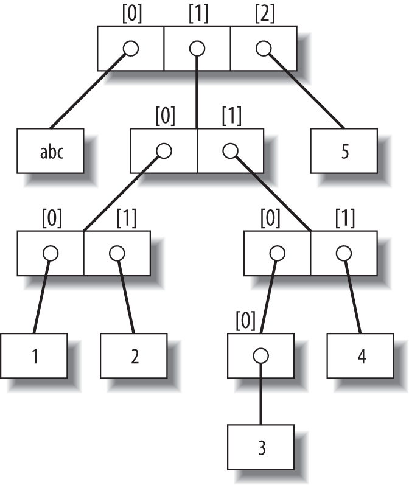
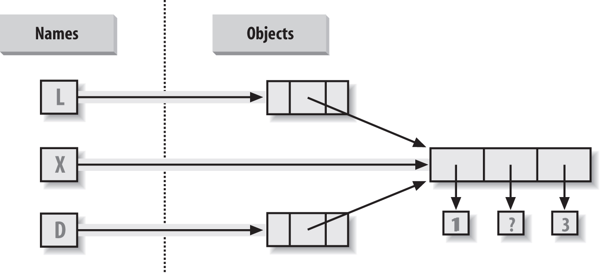
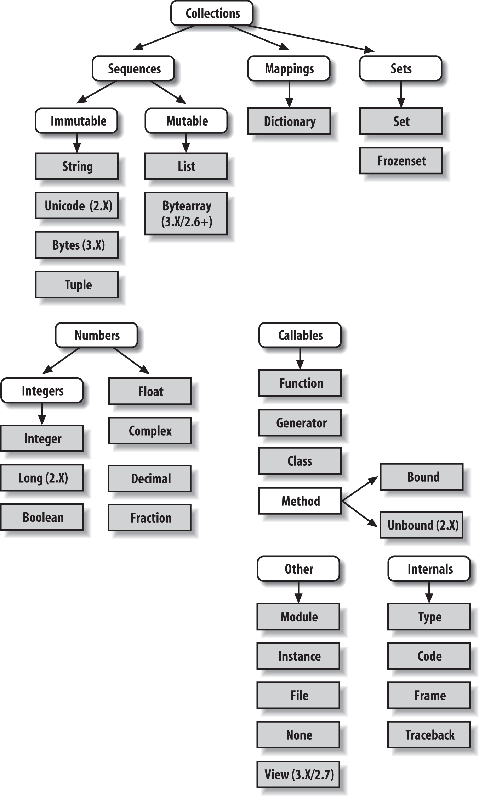
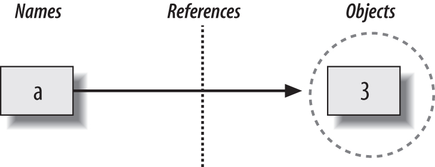
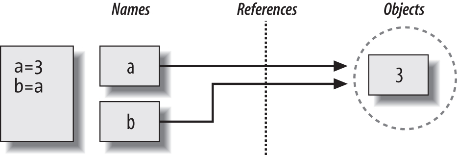
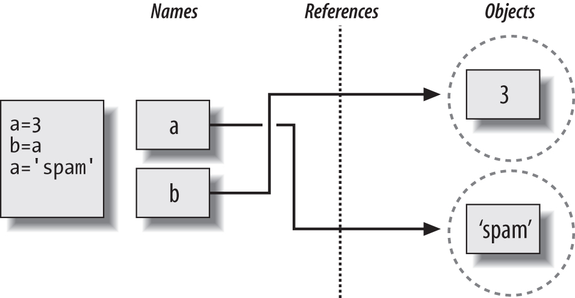

# Python Study Notes


# 2. Basic


## Python	programs	

Program (or script) is a sequence of **definitions** and **commands**

> **Definitions** evaluated and **commands** executed by Python interpreter in a shell.
>
> Can be typed directly into a shell, or stored in a file that is read into the shell and evaluated.

**Command** (or **statement**) instructs interpreter to do something


## The Python Conceptual Hierarchy

Python programs can be decomposed into modules, statements, expressions, and objects, as follows:

1. **Programs are composed of modules.**

2. **Modules contain statements.**

3. **Statements contain expressions.**

4. **Expressions create and process objects.**


## 对象 / Object

in Python, data takes the form of objects.

> either built-in objects that Python provides, or objects we create using Python classes or external language tools such as C extension libraries.

objects are essentially just pieces of memory, with values and sets of associated operations.

**everything is an object in a Python script**

> Python 将程序中的任何内容统称为对象.

Python is strongly object-oriented (强面向对象) in the sense that everything is an object including numbers, strings and functions.

Each object has a type that defines the kinds of things programs can do to it.

Objects are:

– Scalar (i.e. cannot be subdivided), or

> int – used to represent integers, e.g., 5 or 10082!
>
> •  float – used to represent real numbers, e.g., 3.14 or 27.0!
>
> •  bool – used to represent Boolean values True and False!
>
> •  The built in Python func9on type returns the type of an object
>
> ```
> >>> type(3)
> <type ‘int’>
> >>> type(3.0)
> <type ‘float’>
> ```

– Non-­‐scalar (i.e. have internal structure that can be accessed)


## Built-in objects

built-in objects form the core of every Python program.

1. Built-in objects make programs easy to write. 

> For simple tasks, built-in types are often all you need to represent the structure of problem domains. Because you get powerful tools such as collections (lists) and search tables (dictionaries) for free, you can use them immediately. You can get a lot of work done with Python’s built-in object types alone.

2. Built-in objects are components of extensions. 

> For more complex tasks, you may need to provide your own objects using Python classes or C language interfaces. But as you’ll see in later parts of this book, objects implemented manually are often built on top of built-in types such as lists and dictionaries. For instance, a stack data structure may be implemented as a class that manages or customizes a built-in list.

3. Built-in objects are often more efficient than custom data structures.

> Python’s built-in types employ already optimized data structure algorithms that are implemented in C for speed. Although you can write similar object types on your own, you’ll usually be hard-pressed to get the level of performance built-in object types provide.

4. Built-in objects are a standard part of the language. 

> In some ways, Python borrows both from languages that rely on built-in tools (e.g., LISP) and languages that rely on the programmer to provide tool implementations or frameworks of their own (e.g., C++). Although you can implement unique object types in Python, you don’t need to do so just to get started. Moreover, because Python’s built-ins are standard, they’re always the same; proprietary frameworks, on the other hand, tend to differ from site to site.


## Python’s Core Data Types

everything in a Python system is an object type and may be processed by your Python programs

> For instance, you can pass a class to a function, assign it to a variable, stuff it in a list or dictionary, and so on.

Python’s built-in object types and some of the syntax used to code their literals:

```
Built-in objects preview (core data types)

Object type					   Example literals/creation
----------------------------   ------------------------------------------------
Numbers 					   1234, 3.1415, 3+4j, 0b111, Decimal(), Fraction() 
Strings 					   'spam', "Bob's", b'a\x01c', u'sp\xc4m' 
Lists 						   [1, [2, 'three'], 4.5], list(range(10)) 
Dictionaries 				   {'food': 'spam', 'taste': 'yum'}, dict(hours=10) 
Tuples 						   (1, 'spam', 4, 'U'), tuple('spam'), namedtuple 
Files 						   open('eggs.txt'), open(r'C:\ham.bin', 'wb') 
Sets 						   set('abc'), {'a', 'b', 'c'} 
Other core types 			   Booleans, types, None
Program unit types 			   Functions, modules, classes 
Implementation-related types   Compiled code, stack tracebacks 

```

isn’t really complete, because everything we process in Python programs is a kind of object.

**there are no type declarations in Python, the syntax of the expressions you run determines the types of objects you create and use.**

once you create an object, you bind its operation set for all time,

> you can perform only string operations on a string and list operations on a list.

this means that **Python is dynamically typed**.

> a model that keeps track of types for you automatically instead of requiring declaration code

**Python is  strongly typed**

> a constraint that means you can perform on an object only operations that are valid for its type.


### Sequence

in Python we call a **sequence—a positionally ordered collection of other objects**. Sequences maintain a **left-to-right order among the items they contain**: their items are stored and fetched by their relative positions. Strictly speaking, strings are sequences of one-character strings; other, more general sequence types include lists and tuples


### Immutable and Mutable

- **Numbers, Strings, and Tuples are Immutable**. immutable objects’ values can't be changed in place

  > immutability can be used to **guarantee that an object remains constant throughout your program**


- **Lists, Dictionaries, and Sets are Mutable.** they can be changed in place freely, as can most new objects you’ll code with classes.

  > mutable objects’ values can be changed at any time and place (and whether you expect it or not).

  ​


### Object classifications

| Object type   | Category  | Mutable? 是否可变 |
| ------------- | --------- | ------------- |
| Numbers (all) | Numeric   | No            |
| Strings (all) | Sequence  | No            |
| Lists         | Sequence  | Yes           |
| Dictionaries  | Mapping   | Yes           |
| Tuples        | Sequence  | No            |
| Files         | Extension | N/A           |
| Sets          | Set       | Yes           |
| Frozenset     | Set       | No            |
| bytearray     | Sequence  | Yes           |

- **Objects share operations according to their category**; for instance, sequence objects —strings, lists, and tuples—all share sequence operations such as concatenation, length, and indexing.


- **Only mutable objects—lists, dictionaries, and sets—may be changed in place**; you cannot change numbers, strings, or tuples in place.


- **Files export only methods, so mutability doesn’t really apply to them**—their state may be changed when they are processed, but this isn’t quite the same as Python core type mutability constraints.


- “Numbers” in table above includes all number types: integer (and the distinct long integer in 2.X), floating point, complex, decimal, and fraction.


- “Strings” in table above includes str, as well as bytes in 3.X and unicode in 2.X; the bytearray string type in 3.X, 2.6, and 2.7 is mutable.


- **Sets** are something like the keys of a valueless dictionary, but they don’t map to values and **are not ordered**, so sets are neither a mapping nor a sequence type; frozenset is an immutable variant of set.


- In addition to type category operations, as of Python 2.6 and 3.0 all the types in table above have callable methods, which are generally specific to their type.


### Object Flexibility

compound object types—collections with components. In general:

- **Lists, dictionaries, and tuples can hold any kind of object.**


- **Sets can contain any type of immutable object.**


- **Lists, dictionaries, and tuples can be arbitrarily nested.**


- **Lists, dictionaries, and sets can dynamically grow and shrink.**

an example of nesting:

```
>>> L = ['abc', [(1, 2), ([3], 4)], 5]
>>> L[1] 
[(1, 2), ([3], 4)]
>>> L[1][1] 
([3], 4)
>>> L[1][1][0]
[3]
>>> L[1][1][0][0] 
3
```



> A nested object tree with the offsets of its components, created by running the literal expression [‘abc’, [(1, 2), ([3], 4)], 5]. **Syntactically nested objects are internally represented as references (i.e., pointers) to separate pieces of memory.**


### References Versus Copies / 引用 vs 拷贝

**assignments always store references to objects, not copies of those objects.** Because assignments can generate multiple references to the same object

**changing a mutable object in place may affect other references to the same object elsewhere in your program**. If you don’t want such behavior, you’ll need to tell Python to copy the object explicitly.

```
>>> X = [1, 2, 3]
>>> L = ['a', X, 'b']			# Embed references to X's object
>>> D = {'x':X, 'y':2}
```

Because lists are mutable, changing the shared list object from any of the three references also changes what the other two reference:

```
>>> X[1] = 'surprise'			# Changes all three references!
>>> L 
['a', [1, 'surprise', 3], 'b']
>>> D 
{'x': [1, 'surprise', 3], 'y': 2}
```



> Shared object references: because the list referenced by variable X is also referenced from within the objects referenced by L and D, changing the shared list from X makes it look different from L and D, too.


#### Copies:

- Slice expressions with empty limits ( `L[:]` ) copy sequences.


- The dictionary, set, and list copy method ( `X.copy()` ) copies a dictionary, set, or list (the list’s copy is new as of 3.3).


- Some built-in functions, such as list and dict make copies ( `list(L)` , `dict(D)` , `set(S)` ).


- The copy standard library module makes full copies when needed.

example:

```
>>> L = [1,2,3]
>>> D = {'a':1, 'b':2}
>>> A = L[:]						# Instead of A = L (or list(L))
>>> B = D.copy()					# Instead of B = D (ditto for sets)
>>> A[1] = 'Ni'
>>> B['c'] = 'spam'
>>>
>>> L, D 
([1, 2, 3], {'a': 1, 'b': 2})
>>> A, B 
([1, 'Ni', 3], {'a': 1, 'c': 'spam', 'b': 2})
```

```
>>> X = [1, 2, 3]
>>> L = ['a', X[:], 'b']		# Embed copies of X's object
>>> D = {'x':X[:], 'y':2}
```

note:

**empty-limit slices and the dictionary copy method only make top-level copies**; that is, they do not copy nested data structures, if any are present. If you need a complete, fully independent copy of a deeply nested data structure (like the various record structures we’ve coded in recent chapters), use the standard copy module.

```
import copy 
X = copy.deepcopy(Y)		# Fully copy an arbitrarily nested object Y
```

This call recursively traverses objects to copy all their parts.


### Comparisons, Equality, and Truth / 比较，相等性和真值

All Python objects also respond to comparisons: tests for equality, relative magnitude, and so on.Python automatically traverses data structures to apply comparisons from left to right, and as deeply as needed.

This is sometimes called a recursive comparison—the same comparison requested on the top-level objects is applied to each of the nested objects, and to each of their nested objects, and so on, until a result is found.

the recursion is automatic. For instance, a comparison of list objects compares all their components automatically until a mismatch is found or the end is reached:

```
>>> L1 = [1, ('a', 3)]			# Same value, unique objects
>>> L2 = [1, ('a', 3)]
>>> L1 == L2, L1 is L2 			# Equivalent? Same object?
(True, False)
```

two ways to test for equality:

- The `==` operator tests value equivalence.

  >  Python performs an equivalence test, comparing all nested objects recursively.


- The `is` operator tests object identity. 

  > Python tests whether the two are really the same object (i.e., live at the same address in memory).

#### Python compares types as follows:

- Numbers are compared by relative magnitude, after conversion to the common highest type if needed.


- Strings are compared lexicographically (by the character set code point values returned by ord), and character by character until the end or first mismatch ("abc" < "ac").


- Lists and tuples are compared by comparing each component from left to right, and recursively for nested structures, until the end or first mismatch ([2] > [1, 2]).


- Sets are equal if both contain the same items (formally, if each is a subset of the other), and set relative magnitude comparisons apply subset and superset tests.


- Dictionaries compare as equal if their sorted (key, value) lists are equal. Relative magnitude comparisons are not supported for dictionaries in Python 3.X, but they work in 2.X as though comparing sorted (key, value) lists.


- Nonnumeric mixed-type magnitude comparisons (e.g., 1 < 'spam') are errors in Python 3.X. They are allowed in Python 2.X, but use a fixed but arbitrary ordering rule based on type name string. By proxy, this also applies to sorts, which use comparisons internally: nonnumeric mixed-type collections cannot be sorted in 3.X.


#### Python 2.X and 3.X mixed-type comparisons and sorts

In Python 2.X these all work, though mixed types compare by an arbitrary ordering:

```
c:\code> c:\python27\python
>>> 11 == '11' 					# Equality does not convert non-numbers
False
>>> 11 >= '11' 					# 2.X compares by type name string: int, str
False
>>> ['11', '22'].sort()			# Ditto for sorts
>>> [11, '11'].sort()
```

Python 3.X disallows mixed-type magnitude testing, except numeric types and manually converted types:

```
c:\code> c:\python33\python
>>> 11 == '11' False						# 3.X: equality works but magnitude does not
>>> 11 >= '11' 
TypeError: unorderable types: int() > str()

>>> ['11', '22'].sort() 					# Ditto for sorts
>>> [11, '11'].sort() 
TypeError: unorderable types: str() < int()

>>> 11 > 9.123 								# Mixed numbers convert to highest type
True
>>> str(11) >= '11', 11 >= int('11') 		# Manual conversions force the issue
(True, True)
```

#### Python 2.X and 3.X dictionary comparisons

In Python 2.X, dictionaries support magnitude comparisons, as though you were comparing sorted key/value lists:

```
C:\code> c:\python27\python
>>> D1 = {'a':1, 'b':2}
>>> D2 = {'a':1, 'b':3}
>>> D1 == D2 					# Dictionary equality: 2.X + 3.X
False
>>> D1 < D2 					# Dictionary magnitude: 2.X only
True
```

magnitude comparisons for dictionaries are removed in Python 3.X because they incur too much overhead when equality is desired (equality uses an optimized scheme in 3.X that doesn’t literally compare sorted key/ value lists):

```
C:\code> c:\python33\python
>>> D1 = {'a':1, 'b':2}
>>> D2 = {'a':1, 'b':3}
>>> D1 == D2 
False
>>> D1 < D2 
TypeError: unorderable types: dict() < dict()
```

The alternative **in 3.X is to either write loops to compare values by key,** **or compare the sorted key/value lists manually**

```
>>> list(D1.items()) 
[('b', 2), ('a', 1)]
>>> sorted(D1.items()) 
[('a', 1), ('b', 2)]
>>>
>>> sorted(D1.items()) < sorted(D2.items()) 		# Magnitude test in 3.X
True
>>> sorted(D1.items()) > sorted(D2.items()) 
False
```


### The Meaning of True and False in Python

In Python, as in most programming languages, **an integer 0 represents false**, and **an integer 1 represents true**. 

Python recognizes **any empty data structure as false** and a**ny nonempty data structure as true**.

each object is either true or false, as follows:

- **Numbers are false if zero, and true otherwise**.


- **Other objects are false if empty, and true otherwise**.

examples of true and false values of objects in Python.

```
Example object truth values

Object		Value

"spam" 		True
"" 			False
[1, 2] 		True
[] 			False
{'a': 1} 	True
{} 			False
1 			True
0.0 		False
None		False
```


#### The None object

Python also provides a special object called **None, which is always considered to be false**.it is the only value of a special data type in Python and typically serves as **an empty placeholder** (much like a NULL pointer in C). **it is a real object and a real piece of memory that is created and given a built-in name by Python itself.**

- best practice dictates using None if the type of the list’s contents is variable or not yet known.


- Keep in mind that None does not mean “undefined.” That is, None is something, not nothing. 


- it is also the default return value of functions that don’t exit by running into a return statement with a result value.


#### The bool type

the built-in words True and False are just customized versions of the integers 1 and 0

- When used explicitly in truth test code, the words True and False are equivalent to 1 and 0, but they make the programmer’s intent clearer.


- Results of Boolean tests run interactively print as the words True and False, instead of as 1 and 0, to make the type of result clearer.

a bool built-in function that can be used to test the Boolean value of an object if you want to make this explicit (i.e., whether it is true—that is, nonzero or nonempty):

```
>>> bool(1) 
True
>>> bool('spam') 
True
>>> bool({}) 
False
```


### Type Objects

even types themselves are an object type in Python：the type of an object is an object of type `type`

> Seriously, a call to the built-in function type(X) returns the type object of object X.

One note on type names: as of Python 2.2, each core type has a new built-in name added to support type customization through object-oriented subclassing: dict, list, str, tuple, int, float, complex, bytes, type, set, and more. In Python 3.X names all references classes, and in Python 2.X but not 3.X, file is also a type name and a synonym for open. Calls to these names are really object constructor calls, not simply conversion functions, though you can treat them as simple functions for basic usage.

the types standard library module in Python 3.X provides additional type names for types that are not available as built-ins

do type tests with the `isinstance` function

```
>>> type([1]) == type([])				# Compare to type of another list
True
>>> type([1]) == list					# Compare to list type name
True
>>> isinstance([1], list)				# Test if list or customization thereof
True
>>> 

>>> import types						# types has names for other types
>>> def f():pass
... 
>>> type(f) == types.FunctionType
True
```

#### Python’s major built-in object types:



> Python’s major built-in object types, organized by categories. Everything is a type of object in Python, even the type of an object! Some extension types, such as named tuples, might belong in this figure too, but the criteria for inclusion in the core types set are not formal.


### Other Types in Python

a typical Python installation has dozens of additional object types available as linked-in C extensions or Python classes—regular expression objects, DBM files, GUI widgets, network sockets, and so on.


## Built-in Type Gotchas / 内置类型陷阱

### Assignment Creates References, Not Copies

### Repetition Adds One Level Deep

```
>>> L = [4, 5, 6]
>>> X = L * 4								# Like [4, 5, 6] + [4, 5, 6] + ... 
>>> Y = [L] * 4								# [L] + [L] + ... = [L, L,...]

>>> X 
[4, 5, 6, 4, 5, 6, 4, 5, 6, 4, 5, 6]
>>> Y 
[[4, 5, 6], [4, 5, 6], [4, 5, 6], [4, 5, 6]]

>>> L[1] = 0 								# Impacts Y but not X
>>> X 
[4, 5, 6, 4, 5, 6, 4, 5, 6, 4, 5, 6]
>>> Y 
[[4, 0, 6], [4, 0, 6], [4, 0, 6], [4, 0, 6]]

>>> L = [4, 5, 6]
>>> Y = [list(L)] * 4						# Embed a (shared) copy of L
>> L[1] = 0
>>> Y 
[[4, 5, 6], [4, 5, 6], [4, 5, 6], [4, 5, 6]]

>>> Y[0][1] = 99 							# All four copies are still the same
>>> Y 
[[4, 99, 6], [4, 99, 6], [4, 99, 6], [4, 99, 6]]

>>> L = [4, 5, 6]
>>> Y = [list(L) for i in range(4)]
>>> Y 
[[4, 5, 6], [4, 5, 6], [4, 5, 6], [4, 5, 6]]
>>> Y[0][1] = 99
>>> Y 
[[4, 99, 6], [4, 5, 6], [4, 5, 6], [4, 5, 6]]
```

### Beware of Cyclic Data Structures

**if a collection object contains a reference to itself, it’s called a cyclic object.** Python prints a [...] whenever it detects a cycle in the object, rather than getting stuck in an infinite loop (as it once did long ago)：

```
>>> L = ['grail']				# Append reference to same object
>>> L.append(L)					# Generates cycle in object: [...]
>>> L 
['grail', [...]]
```

### Immutable Types Can’t Be Changed in Place

**you can’t change an immutable object in place**. In-stead, you construct a new object with slicing, concatenation, and so on, and assign it back to the original reference, if needed:

```
>>> T = (1, 2, 3)
>>> T[2] = 4							# Error!
Traceback (most recent call last):
  File "<stdin>", line 1, in <module>
TypeError: 'tuple' object does not support item assignment

>>> T = T[:2] + (4,)					# OK: (1, 2, 4)
>>> T
(1, 2, 4)
```


## 注释

_注释_  是任何存在于 `#` 号右侧的文字，其主要用作写给程序读者看的笔记。

举个例子：

```python
print('hello world') #注意到 print 是一个函数
```

或者：

```python
# 注意到 print 是一个函数
print('hello world')
```

python 中多行注释使用三个单引号(''')或三个双引号(""")。

```
#!/usr/bin/python
# -*- coding: UTF-8 -*-
# 文件名：test.py


'''
这是多行注释，使用单引号。
这是多行注释，使用单引号。
这是多行注释，使用单引号。
'''

"""
这是多行注释，使用双引号。
这是多行注释，使用双引号。
这是多行注释，使用双引号。
"""
```


你应该在你的程序中尽可能多地使用有用的注释：

- 解释假设
- 说明重要的决定
- 解释重要的细节
- 说明你想要解决的问题
- 说明你想要在程序中克服的问题，等等。

[*代码会告诉你怎么做，注释会告诉你为何如此。*](http://www.codinghorror.com/blog/2006/12/code-tells-you-how-comments-tell-you-why.html)


## 保留字符

下面的列表显示了在Python中的保留字。这些保留字不能用作常数或变数，或任何其他标识符名称。

所有Python的关键字只包含小写字母。

| and      | exec    | not    |
| -------- | ------- | ------ |
| assert   | finally | or     |
| break    | for     | pass   |
| class    | from    | print  |
| continue | global  | raise  |
| def      | if      | return |
| del      | import  | try    |
| elif     | in      | while  |
| else     | is      | with   |
| except   | lambda  | yield  |


## Print 输出

print 默认输出是换行的，如果要实现不换行需要在变量末尾加上逗号：

```
#!/usr/bin/python
# -*- coding: UTF-8 -*-

x="a"
y="b"
# 换行输出
print x
print y

print '---------'
# 不换行输出
print x,
print y,
```

以上实例执行结果为：

```
a
b
---------
a b
```


## 多个语句构成代码组

缩进相同的一组语句构成一个代码块，我们称之代码组。

像if、while、def和class这样的复合语句，首行以关键字开始，以冒号( : )结束，该行之后的一行或多行代码构成代码组。

我们将首行及后面的代码组称为一个子句(clause)。

如下实例：

```
if expression : 
   suite 
elif expression :  
   suite  
else :  
   suite 
```


## 标识符命名 / Identifier Naming

标识符（Identifiers） 是为 某些东西 提供的给定名称。在你命名标识符时，你需要遵守以下规则：

- 第一个字符必须是字母表中的字母（大写 ASCII 字符或小写 ASCII 字符或 Unicode 字符）或下划线（`_`）。

- 标识符的其它部分可以由字符（大写 ASCII 字符或小写 ASCII 字符或 Unicode 字符）、下划线（`_`）、数字（0~9）组成。

- 标识符名称区分大小写。例如，`myname` 和 `myName` 并不等同。

- 以下划线开头的标识符是有特殊意义的。以单下划线开头 `_foo` 的代表不能直接访问的类属性，需通过类提供的接口进行访问，不能用"`from xxx import *`"而导入。

- 以双下划线开头的 `__foo` 代表类的私有成员；以双下划线开头和结尾的 `__foo__` 代表python里特殊方法专用的标识，如 `__init__（）` 代表类的构造函数。

- > 有效 的标识符名称可以是 `i` 或 `name_2_3` ，_无效_ 的标识符名称可能是 `2things`，`this is spaced out`，`my-name` 和 `>a1b2_c3`。


## 逻辑行与物理行 / Logical And Physical Line

所谓物理行（Physical Line）是你在编写程序时 你所看到 的内容。所谓逻辑行（Logical Line）是 Python 所看到 的单个语句。**Python 会假定每一 物理行 会对应一个 逻辑行**。

有关逻辑行的一个例子是诸如 `print('hello world')` 这样一句语句——如果其本身是一行（正如你在编辑器里所看到的那样），那么它也对应着一行物理行。

Python 之中暗含这样一种期望：Python 鼓励每一行使用一句独立语句从而使得代码更加可读。

**如果你希望在一行物理行中指定多行逻辑行，那么你必须通过使用分号(`;`)来明确表明逻辑行或语句的结束。**

例子：

```python
i = 5
print(i)
```

实际上等同于

```python
i = 5;
print(i);
```

同样可以看作

```python
i = 5; print(i);
```

也与这一写法相同

```python
i = 5; print(i)
```

然而，我*强烈建议*你**对于每一行物理行最多只写入一行逻辑行**。这个观点就是说你不应该使用分号。实际上，我_从未_在 Python 程序中使用、甚至是见过一个分号。

在一类情况下这一方法会颇为有用：如果你有一行非常长的代码，你可以通过使用反斜杠将其拆分成多个物理行。这被称作_显式行连接（Explicit Line Joining）_[^5]：

```python
s = 'This is a string. \
This continues the string.'
print(s)
```

输出：

```
This is a string. This continues the string.
```

类似地，

```python
i = \
5
```

等同于

```python
i = 5
```

在某些情况下，会存在一个隐含的假设，允许你不使用反斜杠。这一情况即逻辑行以括号开始，它可以是方括号或花括号，但不能是结束括号。这被称作 *隐式行连接（Implicit Line Joining）*。

语句中包含[], {} 或 () 括号就不需要使用多行连接符。如下实例：

```
days = ['Monday', 'Tuesday', 'Wednesday',
        'Thursday', 'Friday']
```


## 缩进 / Indentation

在逻辑行的开头留下空白区（使用空格或制表符）用以确定各逻辑行的缩进级别，而后者又可用于确定语句的分组。

这意味着放置在一起的语句必须拥有相同的缩进。每一组这样的语句被称为 块（block）。

**Python最具特色的就是用缩进来写模块。** 

缩进的空白数量是可变的。错误的缩进可能会导致错误。

因此，在Python的代码块中必须使用相同数目的行首缩进空格数。

建议你在每个缩进层次使用 **单个制表符** 或 **两个空格** 或 **四个空格** , 切记不能混用

```
if True:
    print "True"
else:
  print "False"
```

> 使用四个空格来缩进。这是来自 Python 语言官方的建议。好的编辑器会自动为你完成这一工作。请确保你在缩进中使用数量一致的空格，否则你的程序将不会运行，或引发不期望的行为。

> Python 将始终对块使用缩进，并且绝不会使用大括号。你可以通过运行 `from__future__import braces` 来了解更多信息。


## 空行

函数之间或类的方法之间用空行分隔，表示一段新的代码的开始。类和函数入口之间也用一行空行分隔，以突出函数入口的开始。

空行与代码缩进不同，空行并不是Python语法的一部分。书写时不插入空行，Python解释器运行也不会出错。但是空行的作用在于分隔两段不同功能或含义的代码，便于日后代码的维护或重构。

记住：空行也是程序代码的一部分。


## 命令行参数

很多程序可以执行一些操作来查看一些基本信，Python可以使用-h参数查看各参数帮助信息：

```
$ python -h 
usage: python [option] ... [-c cmd | -m mod | file | -] [arg] ... 
Options and arguments (and corresponding environment variables): 
-c cmd : program passed in as string (terminates option list) 
-d     : debug output from parser (also PYTHONDEBUG=x) 
-E     : ignore environment variables (such as PYTHONPATH) 
-h     : print this help message and exit 
 
[ etc. ] 
```


## 字面常量

字面常量 ( literal constant )

An example of a literal constant is a number like `5`, `1.23`, or a string like `'This is a string'` or `"It's a string!"`.

It is called a literal because it is _literal_ - you use its value literally. The number `2` always represents itself and nothing else - it is a _constant_ because its value cannot be changed. Hence, all these are referred to as literal constants.

> 这么称呼这一变量是因为它们是 _字面上的_ [^3]-你用的就是它字面意义上的值或是内容。数字 `2` 总是表示它本身而非其他含义——它是一个 _常量_，因为它的值不能被改变。因此，所有的这些都被称作字面常量。

## 数字

数字主要分为两种类型——整数（Integers）与浮点数（Floats）。

整数的例子即 `2`，它只是一个整数。

浮点数（Floating Point Numbers，在英文中也会简写为 _floats_ ）的例子是 `3.23` 或 `52.3E-4`。其中，`E` 表示 10 的幂。在这里，`52.3E-4` 表示 `52.3 * 10^-4`。

> 没有单独的 `long` 类型。`int` 类型可以指任何大小的整数。


## 变量 / Variable

变量存储在内存中的值。这就意味着在创建变量时会在内存中开辟一个空间。

基于变量的数据类型，解释器会分配指定内存，并决定什么数据可以被存储在内存中。

因此，变量可以指定不同的数据类型，这些变量可以存储整数，小数或字符。


变量的值是可以变化的，也就是说，你可以用变量来存储任何东西。**变量只是你的计算机内存中用以存储信息的一部分**。与文字常量不同，你需要通过一些方式来访问这些变量，因此，你需要为它们命名。


# The Dynamic Typing Interlude 动态类型简介

In Python, types are determined automatically at runtime, not in response to declarations in your code.

## Variables, Objects, and References

**Variable creation**

 A variable (i.e., name), like a, is created when your code first assigns it a value. Future assignments change the value of the already created name. Technically, Python detects some names before your code runs, but you can think of it as though initial assignments make variables.

**Variable types** 

A variable never has any type information or constraints associated with it. The notion of type lives with objects, not names. Variables are generic in nature; they always simply refer to a particular object at a particular point in time.

**Variable use** 

When a variable appears in an expression, it is immediately replaced with the object that it currently refers to, whatever that may be. Further, all variables must be explicitly assigned before they can be used; referencing unassigned variables results in errors.


**变量在赋值时才创建，他可以引用任何类型的对象，并且必须在引用之前赋值。**

variables are created when assigned, can reference any type of object, and must be assigned before they are referenced.

> 这意味着，不需要通过脚本声明索要使用的名字，必须初始化名字然后才能更新它们。例如，必须把计数器初始化为0，然后才能增加它。
>
> This means that you never need to declare names used by your script, but you must initialize names before you can update them; coun-ters, for example, must be initialized to zero before you can add to them.

Names and objects after running the assignment a = 3. Variable a becomes a reference to the object 3. Internally, the variable is really a pointer to the object’s memory space created by running the literal expression 3.




These links from variables to objects are called references in Python—that is, **a reference is a kind of association, implemented as a pointer in memory.**

each time you generate a new value in your script by running an expression, Python creates a new object (i.e., a chunk of memory) to represent that value.

> Python internally caches and reuses certain kinds of unchangeable objects, such as small integers and strings (each 0 is not really a new piece of memory—more on this caching behavior later). But from a logical perspective, it works as though each expression’s result value is a distinct object and each object is a distinct piece of memory.

**Each object also has two standard header fields:** 

- a type designator used to mark the type of the object, 


- and a reference counter used to determine when it’s OK to reclaim the object.

### Types Live with Objects, Not Variables

```
>>> a = 3			# It's an integer
>>> a = 'spam'		# Now it's a string 
>>> a = 1.23		# Now it's a floating point
```


### Objects Are Garbage-Collected

whenever a name is assigned to a new object, the space held by the prior object is reclaimed if it is not referenced by any other name or object. This automatic reclamation of objects’ space is known as garbage collection

```
>>> x = 42
>>> x = 'shrubbery'		# Reclaim 42 now (unless referenced elsewhere)

>>> x = 3.1415		    # Reclaim 'shrubbery' now
>>> x = [1, 2, 3]		# Reclaim 3.1415 now
```

when it is assigned the string 'shrubbery', the object 42 is immediately reclaimed (assuming it is not referenced anywhere else) — **the object’s space is automatically thrown back into the free space pool, to be reused for a future object.**

> Internally, Python accomplishes this feat by keeping a counter in every object that keeps track of the number of references currently pointing to that object. As soon as (and exactly when) this counter drops to zero, the object’s memory space is automatically reclaimed.

**garbage collection**

The most immediately tangible benefit of garbage collection is that it means you can use objects liberally without ever needing to allocate or free up space in your script. Python will clean up unused space for you as your program runs.

> Technically speaking, Python’s garbage collection is based mainly upon reference coun-ters, as described here; however, it also has a component that detects and reclaims objects with cyclic references in time. This component can be disabled if you’re sure that your code doesn’t create cycles, but it is enabled by default.


## Shared References

with multiple names referencing the same object—is usually called a shared reference (and sometimes just a shared object).

```
>>> a = 3
>>> b = a
```



the names a and b are not linked to each other directly when this happens.both variables point to the same object via their references.

```
>>> a = 3
>>> b = a
>>> a = 'spam'
```




### Shared References and In-Place Changes

there are objects and operations that perform in-place object changes—Python’s mutable types, including lists, dictionaries, sets and some objects defined with class statements.. For instance, an assignment to an offset in a list actually changes the list object itself in place, rather than generating a brand-new list object.

reference:

```
mutable objects that support in-place changes，reference：

>>> L1 = [2, 3, 4]		# A mutable object
>>> L2 = L1				# Make a reference to the same object
>>> L1[0] = 24			# An in-place change

>>> L1 					# L1 is different
[24, 3, 4]
>>> L2 					# But so is L2!
[24, 3, 4]
```

#### list copy:

```
the two variables point to different pieces of memory. copy：

>>> L1 = [2, 3, 4]
>>> L2 = L1[:]			# Make a copy of L1 (or list(L1), copy.copy(L1), etc.)
>>> L1[0] = 24

>>> L1 
[24, 3, 4]
>>> L2 					# L2 is not changed
[2, 3, 4]

Note that this slicing technique won’t work on the other major mutable core types, dictionaries and sets, because they are not sequences
```

#### copy a dictionary or set:

1. X.copy() 		(lists have one as of Python 3.3 as well)

2. pass the original object to their type names, dict and set.

3. copy module has a call for copying any object type generically, copying nested object structures—a dictionary with nested lists, for example:

   ```
   import copy 
   X = copy.copy(Y) 		# Make top-level "shallow" copy of any object Y 
   X = copy.deepcopy(Y)	# Make deep copy of any object Y: copy all nested parts
   ```

### Shared References and Equality

Python caches and reuses small integers and small strings.

```
>>> L = [1, 2, 3]
>>> M = L			# M and L reference the same object
>>> L == M 			# Same values 
True
>>> L is M 			# Same objects
True
```

```
>>> L = [1, 2, 3]
>>> M = [1, 2, 3]	# M and L reference different objects 
>>> L == M 			# Same values 
True
>>> L is M 			# Different objects
False
```

> the == operator, tests whether the two referenced objects have the same values;
>
> the is operator, instead tests for object identity—it returns True only if both names point to the exact same object, (it is a much stronger form of equality testing and is rarely applied in most programs.)

small integers and strings are cached and reused:

```
>>> X = 42
>>> Y = 42		# Should be two different objects
>>> id(x)
4297372000
>>> id(y)
4297372000
>>> X == Y 
True
>>> X is Y 		# Same object anyhow: caching at work!
True

X and Y should be == (same value), but not is (same object) because we ran two different literal expressions (42). Because small integers and strings are cached and reused, though, is tells us they reference the same single object.

>>> x = 123456
>>> y = 123456
>>> id(x)
4298641296
>>> id(y)
4323389840
>>> x == y
True
>>> x is y
False
```

ask Python how many references there are to an object: 

```
>>> import sys
>>> sys.getrefcount(1)		# 647 pointers to this shared piece of memory
647

the getrefcount function in the standard sys module returns the object’s reference count.
```

> Because you cannot change immutable numbers or strings in place, it doesn’t matter how many references there are to the same object—every reference will always see the same, unchanging value. Still, this behavior reflects one of the many ways Python optimizes its model for execution speed.


