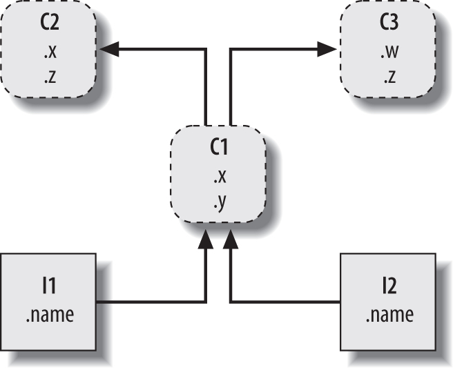
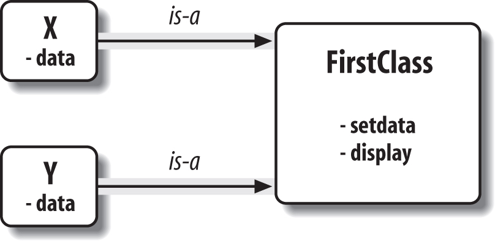
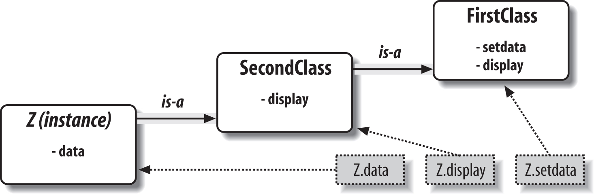
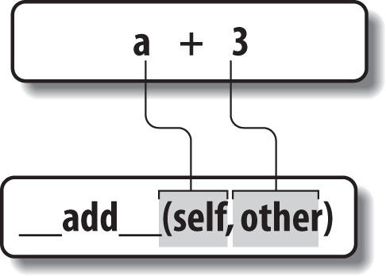

# Class

classes are Python program units, just like functions and modules: they are another compartment for packaging logic and data. In fact, classes also define new namespaces, much like modules. But, compared to other program units we’ve already seen, classes have three critical distinctions that make them more useful when it comes to building new objects:

- **Multiple instances**

  Classes are essentially factories for generating one or more objects. Every time we call a class, we generate a new object with a distinct namespace. Each object generated from a class has access to the class’s attributes and gets a namespace of its own for data that varies per object. This is similar to the per-call state retention of  closure functions, but is explicit and natural in classes, and is just one of the things that classes do. Classes offer a complete programming solution.

- **Customization via inheritance**

   Classes also support the OOP notion of inheritance; we can extend a class by re-defining its attributes outside the class itself in new software components coded as subclasses. More generally, classes can build up namespace hierarchies, which define names to be used by objects created from classes in the hierarchy. This supports multiple customizable behaviors more directly than other tools.

- **Operator overloading** 

  By providing special protocol methods, classes can define objects that respond to the sorts of operations we saw at work on built-in types. For instance, objects made with classes can be sliced, concatenated, indexed, and so on. Python provides hooks that classes can use to intercept and implement any built-in type operation.

## OOP

### Attribute Inheritance Search

much of the OOP story in Python boils down to this expression:

```
object.attribute
```

> Find the first occurrence of `attribute` by looking in `object`, then in all classes above it, from bottom to top and left to right.



> A class tree, with two instances at the bottom (I1 and I2), a class above them (C1), and two superclasses at the top (C2 and C3). All of these objects are namespaces (packages of variables), and the inheritance search is simply a search of the tree from bottom to top looking for the lowest occurrence of an attribute name. Code implies the shape of such trees.

- **Classes** 

  Serve as instance factories. Their attributes provide behavior—data and functions —that is inherited by all the instances generated from them (e.g., a function to compute an employee’s salary from pay and hours).


- **Instances** 

  Represent the concrete items in a program’s domain. Their attributes record data that varies per specific object (e.g., an employee’s Social Security number).

In terms of search trees, an instance inherits attributes from its class, and a class inherits attributes from all classes above it in the tree.

```
I1.x and I2.x both find x in C1 and stop because C1 is lower than C2.

I1.y and I2.y both find y in C1 because that’s the only place y appears.

I1.z and I2.z both find z in C2 because C2 is further to the left than C3.

I2.name finds name in I2 without climbing the tree at all.
```

because C1 redefines the attribute x lower in the tree, it effectively replaces the version above it in C2. such redefinitions are at the heart of software customization in OOP—by redefining and replacing the attribute, C1 effectively customizes what it inherits from its superclasses.


### Classes and Instances

the classes and instances we put in these trees are almost identical—each type’s main purpose is to serve as another kind of namespace—a package of variables, and a place where we can attach attributes. the objects in class trees also have automatically searched links to other namespace objects, and classes correspond to statements, not entire files.

**difference**

1. The primary difference between classes and instances is that classes are a kind of factory for generating instances. 


2. we only ever have one instance of a given module in memory (that’s why we have to reload a module to get its new code), 
3. but with classes, we can make as many instances as we need.


### Method Calls

In fact, whenever we call a function attached to a class in this fashion, an instance of the class is always implied. This implied subject or context is part of the reason we refer to this as an object-oriented model—there is always a subject object when an operation is run.


### Coding Class Trees

- Each `class` statement generates a new class object.


- Each time a class is called, it generates a new instance object.


- Instances are automatically linked to the classes from which they are created.


- Classes are automatically linked to their superclasses according to the way we list them in parentheses in a `class` header line; the left-to-right order there gives the order in the tree.

classes are normally coded in module files and are run during an import (I’ve omitted the guts of the `class` statements here for brevity):

```
class C2: ...				# Make class objects (ovals)
class C3: ...
class C1(C2, C3): ...		# Linked to superclasses (in this order)

I1 = C1() 					# Make instance objects (rectangles)
I2 = C1()					# Linked to their classes
```

Technically, this **example** is using something called **multiple inheritance**, which simply means that a class has more than one superclass above it in the class tree—a useful technique when you wish to combine multiple tools. In Python, if there is more than one superclass listed in parentheses in a `class` statement (like C1’s here), their left-to-right order gives the order in which those superclasses will be searched for attributes by inheritance.

- Attributes are usually attached to classes by assignments made at the top level in `class` statement blocks, and not nested inside function `def` statements there.


- Attributes are usually attached to instances by assignments to the special argument passed to functions coded inside classes, called `self`.

For **example**, classes provide behavior for their instances with method functions we create by coding `def` statements inside `class` statements. Because such nested `def`s assign names within the class, they wind up attaching attributes to the class object that will be inherited by all instances and subclasses:

```
class C2: ... 				# Make superclass objects
class C3: ...

class C1(C2, C3):			# Make and link class C1 
	def setname(self, who): # Assign name: C1.setname 
		self.name = who		# Self is either I1 or I2

I1 = C1() 					# Make two instances
I2 = C1() 
I1.setname('bob') 			# Sets I1.name to 'bob'
I2.setname('sue') 			# Sets I2.name to 'sue'
print(I1.name)				# Prints 'bob'
```

> our C1 class doesn’t attach a `name` attribute to an instance until the `setname` method is called.


### Operator Overloading

If a class wants to guarantee that an attribute like `name` is always set in its instances, it more typically will fill out the attribute at construction time, like this:

```
class C2: ... 				 # Make superclass objects
class C3: ...

class C1(C2, C3):
	def __init__(self, who): # Set name when constructed 
		self.name = who		 # Self is either I1 or I2

I1 = C1('bob') 				 # Sets I1.name to 'bob'
I2 = C1('sue') 				 # Sets I2.name to 'sue'
print(I1.name)				 # Prints 'bob'
```


### OOP Is About Code Reuse

OOP is about looking up attributes in trees with a special first argument in functions.

At a fundamental level, classes are really just packages of functions and other names, much like modules. However, the automatic attribute inheritance search that we get with classes supports customization of software above and beyond what we can do with modules and functions. Moreover, classes provide a natural structure for code that packages and localizes logic and names, and so aids in debugging.

#### Polymorphism and classes

```
class Employee:						# General superclass 
	def computeSalary(self): ... 	# Common or default behaviors
	def giveRaise(self): ... 
	def promote(self): ...
	def retire(self): ...

class Engineer(Employee):			# Specialized subclass
	def computeSalary(self): ...	# Something custom here
	
bob = Employee() 					# Default behavior
sue = Employee() 					# Default behavior
tom = Engineer()					# Custom salary calculator

company = [bob, sue, tom] 			# A composite object
	for emp in company:
		print(emp.computeSalary())	# Run this object's version: default or custom
```

In other applications, polymorphism might also be used to hide (i.e., encapsulate) interface differences. For example, a program that processes data streams might be coded to expect objects with input and output methods, without caring what those methods actually do:

```
def processor(reader, converter, writer):
	while True:
		data = reader.read()
		if not data: break 
		data = converter(data) 
		writer.write(data)
		
class Reader:
	def read(self): ... 			# Default behavior and tools
	def other(self): ... 
class FileReader(Reader):
	def read(self): ... 			# Read from a local file 
class SocketReader(Reader):
	def read(self): ... 			# Read from a network socket 
...
processor(FileReader(...), Converter, FileWriter(...)) 
processor(SocketReader(...), Converter, TapeWriter(...)) 
processor(FtpReader(...), Converter, XmlWriter(...))
```


# Class Coding Basics

In fact, classes have just three primary distinctions. At a base level, they are mostly just namespaces, much like the modules, Unlike modules, though, classes also have support for generating multiple objects, for namespace inheritance, and for operator overloading.


## Classes Generate Multiple Instance Objects

two kinds of objects in Python’s OOP model: **class objects** and **instance objects**. Class objects provide default behavior and serve as factories for instance objects. Instance objects are the real objects your programs process—each is a namespace in its own right, but inherits (i.e., has automatic access to) names in the class from which it was created. Class objects come from statements, and instances come from calls; each time you call a class, you get a new instance of that class.

In effect, classes are essentially factories for generating multiple instances. By contrast, only one copy of each module is ever imported into a single program. In fact, this is why `reload` works as it does, updating a single-instance shared object in place. With classes, each instance can have its own, independent data, supporting multiple versions of the object that the class models.

### Class Objects Provide Default Behavior

When we run a `class` statement, we get a class object. Here’s a rundown of the main properties of Python classes:

- **The class statement creates a class object and assigns it a name**. Just like the function `def` statement, the Python `class` statement is an executable statement. When reached and run, it generates a new class object and assigns it to the name in the `class` header. Also, like `def`s, `class` statements typically run when the files they are coded in are first imported.


- **Assignments inside class statements make class attributes**. Just like in module files, top-level assignments within a `class` statement (not nested in a `def`) generate attributes in a class object. Technically, the `class` statement defines a local scope that morphs into the attribute namespace of the class object, just like a module’s global scope. After running a `class` statement, class attributes are accessed by name qualification: `object.name`.


- **Class attributes provide object state and behavior**. Attributes of a class object record state information and behavior to be shared by all instances created from the class; function `def` statements nested inside a class generate methods, which process instances.

### Instance Objects Are Concrete Items

When we call a class object, we get an instance object. Here’s an overview of the key points behind class instances:

- **Calling a class object like a function makes a new instance object**. Each time a class is called, it creates and returns a new instance object. Instances represent concrete items in your program’s domain.


- **Each instance object inherits class attributes and gets its own namespace**. Instance objects created from classes are new namespaces; they start out empty but inherit attributes that live in the class objects from which they were generated.


- **Assignments to attributes of self in methods make per-instance attributes**. Inside a class’s method functions, the first argument (called `self` by convention) references the instance object being processed; assignments to attributes of `self` create or change data in the instance, not the class.

The end result is that **classes** define common, shared data and behavior, and generate instances. 

**Instances** reflect concrete application entities, and record per-instance data that may vary per object.

### A First Example

```
>>> class FirstClass:					# Define a class object
		def setdata(self, value): 		# Define class's methods
			self.data = value 			# self is the instance
		def display(self): 
			print(self.data)			# self.data: per instance
			
>>> x = FirstClass()					# Make two instances 
>>> y = FirstClass()					# Each is a new namespace
```

> such a statement would be run when the module file it is coded in is imported. this class won’t even exist until Python reaches and runs this statement.

in a method function, the first argument automatically receives an implied instance object when called—the subject of the call.



> Classes and instances are linked namespace objects in a class tree that is searched by inheritance. Here, the “data” attribute is found in instances, but “setdata” and “display” are in the class above them.

Neither x nor y has a `setdata` attribute of its own, so to find it, Python follows the link from instance to class.

```
>>> x.setdata("King Arthur")			# Call methods: self is x 
>>> y.setdata(3.14159)					# Runs: FirstClass.setdata(y, 3.14159)
```

In the `setdata` function inside `FirstClass`, the value passed in is assigned to `self.data`. Within a method, self—the name given to the leftmost argument by con-vention—automatically refers to the instance being processed (x or y), so the assignments store values in the instances’ namespaces, not the class’s; that’s how the `data` names in are created.

```
>>> x.display() 				# self.data differs in each instance
King Arthur
>>> y.display()					# Runs: FirstClass.display(y)
3.14159
```

**change instance attributes in the class itself, by assigning to `self` in methods, or outside the class, by assigning to an explicit instance object:**

```
>>> x.data = "New value"			# Can get/set attributes
>>> x.display()						# Outside the class too
New value
```

we could even **generate an entirely new attribute in the instance’s namespace by assigning to its name outside the class’s method functions:**

```
>>> x.anothername = "spam"			# Can set new attributes here too!
```

Classes usually create all of the instance’s attributes by assignment to the `self` argument, but they don’t have to—programs can fetch, change, or create attributes on any objects to which they have references.


## Classes Are Customized by Inheritance

classes also allow us to make changes by introducing new components (called subclasses), instead of changing existing components in place.

Python also allows classes to inherit from other classes, by redefining attributes in subclasses that appear lower in the hierarchy, we override the more general definitions of those attributes higher in the tree.

> there is no parallel with modules, whose attributes live in a single, flat namespace that is not as amenable to customization.

**In Python, instances inherit from classes, and classes inherit from superclasses**. Here are the key ideas behind the machinery of attribute inheritance:

- **Superclasses are listed in parentheses in a class header**. To make a class inherit attributes from another class, just list the other class in parentheses in the new class statement’s header line. The class that inherits is usually called a subclass, and the class that is inherited from is its superclass.


- **Classes inherit attributes from their superclasses**. Just as instances inherit the attribute names defined in their classes, classes inherit all of the attribute names defined in their superclasses; Python finds them automatically when they’re ac-cessed, if they don’t exist in the subclasses.


- **Instances inherit attributes from all accessible classes**. Each instance gets names from the class it’s generated from, as well as all of that class’s superclasses. When looking for a name, Python checks the instance, then its class, then all su-perclasses.


- **Each object.attribute reference invokes a new, independent search**. Python performs an independent search of the class tree for each attribute fetch expression. This includes references to instances and classes made outside `class` statements (e.g., `X.attr`), as well as references to attributes of the `self` instance argument in a class’s method functions. Each `self.attr` expression in a method invokes a new search for `attr` in `self` and above.


- **Logic changes are made by subclassing, not by changing superclasses**. By redefining superclass names in subclasses lower in the hierarchy (class tree), sub-classes replace and thus customize inherited behavior.

### A Second Example

we’ll define a new class, `SecondClass`, that inherits all of `FirstClass`’s names and provides one of its own:

```
>>> class SecondClass(FirstClass):					# Inherits setdata 
		def display(self):							# Changes display
			print('Current value = "%s"' % self.data)
			
>>> z = SecondClass()
>>> z.setdata(42)				# Finds setdata in FirstClass
>>> z.display() 				# Finds overridden method in SecondClass
Current value = "42"

>>> x.display() 				# x is still a FirstClass instance (old message)
New value
```



> Specialization: overriding inherited names by redefining them in extensions lower in the class tree. Here, SecondClass redefines and so customizes the “display” method for its instances.


### Classes Are Attributes in Modules

a class name. It’s just a variable assigned to an object when the class statement runs, and the object can be referenced with any normal expression.

For instance, if our `FirstClass` were coded in a module file instead of being typed interactively, we could import it and use its name normally in a `class` header line:

```
from modulename import FirstClass 		# Copy name into my scope
class SecondClass(FirstClass):			# Use class name directly
	def display(self): ...
```

equivalently:

```
import modulename 							# Access the whole module 
class SecondClass(modulename.FirstClass):	# Qualify to reference
	def display(self): ...
```

**Example :**

```
# food.py 
var = 1 			# food.var
def func(): ... 	# food.func
class spam: ... 	# food.spam
class ham: ... 		# food.ham
class eggs: ...		# food.eggs
```

the module and class happen to have the same name:

```
# person.py
class person: ...
```

we need to go through the module to fetch the class as usual:

```
import person 			# Import module
x = person.person()		# Class within module
```

the `from` statement is used:

```
from person import person 		# Get class from module
x = person()					# Use class name

import person 					# Lowercase for modules
x = person.Person()				# Uppercase for classes
```

although classes and modules are both namespaces for attaching attributes, they correspond to very different source code structures: **a module reflects an entire file**, but **a class is a statement within a file**.


## Classes Can Intercept Python Operators

the third and final major difference between classes and modules: operator overloading.

In simple terms, **operator overloading** lets objects coded with classes intercept and respond to operations that work on built-in types: addition, slic-ing, printing, qualification, and so on.

Here is a quick rundown of the **main ideas behind overloading operators**:

- **Methods named with double underscores (`__X__`) are special hooks**. In Python classes we implement operator overloading by providing specially named methods to intercept operations. The Python language defines a fixed and unchangeable mapping from each of these operations to a specially named method.


- **Such methods are called automatically when instances appear in built-in operations**. For instance, if an instance object inherits an `__add__` method, that method is called whenever the object appears in a + expression. The method’s return value becomes the result of the corresponding expression.


- **Classes may override most built-in type operations**. There are dozens of special operator overloading method names for intercepting and implementing nearly every operation available for built-in types. This includes expressions, but also basic operations like printing and object creation.


- **There are no defaults for operator overloading methods, and none are required**. If a class does not define or inherit an operator overloading method, it just means that the corresponding operation is not supported for the class’s instances. If there is no `__add__`, for example, + expressions raise exceptions.


- **New-style classes have some defaults, but not for common operations**. In Python 3.X, and so-called “new style” classes in 2.X that we’ll define later, a root class named `object` does provide defaults for some `__X__` methods, but not for many, and not for most commonly used operations.


- **Operators allow classes to integrate with Python’s object model**. By overloading type operations, the user-defined objects we implement with classes can act just like built-ins, and so provide consistency as well as compatibility with expected interfaces.

Operator overloading is an optional feature; it’s used primarily by people developing tools for other Python programmers, not by application developers.

### A Third Example

we’ll define a subclass of the prior section’s `SecondClass` that implements three specially named attributes that Python will call automatically:

1. `__init__` is run when a new instance object is created: `self` is the new `ThirdClass` object.
2. `__add__` is run when a `ThirdClass` instance appears in a + expression.
3. `__str__` is run when an object is printed (technically, when it’s converted to its print string by the `str` built-in function or its Python internals equivalent).

new subclass also defines a normally named method called `mul`, which changes the instance object in place:

```python
>>> class FirstClass:					# Define a class object
		def setdata(self, value): 		# Define class's methods
			self.data = value 			# self is the instance
		def display(self): 
			print(self.data)			# self.data: per instance

>>> class SecondClass(FirstClass):					# Inherits setdata 
		def display(self):							# Changes display
			print('Current value = "%s"' % self.data)

>>> class ThirdClass(SecondClass):					# Inherit from SecondClass
		def __init__(self, value):					# On "ThirdClass(value)"
			self.data = value 
		def __add__(self, other):					# On "self + other"
			return ThirdClass(self.data + other) 
		def __str__(self):							# On "print(self)", "str()"
			return '[ThirdClass: %s]' % self.data
		def mul(self, other):						# In-place change: named
			self.data *= other
            
>>> a = ThirdClass('abc')			# __init__ called
>>> a.display() 					# Inherited method called
Current value = "abc"
>>> print(a) 						# __str__: returns display string
[ThirdClass: abc]

>>> b = a + 'xyz'					# __add__: makes a new instance
>>> b.display() 					# b has all ThirdClass methods
Current value = "abcxyz"
>>> print(b) 						# __str__: returns display string
[ThirdClass: abcxyz]

>>> a.mul(3)						# mul: changes instance in place
>>> print(a) 
[ThirdClass: abcabcabc]
```



> In operator overloading, expression operators and other built-in operations performed on class instances are mapped back to specially named methods in the class. These special methods are optional and may be inherited as usual. Here, a + expression triggers the `__add__` method.

Specially named methods such as `__init__`, `__add__`, and `__str__` are inherited by sub-classes and instances, just like any other names assigned in a class. If they’re not coded in a class, Python looks for such names in all its superclasses, as usual

Operator overloading method names are also not built-in or reserved words; they are just attributes that Python looks for when objects appear in various contexts.

#### Returning results, or not

Some operator overloading methods like `__str__` require results, but others are more flexible.

For example, notice how the `__add__` method makes and returns a new instance object of its class, by calling `ThirdClass` with the result value—which in turn triggers `__init__` to initialize the result.

`mul` changes the current instance object in place, by reassigning the `self` attribute.


### Why Use Operator Overloading?

As a class designer, you can choose to use operator overloading or not. Your choice simply depends on how much you want your object to look and feel like built-in types.

if you omit an operator overloading method and do not inherit it from a superclass, the corresponding operation will not be supported for your in-stances; if it’s attempted, an exception will be raised (or, in some cases like printing, a standard default will be used).

Frankly, many operator overloading methods tend to be used only when you are implementing objects that are mathematical in nature

you might decide to use operator overloading if you need to pass a user-defined object to a function that was coded to expect the operators available on a built-in type like a list or a dictionary. Implementing the same operator set in your class will ensure that your objects support the same expected object interface and so are compatible with the function.

One overloading method we will use often here is the `__init__` constructor method, used to initialize newly created instance objects, and present in almost every realistic class. Because it allows classes to fill out the attributes in their new instances immedi-ately, the constructor is useful for almost every kind of class you might code. In fact, even though instance attributes are not declared in Python, you can usually find out which attributes an instance will have by inspecting its class’s `__init__` method.


#### Predefined Class Attributes

Classes have five predefined attributes:

| Attribute    | Type             | Read/Write | Description                              |
| ------------ | ---------------- | ---------- | ---------------------------------------- |
| `__dict__`   | dictionary       | R/W        | The class name space.                    |
| `__name__`   | string           | R/O        | The name of the class.                   |
| `__bases__`  | tuple of classes | R/O        | The classes from which this class inherits. |
| `__doc__`    | string OR None   | R/W        | The class [documentation string](http://www2.lib.uchicago.edu/keith/courses/python/class/2/#comments). |
| `__module__` | string           | R/W        | The name of the module in which this class was defined. |

