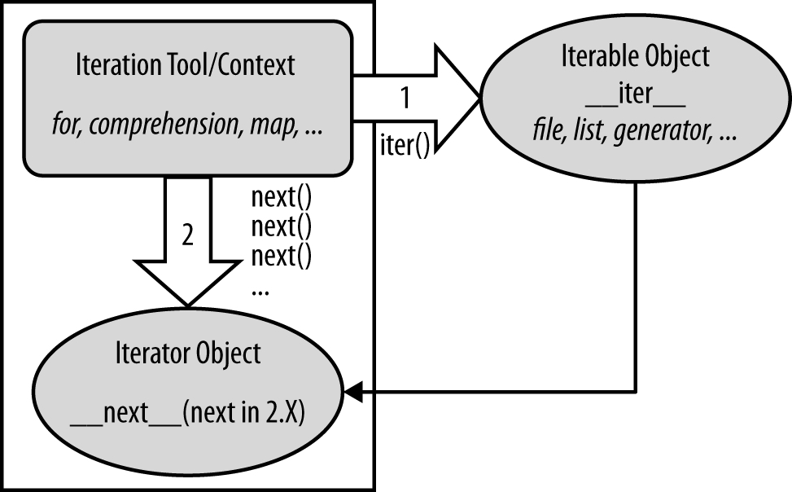

# Python Study Notes


# Iteration 迭代

如果给定一个list或tuple，我们可以通过 `for` 循环来遍历这个list或tuple，这种遍历我们称为迭代（Iteration）。

> *Terminology*
>
> this book has a very strong preference for using the term **iterable** to refer to an object that supports the iter call, 
>
> and **iterator** to refer to an object returned by an iterable on iter that supports the next(I) call. Both these calls are defined ahead.
>
> the term **generator** —which refers to objects that automatically support the iteration protocol, and hence are iterable—even though all iterables generate results!

The concept of “iterable objects” is relatively recent in Python, but it has come to permeate the language’s design. It’s essentially a generalization of the notion of sequences—an object is considered iterable if it is either a physically stored sequence, or an object that produces one result at a time in the context of an iteration tool like a `for` loop. In a sense, **iterable objects include both physical sequences and virtual sequences computed on demand.**

all iteration tools that scan objects from left to right in Python, including `for` loops, the list comprehensions , `in` membership tests, the `map` built-in function, and more.


## The Iteration Protocol: File Iterators

understand the iteration protocol is to see how it works with a built-in type such as the file：

call the iteration protocol in Python. Any object with a `__next__` method to advance to a next result, which raises `StopIteration` at the end of the series of results, is considered an iterator in Python. because all iteration tools normally work internally by calling `__next__` on each iteration and catching the `StopIteration` exception to determine when to exit.

> a `next(X)` built-in function is also available in both Python 3.X and 2.X (2.6 and later)
>
> calls `X.__next__()` in 3.X and `X.next()` in 2.X.

In fact, everything that scans left to right in Python employs the iteration protocol in the same way


## Manual Iteration: iter and next

To simplify manual iteration code.

a `next(X)` built-in function is also available in both Python 3.X and 2.X (2.6 and later)

calls `X.__next__()` in 3.X and `X.next()` in 2.X.

```
>>> f = open('script2.py')
>>> f.__next__() 			# Call iteration method directly
'import sys\n'
>>> f.__next__() 
'print(sys.path)\n'

>>> f = open('script2.py')
>>> next(f) 				# The next(f) built-in calls f.__next__() in 3.X
'import sys\n'
>>> next(f) 				# next(f) => [3.X: f.__next__()], [2.X: f.next()]
'print(sys.path)\n'
```

When the `for` loop begins, it first obtains an iterator from the iterable object by passing it to the `iter` built-in function; the object returned by `iter` in turn has the required `next` method. The `iter` function internally runs the `__iter__` method, much like next and `__next__`.

> the file iterator still appears to be slightly faster than `readlines` and at least 30% faster than the `while` loop in both 2.7 and 3.3 on tests

#### The full iteration protocol

- The iterable object you request iteration for, whose `__iter__` is run by `iter`


- The iterator object returned by the iterable that actually produces values during the iteration, whose `__next__` is run by `next` and raises `StopIteration` when finished producing results




> The Python iteration protocol, used by for loops, comprehensions, maps, and more, and supported by files, lists, dictionaries, generators, and more. Some objects are both iteration context and iterable object, such as generator expressions and 3.X’s flavors of some tools (such as map and zip). Some objects are both iterable and iterator, returning themselves for the iter() call, which is then a no-op.

how `for` loops internally process built-in sequence types such as lists:

```
>>> L = [1, 2, 3]
>>> I = iter(L)				# Obtain an iterator object from an iterable
>>> I.__next__()			# Call iterator's next to advance to next item
>>> I.__next__() 			# Or use I.next() in 2.X, next(I) in either line
2
>>> I.__next__() 
3
>>> I.__next__() 
...error text omitted... 
StopIteration
```

This initial step is not required for files, because a file object is its own iterator. Because they support just one iteration (they can’t seek backward to support multiple active scans), files have their own `__next__` method and do not need to return a different object that does:

```
>>> f = open('script2.py')
>>> iter(f) is f True
>>> iter(f) is f.__iter__() 
True
>>> f.__next__() 
'import sys\n'
```

Lists and many other built-in objects, though, are not their own iterators because they do support multiple open iterations—for example, there may be multiple iterations in nested loops all at different positions. For such objects, we must call `iter` to start iter-ating:

```
>>> L = [1, 2, 3]
>>> iter(L) is L 
False
>>> L.__next__() 
AttributeError: 'list' object has no attribute '__next__'

>>> I = iter(L)
>>> I.__next__() 
1
>>> next(I) 		# Same as I.__next__()
2
```


#### Manual iteration

automatic iteration:

```
>>> L = [1, 2, 3]
>>>
>>> for X in L:					# Automatic iteration
... 	print(X ** 2, end=' ') 	# Obtains iter, calls __next__, catches exceptions
...
1 4 9
```

manual iteration:

```
>>> L = [1, 2, 3]
>>> I = iter(L)					# Manual iteration: what for loops usually do
>>> while True:
... 	try:					# try statement catches exceptions
... 		X = next(I) 		# Or call I.__next__ in 3.X
... 	except StopIteration: 
... 		break 
... 	print(X ** 2, end=' ') 
...
1 4 9
```


## Other Iteration Contexts

every built-in tool that scans from left to right across objects uses the iteration protocol.

list comprehensions and the `map` built-in function use the same protocol as their `for` loop cousin. When applied to a file, they both leverage the file object’s iterator automatically to scan line by line, fetching an iterator with `__iter__` and calling `__next__` each time through:

```
>>> for line in open('script2.py'): 		# Use file iterators
... 	print(line.upper(), end='')
...
IMPORT SYS 
PRINT(SYS.PATH) 
X = 2 
PRINT(X ** 32)
```

For example, sequence assignment, the `in` membership test, slice assignment, and the list’s `extend` method also leverage the iteration protocol to scan, and thus read a file by lines automatically:

```
>>> a, b, c, d = open('script2.py')		# Sequence assignment
>>> a, d 
('import sys\n', 'print(x ** 32)\n')

>>> a, *b = open('script2.py') 			# 3.X extended form
>>> a, b 
('import sys\n', ['print(sys.path)\n', 'x = 2\n', 'print(x ** 32)\n'])

>>> 'y = 2\n' in open('script2.py') 	# Membership test
False
>>> 'x = 2\n' in open('script2.py') 
True

>>> L = [11, 22, 33, 44]				# Slice assignment
>>> L[1:3] = open('script2.py')
>>> L 
[11, 'import sys\n', 'print(sys.path)\n', 'x = 2\n', 'print(x ** 32)\n', 44]

>>> L = [11]
>>> L.extend(open('script2.py'))		# list.extend method

>>> L 
[11, 'import sys\n', 'print(sys.path)\n', 'x = 2\n', 'print(x ** 32)\n']
```


- User-defined functions can be turned into iterable generator functions, with yield statements.


- List comprehensions morph into iterable generator expressions when coded in parentheses.


- User-defined classes are made iterable with `__iter__` or `__getitem__` operator over-loading.


### `for` loop

`for` loop can work on any sequence type in Python, including lists, tuples, and strings, like this:

```
>>> for x in [1, 2, 3, 4]: print(x ** 2, end=' ') 
...
1 4 9 16

>>> for x in (1, 2, 3, 4): print(x ** 3, end=' ') .
..
1 8 27 64

>>> for x in 'spam': print(x * 2, end=' ') 
...
ss pp aa mm
```

在Python中，迭代是通过 `for ... in` 来完成的.

> 而很多语言比如C或者Java，迭代list是通过下标完成的，比如Java代码：
>
> ```
> for (i=0; i<list.length; i++) {
>     n = list[i];
> }
> ```

同时引用了两个变量:

```
>>> for x, y in [(1, 1), (2, 4), (3, 9)]:
...     print(x, y)
...
1 1
2 4
3 9
```


#### best way to read a text file

the best way to read a text file line by line today is to not read it at all—instead, allow the `for` loop to automatically call `__next__` to advance to the next line on each iteration.

for three reasons: 

1. it’s the simplest to code, 
2. might be the quickest to run, 
3. and is the best in terms of memory usage.

```
>>> for line in open('script2.py'): 		# Use file iterators to read by lines
... print(line.upper(), end='') 			# Calls __next__, catches StopIteration
...
IMPORT SYS 
PRINT(SYS.PATH) 
X = 2 
PRINT(X ** 32)
```

The older, original way to achieve the same effect with a for loop is to call the file readlines method to load the file’s content into memory as a list of line strings:

```
>>> for line in open('script2.py').readlines(): 
... 	print(line.upper(), end='') 
...
IMPORT SYS 
PRINT(SYS.PATH) 
X = 2 
PRINT(X ** 32)
```

read a file line by line with a `while` loop:

> this may run slower than the iterator-based `for` loop version, because itera-tors run at C language speed inside Python, whereas the `while` loop version runs Python byte code through the Python virtual machine.
>
> Anytime we trade Python code for C code, speed tends to increase.


### list comprehensions

```
>>> uppers = [line.upper() for line in open('script2.py')]
>>> uppers 
['IMPORT SYS\n', 'PRINT(SYS.PATH)\n', 'X = 2\n', 'PRINT(X ** 32)\n']
```


### dict 可以迭代

- in Python 3.X the dictionary `keys`, `values`, and `items` methods return iterable view objects that generate result items one at a time, instead of producing result lists all at once in memory .


- Views are also available in 2.7 as an option, but under special method names to avoid impacting existing code. 


- View items maintain the same physical ordering as that of the dictionary and reflect changes made to the underlying dictionary.

```
>>> D = dict(a=1, b=2, c=3)
>>> D
{'c': 3, 'b': 2, 'a': 1}

>>> K = D.keys()			# A view object in 3.X, not a list
>>> K
dict_keys(['c', 'b', 'a'])

>>> next(K)					# Views are not iterators themselves
TypeError: 'dict_keys' object is not an iterator

>>> I = iter(K)				# View iterables have an iterator,
>>> next(I)					# which can be used manually,
'c'							# but does not support len(), index
>>> next(I)
'b'

>>> for k in D.keys(): print(k, end=' ')		# All iteration contexts use auto
...
a b c
```

```
>>> d = {'a': 1, 'b': 2, 'c': 3}
>>> for key in d:
...     print(key)
...
a
c
b
```

因为dict的存储不是按照list的方式顺序排列，所以，迭代出的结果顺序很可能不一样。

默认情况下，dict迭代的是key。如果要迭代value，可以用 `for value in d.values():`，如果要同时迭代key和value，可以用 `for k, v in d.items():`。

```
>>> d = {'a': 1, 'b': 2, 'c': 3}
>>> for value in d.values():
...     print(value)
... 
3
1
2
```

```
>>> d = {'a': 1, 'b': 2, 'c': 3}
>>> for k, v in d.items():
...     print(k, v)
... 
c 3
a 1
b 2
```

to request its keys list explicitly:

```
>>> D = {'a':1, 'b':2, 'c':3}
>>> for key in D.keys(): 
... 	print(key, D[key]) 
...
a 1 
b 2 
c 3
```

dictionaries are iterables with an iterator that automatically returns one key at a time in an iteration context:

```
>>> I = iter(D)
>>> next(I) 
'a'
>>> next(I) 
'b'
>>> next(I) 
'c'
>>> next(I) 
Traceback (most recent call last):
	File "<stdin>", line 1, in <module> 
StopIteration
```

the `for` loop will use the iteration protocol to grab one key each time through:

```
>>> for key in D:
... 	print(key, D[key]) 
...
a 1 
b 2 
c 3
```

because `keys` no longer returns a list, the traditional coding pattern for scanning a dictionary by sorted keys won’t work in 3.X. Instead, convert keys views first with a `list` call, or use the `sorted` call on either a keys view or the dictionary itself,

```
>>> D = dict(a=1, b=2, c=3)
>>> D
{'c': 3, 'b': 2, 'a': 1}
>>> for k in sorted(D.keys()): print(k, D[k], end=' ')
... 
a 1 b 2 c 3 
>>> 
>>> for k in sorted(D): print(k, D[k], end=' ')
... 
a 1 b 2 c 3 
```


### 字符串也是可迭代对象

```
>>> for ch in 'ABC':
...     print(ch)
...
A
B
C
```


### os.popen

shelves (an access-by-key filesystem for Python objects) and the results from `os.popen` (a tool for reading the output of shell commands) are iterable:

```
>>> import os
>>> P = os.popen('dir')
>>> P.__next__() 
' Volume in drive C has no label.\n'
>>> P.__next__() 
' Volume Serial Number is D093-D1F7\n'
>>> next(P) 
TypeError: _wrap_close object is not an iterator
```

`popen` objects themselves support a `P.next()` method in Python 2.X. In 3.X, they support the `P.__next__()` method, but not the `next(P)` built-in.

```
>>> P = os.popen('dir')
>>> I = iter(P)
>>> next(I) 
' Volume in drive C has no label.\n'
>>> I.__next__() 
' Volume Serial Number is D093-D1F7\n'
```


### 如何判断一个对象是可迭代对象?

通过collections模块的Iterable类型判断：

```
>>> from collections import Iterable
>>> isinstance('abc', Iterable) 	# str是否可迭代
True
>>> isinstance([1,2,3], Iterable)   # list是否可迭代
True
>>> isinstance(123, Iterable) 		# 整数是否可迭代
False
```


### enumerate()

Python内置的 `enumerate` 函数可以把一个list变成索引-元素对，这样就可以在`for`循环中同时迭代索引和元素本身：

```
>>> for i, value in enumerate(['A', 'B', 'C']):
...     print(i, value)
...
0 A
1 B
2 C
```
```
>>> E = enumerate('spam') 		# enumerate is an iterable too
>>> E 
<enumerate object at 0x00000000029B7678>
>>> I = iter(E)
>>> next(I) 					# Generate results with iteration protocol (0, 's')
>>> next(I) 					# Or use list to force generation to run (1, 'p')
>>> list(enumerate('spam')) 
[(0, 's'), (1, 'p'), (2, 'a'), (3, 'm')]
```
```
>>> list(enumerate(open('script2.py'))) 
[(0, 'import sys\n'), (1, 'print(sys.path)\n'), (2, 'x = 2\n'), (3, 'print(x ** 32)\n')]
```


### sorted()

`sorted` sorts items in an iterable

```
>>> sorted(open('script2.py')) 
['import sys\n', 'print(sys.path)\n', 'print(x ** 32)\n', 'x = 2\n']
```


### zip()

`zip` combines items from iterables

```
>>> list(zip(open('script2.py'), open('script2.py'))) 
[('import sys\n', 'import sys\n'), ('print(sys.path)\n', 'print(sys.path)\n'), ('x = 2\n', 'x = 2\n'), ('print(x ** 32)\n', 'print(x ** 32)\n')]
```


### filter()

`filter` selects items for which a function is true

```
>>> list(filter(bool, open('script2.py'))) 			# nonempty=True 
['import sys\n', 'print(sys.path)\n', 'x = 2\n', 'print(x ** 32)\n']
```


### reduce()

`reduce` runs pairs of items in an iterable through a function

```
>>> import functools, operator
>>> functools.reduce(operator.add, open('script2.py')) 
'import sys\nprint(sys.path)\nx = 2\nprint(x ** 32)\n'
```


### map()

```
>>> map(str.upper, open('script2.py')) 		# map is itself an iterable in 3.X
<map object at 0x00000000029476D8>
>>> list(map(str.upper, open('script2.py'))) 
['IMPORT SYS\n', 'PRINT(SYS.PATH)\n', 'X = 2\n', 'PRINT(X ** 32)\n']
```


### range()

In 3.X, it returns an iterable that generates numbers in the range on demand, instead of building the result list in memory.

```
C:\code> c:\python33\python
>>> R = range(10)			# range returns an iterable, not a list
>>> R 
range(0, 10)

>>> I = iter(R)				# Make an iterator from the range iterable
>>> next(I) 				# Advance to next result
0							# What happens in for loops, comprehensions, etc.
>>> next(I) 
1
>>> next(I) 
2

>>> list(range(10)) 		# To force a list if required
[0, 1, 2, 3, 4, 5, 6, 7, 8, 9]
```


## Multiple Versus Single Pass Iterators 多个迭代器与单个迭代器

- **multiple iterators are usually supported by returning new objects for the iter call**


- **a single iterator generally means an object returns itself**

example：

the `range` object it is not its own iterator (you make one with `iter` when iterating manually), and it supports multiple iterators over its result that remember their positions independently:

```
>>> R = range(3)		# range allows multiple iterators
>>> next(R)
TypeError: range object is not an iterator

>>> I1 = iter(R)
>>> next(I1)
0
>>> next(I1)
1
>>> I2 = iter(R)		# Two iterators on one range
>>> next(I2)
0
>>> next(I2)
1
>>> next(I1)			# I1 is at a different spot than I2
2
>>> next(I2)
2
```

By contrast, in 3.X `zip`, `map`, and `filter` do not support multiple active iterators on the same result; because of this the `iter` call is optional for stepping through such objects’ results—their `iter` is themselves (in 2.X these built-ins return multiple-scan lists so the following does not apply):

```
>>> Z = zip((1, 2, 3), (10, 11, 12))
>>> I1 = iter(Z)
>>> I2 = iter(Z)			# Two iterators on one zip
>>> next(I1)
(1, 10)
>>> next(I1)
(2, 11)
>>> next(I2)				# (3.X) I2 is at same spot as I1!
(3, 12)

>>> M = map(abs, (-1, 0, 1))
>>> I1 = iter(M); I2 = iter(M)
>>> print(next(I1), next(I1), next(I1))
1 0 1
>>> next(I2)				# (3.X) Single scan is exhausted!
StopIteration
```