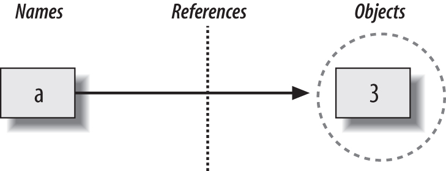

# Python Study Notes


# The Dynamic Typing Interlude 动态类型简介

In Python, types are determined automatically at runtime, not in response to declarations in your code.

## Variables, Objects, and References

**Variable creation**

 A variable (i.e., name), like a, is created when your code first assigns it a value. Future assignments change the value of the already created name. Technically, Python detects some names before your code runs, but you can think of it as though initial assignments make variables.

**Variable types** 

A variable never has any type information or constraints associated with it. The notion of type lives with objects, not names. Variables are generic in nature; they always simply refer to a particular object at a particular point in time.

**Variable use** 

When a variable appears in an expression, it is immediately replaced with the object that it currently refers to, whatever that may be. Further, all variables must be explicitly assigned before they can be used; referencing unassigned variables results in errors.


**变量在赋值时才创建，他可以引用任何类型的对象，并且必须在引用之前赋值。**

variables are created when assigned, can reference any type of object, and must be assigned before they are referenced.

> 这意味着，不需要通过脚本声明索要使用的名字，必须初始化名字然后才能更新它们。例如，必须把计数器初始化为0，然后才能增加它。
>
> This means that you never need to declare names used by your script, but you must initialize names before you can update them; coun-ters, for example, must be initialized to zero before you can add to them.

Names and objects after running the assignment a = 3. Variable a becomes a reference to the object 3. Internally, the variable is really a pointer to the object’s memory space created by running the literal expression 3.




These links from variables to objects are called references in Python—that is, **a reference is a kind of association, implemented as a pointer in memory.**

each time you generate a new value in your script by running an expression, Python creates a new object (i.e., a chunk of memory) to represent that value.

> Python internally caches and reuses certain kinds of unchangeable objects, such as small integers and strings (each 0 is not really a new piece of memory—more on this caching behavior later). But from a logical perspective, it works as though each expression’s result value is a distinct object and each object is a distinct piece of memory.

**Each object also has two standard header fields:** 

- a type designator used to mark the type of the object, 


- and a reference counter used to determine when it’s OK to reclaim the object.


### Types Live with Objects, Not Variables

```
>>> a = 3			# It's an integer
>>> a = 'spam'		# Now it's a string 
>>> a = 1.23		# Now it's a floating point
```


### Objects Are Garbage-Collected

whenever a name is assigned to a new object, the space held by the prior object is reclaimed if it is not referenced by any other name or object. This automatic reclamation of objects’ space is known as garbage collection

```
>>> x = 42
>>> x = 'shrubbery'		# Reclaim 42 now (unless referenced elsewhere)

>>> x = 3.1415		    # Reclaim 'shrubbery' now
>>> x = [1, 2, 3]		# Reclaim 3.1415 now
```

when it is assigned the string 'shrubbery', the object 42 is immediately reclaimed (assuming it is not referenced anywhere else) — **the object’s space is automatically thrown back into the free space pool, to be reused for a future object.**

> Internally, Python accomplishes this feat by keeping a counter in every object that keeps track of the number of references currently pointing to that object. As soon as (and exactly when) this counter drops to zero, the object’s memory space is automatically reclaimed.

**garbage collection**

The most immediately tangible benefit of garbage collection is that it means you can use objects liberally without ever needing to allocate or free up space in your script. Python will clean up unused space for you as your program runs.

> Technically speaking, Python’s garbage collection is based mainly upon reference coun-ters, as described here; however, it also has a component that detects and reclaims objects with cyclic references in time. This component can be disabled if you’re sure that your code doesn’t create cycles, but it is enabled by default.


## Shared References

with multiple names referencing the same object—is usually called a shared reference (and sometimes just a shared object).

```
>>> a = 3
>>> b = a
```


the names a and b are not linked to each other directly when this happens.both variables point to the same object via their references.

```
>>> a = 3
>>> b = a
>>> a = 'spam'
```


### Shared References and In-Place Changes

there are objects and operations that perform in-place object changes—Python’s mutable types, including lists, dictionaries, sets and some objects defined with class statements.. For instance, an assignment to an offset in a list actually changes the list object itself in place, rather than generating a brand-new list object.

reference:

```
mutable objects that support in-place changes，reference：

>>> L1 = [2, 3, 4]		# A mutable object
>>> L2 = L1				# Make a reference to the same object
>>> L1[0] = 24			# An in-place change

>>> L1 					# L1 is different
[24, 3, 4]
>>> L2 					# But so is L2!
[24, 3, 4]
```

#### list copy:

```
the two variables point to different pieces of memory. copy：

>>> L1 = [2, 3, 4]
>>> L2 = L1[:]			# Make a copy of L1 (or list(L1), copy.copy(L1), etc.)
>>> L1[0] = 24

>>> L1 
[24, 3, 4]
>>> L2 					# L2 is not changed
[2, 3, 4]

Note that this slicing technique won’t work on the other major mutable core types, dictionaries and sets, because they are not sequences
```

#### copy a dictionary or set:

1. X.copy() 		(lists have one as of Python 3.3 as well)

2. pass the original object to their type names, dict and set.

3. copy module has a call for copying any object type generically, copying nested object structures—a dictionary with nested lists, for example:

   ```
   import copy 
   X = copy.copy(Y) 		# Make top-level "shallow" copy of any object Y 
   X = copy.deepcopy(Y)	# Make deep copy of any object Y: copy all nested parts
   ```

### Shared References and Equality

Python caches and reuses small integers and small strings.

```
>>> L = [1, 2, 3]
>>> M = L			# M and L reference the same object
>>> L == M 			# Same values 
True
>>> L is M 			# Same objects
True
```

```
>>> L = [1, 2, 3]
>>> M = [1, 2, 3]	# M and L reference different objects 
>>> L == M 			# Same values 
True
>>> L is M 			# Different objects
False
```

> the == operator, tests whether the two referenced objects have the same values;
>
> the is operator, instead tests for object identity—it returns True only if both names point to the exact same object, (it is a much stronger form of equality testing and is rarely applied in most programs.)

small integers and strings are cached and reused:

```
>>> X = 42
>>> Y = 42		# Should be two different objects
>>> id(x)
4297372000
>>> id(y)
4297372000
>>> X == Y 
True
>>> X is Y 		# Same object anyhow: caching at work!
True

X and Y should be == (same value), but not is (same object) because we ran two different literal expressions (42). Because small integers and strings are cached and reused, though, is tells us they reference the same single object.

>>> x = 123456
>>> y = 123456
>>> id(x)
4298641296
>>> id(y)
4323389840
>>> x == y
True
>>> x is y
False
```

ask Python how many references there are to an object: 

```
>>> import sys
>>> sys.getrefcount(1)		# 647 pointers to this shared piece of memory
647

the getrefcount function in the standard sys module returns the object’s reference count.
```

> Because you cannot change immutable numbers or strings in place, it doesn’t matter how many references there are to the same object—every reference will always see the same, unchanging value. Still, this behavior reflects one of the many ways Python optimizes its model for execution speed.


