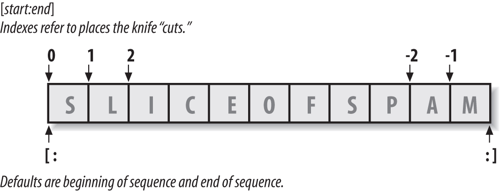

# Python Study Notes


# 字符串和编码


## 字符编码


### ASCII

计算机只能处理数字，如果要处理文本，就必须先把文本转换为数字才能处理。

**最早的计算机在设计时采用8个比特（bit）作为一个字节（byte）**。

> 用8个可以开合的晶体管来组合成不同的状态。

所以，一个字节能表示的最大的整数就是255（二进制11111111 = 十进制255），如果要表示更大的整数，就必须用更多的字节。

> 比如两个字节可以表示的最大整数是65535，4个字节可以表示的最大整数是4294967295。

开始计算机只在美国用。八位的字节一共可以组合出256(2的8次方)种不同的状态。

其中的编号从0开始的32种状态分别规定了特殊的用途，一但终端、打印机遇上约定好的这些字节被传过来时，就要做一些约定的动作，如：

> 遇上0×10, 终端就换行；
>
> 遇上0×07, 终端就向人们嘟嘟叫；
>
> 遇上0x1b, 打印机就打印反白的字，或者终端就用彩色显示字母。

把这些0×20以下的字节状态称为“控制码”。他们又把所有的空 格、标点符号、数字、大小写字母分别用连续的字节状态表示，一直编到了第127号，这样计算机就可以用不同字节来存储英语的文字了。

这个方案叫做 ANSI的“Ascii”编码（American Standard Code for Information Interchange，美国信息互换标准代码）。当时世界上所有的计算机都用同样的ASCII方案来保存英文文字。

### 扩展字符集

后来，世界各地的都开始使用计算机，但是很多国家用的不是英文，他们的字母里有许多是ASCII里没有的，为了可以在计算机保存他们的文字，他们决定采用 127号之后的空位来表示这些新的字母、符号，还加入了很多画表格时需要用下到的横线、竖线、交叉等形状，一直把序号编到了最后一个状态255。

**从128 到255这一页的字符集被称“扩展字符集”**。

### GB2312

等中国人们得到计算机时，已经没有可以利用的字节状态来表示汉字。

中国人民把那些127号之后的奇异符号们直接取消掉, 规定：

> 一个小于127的字符的意义与原来相同，但两个大于127的字符连在一起时，就表示一个汉字；
>
> 前面的一个字节（他称之为高字节）从0xA1用到 0xF7，后面一个字节（低字节）从0xA1到0xFE；

这样我们就可以组合出大约7000多个简体汉字了。

在这些编码里，我们还把数学符号、罗马希腊的字母、日文的假名们都编进去了，连在 ASCII 里本来就有的数字、标点、字母都统统重新编了两个字节长的编码，这就是常说的“全角”字符。

而原来在127号以下的那些就叫“半角”字符了。

于是就把这种汉字方案叫做 “GB2312”。GB2312 是对 ASCII 的中文扩展。

### GBK 标准

但是中国的汉字太多了，我们很快就就发现有许多人的人名没有办法在这里打出来。

于是我们不得不继续把 GB2312 没有用到的码位找出来老实不客气地用上。

后来还是不够用，于是干脆不再要求低字节一定是127号之后的内码，只要第一个字节是大于127就固定表示这是一个汉字的开始，不管后面跟的是不是扩展字符集里的内容。结果扩展之后的编码方案被称为 GBK 标准，GBK包括了GB2312 的所有内容，同时又增加了近20000个新的汉字（包括繁体字）和符号。

### GB18030

后来少数民族也要用电脑了，于是再扩展，又加了几千个新的少数民族的字，GBK扩成了 GB18030。

### DBCS

中国的程序员们通称这一系列汉字编码的标准叫做 “DBCS“（Double Byte Charecter Set 双字节字符集）。

在DBCS系列标准里，最大的特点是两字节长的汉字字符和一字节长的英文字符并存于同一套编码方案里，因此他们写的程序为了支持中文处理，必须要注意字串里的每一个字节的值，如果这个值是大于127的，那么就认为一个双字节字符集里的字符出现了。

那时候“**一个汉字算两个英文字符**”

因为当时各个国家都像中国这样搞出一套自己的编码标准，结果互相之间谁也不懂谁的编码，也不支持别人的编码。

连大陆和台湾也分别采用了不同的 DBCS 编码方案，台湾支持 BIG5 编码。日本把日文编到`Shift_JIS`里，韩国把韩文编到`Euc-kr`里。

### Unicode

正在这时， ISO （国际标谁化组织）的国际组织决定着手解决这个问题。

他们采用的方法很简单：

> 废了所有的地区性编码方案，重新搞一个包括了地球上所有文化、所有字母和符号 的编码！

他们打算叫它”Universal Multiple-Octet Coded Character Set”，简称 UCS, 俗称 “unicode”。

unicode开始制订时，计算机的存储器容量极大地发展了，空间再也不成为问题了。于是 ISO 就直接规定必须用两个字节，也就是16位来统一表示所有的字符，对于ASCII里的那些“半角”字符，unicode包持其原编码不变，只是将其长度由原来的8位扩展为16位，而其他文化和语言的字符则全部重新统一编码。由于“半角”英文符号只需要用到低8位，所以其高8位永远是0，因此这种方案在保存英文文本时会多浪费一倍的空间。

这时候，程序员开始发现一个现象：他们的strlen函数靠不住了，一个汉字不再是相当于两个字符了，而是一个！是的，从unicode开始，无论是半角的英文字母，还是全角的汉字，它们都是统一的“一个字符”！同时，也都是统一的“两个字节”.

请注意“字符”和“字节”两个术语的不同：

```
“字节”是一个8位的物理存贮单元，

而“字符”则是一个文化相关的符号。
```

**在unicode中，一个字符就是两个字节**。（一个汉字算两个英文字符的时代已经快过去了)。

unicode同样也不完美，这里就有两个的问题:

> 一个是，如何才能区别unicode和ascii？计算机怎么知道三个字节表示一个符号，而不是分别表示三个符号呢？
>
> 第二个问题是，英文字母只用一个字节表示就够了，如果unicode统一规定，每个符号用三个或四个字节表示，那么每个英文字母前都必然有二到三个字节是0，这对于存储空间来说是极大的浪费，文本文件的大小会因此大出二三倍。

### UTF

unicode在很长一段时间内无法推广，直到互联网的出现，为解决unicode如何在网络上传输的问题，于是面向传输的众多 UTF（UCS Transfer Format）标准出现了，顾名思义：

```
UTF-8就是每次8个位传输数据，

而UTF-16就是每次16个位。

```

UTF-8就是在互联网上使用最广的一种unicode的实现方式，这是为传输而设计的编码，并使编码无国界，这样就可以显示全世界上所有文化的字符了。

**UTF-8编码把一个Unicode字符根据不同的数字大小编码成1-6个字节，常用的英文字母被编码成1个字节，汉字通常是3个字节，只有很生僻的字符才会被编码成4-6个字节。如果你要传输的文本包含大量英文字符，用UTF-8编码就能节省空间：**

| 字符   | ASCII    | Unicode           | UTF-8                      |
| ---- | -------- | ----------------- | -------------------------- |
| A    | 01000001 | 00000000 01000001 | 01000001                   |
| 中    | x        | 01001110 00101101 | 11100100 10111000 10101101 |

UTF-8最大的一个特点，就是它是一种变长的编码方式。根据不同的符号而变化字节长度。

当字符在ASCII码的范围时，就用一个字节表示，保留了ASCII字符一个字节的编码做为它的一部分.

**注意的是unicode一个中文字符占2个字节，而UTF-8一个中文字符占3个字节。**

为了传输时的可靠性，从unicode到uft-8并不是直接的对应，而是要过一些算法和规则来转换。

```
Unicode符号范围 | UTF-8编码方式
(十六进制)         |        （二进制）
—————————————————————–—————————————————————–
0000 0000-0000 007F | 0xxxxxxx
0000 0080-0000 07FF | 110xxxxx 10xxxxxx
0000 0800-0000 FFFF | 1110xxxx 10xxxxxx 10xxxxxx
0001 0000-0010 FFFF | 11110xxx 10xxxxxx 10xxxxxx 10xxxxxx
```

### GB2312编码与UTF8编码的编码冲撞

在网络里传递信息时有一个很重要的问题，就是对于数据高低位的解读方式，一些计算机是采用低位先发送的方法，例如我们PC机采用的 INTEL 架构，而另一些是采用高位先发送的方式，在网络中交换数据时，为了核对双方对于高低位的认识是否是一致的，采用了一种很简便的方法，就是在文本流的开始时向对方发送一个标志符——如果之后的文本是高位在位，那就发送"FEFF"，反之，则发送"FFFE"。不信你可以用二进制方式打开一个UTF-X格式的文件，看看开头两个字节是不是这两个字节？

讲到这里，我们再顺便说说一个很著名的奇怪现象：当你在 windows 的记事本里新建一个文件，输入"联通"两个字之后，保存，关闭，然后再次打开，你会发现这两个字已经消失了，代之的是几个乱码！

其实这是因为GB2312编码与UTF8编码产生了编码冲撞的原因。

例如"汉"字的Unicode编码是6C49。6C49在0800-FFFF之间，所以要用3字节模板：1110xxxx 10xxxxxx 10xxxxxx。将6C49写成二进制是：0110 1100 0100 1001，将这个比特流按三字节模板的分段方法分为0110 110001 001001，依次代替模板中的x，得到：1110-0110 10-110001 10-001001，即E6 B1 89，这就是其UTF8的编码。

```
#例如"汉"字的Unicode编码是6C49。6C49在0800-FFFF之间

1110xxxx 10xxxxxx 10xxxxxx        #用3字节模板
0110 1100 0100 1001               #将6C49写成二进制是
     0110    110001    001001     #将这个比特流按三字节模板的分段方法分
1110-0110 10-110001 10-001001     #依次代替模板中的x，得到1110-0110 10-110001 10-001001，即E6 B1 89
```

### 两个字的文件没有办法在记事本里正常显示的原因

而当你新建一个文本文件时，记事本的编码默认是ANSI, 如果你在ANSI的编码输入汉字，那么他实际就是GB系列的编码方式，在这种编码下，"联通"的内码是：

c1 1100 0001

aa 1010 1010

cd 1100 1101

a8 1010 1000

注意到了吗？第一二个字节、第三四个字节的起始部分的都是"110"和"10"，正好与UTF8规则里的两字节模板是一致的，于是再次打开记事本时，记事本就误认为这是一个UTF8编码的文件，让我们把第一个字节的110和第二个字节的10去掉，我们就得到了"00001 101010"，再把各位对齐，补上前导的0，就得到了"0000 0000 0110 1010"，不好意思，这是UNICODE的006A，也就是小写的字母"j"，而之后的两字节用UTF8解码之后是0368，这个字符什么也不是。这就是只有"联通"

两个字的文件没有办法在记事本里正常显示的原因。

而如果你在"联通"之后多输入几个字，其他的字的编码不见得又恰好是110和10开始的字节，这样再次打开时，记事本就不会坚持这是一个utf8编码的文件，而会用ANSI的方式解读之，这时乱码又不出现了。

### sqlserver里面有char和nchar，那个n据说是指unicode的数据，这个是什么意思？

在数据库里，有n前缀的字串类型就是UNICODE类型，这种类型中，固定用两个字节来表示一个字符，无论这个字符是汉字还是英文字母，或是别的什么。

如果你要测试"abc汉字"这个串的长度，在没有n前缀的数据类型里，这个字串是7个字符的长度，因为一个汉字相当于两个字符。而在有n前缀的数据类型里，同样的测试串长度的函数将会告诉你是5个字符，因为一个汉字就是一个字符。


## 现在计算机系统通用的字符编码工作方式：

在计算机内存中，统一使用Unicode编码，当需要保存到硬盘或者需要传输的时候，就转换为UTF-8编码。

用记事本编辑的时候，从文件读取的UTF-8字符被转换为Unicode字符到内存里，编辑完成后，保存的时候再把Unicode转换为UTF-8保存到文件：


浏览网页的时候，服务器会把动态生成的Unicode内容转换为UTF-8再传输到浏览器：


所以你看到很多网页的源码上会有类似`<meta charset="UTF-8" />`的信息，表示该网页正是用的UTF-8编码。


# 字符串

A string is a _sequence_ of _characters_.一串字符串（String）是 _字符（Characters）_ 的 _序列（Sequence）_

the characters they contain have a left-to-right positional order and that they cannot be changed in place.

> in Python we call a sequence—a positionally ordered collection of other objects. Sequences maintain a left-to-right order among the items they contain: their items are stored and fetched by their relative positions. Strictly speaking, strings are sequences of one-character strings; other, more general sequence types include lists and tuples

### Immutability

**Strings are Immutable in Python**

> they cannot be changed in place after they are created. you can never overwrite the values of immutable objects.

```
>>> S 
'Spam'

>>> S[0] = 'z' 				# Immutable objects cannot be changed 
...error text omitted...
TypeError: 'str' object does not support item assignment

>>> S = 'z' + S[1:]			# But we can run expressions to make new objects
>>> S 
'zpam'
```

```
>>> S = 'shrubbery'
>>> L = list(S)					# Expand to a list: [...]
>>> L
['s', 'h', 'r', 'u', 'b', 'b', 'e', 'r', 'y']
>>> L[1] = 'c'					# Change it in place 
>>> ''.join(L) 					# Join with empty delimiter
'scrubbery'

>>> B = bytearray(b'spam')		# A bytes/list hybrid (ahead)
>>> B.extend(b'eggs')			# 'b' needed in 3.X, not 2.X 
>>> B 							# B[i] = ord(c) works here too
bytearray(b'spameggs')
>>> B.decode() 					# Translate to normal string
'spameggs'
```

The bytearray supports in-place changes for text, but only for text whose characters are all at most 8-bits wide (e.g., ASCII). All other strings are still immutable—bytear ray is a distinct hybrid of immutable bytes strings (whose b'...' syntax is required in 3.X and optional in 2.X) and mutable lists (coded and displayed in [])

### 单引号 Single quotes:

你可以使用单引号来指定字符串，例如 `'将我这样框进来'` 或 `'Quote me on this'` 。

所有引号内的空间，诸如空格与制表符，都将按原样保留。

```
>>> 'knight"s', "knight's" 
('knight"s', "knight's")
```

the comma is important here. Without it, Python automatically concatenates adjacent string literals in any expression

```
>>> title = "Meaning " 'of' " Life"		# Implicit concatenation
>>> title 
'Meaning of Life'
```

### 双引号 Double quotes:

被双引号包括的字符串和被单引号括起的字符串, 其工作机制完全相同。

例如 `"你的名字是？"` 或 `"What's your name?"` 。

```
>>> "What's your name?"
"What's your name?"
>>> 'the "book" is white'
'the "book" is white'
```

### 三引号 Triple quotes:

三引号允许一个字符串跨多行，字符串中可以包含换行符、制表符以及其他特殊字符。

三引号的语法是一对连续的单引号`'''`或者双引号`"""`（通常都是成对的用）。

Triple-quoted strings are useful anytime you need multiline text in your program; for example, to embed multiline error messages or HTML, XML, or JSON code in your Python source code files.

你可以在三引号之间自由地使用单引号与双引号。来看看这个例子：

```python
'''这是一段多行字符串。这是它的第一行。
This is the second line.
"What's your name?," I asked.
He said "Bond, James Bond."
'''
```

三重引号字符串常用于文档字符串，当出现在文件的特定地点，被当做注释一样的字符串常量

> Triple-quoted strings are also commonly used for documentation strings, which are string literals that are taken as comments when they appear at specific points in your file

```
X = 1 
""" 
import os 			# Disable this code temporarily
print(os.getcwd()) 
""" 
Y = 2
```

### 转义字符

在字符串中，有时需要输入一些特殊的符号，但是，某些符号不能直接输出，就需要用转义符。所谓转义，就是不采用符号本来的含义，而采用另外一含义了。

```
>>> 'What\'s your name?'
"What's your name?"
```

下面表格中列出常用的转义符：

| 转义字符         | 描述                                       |
| ------------ | ---------------------------------------- |
| `\newline`   | (在行尾时) 续行符 Ignored (continuation line)   |
| `\\`         | 反斜杠符号 (保留 `\`)                           |
| `\'`         | 单引号 (保留 `'`)                             |
| `\"`         | 双引号 (保留 `"`)                             |
| `\a`         | 响铃                                       |
| `\b`         | 退格(Backspace)                            |
| \e           | 转义                                       |
| `\0`         | 空 Null: binary 0 character (doesn’t end string) |
| `\n`         | 换行 Newline (linefeed)                    |
| `\v`         | 纵向制表符                                    |
| `\t`         | 横向制表符                                    |
| `\r`         | 回车 Carriage return                       |
| `\f`         | 换页 Formfeed                              |
| `\oyy`       | 八进制数，yy代表的字符，Character with octal value ooo (up to 3 digits) |
| `\xyy`       | 十六进制数，yy代表的字符，Character with hex value hh (exactly 2 digits) |
| `\other`     | 其它的字符以普通格式输出 Not an escape (keeps both \ and other) |
| `\N{ id }`   | Unicode database ID                      |
| `\uhhhh`     | Unicode character with 16-bit hex value  |
| `\Uhhhhhhhh` | Unicode character with 32-bit hex value  |
|              |                                          |

### 原始字符串 Raw strings

如果你需要指定一些未经过特殊处理的字符串，比如转义序列，那么你需要在字符串前增加 `r` 或 `R` 来指定一个 _原始（Raw）_ 字符串。由r开头引起的字符串，就是原始字符串，在里面放任何字符都表示该字符的原始含义。下面是一个例子：

```
>>> r"Newlines are indicated by \n"
'Newlines are indicated by \\n'
```

> **针对正则表达式用户的提示**
>
> 在处理正则表达式时应全程使用原始字符串。否则，将会有大量 Backwhacking 需要处理。举例说明的话，反向引用可以通过 `'\\1'` 或 `r'\1' ` 来实现。

这种方法在做网站设置网站目录结构的时候非常有用。使用了原始字符串，就不需要转义了。

一个raw字符串不能以奇数个反斜杠结尾，因为反斜杠会转义后续引用的字符

### 字符串运算符

A variable is created when you assign it a value, may be assigned any type of object, and is replaced with its value when it shows up in an expression. It must also have been previously assigned by the time you use its value.

Common string literals and operations:

```
Operation						Interpretation

S = '' 							Empty string
S = "spam's" 					Double quotes, same as single
S = 's\np\ta\x00m' 				Escape sequences
S = """...multiline...""" 		Triple-quoted block strings
S = r'\temp\spam' 				Raw strings (no escapes)
B = b'sp\xc4m' 					Byte strings in 2.6, 2.7, and 3.X
U = u'sp\u00c4m' 				Unicode strings in 2.X and 3.3+
S1 + S2 						Concatenate, repeat
S * 3 
S[i] 							Index, slice, length
S[i:j] 
len(S) 
"a %s parrot" % kind 			String formatting expression
"a {0} parrot".format(kind)		String formatting method in 2.6, 2.7, and 3.X
S.find('pa')					String methods (see ahead for all 43): search,
S.rstrip()						remove whitespace,
S.replace('pa', 'xx')			replacement,
S.split(',')					split on delimiter,
S.isdigit()						content test,
S.lower()						case conversion,
S.endswith('spam') 				end test,
'spam'.join(strlist)			delimiter join,
S.encode('latin-1')				Unicode encoding,
B.decode('utf8') 				Unicode decoding, etc.
for x in S: print(x) 			Iteration, membership
'spam' in S 
[c * 2 for c in S] 
map(ord, S) 
re.match('sp(.*)am', line)		Pattern matching: library module
```

下表实例变量 a 值为字符串 "Hello"，b 变量值为 "Python"：

| 操作符    | 描述                                       | 实例                                |
| ------ | ---------------------------------------- | --------------------------------- |
| +      | 字符串连接                                    | >>>a + b'HelloPython'             |
| *      | 重复输出字符串                                  | >>>a * 2'HelloHello'              |
| []     | 通过索引获取字符串中字符                             | >>>a[1]'e'                        |
| [ : ]  | 截取字符串中的一部分                               | >>>a[1:4]'ell'                    |
| in     | 成员运算符 - 如果字符串中包含给定的字符返回 True             | >>>"H" in aTrue                   |
| not in | 成员运算符 - 如果字符串中不包含给定的字符返回 True            | >>>"M" not in aTrue               |
| r/R    | 原始字符串 - 原始字符串：所有的字符串都是直接按照字面的意思来使用，没有转义特殊或不能打印的字符。 原始字符串除在字符串的第一个引号前加上字母"r"（可以大小写）以外，与普通字符串有着几乎完全相同的语法。 | >>>print r'\n'\n>>> print R'\n'\n |
| %      | 格式字符串                                    | 见格式化                              |

#### Indexing and Slicing：

**Indexing (S[i]) fetches components at offsets:**

- The first item is at offset 0.


- Negative indexes mean to count backward from the end or right.


- S[0] fetches the first item.


- S[−2] fetches the second item from the end (like S[len(S)−2]).

**Slicing (S[i:j]) extracts contiguous sections of sequences:**

- The upper bound is noninclusive.


-  Slice boundaries default to 0 and the sequence length, if omitted.


- S[1:3] fetches items at offsets 1 up to but not including 3.


- S[1:] fetches items at offset 1 through the end (the sequence length).


- S[:3] fetches items at offset 0 up to but not including 3.


- S[:−1] fetches items at offset 0 up to but not including the last item.


- S[:] fetches items at offsets 0 through the end—making a top-level copy of S.

**Extended slicing (S[i:j:k]) accepts a step (or stride) k, which defaults to +1:**

- Allows for skipping items and reversing order—see the next section.

  X[I:J:K], which means “extract all the items in X, from offset I through J−1, by K.”The third limit, K, defaults to +1, which is why normally all items in a slice are extracted from left to right. 

```
>>> 'spam'[1:3] 			# Slicing syntax
'pa'
>>> 'spam'[slice(1, 3)] 	# Slice objects with index syntax + object
'pa'
>>> 'spam'[::-1] 
'maps'
>>> 'spam'[slice(None, None, −1)] 
'maps'
```



> The basics of slicing are straightforward. When you index a sequence object such as a string on a pair of offsets separated by a colon, Python returns a new object containing the contiguous section identified by the offset pair. The left offset is taken to be the lower bound (inclusive), and the right is the upper bound (noninclusive). That is, Python fetches all items from the lower bound up to but not including the upper bound, and returns a new object containing the fetched items. If omitted, the left and right bounds default to 0 and the length of the object you are slicing, respectively.


```
>>> S = 'Spam'		# Make a 4-character string, and assign it to a name 
>>> len(S) 			# Length
4		
>>> S[0] 			# The first item in S, indexing by zero-based position
'S'
>>> S[1] 			# The second item from the left
'p'
>>> S[-1] 			# The last item from the end in S
'm'
>>> S[len(S)-1] 	# Negative indexing, the hard way
'm'					# we can use an arbitrary expression in the square brackets.
					# anywhere that Python expects a value, we can use a literal, a variable, or any expression we wish. Python’s syntax is completely general this way.

>>> S[-2] 			# The second-to-last item from the end
'a'
>>> S 				# A 4-character string 
'Spam'
>>> S[1:3] 			# Slice of S from offsets 1 through 2 (not 3)
'pa'

# In a slice, the left bound defaults to zero, and the right bound defaults to the length of the sequence being sliced. This leads to some common usage variations:

>>> S[1:] 			# Everything past the first (1:len(S)) 
'pam'
>>> S[0:3] 			# Everything but the last
'Spa'
>>> S[:3] 			# Same as S[0:3]
'Spa'
>>> S[:-1] 			# Everything but the last again, but simpler (0:-1)
'Spa'
>>> S[:] 			# All of S as a top-level copy (0:len(S))
'Spam'
>>> S + 'xyz' 		# Concatenation 
'Spamxyz'
>>> S 				# S is unchanged 
'Spam'
>>> S * 8 			# Repetition 
'SpamSpamSpamSpamSpamSpamSpamSpam'
```


### 变量和字符串

**变量无类型，对象有类型**

在对字符串类型的对象，能够通过赋值语句，将对象与某个标签（变量）关联起来。

```
>>> b = "hello,world"
>>> b
'hello,world'
>>> print(b)
hello,world

>>> type(b)
<class 'str'>
```

其本质含义是变量b相当于一个标签，贴在了对象"hello,world"上面。


### 拼接字符串

用`+`拼接起来的两个对象，必须是同一种类型的。

```
>>> "py" + "thon"
'python'
```


## 字符串转换工具 String Conversion

### str()

用`str()`实现将整数对象转换为字符串对象。

```
>>> a = "250"
>>> type(a)
<class 'str'>
>>> b = int(a)
>>> b
250
>>> type(b)
<class 'int'>
```

### repr()

这里repr()是一个函数，其实就是反引号的替代品，它能够把结果字符串转化为合法的python表达式。

```
>>> type(b)
<class 'int'>
>>> b = "free"
>>> a = 1989
>>> print(b+repr(a))
free1989
```

### ``(python2)


```
>>> a = 12
>>> `a`
'12'
```

注意，`` 是反引号，不是单引号，就是键盘中通常在数字1左边的那个，在英文半角状态下输入的符号。这种方法，在编程实践中比较少应用，特别是在python3中，已经把这种方式弃绝了。


## Python对Unicode的支持

在最新的Python 3版本中，字符串是以Unicode编码的，也就是说，Python的字符串支持多语言，例如：

```
>>> print('包含中文的str')
包含中文的str
```


### Unicode 字符串

以Unicode表示的字符串用`u'...'`表示，引号前小写的"u"表示这里创建的是一个 Unicode 字符串。比如：

```
>>> print(u'中文')
中文
>>> u'中'    #python3
'中'
>>> u'中'	#python2
u'\u4e2d'
```

写`u'中'`和`u'\u4e2d'`是一样的，`\u`后面是十六进制的Unicode码。

如果你想加入一个特殊字符，可以使用 Python 的 Unicode-Escape 编码。

```
>>> print(u'Hello\u0020World !')    #python3
Hello World !
```

被替换的 \u0020 标识表示在给定位置插入编码值为 0x0020 的 Unicode 字符（空格符）。

字符串`'xxx'`虽然是ASCII编码，但也可以看成是UTF-8编码，而`u'xxx'`则只能是Unicode编码。


### ord()和chr()函数

对于单个字符的编码，Python提供了

`ord()`函数 (转换为对应的ASCII码，函数实际返回的是这个字符在内存中对应的字符的二进制值) 获取字符的整数表示，

`chr()`函数(获取ASCII码并将其转化为对应的字符)把编码转换为对应的字符：

```
>>> ord('A')
65
>>> ord('中')
20013
>>> chr(66)
'B'
>>> chr(25991)
'文'
```

如果知道字符的整数编码，还可以用十六进制这么写`str`：

```
>>> '\u4e2d\u6587'
'中文'
```

两种写法完全是等价的。

由于Python的字符串类型是`str`，在内存中以Unicode表示，一个字符对应若干个字节。如果要在网络上传输，或者保存到磁盘上，就需要把`str`变为以字节为单位的`bytes`。

Python对`bytes`类型的数据用带`b`前缀的单引号或双引号表示：

```
x = b'ABC'
```

要注意区分`'ABC'`和`b'ABC'`，前者是`str`，后者虽然内容显示得和前者一样，但`bytes`的每个字符都只占用一个字节。


### encode()

以Unicode表示的`str`通过`encode()`方法可以编码为指定的`bytes`，例如：

```
>>> 'ABC'.encode('ascii')
b'ABC'
>>> '中文'.encode('utf-8')
b'\xe4\xb8\xad\xe6\x96\x87'
>>> '中文'.encode('ascii')
Traceback (most recent call last):
  File "<stdin>", line 1, in <module>
UnicodeEncodeError: 'ascii' codec can't encode characters in position 0-1: ordinal not in range(128)
```

纯英文的`str`可以用`ASCII`编码为`bytes`，内容是一样的，含有中文的`str`可以用`UTF-8`编码为`bytes`。含有中文的`str`无法用`ASCII`编码，因为中文编码的范围超过了`ASCII`编码的范围，Python会报错。

在`bytes`中，无法显示为ASCII字符的字节，用`\x##`显示。

### encode() (python2)

把`u'xxx'`转换为UTF-8编码的`'xxx'`用`encode('utf-8')`方法：

```
>>> u'ABC'.encode('utf-8')
'ABC'
>>> u'中文'.encode('utf-8')
'\xe4\xb8\xad\xe6\x96\x87'
```

英文字符转换后表示的UTF-8的值和Unicode值相等（但占用的存储空间不同），而中文字符转换后1个Unicode字符将变为3个UTF-8字符，你看到的`\xe4`就是其中一个字节，因为它的值是`228`，没有对应的字母可以显示，所以以十六进制显示字节的数值。`len()`函数可以返回字符串的长度：

```
>>> len(u'ABC')
3
>>> len('ABC')
3
>>> len(u'中文')
2
>>> len('\xe4\xb8\xad\xe6\x96\x87')
6
```


### decode()

如果我们从网络或磁盘上读取了字节流，那么读到的数据就是`bytes`。要把`bytes`变为`str`，就需要用`decode()`方法：

```
>>> b'ABC'.decode('ascii')
'ABC'
>>> b'\xe4\xb8\xad\xe6\x96\x87'.decode('utf-8')
'中文'
```

要计算`str`包含多少个字符，可以用`len()`函数：

```
>>> len('ABC')
3
>>> len('中文')
2
```

`len()`函数计算的是`str`的字符数，如果换成`bytes`，`len()`函数就计算字节数：

```
>>> len(b'ABC')
3
>>> len(b'\xe4\xb8\xad\xe6\x96\x87')
6
>>> len('中文'.encode('utf-8'))
6
```

可见，1个中文字符经过UTF-8编码后通常会占用3个字节，而1个英文字符只占用1个字节。

### decode() (python2)

把UTF-8编码表示的字符串`'xxx'`转换为Unicode字符串`u'xxx'`用`decode('utf-8')`方法：

```
>>> 'abc'.decode('utf-8')
u'abc'
>>> '\xe4\xb8\xad\xe6\x96\x87'.decode('utf-8')
u'\u4e2d\u6587'
>>> print '\xe4\xb8\xad\xe6\x96\x87'.decode('utf-8')
中文
```

在操作字符串时，我们经常遇到`str`和`bytes`的互相转换。为了避免乱码问题，应当始终坚持使用UTF-8编码对`str`和`bytes`进行转换。


### Python源代码

由于Python源代码也是一个文本文件，所以，当你的源代码中包含中文的时候，在保存源代码时，就需要务必指定保存为UTF-8编码。当Python解释器读取源代码时，为了让它按UTF-8编码读取，我们通常在文件开头写上这两行：

```
#!/usr/bin/env python
# -*- coding: utf-8 -*-
```

> 第一行注释是为了告诉Linux/OS X系统，这是一个Python可执行程序，Windows系统会忽略这个注释；
>
> 第二行注释是为了告诉Python解释器，按照UTF-8编码读取源代码，否则，你在源代码中写的中文输出可能会有乱码。

如果`.py`文件本身使用UTF-8编码，并且也申明了`# -*- coding: utf-8 -*-`，打开命令提示符测试就可以正常显示中文：

### 使用Notepad++进行编辑

如果你使用Notepad++进行编辑，除了要加上`# -*- coding: utf-8 -*-`外，中文字符串必须是Unicode字符串

```
#!/usr/bin/env python
# -*- coding: utf-8 -*-

print(u"中文")
```

> 申明了UTF-8编码并不意味着你的`.py`文件就是UTF-8编码的，必须并且要确保Notepad++正在使用UTF-8 without BOM编码(Notepad++中，在Encoding中设置)


## 格式化

### “格式化字符串”用`%`实现

在Python中，采用的格式化方式和C语言是一致的，“格式化字符串”用`%`实现，举例如下：

```
>>> 'Hello, %s' % 'world'
'Hello, world'
>>> 'Hi, %s, you have $%d.' % ('Michael', 1000000)
'Hi, Michael, you have $1000000.'
```

`%`运算符就是用来格式化字符串的。在字符串内部，`%s`表示用字符串替换，`%d`表示用整数替换，有几个`%?`占位符，后面就跟几个变量或者值，顺序要对应好。如果只有一个`%?`，括号可以省略。


不同的占位符，会表示那个位置应该被不同类型的对象填充。常见的占位符有：

| 占位符  | 说明                 |
| ---- | ------------------ |
| %s   | 字符串(采用str()的显示)    |
| %r   | 字符串(采用repr()的显示)   |
| %c   | 单个字符               |
| %b   | 二进制整数              |
| %d   | 十进制整数              |
| %i   | 十进制整数              |
| %o   | 八进制整数              |
| %x   | 十六进制整数             |
| %e   | 指数 (基底写为e)         |
| %E   | 指数 (基底写为E)         |
| %f   | 浮点数                |
| %F   | 浮点数，与上相同           |
| %g   | 指数(e)或浮点数 (根据显示长度) |
| %G   | 指数(E)或浮点数 (根据显示长度) |
| %%   | 字符"%"              |


其中，格式化整数和浮点数还可以指定是否补0和整数与小数的位数：

```
>>> '%2d-%02d' % (3, 1)
' 3-01'
>>> '%.2f' % 3.1415926
'3.14'
```

如果你不太确定应该用什么，`%s`永远起作用，它会把任何数据类型转换为字符串：

```
>>> 'Age: %s. Gender: %s' % (25, True)
'Age: 25. Gender: True'

```

有些时候，字符串里面的`%`是一个普通字符怎么办？这个时候就需要转义，用`%%`来表示一个`%`：

```
>>> 'growth rate: %d %%' % 7
'growth rate: 7 %'
```

还有一些辅助符号，如下表所示：

| 辅助符号 | 说明                                       |
| ---- | ---------------------------------------- |
| *    | 定义宽度或者小数点精度                              |
| -    | 用做左对齐                                    |
| +    | 在正数前面显示加号(+)                             |
| <sp> | 在正数前面显示空格                                |
| #    | 在八进制数前面显示零(0)，在十六进制前面显示“0x”或者“0X”（取决于用的是“x”还是“X”） |
| 0    | 显示的数字前面填充“0”而不是默认的空格                     |
| m.n  | m 是显示的最小总宽度，n 是小数点后的位数（如果可用的话）           |

注意：辅助符号要在百分号(%)和格式化符号之间。

```
>>> Num1 = 108
>>> print("%#X" % Num1)
0X6C
>>> Num2 = 234.567890
>>> print("%.2f" % Num2)
234.57
```

注意，上面的例子中，没有实现四舍五入的操作，貌似只是截取。就请回头找一找本教程中关于十进制与二进制数转换的讲述。


### `string.format()`的格式化方法

python非常提倡的`string.format()`的格式化方法:

```
>>> s1 = "I like {0}".format("python")
>>> s1
'I like python'
>>> s2 = "Suzhou is more than {0} years. {1} lives in here.".format(2500, "jim") 
>>> s2
'Suzhou is more than 2500 years. jim lives in here.'
```

其中`{索引值}`作为占位符，只需要将对应的东西，按照顺序在format后面的括号中排列好，分别对应占位符`{}`即可。

```
>>> print "Suzhou is more than {year} years. {name} lives in here.".format(year=2500, name="jim") 
Suzhou is more than 2500 years. jim lives in here.
```

Python 中 `format` 方法所做的事情便是将每个参数值替换至格式所在的位置。这之中可以有更详细的格式，例如：

```python
# 对于浮点数 '0.333' 保留小数点(.)后三位
print('{0:.3f}'.format(1.0/3))
# 使用下划线填充文本，并保持文字处于中间位置
# 使用 (^) 定义 '___hello___'字符串长度为 11
print('{0:_^11}'.format('hello'))
# 基于关键词输出 'Swaroop wrote A Byte of Python'  
print('{name} wrote {book}'.format(name='Swaroop', book='A Byte of Python'))
```

输出：

```
0.333
___hello___
Swaroop wrote A Byte of Python
```

由于我们正在讨论格式问题，就要注意 `print` 总是会以一个不可见的“新一行”字符（`\n`）结尾，因此重复调用 `print`将会在相互独立的一行中分别打印。为防止打印过程中出现这一换行符，你可以通过 `end` 指定其应以空白结尾：

```python
print('a', end='')
print('b', end='')
```

输出结果如下：

```
ab
```

或者你通过 `end` 指定以空格结尾：

```python
print('a', end=' ')
print('b', end=' ')
print('c')
```

输出结果如下：

```
a b c
```

### 


### 字典格式化

还有一种格式化的方法，被称为“字典格式化”

```
>>> lang = "python"
>>> print("I love %(program)s"%{"program":lang})
I love python
```


## python的字符串内建函数

### Method Call Syntax

methods are simply functions that are associated with and act upon particular objects. Technically, they are attributes attached to objects that happen to reference callable functions which always have an implied subject. In finer-grained detail, functions are packages of code, and **method calls combine two operations at once—an attribute fetch and a call:**

> Attribute fetches 
>
> An expression of the form object.attribute means “fetch the value of attribute in object.”

> Call expressions 
>
> An expression of the form function(arguments) means “invoke the code of func tion, passing zero or more comma-separated argument objects to it, and return function’s result value.”

**The method call expression:**

```
object.method(arguments)
```

> is evaluated from left to right—Python will first fetch the method of the object and then call it, passing in both object and the arguments. Or, in plain words, the method call expression means this:
>
> Call method to process object with arguments.
>
> If the method computes a result, it will also come back as the result of the entire method-call expression.
>
> ```
> >>> S = 'spam'
> >>> result = S.find('pa')	# Call the find method to look for 'pa' in string S
> ```
>
> most objects have callable methods, and all are accessed using this same method-call syntax. methods cannot be run (and make little sense) without a subject.


### String method calls

这些方法实现了string模块的大部分方法，如下表所示列出了目前字符串内建支持的方法，所有的方法都包含了对Unicode的支持，有一些甚至是专门用于Unicode的。

```
>>> help(str)	#查看string模块

>>> dir(str)	#string包内函数列表
['__add__', '__class__', '__contains__', '__delattr__', '__dir__', '__doc__', '__eq__', '__format__', '__ge__', '__getattribute__', '__getitem__', '__getnewargs__', '__gt__', '__hash__', '__init__', '__iter__', '__le__', '__len__', '__lt__', '__mod__', '__mul__', '__ne__', '__new__', '__reduce__', '__reduce_ex__', '__repr__', '__rmod__', '__rmul__', '__setattr__', '__sizeof__', '__str__', '__subclasshook__', 'capitalize', 'casefold', 'center', 'count', 'encode', 'endswith', 'expandtabs', 'find', 'format', 'format_map', 'index', 'isalnum', 'isalpha', 'isdecimal', 'isdigit', 'isidentifier', 'islower', 'isnumeric', 'isprintable', 'isspace', 'istitle', 'isupper', 'join', 'ljust', 'lower', 'lstrip', 'maketrans', 'partition', 'replace', 'rfind', 'rindex', 'rjust', 'rpartition', 'rsplit', 'rstrip', 'split', 'splitlines', 'startswith', 'strip', 'swapcase', 'title', 'translate', 'upper', 'zfill']

>>> help(str.title)		#查看string包内title函数功能
```

Python 的字符串常用内建函数如下：

In this table, S is a string object, and optional arguments are enclosed in square brackets.

| 序号   | 方法及描述                                    |
| ---- | ---------------------------------------- |
| 1    | [capitalize()](http://www.runoob.com/python3/python3-string-capitalize.html)    将字符串的第一个字符转换为大写 |
|      | S.casefold()                             |
| 2    | [center(width, fillchar)](http://www.runoob.com/python3/python3-string-center.html)    返回一个指定的宽度 width 居中的字符串，fillchar 为填充的字符，默认为空格。 |
| 3    | [count(str, beg= 0,end=len(string))](http://www.runoob.com/python3/python3-string-count.html)    返回 str 在 string 里面出现的次数，如果 beg 或者 end 指定则返回指定范围内 str 出现的次数 |
| 4    | [bytes.decode(encoding="utf-8", errors="strict")](http://www.runoob.com/python3/python3-string-decode.html)    Python3 中没有 decode 方法，但我们可以使用 bytes 对象的 decode() 方法来解码给定的 bytes 对象，这个 bytes 对象可以由 str.encode() 来编码返回。 |
| 5    | [encode(encoding='UTF-8',errors='strict')](http://www.runoob.com/python3/python3-string-encode.html)    以 encoding 指定的编码格式编码字符串，如果出错默认报一个ValueError 的异常，除非 errors 指定的是'ignore'或者'replace' |
| 6    | [endswith(suffix, beg=0, end=len(string))](http://www.runoob.com/python3/python3-string-endswith.html)    检查字符串是否以 obj 结束，如果beg 或者 end 指定则检查指定的范围内是否以 obj 结束，如果是，返回 True,否则返回 False. |
| 7    | [expandtabs(tabsize=8)](http://www.runoob.com/python3/python3-string-expandtabs.html)    把字符串 string 中的 tab 符号转为空格，tab 符号默认的空格数是 8 。 |
| 8    | [find(str, beg=0 end=len(string))](http://www.runoob.com/python3/python3-string-find.html)    检测 str 是否包含在字符串中 中，如果 beg 和 end 指定范围，则检查是否包含在指定范围内，如果是返回开始的索引值，否则返回-1 |
|      | S.format(fmtstr, *args, **kwargs)        |
| 9    | [index(str, beg=0, end=len(string))](http://www.runoob.com/python3/python3-string-index.html)    跟find()方法一样，只不过如果str不在字符串中会报一个异常. |
| 10   | [isalnum()](http://www.runoob.com/python3/python3-string-isalnum.html)    如果字符串至少有一个字符并且所有字符都是字母或数字则返 回 True,否则返回 False |
| 11   | [isalpha()](http://www.runoob.com/python3/python3-string-isalpha.html)    如果字符串至少有一个字符并且所有字符都是字母则返回 True, 否则返回 False |
|      | S.isdecimal()                            |
| 40   | [isdecimal()](http://www.runoob.com/python3/python3-string-isdecimal.html)检查字符串是否只包含十进制字符，如果是返回 true，否则返回 false。 |
| 12   | [isdigit()](http://www.runoob.com/python3/python3-string-isdigit.html)    如果字符串只包含数字则返回 True 否则返回 False.. |
|      | S.isidentifier()                         |
| 13   | [islower()](http://www.runoob.com/python3/python3-string-islower.html)    如果字符串中包含至少一个区分大小写的字符，并且所有这些(区分大小写的)字符都是小写，则返回 True，否则返回 False |
| 14   | [isnumeric()](http://www.runoob.com/python3/python3-string-isnumeric.html)    如果字符串中只包含数字字符，则返回 True，否则返回 False |
|      | S.isprintable()                          |
| 15   | [isspace()](http://www.runoob.com/python3/python3-string-isspace.html)    如果字符串中只包含空格，则返回 True，否则返回 False. |
| 16   | [istitle()](http://www.runoob.com/python3/python3-string-istitle.html)    如果字符串是标题化的(见 title())则返回 True，否则返回 False |
| 17   | [isupper()](http://www.runoob.com/python3/python3-string-isupper.html)    如果字符串中包含至少一个区分大小写的字符，并且所有这些(区分大小写的)字符都是大写，则返回 True，否则返回 False |
| 18   | S.join(iterable)    以指定字符串作为分隔符，将 seq 中所有的元素(的字符串表示)合并为一个新的字符串 |
| 19   | [len(string)](http://www.runoob.com/python3/python3-string-len.html)    返回字符串长度 |
| 20   | `S.ljust(width[, fillchar])` 返回一个原字符串左对齐,并使用 fillchar 填充至长度 width 的新字符串，fillchar 默认为空格。 |
| 21   | [lower()](http://www.runoob.com/python3/python3-string-lower.html)转换字符串中所有大写字符为小写. |
| 22   | [lstrip()](http://www.runoob.com/python3/python3-string-lstrip.html)截掉字符串左边的空格 |
| 23   | `S.maketrans(x[, y[, z]])` 创建字符映射的转换表，对于接受两个参数的最简单的调用方式，第一个参数是字符串，表示需要转换的字符，第二个参数也是字符串表示转换的目标。 |
| 24   | [max(str)](http://www.runoob.com/python3/python3-string-max.html)返回字符串 str 中最大的字母。 |
| 25   | [min(str)](http://www.runoob.com/python3/python3-string-min.html)返回字符串 str 中最小的字母。 |
|      | `S.partition(sep)`                       |
| 26   | `S.replace(old, new [, count])` 把 将字符串中的 str1 替换成 str2,如果 max 指定，则替换不超过 max 次。 |
| 27   | [rfind(str, beg=0,end=len(string))](http://www.runoob.com/python3/python3-string-rfind.html)类似于 find()函数，不过是从右边开始查找. |
| 28   | [rindex( str, beg=0, end=len(string))](http://www.runoob.com/python3/python3-string-rindex.html)类似于 index()，不过是从右边开始. |
| 29   | `S.rjust(width [, fillchar])` 返回一个原字符串右对齐,并使用fillchar(默认空格）填充至长度 width 的新字符串 |
|      | `S.rpartition(sep)`                      |
| 31   | split(str="", num=string.count(str))num=string.count(str)) 以 str 为分隔符截取字符串，如果 num 有指定值，则仅截取 num 个子字符串 |
| 30   | [rstrip()](http://www.runoob.com/python3/python3-string-rstrip.html)删除字符串字符串末尾的空格. |
|      | `S.split([sep [,maxsplit]])`             |
| 32   | splitlines([keepends\])按照行('\r', '\r\n', \n')分隔，返回一个包含各行作为元素的列表，如果参数 keepends 为 False，不包含换行符，如果为 True，则保留换行符。 |
| 33   | [startswith(str, beg=0,end=len(string))](http://www.runoob.com/python3/python3-string-startswith.html)检查字符串是否是以 obj 开头，是则返回 True，否则返回 False。如果beg 和 end 指定值，则在指定范围内检查。 |
| 34   | strip([chars\])在字符串上执行 lstrip()和 rstrip() |
| 35   | [swapcase()](http://www.runoob.com/python3/python3-string-swapcase.html)将字符串中大写转换为小写，小写转换为大写 |
| 36   | [title()](http://www.runoob.com/python3/python3-string-title.html)返回"标题化"的字符串,就是说所有单词都是以大写开始，其余字母均为小写(见 istitle()) |
| 37   | [translate(table, deletechars="")](http://www.runoob.com/python3/python3-string-translate.html)根据 str 给出的表(包含 256 个字符)转换 string 的字符, 要过滤掉的字符放到 deletechars 参数中 |
| 38   | [upper()](http://www.runoob.com/python3/python3-string-upper.html)转换字符串中的小写字母为大写 |
| 39   | [zfill (width)](http://www.runoob.com/python3/python3-string-zfill.html)返回长度为 width 的字符串，原字符串右对齐，前面填充0 |
|      |                                          |


### str.capitalize()

capitalize()将字符串的第一个字母变成大写,其他字母变小写。对于 8 位字节编码需要根据本地环境。

> **capitalize**(...)
>
>     S.capitalize() -> str
>
>     
>
>     Return a capitalized version of S, i.e. make the first character
>
>     have upper case and the rest lower case.

```
>>> "aBCD".capitalize()
'Abcd'
```


### str.casefold()

将字符串转换成小写，Unicode 编码中凡是有对应的小写形式的，都会转换。

> **casefold**(...)
>
> ​    S.casefold() -> str
>
> ​    
>
> ​    Return a version of S suitable for caseless comparisons.

```
>>> "aBCD".casefold()
'abcd'
```


### str.center()

 center() 返回一个原字符串居中,并使用空格填充至长度 width 的新字符串。默认填充字符为空格。

- width -- 字符串的总宽度。
- fillchar -- 填充字符。

> **center**(...)
>
> ​    S.center(width[, fillchar]) -> str
>
> ​    
>
> ​    Return S centered in a string of length width. Padding is
>
> ​    done using the specified fill character (default is a space)

```
>>> "aB C De".center(11,"o")
'ooaB C Deoo'
```


### str.count()

count() 方法用于统计字符串里某个字符出现的次数。可选参数为在字符串搜索的开始与结束位置。

```
str.count(sub, start= 0,end=len(string))
```

- sub -- 搜索的子字符串
- start -- 字符串开始搜索的位置。默认为第一个字符,第一个字符索引值为0。
- end -- 字符串中结束搜索的位置。字符中第一个字符的索引为 0。默认为字符串的最后一个位置。

该方法返回子字符串在字符串中出现的次数。

> **count**(...)
>
>     S.count(sub[, start[, end]]) -> int
>
>     
>
>     Return the number of non-overlapping occurrences of substring sub in
>
>     string S[start:end].  Optional arguments start and end are
>
>     interpreted as in slice notation.

```
>>> "apple".count("p")
2
>>> "apple".count("a",0,4)
1
```


### str.encode()

encode() 方法以指定的编码格式编码字符串。errors参数可以指定不同的错误处理方案。

```
str.encode(encoding='UTF-8',errors='strict')
```

- encoding -- 要使用的编码，如: UTF-8。
- errors -- 设置不同错误的处理方案。默认为 'strict',意为编码错误引起一个UnicodeError。 其他可能得值有 'ignore', 'replace', 'xmlcharrefreplace', 'backslashreplace' 以及通过 codecs.register_error() 注册的任何值。

该方法返回编码后的字符串，它是一个 bytes 对象。

> **encode**(...)
>
>     S.encode(encoding='utf-8', errors='strict') -> bytes
>
>     
>
>     Encode S using the codec registered for encoding. Default encoding
>
>     is 'utf-8'. errors may be given to set a different error
>
>     handling scheme. Default is 'strict' meaning that encoding errors raise
>
>     a UnicodeEncodeError. Other possible values are 'ignore', 'replace' and
>
>     'xmlcharrefreplace' as well as any other name registered with
>
>     codecs.register_error that can handle UnicodeEncodeErrors.

```
>>> "你好".encode("UTF-8")
b'\xe4\xbd\xa0\xe5\xa5\xbd'
>>> "你好".encode("GBK")
b'\xc4\xe3\xba\xc3'

>>> "你好".encode("utf-8","strict")
b'\xe4\xbd\xa0\xe5\xa5\xbd'
>>> "你好".encode("gbk","strict")
b'\xc4\xe3\xba\xc3'
```


### str.endswith()

endswith() 方法用于判断字符串是否以指定后缀结尾，如果以指定后缀结尾返回True，否则返回False。可选参数"start"与"end"为检索字符串的开始与结束位置。

```
str.endswith(suffix[, start[, end]])
```

- suffix -- 该参数可以是一个字符串或者是一个元素。
- start -- 字符串中的开始位置。
- end -- 字符中结束位置。

如果字符串含有指定的后缀返回True，否则返回False。

> **endswith**(...)
>
>     S.endswith(suffix[, start[, end]]) -> bool
>
>     
>
>     Return True if S ends with the specified suffix, False otherwise.
>
>     With optional start, test S beginning at that position.
>
>     With optional end, stop comparing S at that position.
>
>     suffix can also be a tuple of strings to try.

```
>>> "apple".endswith("le")
True
>>> "apple".endswith("le",2)
True
>>> "apple".endswith("le",0,3)
False
```


### str.expandtabs()

expandtabs() 方法把字符串中的 tab 符号('\t')转为空格，tab 符号('\t')默认的空格数是 8。

```
str.expandtabs(tabsize=8)
```

- tabsize -- 指定转换字符串中的 tab 符号('\t')转为空格的字符数。

该方法返回字符串中的 tab 符号('\t')转为空格后生成的新字符串。

> **expandtabs**(...)
>
>     S.expandtabs(tabsize=8) -> str
>
>     
>
>     Return a copy of S where all tab characters are expanded using spaces.
>
>     If tabsize is not given, a tab size of 8 characters is assumed.

```
>>> "good\tboy".expandtabs()
'good    boy'
>>> "good\tboy".expandtabs(2)
'good  boy'
```


### str.find()

find() 方法检测字符串中是否包含子字符串 str ，如果指定 beg（开始） 和 end（结束） 范围，则检查是否包含在指定范围内，如果包含子字符串返回开始的索引值，否则返回-1。

```
str.find(str, beg=0, end=len(string))
```

- str -- 指定检索的字符串
- beg -- 开始索引，默认为0。
- end -- 结束索引，默认为字符串的长度。

如果包含子字符串返回开始的索引值，否则返回-1。

> **find**(...)
>
>     S.find(sub[, start[, end]]) -> int
>
>     
>
>     Return the lowest index in S where substring sub is found,
>
>     such that sub is contained within S[start:end].  Optional
>
>     arguments start and end are interpreted as in slice notation.
>
>     
>
>     Return -1 on failure.

```
>>> "apple".find("pl")
2
>>> "apple".find("pl",1)
2
>>> "apple".find("pl",3)
-1
>>> "apple".find("pl",1,4)
2
```


### str.format()

https://docs.python.org/3/library/string.html#module-string


> **format**(...)
>
>     S.format(*args, **kwargs) -> str
>
>     
>
>     Return a formatted version of S, using substitutions from args and kwargs.
>
>     The substitutions are identified by braces ('{' and '}').

#### Format examples

Accessing arguments by position:

```
>>> '{0}, {1}, {2}'.format('a', 'b', 'c')
'a, b, c'
>>> '{}, {}, {}'.format('a', 'b', 'c')  # 3.1+ only
'a, b, c'
>>> '{2}, {1}, {0}'.format('a', 'b', 'c')
'c, b, a'
>>> '{2}, {1}, {0}'.format(*'abc')      # unpacking argument sequence
'c, b, a'
>>> '{0}{1}{0}'.format('abra', 'cad')   # arguments' indices can be repeated
'abracadabra'
```

Accessing arguments by name:

```
>>> 'Coordinates: {latitude}, {longitude}'.format(latitude='37.24N', longitude='-115.81W')
'Coordinates: 37.24N, -115.81W'
>>> coord = {'latitude': '37.24N', 'longitude': '-115.81W'}
>>> 'Coordinates: {latitude}, {longitude}'.format(**coord)
'Coordinates: 37.24N, -115.81W'
```

Accessing arguments’ attributes:

```
>>> c = 3-5j
>>> ('The complex number {0} is formed from the real part {0.real} '
...  'and the imaginary part {0.imag}.').format(c)
'The complex number (3-5j) is formed from the real part 3.0 and the imaginary part -5.0.'
>>> class Point:
...     def __init__(self, x, y):
...         self.x, self.y = x, y
...     def __str__(self):
...         return 'Point({self.x}, {self.y})'.format(self=self)
...
>>> str(Point(4, 2))
'Point(4, 2)'
```

Accessing arguments’ items:

```
>>> coord = (3, 5)
>>> 'X: {0[0]};  Y: {0[1]}'.format(coord)
'X: 3;  Y: 5'
```

Replacing `%s` and `%r`:

```
>>> "repr() shows quotes: {!r}; str() doesn't: {!s}".format('test1', 'test2')
"repr() shows quotes: 'test1'; str() doesn't: test2"
```

Aligning the text and specifying a width:

```
>>> '{:<30}'.format('left aligned')
'left aligned                  '
>>> '{:>30}'.format('right aligned')
'                 right aligned'
>>> '{:^30}'.format('centered')
'           centered           '
>>> '{:*^30}'.format('centered')  # use '*' as a fill char
'***********centered***********'

```

Replacing `%+f`, `%-f`, and `% f` and specifying a sign:

```
>>> '{:+f}; {:+f}'.format(3.14, -3.14)  # show it always
'+3.140000; -3.140000'
>>> '{: f}; {: f}'.format(3.14, -3.14)  # show a space for positive numbers
' 3.140000; -3.140000'
>>> '{:-f}; {:-f}'.format(3.14, -3.14)  # show only the minus -- same as '{:f}; {:f}'
'3.140000; -3.140000'
```

Replacing `%x` and `%o` and converting the value to different bases:

```
>>> # format also supports binary numbers
>>> "int: {0:d};  hex: {0:x};  oct: {0:o};  bin: {0:b}".format(42)
'int: 42;  hex: 2a;  oct: 52;  bin: 101010'
>>> # with 0x, 0o, or 0b as prefix:
>>> "int: {0:d};  hex: {0:#x};  oct: {0:#o};  bin: {0:#b}".format(42)
'int: 42;  hex: 0x2a;  oct: 0o52;  bin: 0b101010'
```

Using the comma as a thousands separator:

```
>>> '{:,}'.format(1234567890)
'1,234,567,890'
```

Expressing a percentage:

```
>>> points = 19
>>> total = 22
>>> 'Correct answers: {:.2%}'.format(points/total)
'Correct answers: 86.36%'
```

Using type-specific formatting:

```
>>> import datetime
>>> d = datetime.datetime(2010, 7, 4, 12, 15, 58)
>>> '{:%Y-%m-%d %H:%M:%S}'.format(d)
'2010-07-04 12:15:58'
```

Nesting arguments and more complex examples:

```
>>> for align, text in zip('<^>', ['left', 'center', 'right']):
...     '{0:{fill}{align}16}'.format(text, fill=align, align=align)
...
'left<<<<<<<<<<<<'
'^^^^^center^^^^^'
'>>>>>>>>>>>right'
>>>
>>> octets = [192, 168, 0, 1]
>>> '{:02X}{:02X}{:02X}{:02X}'.format(*octets)
'C0A80001'
>>> int(_, 16)
3232235521
>>>
>>> width = 5
>>> for num in range(5,12): 
...     for base in 'dXob':
...         print('{0:{width}{base}}'.format(num, base=base, width=width), end=' ')
...     print()
...
    5     5     5   101
    6     6     6   110
    7     7     7   111
    8     8    10  1000
    9     9    11  1001
   10     A    12  1010
   11     B    13  1011
```


### str.replace()

replace() 方法把字符串中的 old（旧字符串） 替换成 new(新字符串)，如果指定第三个参数max，则替换不超过 max 次。

```
str.replace(old, new[, max])
```

- old -- 将被替换的子字符串。
- new -- 新字符串，用于替换old子字符串。
- max -- 可选字符串, 替换不超过 max 次

返回字符串中的 old（旧字符串） 替换成 new(新字符串)后生成的新字符串，如果指定第三个参数max，则替换不超过 max 次。

> **replace**(...)
>
> ​    S.replace(old, new[, count]) -> str
>
> ​    
>
> ​    Return a copy of S with all occurrences of substring
>
> ​    old replaced by new.  If the optional argument count is
>
> ​    given, only the first count occurrences are replaced.

```
>>> S = 'Spam'
>>> S.replace('pa', 'XYZ') 		# Replace occurrences of a string in S with another
'SXYZm'
>>> S 
'Spam'
```


### ...

### ...

### ...


## String Method Examples

### Changing String

#### 1. make a new text value from an existing string

you construct a new string with operations such as slicing and concatenation.

```
>>> S = 'spammy'
>>> S = S[:3] + 'xx' + S[5:]		# Slice sections from S
>>> S 
'spaxxy'
```

```
>>> S = "abcde"
>>> id(S)
4323524480
>>> S = S.replace("cd","mn")		# Replace all cd with mn in S
>>> S
'abmne'
>>> id(S)
4324167784
```

#### 2. The replace method 

 **replace returns a new string object** 

is more general than this code implies. It takes as arguments the original substring (of any length) and the string (of any length) to replace it with, and performs a global search and replace:

```
>>> 'aa$bb$cc$dd'.replace('$', 'SPAM') 
'aaSPAMbbSPAMccSPAMdd'
```

If you need to replace one fixed-size string that can occur at any offset, you can do a replacement again, or search for the substring with the string **find method** and then slice:

```
>>> S = 'xxxxSPAMxxxxSPAMxxxx'
>>> where = S.find('SPAM') 			# Search for position
>>> where 							# Occurs at offset 4 
4
>>> S = S[:where] + 'EGGS' + S[(where+4):]
>>> S 
'xxxxEGGSxxxxSPAMxxxx'
```

use replace with a third argument:

```
>>> S = 'xxxxSPAMxxxxSPAMxxxx'
>>> S.replace('SPAM', 'EGGS')		# Replace all		
'xxxxEGGSxxxxEGGSxxxx'

>>> S.replace('SPAM', 'EGGS', 1) 	# Replace one
'xxxxEGGSxxxxSPAMxxxx'
```

> Notice that replace returns a new string object each time. Because strings are immutable
>

**make multiple changes to it without generating a new copy for each change:**

```
>>> S = 'spammy'
>>> L = list(S)
>>> L 
['s', 'p', 'a', 'm', 'm', 'y']

>>> L[3] = 'x'		# Works for lists, not strings
>>> L[4] = 'x'
>>> L ['s', 'p', 'a', 'x', 'x', 'y']
```

after your changes, you need to convert back to a string (e.g., to write to a file), use the string join method to “implode” the list back into a string:

```
>>> S = ''.join(L)
>>> S
'spaxxy'
```

> join puts the strings in a list (or other iterable) together, with the delimiter between list items; in this case, it uses an empty string delimiter to convert from a list back to a string. More generally, any string delimiter and iterable of strings will do:
>
> ```
> >>> 'SPAM'.join(['eggs', 'sausage', 'ham', 'toast']) 'eggsSPAMsausageSPAMhamSPAMtoast'
> ```


### Parsing Text


# ASCII

## 标准表

| Bin(二进制)  | Oct(八进制) | Dec(十进制) | Hex(十六进制) | 缩写/字符                       | 解释     |
| --------- | -------- | -------- | --------- | --------------------------- | ------ |
| 0000 0000 | 0        | 0        | 00        | NUL(null)                   | 空字符    |
| 0000 0001 | 1        | 1        | 01        | SOH(start of headline)      | 标题开始   |
| 0000 0010 | 2        | 2        | 02        | STX (start of text)         | 正文开始   |
| 0000 0011 | 3        | 3        | 03        | ETX (end of text)           | 正文结束   |
| 0000 0100 | 4        | 4        | 04        | EOT (end of transmission)   | 传输结束   |
| 0000 0101 | 5        | 5        | 05        | ENQ (enquiry)               | 请求     |
| 0000 0110 | 6        | 6        | 06        | ACK (acknowledge)           | 收到通知   |
| 0000 0111 | 7        | 7        | 07        | BEL (bell)                  | 响铃     |
| 0000 1000 | 10       | 8        | 08        | BS (backspace)              | 退格     |
| 0000 1001 | 11       | 9        | 09        | HT (horizontal tab)         | 水平制表符  |
| 0000 1010 | 12       | 10       | 0A        | LF (NL line feed, new line) | 换行键    |
| 0000 1011 | 13       | 11       | 0B        | VT (vertical tab)           | 垂直制表符  |
| 0000 1100 | 14       | 12       | 0C        | FF (NP form feed, new page) | 换页键    |
| 0000 1101 | 15       | 13       | 0D        | CR (carriage return)        | 回车键    |
| 0000 1110 | 16       | 14       | 0E        | SO (shift out)              | 不用切换   |
| 0000 1111 | 17       | 15       | 0F        | SI (shift in)               | 启用切换   |
| 0001 0000 | 20       | 16       | 10        | DLE (data link escape)      | 数据链路转义 |
| 0001 0001 | 21       | 17       | 11        | DC1 (device control 1)      | 设备控制1  |
| 0001 0010 | 22       | 18       | 12        | DC2 (device control 2)      | 设备控制2  |
| 0001 0011 | 23       | 19       | 13        | DC3 (device control 3)      | 设备控制3  |
| 0001 0100 | 24       | 20       | 14        | DC4 (device control 4)      | 设备控制4  |
| 0001 0101 | 25       | 21       | 15        | NAK (negative acknowledge)  | 拒绝接收   |
| 0001 0110 | 26       | 22       | 16        | SYN (synchronous idle)      | 同步空闲   |
| 0001 0111 | 27       | 23       | 17        | ETB (end of trans. block)   | 结束传输块  |
| 0001 1000 | 30       | 24       | 18        | CAN (cancel)                | 取消     |
| 0001 1001 | 31       | 25       | 19        | EM (end of medium)          | 媒介结束   |
| 0001 1010 | 32       | 26       | 1A        | SUB (substitute)            | 代替     |
| 0001 1011 | 33       | 27       | 1B        | ESC (escape)                | 换码(溢出) |
| 0001 1100 | 34       | 28       | 1C        | FS (file separator)         | 文件分隔符  |
| 0001 1101 | 35       | 29       | 1D        | GS (group separator)        | 分组符    |
| 0001 1110 | 36       | 30       | 1E        | RS (record separator)       | 记录分隔符  |
| 0001 1111 | 37       | 31       | 1F        | US (unit separator)         | 单元分隔符  |
| 0010 0000 | 40       | 32       | 20        | (space)                     | 空格     |
| 0010 0001 | 41       | 33       | 21        | !                           | 叹号     |
| 0010 0010 | 42       | 34       | 22        | "                           | 双引号    |
| 0010 0011 | 43       | 35       | 23        | #                           | 井号     |
| 0010 0100 | 44       | 36       | 24        | $                           | 美元符    |
| 0010 0101 | 45       | 37       | 25        | %                           | 百分号    |
| 0010 0110 | 46       | 38       | 26        | &                           | 和号     |
| 0010 0111 | 47       | 39       | 27        | '                           | 闭单引号   |
| 0010 1000 | 50       | 40       | 28        | (                           | 开括号    |
| 0010 1001 | 51       | 41       | 29        | )                           | 闭括号    |
| 0010 1010 | 52       | 42       | 2A        | *                           | 星号     |
| 0010 1011 | 53       | 43       | 2B        | +                           | 加号     |
| 0010 1100 | 54       | 44       | 2C        | ,                           | 逗号     |
| 0010 1101 | 55       | 45       | 2D        | -                           | 减号/破折号 |
| 0010 1110 | 56       | 46       | 2E        | .                           | 句号     |
| 00101111  | 57       | 47       | 2F        | /                           | 斜杠     |
| 00110000  | 60       | 48       | 30        | 0                           | 数字0    |
| 00110001  | 61       | 49       | 31        | 1                           | 数字1    |
| 00110010  | 62       | 50       | 32        | 2                           | 数字2    |
| 00110011  | 63       | 51       | 33        | 3                           | 数字3    |
| 00110100  | 64       | 52       | 34        | 4                           | 数字4    |
| 00110101  | 65       | 53       | 35        | 5                           | 数字5    |
| 00110110  | 66       | 54       | 36        | 6                           | 数字6    |
| 00110111  | 67       | 55       | 37        | 7                           | 数字7    |
| 00111000  | 70       | 56       | 38        | 8                           | 数字8    |
| 00111001  | 71       | 57       | 39        | 9                           | 数字9    |
| 00111010  | 72       | 58       | 3A        | :                           | 冒号     |
| 00111011  | 73       | 59       | 3B        | ;                           | 分号     |
| 00111100  | 74       | 60       | 3C        | <                           | 小于     |
| 00111101  | 75       | 61       | 3D        | =                           | 等号     |
| 00111110  | 76       | 62       | 3E        | >                           | 大于     |
| 00111111  | 77       | 63       | 3F        | ?                           | 问号     |
| 01000000  | 100      | 64       | 40        | @                           | 电子邮件符号 |
| 01000001  | 101      | 65       | 41        | A                           | 大写字母A  |
| 01000010  | 102      | 66       | 42        | B                           | 大写字母B  |
| 01000011  | 103      | 67       | 43        | C                           | 大写字母C  |
| 01000100  | 104      | 68       | 44        | D                           | 大写字母D  |
| 01000101  | 105      | 69       | 45        | E                           | 大写字母E  |
| 01000110  | 106      | 70       | 46        | F                           | 大写字母F  |
| 01000111  | 107      | 71       | 47        | G                           | 大写字母G  |
| 01001000  | 110      | 72       | 48        | H                           | 大写字母H  |
| 01001001  | 111      | 73       | 49        | I                           | 大写字母I  |
| 01001010  | 112      | 74       | 4A        | J                           | 大写字母J  |
| 01001011  | 113      | 75       | 4B        | K                           | 大写字母K  |
| 01001100  | 114      | 76       | 4C        | L                           | 大写字母L  |
| 01001101  | 115      | 77       | 4D        | M                           | 大写字母M  |
| 01001110  | 116      | 78       | 4E        | N                           | 大写字母N  |
| 01001111  | 117      | 79       | 4F        | O                           | 大写字母O  |
| 01010000  | 120      | 80       | 50        | P                           | 大写字母P  |
| 01010001  | 121      | 81       | 51        | Q                           | 大写字母Q  |
| 01010010  | 122      | 82       | 52        | R                           | 大写字母R  |
| 01010011  | 123      | 83       | 53        | S                           | 大写字母S  |
| 01010100  | 124      | 84       | 54        | T                           | 大写字母T  |
| 01010101  | 125      | 85       | 55        | U                           | 大写字母U  |
| 01010110  | 126      | 86       | 56        | V                           | 大写字母V  |
| 01010111  | 127      | 87       | 57        | W                           | 大写字母W  |
| 01011000  | 130      | 88       | 58        | X                           | 大写字母X  |
| 01011001  | 131      | 89       | 59        | Y                           | 大写字母Y  |
| 01011010  | 132      | 90       | 5A        | Z                           | 大写字母Z  |
| 01011011  | 133      | 91       | 5B        | [                           | 开方括号   |
| 01011100  | 134      | 92       | 5C        | \                           | 反斜杠    |
| 01011101  | 135      | 93       | 5D        | ]                           | 闭方括号   |
| 01011110  | 136      | 94       | 5E        | ^                           | 脱字符    |
| 01011111  | 137      | 95       | 5F        | _                           | 下划线    |
| 01100000  | 140      | 96       | 60        | `                           | 开单引号   |
| 01100001  | 141      | 97       | 61        | a                           | 小写字母a  |
| 01100010  | 142      | 98       | 62        | b                           | 小写字母b  |
| 01100011  | 143      | 99       | 63        | c                           | 小写字母c  |
| 01100100  | 144      | 100      | 64        | d                           | 小写字母d  |
| 01100101  | 145      | 101      | 65        | e                           | 小写字母e  |
| 01100110  | 146      | 102      | 66        | f                           | 小写字母f  |
| 01100111  | 147      | 103      | 67        | g                           | 小写字母g  |
| 01101000  | 150      | 104      | 68        | h                           | 小写字母h  |
| 01101001  | 151      | 105      | 69        | i                           | 小写字母i  |
| 01101010  | 152      | 106      | 6A        | j                           | 小写字母j  |
| 01101011  | 153      | 107      | 6B        | k                           | 小写字母k  |
| 01101100  | 154      | 108      | 6C        | l                           | 小写字母l  |
| 01101101  | 155      | 109      | 6D        | m                           | 小写字母m  |
| 01101110  | 156      | 110      | 6E        | n                           | 小写字母n  |
| 01101111  | 157      | 111      | 6F        | o                           | 小写字母o  |
| 01110000  | 160      | 112      | 70        | p                           | 小写字母p  |
| 01110001  | 161      | 113      | 71        | q                           | 小写字母q  |
| 01110010  | 162      | 114      | 72        | r                           | 小写字母r  |
| 01110011  | 163      | 115      | 73        | s                           | 小写字母s  |
| 01110100  | 164      | 116      | 74        | t                           | 小写字母t  |
| 01110101  | 165      | 117      | 75        | u                           | 小写字母u  |
| 01110110  | 166      | 118      | 76        | v                           | 小写字母v  |
| 01110111  | 167      | 119      | 77        | w                           | 小写字母w  |
| 01111000  | 170      | 120      | 78        | x                           | 小写字母x  |
| 01111001  | 171      | 121      | 79        | y                           | 小写字母y  |
| 01111010  | 172      | 122      | 7A        | z                           | 小写字母z  |
| 01111011  | 173      | 123      | 7B        | {                           | 开花括号   |
| 01111100  | 174      | 124      | 7C        | \|                          | 垂线     |
| 01111101  | 175      | 125      | 7D        | }                           | 闭花括号   |
| 01111110  | 176      | 126      | 7E        | ~                           | 波浪号    |
| 01111111  | 177      | 127      | 7F        | DEL (delete)                | 删除     |


## 大小规则

1）数字0~9比字母要小。如"7"<"F"；

2）数字0比数字9要小，并按0到9顺序递增。如"3"<"8"

3）字母A比字母Z要小，并按A到Z顺序递增。如"A"<"Z"

4）同个字母的大写字母比小写字母要小。如"A"<"a"。

记住几个常见字母的ASCII码大小：

“换行LF”为0x0A；“回车CR”为0x0D；空格为0x20；"0"为0x30； "A"为0x41；"a"为0x61。

另外还有128-255的ASCII字符。

查询ASCII技巧，方便查询ASCII码对应的字符：新建一个文本文档，按住ALT+要查询的码值（注意，这里是十进制），松开即可显示出对应字符。例如：按住ALT+97,则会显示出'a'。